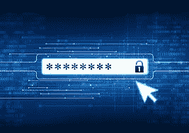
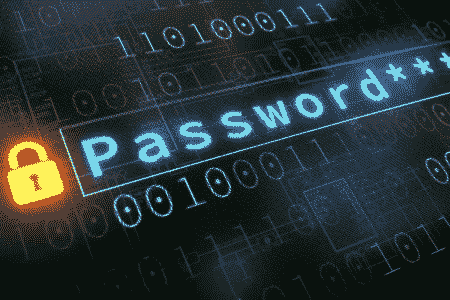

# 密码安全性

> 原文：<https://www.social-engineer.org/social-engineering/password-security/>

密码安全极其重要。毫无疑问，这是你以前听过的。事实上，它可能是你听到的东西，然后立即驳回，因为你已经听过太多次了。然而，为什么我们不应该忽视它呢？我们对密码安全到底了解多少？

LastPass 写了一篇关于密码的[心理学的非常有趣的文章。其中包括对 7 个国家的 3750 名专业人士进行的民意调查的统计数据。今天，我们将看看这些统计数据，并讨论它们对我们意味着什么，以及为什么它很重要。](https://blog.lastpass.com/2021/09/new-report-2021-psychology-of-passwords/)

## 密码教育

统计数据向我们展示了什么？首先，只有 8%的专业人士认为强密码不应该与个人信息相关联。这意味着许多人正在创建涉及个人信息的密码。很多时候，人们会在创建密码时使用生日或家庭地址等信息。为什么这令人担忧？

在过去的两年里，我们的数字生活呈指数级增长。创建的帐户越多，意味着在线共享的个人信息就越多，包括密码创建和其他方面。如果其中一个被攻破的账户显示了包含个人信息的密码，这意味着这些信息已经存在，并且可以被恶意用户获取。此外，2021 年，27%的受访者表示，他们在社交媒体上分享了自己房子或邻居的照片。这个数字比 2020 年增加了 20%。

除了这些数字，人们倾向于重复使用密码。这真的是如此危险的行为吗？

## 为什么复用这么危险？

密码重复使用是冒险行为吗？是的。这是因为仅仅一个被盗的用户名和密码组合就可能允许恶意行为者访问多个帐户。[“根据威瑞森数据泄露报告，80%的数据泄露是由糟糕的或重复使用的密码造成的。”](https://www.crn.com/news/channel-programs/logmein-poor-or-reused-passwords-responsible-for-83-percent-of-breaches)多么惊人的数字！这就是密码重复使用如此危险的原因。当在[公司网络](https://www.social-engineer.com/secure-it-keep-your-digital-profile-safe-from-vishers-and-phishers/)中重复使用密码时，这种危险会增加。

## 为什么会有人从事不良密码行为？

那么，人们为什么会从事不良密码行为呢？68%的人说他们重复使用密码是因为他们害怕忘记密码。52%的人希望控制他们所有的密码。36%的人表示，他们认为自己的账户对恶意用户没有足够的价值。

请放心，恶意行为者会利用他们可以利用的任何帐户。那么，什么可以帮助我们记住我们的密码并保持对我们账户的控制呢？让我们看看什么是好的密码行为。

## 什么是好的密码行为？

为了获得良好的密码行为，请记住以下几点:

*   每个密码都应该是唯一的
*   使用无意义的字符组合
*   采用多因素身份验证
*   确保在收到违规通知时更新密码

如果这个列表让你感到畏惧，有一个工具可以让它变得简单一点，特别是如果你担心忘记你的密码。这个工具叫做密码管理器。密码管理器为您存储所有密码，甚至可以为您提供安全和唯一的密码。当您使用管理器时，您需要记住的只是进入应用程序的密码。这将节省你的时间，精力，并可能忘记密码的头痛。

也可以考虑使用通行短语来代替密码。这可以是你最喜欢的书、电影、歌曲等的完整句子。选择一些对你有意义，但你没有在社交媒体上发布的东西。使用这样一个短语，加上适当的标点符号、大小写和间距，攻击者很难强行破解或猜测，同时您也很容易记住。

## 安全且受保护

密码安全极其重要。你以前听过，你还会再听到。不过，现在你可能对*为什么*如此重要有了更清晰的理解。我们希望本文中包含的提示能够帮助您在前进的过程中更加安全和受到保护。

*来源:*
*[https://blog . lastpass . com/2021/09/new-report-2021-psychology-of-passwords/](https://blog.lastpass.com/2021/09/new-report-2021-psychology-of-passwords/)*
*[https://www . CrN . com/news/channel-programs/logmein-poor-reuse-passwords-responsible-for-percent-of-of-83%的违规行为](https://www.crn.com/news/channel-programs/logmein-poor-or-reused-passwords-responsible-for-83-percent-of-breaches)*
*[https://www . social-com](https://www.social-engineer.com/secure-it-keep-your-digital-profile-safe-from-vishers-and-phishers/)*

*图片:*【https://encrypted-tbn0.gstatic.com/images?】*[q = tbn:and 9 gcqheboaydq 0 ef ujzvgm 8 dtqmngowksjelegcrw&usqp = CAU](https://encrypted-tbn0.gstatic.com/images?q=tbn:ANd9GcQhEBoaydq0EFUjzvgm8dtQmnGowksjleGcRw&usqp=CAU)*
*[https://images . idgesg . nimg/article/2018/08/5 _ password-best-practices _ unique-passwords _ authentic ation-100768646-large . jpg？auto=webp & quality=85，70](https://images.idgesg.nimg/article/2018/08/5_password-best-practices_unique-passwords_authentication-100768646-large.jpg?auto=webp&quality=85,70)T11】*