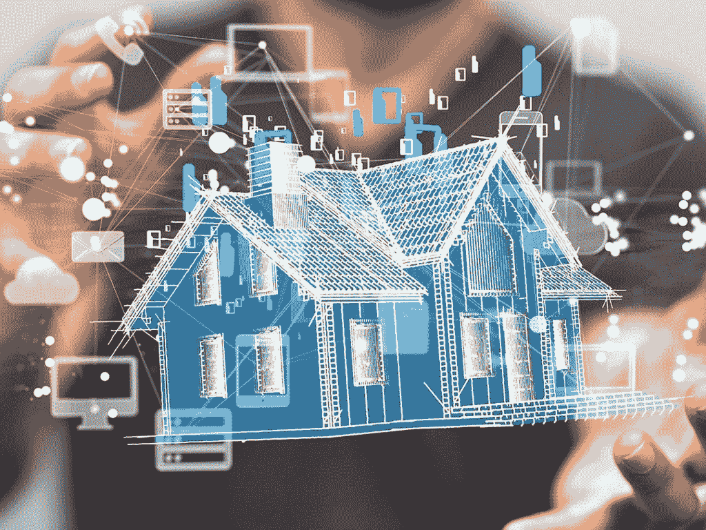

# 网络安全第一:工作和家庭中的#BeCyberSmart

> 原文：<https://www.social-engineer.org/social-engineering/cybersecurity-first-becybersmart-at-work-and-home/>

作为安全专业人员，我们受到持续暴露于敌对模拟训练的制约。这种身临其境的教育形式使我们能够在工作场所之外以及在 it 领域发展和维护一个安全的环境。这就引出了一个问题，如果给一个银行出纳员一些基本的培训，他能做同样的事情吗？C 级高管呢？从更广的角度来看这个问题，普通人能识别并保护自己免受攻击者的攻击吗？专家克里斯·哈德纳吉建议我们，“除非你从事安全行业或执法工作，否则你不会熟悉每一个新出现的骗局。但你仍然可以通过更深入地了解骗子如何操纵人们来降低自己成为受害者的几率，不管他们的具体计划是什么。”

不管攻击媒介是什么，了解攻击者在获取信息时使用的方法可以降低您成为受害者的几率。你看，操纵只是攻击者看似无穷无尽的工具箱中的一个工具。保护自己免受各种工具的攻击可以简单到[拥有自己的安全角色](https://staysafeonline.org/wp-content/uploads/2020/04/Own-Your-Role-in-Cybersecurity_-Start-with-the-Basics-.pdf)，深入了解现有的[攻击媒介](https://www.social-engineer.org/framework/attack-vectors/)，并学习如何关闭或阻止潜在的攻击者。这就是为什么，对于今年 10 月的[网络安全意识月](https://staysafeonline.org/cybersecurity-awareness-month/theme/)，我们鼓励你尽自己的一份力量#BeCyberSmart！因为无论你是一名普通工人、家庭主妇还是首席执行官，你都在确保你、你的家庭和你的工作安全方面扮演着至关重要的角色。

## 网络安全第一

当被安全行业以外的人接触时，拥有自己在网络安全领域的角色可能会显得很麻烦。但是，这第一步只是要求您确定他们访问范围内的哪些信息或设备需要保护。

[网络安全&基础设施安全局](https://www.cisa.gov/) (CISA)推荐这些 [**5 个简单的小技巧**](https://www.cisa.gov/sites/default/files/publications/NCSAM_WorkSecure_2020.pdf) 增加你在**工作中的网络安全**:

*   将商业信息视为个人信息。
*   不要让密码容易被猜到。
*   确保软件和安全设置是最新的。
*   注意你在社交媒体上发布的内容；网络罪犯经常使用它们来收集个人身份信息(PII)和公司信息。
*   保持警惕。不要点击不明链接。而是举报并删除可疑邮件。

[国家网络安全联盟](https://staysafeonline.org/) (NCSA)为**远程工作者**推荐这些 [**8 个简单提示**](https://staysafeonline.org/wp-content/uploads/2020/03/NCSA-Remote-Working-Tipsheet.pdf) :

*   点击前先思考。
*   锁定您的登录。
*   连接到安全网络，并使用公司发布的虚拟专用网络(VPN)。
*   将您的个人设备和公司设备放在不同的 Wi-Fi 网络上。
*   随身携带设备或将其存放在安全的地方。
*   限制访问您用于工作的设备。
*   使用公司批准/审查的设备和应用程序。
*   更新您的软件。

### 建立一个人类防火墙

保护您的工作环境需要您创建安全专业人员所称的人类防火墙。人类防火墙由目标在请求信息时向攻击者提供的防御措施组成。在使用中，人类防火墙可以是访问指定组织的直接网站而不是点击通过电子邮件接收的链接的员工。或者是一名员工打电话给他们的人力资源部门，以验证通过电子邮件请求敏感信息是合法的。此外，人类防火墙有效性的关键是人类“传播消息”或报告可疑活动的能力。

验证过程与报告相结合，使人类防火墙成为抵御攻击者的最高防线。请记住，这些请求可能会以电子邮件、[电话](https://www.social-engineer.org/framework/attack-vectors/vishing/)、[短信](https://www.social-engineer.org/framework/attack-vectors/smishing/)甚至[冒充](https://www.social-engineer.org/framework/attack-vectors/impersonation/)的形式出现，来自你认为是有信誉的来源。对恶意行为者可能用来危害员工的所有[攻击媒介](https://www.social-engineer.org/framework/attack-vectors/)进行适当的怀疑和内部验证非常重要。

毫不奇怪，一致性和实践允许安全专业人员在面对恶意行为者时做出有效的反应。那么，我们如何在不损害我们要保护的公司安全的情况下让员工参与实践呢？答案很简单；通过模拟攻击和后续训练。2020 年，Social-Engineer，LLC 在使用类似的培训平台时，发现钓鱼邮件的数量增加了近 350%。正是由于这些精心策划的运动，社会工程有限责任公司可以将他们的成功。这些运动严重依赖于可教的时刻，旨在建立肌肉记忆，为真正的攻击做准备。这些托管服务加上他们“让他们因为遇见我们而变得更好”的承诺，确保员工不是一次而是永远尽自己的职责。

## 网络安全首先在国内

在当今世界，无论你是在旅途中、在家还是在工作中，[个人设备](https://www.nist.gov/video/what-internet-things-iot-and-how-can-we-secure-it)在日常活动中发挥着巨大的作用。事实上，[物联网市场预计将在 2020 年达到 310 亿台联网设备](https://www.prnewswire.com/news-releases/the-world-will-store-200-zettabytes-of-data-by-2025-301072627.html)，预计到 2025 年将达到 750 亿台。

有理由认为，对于家中的#BeCyberSmart，我们需要通过对所有连接的设备应用基本的安全实践来应对连接性的增加。通常，公司网络配备有防火墙、首席安全官(CSO)和整个网络安全部门来保护它们的安全。正是出于这个原因，CISA 建议我们借鉴公司的做法。下次你考虑家庭网络安全时，任命一名家庭首席安全官[监控所有设备的安全设置](https://us-cert.cisa.gov/ncas/tips/ST04-003)，[确保保护软件是最新的](https://us-cert.cisa.gov/ncas/tips/ST04-006)，最重要的是，确保家庭中的每个人都[小心连接](https://us-cert.cisa.gov/ncas/tips/ST15-002)。

### 了解您的设备

随着我们在家中添加的每一个连接设备，可访问性和便利性触手可及。不幸的是，可访问性带来了脆弱性。大多数消费者没有意识到，一旦你的设备连接到 Wi-Fi，它就连接到了数百万台其他电脑。攻击者也不会使用不安全的网络连接来远程访问您的设备。不要让他们；防止攻击者访问需要在购买之前研究设备或在线产品。所以，记住，了解你的设备。当投资一个新产品来简化您的生活时，在购买前研究产品的安全特性、最近的隐私/安全问题以及产品的评论。通过这种方式，你可以获得互联世界的好处，而不会危及你家的隐私和安全。

### 隐私和安全设置

确保你家的安全是一个不小的壮举。从更改所有设备的默认密码和隐私/安全设置开始。

在设备上配置这些隐私/安全设置的理想时间是设备首次开机时。一些智能设备甚至会在首次激活设备时提示消费者配置隐私和安全设置。但是，如果您的设备在使用后没有提示您或者您正在更改设置，请不要跳过此步骤。不允许设备配置为默认设置。相反，请确保您花一点时间来配置隐私和安全设置，以达到您的舒适程度。此外，使用唯一的长密码和多因素身份验证系统(MFA)保护您的在线帐户。因为在最近的新冠肺炎疫情期间，无论你是全职父母还是大学生，建设一个网络安全家庭的责任都落在了你的身上。

## 网络安全永远不应该是事后的想法

Social-Engineer，LLC 表示，“从最高领导层到最新员工，网络安全要求每个人都保持警惕，以确保数据、客户和资本的安全。”从那以后，我们了解到，所有希望确保网络安全的人都需要承担责任。无论是在家还是在办公室。如果你想尽自己的一份力量#BeCyberSmart，那就从利用[社会工程师的免费教育资源](https://www.social-engineer.org/)开始，让自己熟悉最新的安全实践。记住，如果你有兴趣与 Social-Engineer 合作#BeCyberSmart，请[联系 Social-Engineer，LLC](https://www.social-engineer.com/services/se-phishing-service/#request) 获取个性化报价。因为只有通过共同努力，我们才能真正实现网络安全环境。

*来源*
[*https://www . social-engineer . com/social-engineer-team/Christopher-hadnagy/*](https://www.social-engineer.com/social-engineer-team/christopher-hadnagy/)
*[https://staysafeonline . org/WP-content/uploads/2020/04/Own-Your-Role-in-network security _-Start-with-the-Basics-。pdf](https://staysafeonline.org/wp-content/uploads/2020/04/Own-Your-Role-in-Cybersecurity_-Start-with-the-Basics-.pdf)*
*[https://www.social-engineer.org/framework/attack-vectors/](https://www.social-engineer.org/framework/attack-vectors/)*
*[https://staysafeonline . org/Cyber security-awareness-month/theme/](https://staysafeonline.org/cybersecurity-awareness-month/theme/)*
*[https://staysafeonline.org/](https://staysafeonline.org/)*
*[https://www . cisa . gov/sites/default/files/publications/NCSAM _ work Secure _ 2020 . pdf](https://www.cisa.gov/sites/default/files/publications/NCSAM_WorkSecure_2020.pdf)*

*图片*
*[https://staysafeonline . org/cyber security-awareness-month/theme/](https://staysafeonline.org/cybersecurity-awareness-month/theme/)*
*[https://www . peoples banknet . com/creating-a-cyber-secure-home/](https://www.peoplesbanknet.com/creating-a-cyber-secure-home/)*