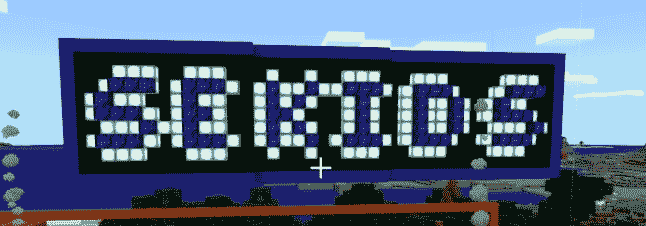
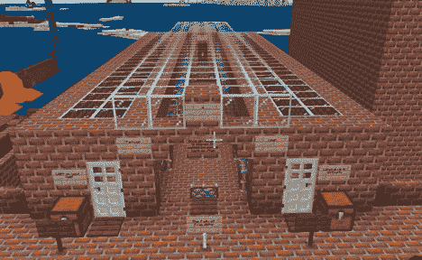

# DEF CON 儿童:为他们的未来做准备

> 原文：<https://www.social-engineer.org/social-engineering/def-con-kids/>

<figure id="attachment_13684" aria-describedby="caption-attachment-13684" style="width: 646px" class="wp-caption aligncenter">

<figcaption id="caption-attachment-13684" class="wp-caption-text">Image — courtesy of Social-Engineer</figcaption>

</figure>

今年的 DEF CON 2020 Social Engineering Capture the Flag for Kids(secf4kids)是一个里程碑式的事件。DEF CON 宣布，新冠肺炎疫情将完全虚拟化。这意味着我们必须在一个全新的环境中处理 SECTF4Kids。我们需要应用同样的原则，鼓励同样的理想，而不必与我们的参赛者面对面。同时，我们希望为 DEF CON 的孩子们实现我们的目标…为他们的未来做准备。

自 2011 年[以来，我们每年都会在 DEF CON](https://www.social-engineer.org/general-blog/how-strong-is-your-schmooze-kids-edition/) 上举办一场 4Kids 节。SECTF4Kids 鼓励 6-12 岁儿童的批判性思维和沟通技巧。我们通过创造对他们来说有趣且具有挑战性的谜题和密码来做到这一点。孩子们学习如何做研究，或者[开源情报收集](https://www.social-engineer.org/framework/information-gathering/technical-methods-of-information-gathering/)。参加我们的孩子们也学习如何找到复杂问题的创造性解决方案。然后，我们将所有这些技能结合在一起，教孩子们如何将它们应用到社会工程中。当然，要善用它们。然而，我们能虚拟地做到这一切吗？我们该如何利用网络环境，保持我们公司的座右铭，“[让他们因为遇见你而感觉更好？”](https://www.social-engineer.org/framework/general-discussion/social-engineering-code-of-ethics/)我们转向这个星球上最受欢迎的游戏之一:[《我的世界》](https://www.minecraft.net/en-us)。

## 我们如何建造它

利用《我的世界》的平台，我们建立了一个服务器，让孩子们，我们的参赛者，可以解决游戏中的各种难题。为此，我们招募了一个聪明而勤奋的团队:埃莉，又名九头蛇，玛蒂，艾米莉。几个星期以来，这个不可思议的团队充实并测试了我们的想法；将它们转变成一个充满谜题的美丽而实用的世界。他们把这个世界变成了一个有图书馆、餐馆、杂货店、市政厅等等的城镇。每个都有自己的主题拼图！

<figure id="attachment_13685" aria-describedby="caption-attachment-13685" style="width: 468px" class="wp-caption aligncenter">

<figcaption id="caption-attachment-13685" class="wp-caption-text">Image — courtesy of Social-Engineer</figcaption>

</figure>

这些谜题涵盖了许多不同的类别。我们有迷宫和密码让孩子们去解决和探索。以及需要解决和完成的逻辑谜题和谜语。也有编码杠杆难题，要求我们的参赛者首先找到我们在互联网上提出的一个问题的答案。接下来，他们必须将答案翻译成一个数字短语(是的，我们教他们使用 T9)，然后通过激活正确的控制杆来输入。总而言之，要在一个小时内完成各种不同的目标。

这些谜题最后都有一个目标。不管它是解开另一个谜题的钥匙，还是在比赛最后阶段使用的资源。手推车发射。

## 手推车发射

孩子们会建造一个装置，沿着他们自己设计的轨道发射矿车！为此，他们需要运用批判性思维，找到创造性的解决方案。他们还需要了解如何将我们提供的资源与他们获得的拼图奖励结合起来。当然，也有奖励来激励他们。能把车推出最远的孩子获胜。

那么，这些谜题是如何教会 DEF CON 的孩子们有价值的技能，让他们为未来做好准备的呢？让我们来看看。

## 批判性思维和主动阅读

我们社会工程师将批判性思考者定义为收集和评估相关信息并得出合理结论和解决方案的人。他们也在不同的思想体系中进行开放的思考，同时认识和评估他们的假设、含义和实际后果。这种推理和思考每天都越来越重要，正如[心理学今日](https://www.psychologytoday.com/us/blog/the-social-trust/202002/how-parents-can-teach-kids-critical-thinking)所指出的。现在，我们正处于信息的顶点，是我们处理信息的转折点。这最新的一代一直处于不同想法、事实和观点的洪流之中。

为了帮助我们的 DEF CON 孩子发展批判性思维，我们的几个谜题鼓励孩子们检查他们以前看到的东西，然后与他们现在拥有的信息进行比较。我们希望他们不仅能阅读和理解信息，还能进行批判性思考并将其应用到他们的环境中。对于一些谜题，一次只有一个孩子能读懂提示，这迫使他们清晰地交流并分享他们的理解。例如，我们镇上有一家“医院”医院拼图的目标是进入一个被称为“隔离病房”的密封房间为了进入其中，团队需要至少一个孩子在楼下，向楼上的另一个孩子解释他们所看到的，并比较他们收到的笔记。只有通过合作，他们才能打开大门，解决难题。

这类谜题给了他们练习的机会，这样他们就可以把他们看到的所有东西都拿出来，然后自己整理出来。他们教孩子们批判性地思考和理解他们所读的东西。

## 逻辑思维

其他谜题要求他们连接简单的电路，并以更线性的方式解决问题。“触及天空”就是这样一个谜题，它要求他们沿着两条独立的直线路径到达他们的目标……一个漂浮的箱子。

每条路上都有一个漂浮在空中的箱子，遥不可及，为了拿到它，他们需要以正确的顺序启动正确的杠杆，将障碍物移开。然后，他们需要使用杠杆动作掉落的资源来到达拼图的另一部分。这个奖励给了他们一个杠杆，允许他们激活活塞平台，让他们骑着队友激活的活塞到达他们想去的地方。但是要爬上那个平台，他们需要使用他们之前收到的一个下降的梯子，用另一个杠杆打破一个蛋糕，然后让他们的队友用地面上的杠杆把他们举起来。明白了吗？

这些谜题要求参赛者接受他们环境中存在的所有信息，对其进行分类，并将每一部分联系起来。他们学会了牢记自己的目标，并坚持每一步以达到目标。

## 创造性思维

创造力是在任何领域或行业取得成功的重要因素。这是一种可以训练的特质。所以，另一方面，我们也鼓励孩子们寻找创造性的方法来实现他们的目标。有鉴于此，我们选择了一些可以训练孩子们找到创造性解决方案的谜题，并奖励他们。

今年，这方面出现了前所未有的增长。特别是关于最后的矿车发射。他们保存了一些拼图，并利用了他们的环境。他们也找到了解决材料和队友短缺的方法。

## 沟通

这是一个许多人认为现在极其重要的话题。最新一代人花在面对面交流上的时间很少。因此，沟通技巧被搁置一旁。然而，有很多方法可以解决这个问题，其中之一就是…游戏。虽然这似乎与目标背道而驰，但它是现代文化的重要组成部分。

通常，个人技能和自私的游戏会得到回报。它受到游戏机制、积分系统甚至社区本身的鼓励。然而，体育或电子竞技领域的专业团队意识到，团队沟通是任何游戏中最重要的因素之一。例如，玩家可能在某项活动或游戏中表现出高超的技巧，但尽管他们很有技巧，却变得沮丧和失败。相反，一个球员能够让他们的团队一起工作，专注于首要目标，并让每个人都冷静和专注…这是一个球员会赢。这些同样的技能可以应用到工作和生活中，让他们成功。

团队合作是我们许多难题的关键。大多数谜题需要至少两个孩子交流，或者一起合作。一个谜题要求三个孩子同时运用这里提到的每一个方面。每个玩家都有不同的目标来达到相同的目标。两个解决不同的难题来激活可移动的平台，这样第三个就可以导航，平台，或“跑酷”到最终目标。这样做需要他们用逻辑和创造性的方式思考他们的资源。这样他们就可以解决力学和谜题，并交流何时移动，何时暂停。

## DEF CON 儿童—与我们一起玩感觉更好

DEF CON SECTF4Kids 致力于一个单一的目标:通过教育实现安全。通过用有趣的方式教孩子们这些必要的技能，我们正在为他们的未来做准备。我们教他们如何解决问题，拥抱创造性的解决方案，最重要的是，让人们因为遇见他们而感觉更好。现在，我们发布了用于制作这个世界的服务器文件，这样每个孩子、父母和童心未泯的人都可以为自己和朋友尝试这些简单的谜题。我们希望每个人都能享受这些活动，并且我们会让你因为和我们一起玩而感觉更好。如果你下次有兴趣加入我们，请关注我们在 [Twitter 上的公告！](https://twitter.com/SocEngineerInc)我们希望到时能见到你！

## 奖金视频！

阅读关于这场比赛还不够吗？查看我们在下面拍摄的现场活动视频。

[https://www.youtube.com/embed/DkVcvLUtqdo](https://www.youtube.com/embed/DkVcvLUtqdo)

还是不够？你可以玩整个《我的世界》世界。在这里找到世界下载和说明[！](https://www.social-engineer.org/resources/def-con-28-sectf4kids-minecraft-world/)

*来源*
*[https://www . social-engineer . org/general-blog/how-strong-is-your-schmsece-kids-edition/](https://www.social-engineer.org/general-blog/how-strong-is-your-schmooze-kids-edition/)*
*[https://www . social-engineer . org/framework/general-discussion/code-of-of-ethics/](https://www.social-engineer.org/framework/general-discussion/code-of-ethics/)*
*[https://www.minecraft.net/en-us](https://www.minecraft.net/en-us)*
*[https://www.social-engineer.com/what-is-critical-thinking/](https://www.social-engineer.com/what-is-critical-thinking/)*