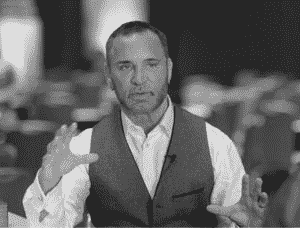
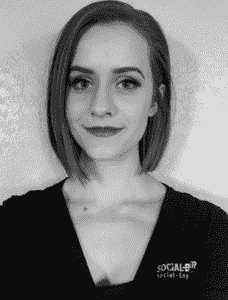
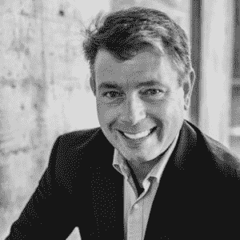
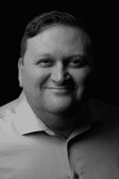
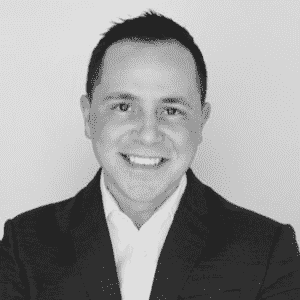
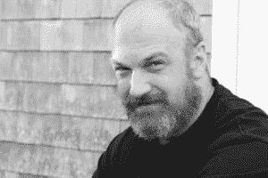
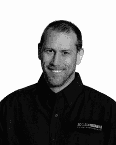
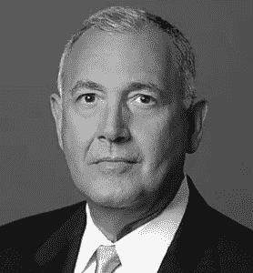
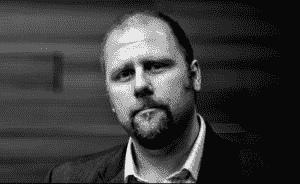

# 2021 年人类黑客大会:准备好大吃一惊吧！

> 原文：<https://www.social-engineer.org/social-engineering/the-human-hacking-conference-2021-plan-to-be-amazed/>

我们有好消息！2021 年人类黑客大会(HHC)的计划正在进行中，所以请在您的日历上标出 2021 年 3 月 11 日至 13 日的日期。在这个博客的奖金部分寻找注册 HHC 的链接！！你参加今年的 HHC 了吗？那么毫无疑问，你会同意 HHC 教练罗宾·德雷克的说法，他把它描述为 ***【凯旋盛会】**“可能是你能呆的最安全的环境”。* *每个人都在那里互相帮助，共同学习、成长和协作。”*从 Dreeke 的评论中，很明显 HHC 的核心价值观*“让他们因为遇见你而感觉更好”*影响了整个活动。无论你是回头客还是打算第一次参加，你对人类黑客大会 2021 有什么期待？我们将让你先睹为快，并简要概述 HHC 的历史。

## **关于人类黑客大会**

HHC 是由社会工程村赞助的。它是由世界知名的“人体黑客”专家、作家和公司安全顾问克里斯·哈德纳吉创建的。HHC 教授人类欺骗、身体语言分析、认知敏捷、智力研究和安全最佳实践方面的技术。它的特点是由行为、生理、欺骗、技术和心理学领域的世界知名领袖教授的多小时学习课程。他们探索诸如非语言交流、测试、身体和心理影响以及个人发展等主题。HHC 还设有各种演讲环节，从包含快节奏内容的专家级演讲者，到小组讨论和主题演讲。此外，还有三个晚上的活动和交流机会。既然你已经知道了 HHC，是时候把你介绍给教练了。

## **人类黑客大会 2021 培训师**

我们有出色的培训师为您准备了长达数小时的学习课程。重返 2021 年人类黑客大会的有多夫·巴伦、布兰妮·考德威尔、罗宾·德雷克、乔·纳瓦罗、斯黛芬妮·保罗、伊恩·罗兰和 r·保罗·威尔逊。2021 年，马克·鲍登、谢尔比·达科、克里斯·哈德纳吉、蔡斯·休斯、科特·克兰普、瑞安·麦克道戈尔和赤焰松·雷诺兹将加入 HHC 训练队。这里有一个研讨会的预览。

### **[多夫男爵](https://www.dovbaron.com/) —智取竞争对手** 

Baron 又名“Dragonist”，是一名企业文化战略家，在次世代领导的不断发展的世界中拥有超过 30 年的国际演讲经验。《公司》杂志将 Dov 列为 100 名最佳领导力演讲者。他是“全蒙提领导力”的创始人，也是畅销书作家。Dov 的工作坊专注于寻找你的龙火，即使在危机中，它也可以并将激励你去改变任何你想要的东西。他讨论了情绪的认知神经科学，即情绪逻辑和情感神经科学。参加完这个工作坊后，你将会学到实用有效的领导技巧和策略。

### **[【马克·鲍登】](https://truthplane.com/)—信任的肢体语言&非语言影响力和说服力的可信度**

鲍登是身体语言和人类行为方面的畅销书作家。他因他的手势平面系统而闻名，并在他所称的“真实平面”中特别使用了张开手掌的手势。在这个有趣的研讨会上，Mark 展示了他的 TRUTHPLANE GesturePlane 系统。马克向我们展示了“通常不是你说了什么，而是你如何说才能得到结果。”

### **Brittney Caldwell——为卓越的结果做出卓越的行为**

考德威尔是一名自由职业演员、剧作家、导演，也是度假剧院集团的老板。她有 15 年的表演经验，并指导社会工程师有限责任公司的硕士水平的社会工程培训课程。在布兰妮的工作室里，看看在你开口说话之前，非语言行为是如何讲述你的故事的。布兰妮教授如何制定策略，在参与时保持冷静和专注。布兰妮的工作室给了你一套工具，使你能够创造非语言行为，产生非凡的结果。

### **[谢尔比·达科](https://www.social-engineer.com/social-engineer-team/shelby-dacko/) —全新社会工程(SE) Pentest**

Dacko 是社会工程师有限责任公司的专业社会工程师，也是无辜生命基金会的志愿者。她的专长包括视觉、视觉艺术和教材制作。Shelby 与 Curt Klump 合作，教授为期三天的全新 SE Pentest 研讨会的第二天，带您了解远程 SE Pentest 的三个主要方面。在工作坊的第二天，谢尔比和柯特专注于视觉。与会者学习什么是视觉，视觉心理学，以及如何制定一个标志清单和一个借口。而且，你可以获得视觉方面的实践经验。本研讨会中的所有练习都以第三天所需的信息结束。

### **[罗宾·德雷克](https://twitter.com/rdreeke?lang=en)——如何像 FBI 行为专家一样评估人**

德雷克是一名退休的联邦调查局特工，前反间谍行为分析项目负责人。他是 People Formula 的首席执行官、行为分析专家、专业演讲者、培训师、推动者和畅销书作家。Robin 的工作室由三个部分组成，每个部分都有特定的目标和要点。首先，在第一部分，你将学习 10 种具体的技巧来发展面对面和虚拟的融洽关系。接下来，第二块展示了融洽相处后建立信任的五个步骤。Robin 以第三块结束了他的研讨会，重点关注了可信赖性和可预测性的六个标志。

### **[克里斯·哈德纳吉](https://www.social-engineer.com/social-engineer-team/christopher-hadnagy/) —全新 SE Pentest**

Hadnagy 又名“人类黑客”，是一名安全顾问、作家、演讲者和专业社会工程师。他是专门从事社会工程的咨询和培训公司 Social-Engineer，LLC 的首席执行官。Chris 与赤焰松·雷诺兹合作开展全新 SE Pentest 跟踪的第三天，重点关注网络钓鱼。与会者学习什么是网络钓鱼，网络钓鱼的心理，以及如何建立一个企业网络钓鱼计划。根据第一天和第二天获得的数据，参与者开发了一个网络钓鱼的四个级别，用于攻击目标。在本课程结束时，如果学生完成了三天的学习，并且没有违反课堂规则，他们将获得一张合格证书。

### **[蔡斯·休斯](https://twitter.com/thechasehughes)—人类贸易**

休斯是畅销书作家，也是应用行为研究公司的首席执行官。他是美国公认的顶级行为剖析师之一，20 年来创造了世界范围内最先进的行为技能课程和策略。在 HHC 2021 上，蔡斯的工作室向你介绍了人类行为技能，并深入研究了纯粹影响力的六个要素。发现如何在不到六分钟的时间里听出言外之意。蔡斯还教了 14 种在阅读肢体语言时最有效的方法。

### **[Curt Klump](https://www.social-engineer.com/social-engineer-team/curt-klump/) —全新 SE Pentest**

Curt 是 Social-Engineer，LLC 的一名专业社会工程师和人类风险分析师，他是建筑、表演、导演、音乐和生物制造领域的多面手。Curt 与 Shelby Dacko 合作，教授全新 SE Pentest 赛道的第二天，重点是视觉。与会者学习什么是视觉，视觉心理学，以及如何制定一个标志清单和一个借口。在这个工作坊里，你可以获得视觉的实际操作经验。所有的练习都以你第三天需要的信息结束。

### **[瑞安·麦克杜格尔](https://www.social-engineer.com/social-engineer-team/ryan-macdougall/) —全新 SE Pentest**

Ryan 是网络渗透测试、应用安全、协议分析和社会工程领域的主题专家。他是 Social-Engineer，LLC 的首席运营官和开源智能培训师，在渗透测试和客户演习期间负责运营，并管理客户关系。Ryan 是一名多年的 Blackhat 会议培训师，也是 DEFCON SEVillage 关于社会工程和开源情报收集的演讲者。他将在新学期的第一天授课。Ryan 将关注每一个社会工程师生命的命脉…OSINT。这部分课程将重点关注 OSINT 是什么，如何使用它，以及如何磨练自己的技能，使自己成为一名成功的社会工程师。

### **[乔·纳瓦罗](http://joenavarro.net/)——在法庭环境中使用非语言交流**

25 年来，乔一直担任联邦调查局特工，从事刑事和反情报工作。他是畅销书作家，被认为是世界上人类行为和非语言交流方面的领先专家之一。在这个工作坊中，Joe 展示了 FBI 探员如何在法庭环境中使用非语言。他还展示了肢体语言如何被用来评估所说的和真实感受之间的不一致。

### **[斯黛芬妮·保罗](http://stephaniepaulinc.com/) —如何开发有影响力的故事和有说服力的人物**

保罗是斯黛芬妮·保罗公司的创始人，该公司专门辅导高管、销售团队、TEDx 演讲者和筹款人成为沟通大师。她带来了她 29 年作为演员和即兴表演的娱乐经验，以及单口相声和小品喜剧演员。斯蒂芬妮的高度互动的学习轨道教授开发有影响力和令人信服的故事结构的有效技能和工具。作为额外的奖励，你还可以学到娱乐行业的技巧。

### **[赤焰松雷诺兹](https://www.social-engineer.com/social-engineer-team/maxie-reynolds/) —全新 SE Pentest**

Reynolds 是社会工程师有限责任公司的物理专家和专业社会工程师。她是一名认证的道德黑客，以及具有石油和天然气背景的数字法医调查员。赤焰松与克里斯·哈德纳吉(Chris Hadnagy)合作开展全新 SE Pentest 培训课程的第三天，重点关注网络钓鱼。与会者学习什么是网络钓鱼，网络钓鱼的心理，以及如何建立一个企业网络钓鱼计划。根据第一天和第二天获得的数据，参与者开发了一个网络钓鱼的四个级别，用于攻击目标。在课程结束时，如果学生完成了三天的学习，并且没有超出班级规定的范围，他们将获得一张合格证书。

### **[伊恩·罗兰](https://ianrowland.com/) —冷读**

罗兰又名“头脑人”，是一个企业发言人，培训师和顾问。伊恩通过教授惊人的、变革性的思维技能，帮助人们和公司取得更大的成功，这些技能给生活和商业带来了实际的好处。伊恩的研讨会，揭示了冷阅读的艺术，以及如何将这些技术应用于商业环境。罗兰的工作室也有现场演示和实践环节。亲眼看到冷读是一种神奇、实用、有用的沟通技巧。

### **[保罗·威尔逊](http://www.conartist.tv/)——身体和心理影响:不可能的欺骗**

R.保罗·威尔逊是一名电影制作人、作家、获奖的魔术师和魔术师。威尔逊的高度互动和娱乐性的研讨会准备与会者认识和规避未来的攻击基于人类的欺骗。深入了解骗子、诈骗犯、黑客和社会工程师如何设计攻击方法来欺骗世界各地的受害者。

## 准备好大吃一惊吧！

HHC 是一项基础教育活动，在这里你可以接受如何破解思想、行为和周围人的专业培训。你从参加 HHC 中学到的技能和见识对你个人和职业都有好处。HHC 2020 培训师罗宾·德雷克的话总结了你可以期待的东西，“我很高兴分享我的内容。但更令人兴奋的是成为与会者。演员阵容非常惊人。

计划参加 2021 年人类黑客大会，并为之惊叹！在我们的[社交媒体](https://twitter.com/sevillage)上关注我们，观看我们教练的独家视频！

## **奖金！**

但是等等…还有更多！HHC 的注册现在开始！！别耽误— [**在这里**注册。](https://registration.humanhackingconference.com/ereg/newreg.php?eventid=540573&)

如果你错过了第一届人类黑客大会，我们的特别播客和博客将带你了解 HHC 2020 的幕后。

社会工程师播客主持人克里斯·哈德纳吉采访了出席 2020 年人类黑客大会的几位令人惊叹的培训师。从他们的陈述中获取关键要点。你可以在这里收听播客[。](https://www.social-engineer.org/podcast/ep-127-the-human-hacking-conference-2020-recap/)

你也可以在我们的博客[“人类黑客大会:阿尔法年”中了解 2020 年人类黑客大会。](https://www.social-engineer.org/general-blog/the-human-hacking-conference-year-alpha/)