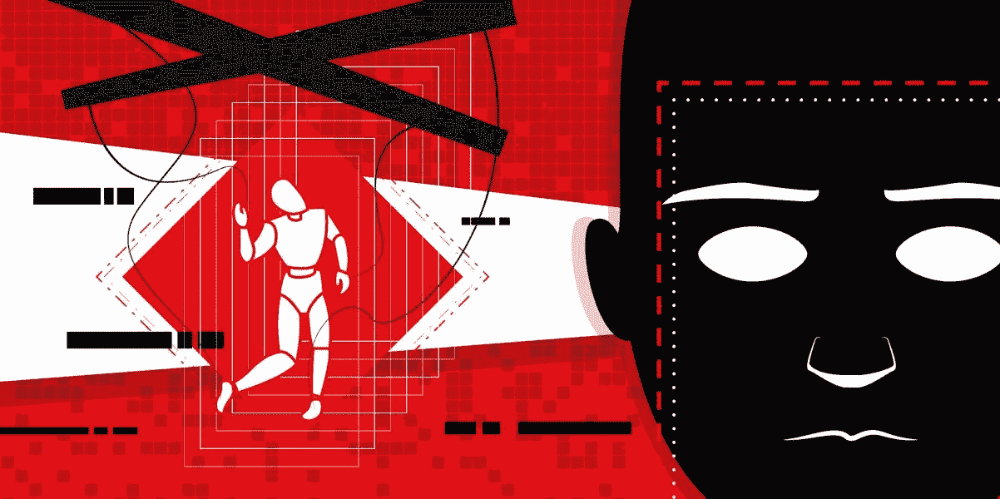

# Deepfakes:如何防御攻击

> 原文：<https://www.social-engineer.org/social-engineering/deepfakes-how-to-defend-yourself-from-attack/>

Deepfakes 已经存在几年了。这项技术目前正被恶意使用，比如在社交媒体上传播虚假信息。它还被用于更多的喜剧目的，比如让尼古拉斯·凯奇出演并不可怕的电影。对你们中的一些人来说，这可能是旧闻，因为 Deepfakes 在 2017 年首次获得广泛关注[。](https://www.wired.com/story/future-of-artificial-intelligence-2018/)我们甚至在[最近的帖子](https://www.social-engineer.com/cybersecurity-threats-for-2020/)中谈到了它，我们称之为“Deepfakes 是 2020 年的网络安全威胁”。为什么又提起这件事？

## **目标已经改变**

以前，要创建一个可信的 deepfake，需要几个小时的源视频显示目标的脸。所以最初这种用法仅限于名人、政治家和其他公众人物。机器学习的最新进展已经允许使用目标的一张照片和仅仅 5 秒钟的声音来制造假货。现在，人们在社交媒体上发布自己的图片和视频是很常见的。这可能是攻击者创建一个真实的 deepfake 所需要的全部。听起来吓人吗？确实是。目标变了。任何在社交媒体上出现的人都容易在电话上被假冒，甚至可能在视频通话中被假冒。让我们回顾一下这些攻击是如何进行的，以及如何保护自己和公司免受攻击。

## **在电话里**

语音 deepfakes 已经存在了相当一段时间。几年前，Adobe 展示了一个名为 [VoCo 的程序。它需要一个人说话大约 20 分钟，并且能够惊人地模仿他们。尽管该产品是为音频编辑专业人士设计的，但由于](https://www.youtube.com/watch?v=I3l4XLZ59iw)[的道德和安全问题，该产品应该会停产。](https://www.bbc.com/news/technology-37899902)最近，其他公司已经继承了 Adobe 的遗志。现在已经有商业产品，如 Lyrebird、Descript 等，复制甚至改进了这项技术。一个名为“[实时语音克隆](https://github.com/CorentinJ/Real-Time-Voice-Cloning)”的开源项目可以只用几秒钟的个人语音样本就生成可信的语音片段。

不幸的是，这种攻击不再是假设。2019 年，“[一个语音 Deepfake 被用来诈骗一位首席执行官 24.3 万美元”](https://www.wsj.com/articles/fraudsters-use-ai-to-mimic-ceos-voice-in-unusual-cybercrime-case-11567157402)。首席执行官认为他是在和公司德国母公司的首席执行官说话。是什么说服了他？他听出了老板轻微的德国口音和他在电话里的声音的旋律。在这种情况下，拥有正确的声音让攻击者有足够的可信度从他的目标身上提取 243，000 美元。我们过去已经讨论过[这些虚拟攻击有多强大](https://www.social-engineer.com/have-you-ever-received-one-of-those-calls/)，但是，在攻击者的武器库中有了这样的工具，虚拟攻击将更加危险。

## **进行视频通话**

想象一下，多亏了新冠肺炎，你可以在家工作。你收到了一封电子邮件链接，发自一位你之前聊过几次的同事。他请求您加入他的视频会议。电话按预期进行:你们互致问候，讨论一些敏感的公司数据。如果这个人看起来和听起来都像正常人，你有什么理由怀疑他们的身份？不幸的是，在这个例子中，这位同事是一个企图窃取公司信息的骗子。这看起来有些牵强，但是 deepfake 技术的进步使得这种攻击很快成为可能。

以前需要花费数小时的源视频和计算机时间，现在只需一张图片的一小部分时间就可以完成。GitHub 上免费提供的一个最新工具[就是这样做的:](https://github.com/AliaksandrSiarohin/first-order-model)

[https://giphy.com/embed/ifSCyLXRiX7UhNkrQ8](https://giphy.com/embed/ifSCyLXRiX7UhNkrQ8)

虽然看起来像科幻小说，但这是真实的。该程序只能访问每个演员的一个图像，但正如你所见，它能够复制眨眼，眼睛运动，嘴部运动，甚至头部倾斜，失真最小。像这样的工具迭代很快，现在可以实时使用。这为通过视频会议工具(如 Zoom)进行类似视觉攻击打开了大门。

## 我们如何防御这种情况？

Deepfakes 越来越难用我们的眼睛和耳朵察觉。基于人工智能的检测方法正在开发，可以帮助我们识别假货，但重要的是要记住，这些方法可能永远不会万无一失。就像猫捉老鼠的游戏；随着检测技术的进步，假货也会越来越多。当攻击从缝隙中溜走时，你需要保持警惕。

执行严格的验证程序很重要。一定要练习，即使你认出了某人的声音或面孔。您选择哪种验证方法取决于您公司的安全要求。一旦员工接受了教育，你需要确保验证程序得到遵守。你可以让你的员工接到训练有素的专业人士打来的现场电话来测试他们，这些专业人士可以模仿真正的攻击者的战术。

你可以通过限制自己在社交媒体上的公开露面来保护自己。通过启用隐私限制，您可以防止骗子轻易地窃取您的声音和肖像。实践良好的帐户安全性总是很重要的。其中一个主要方法是，如果可能的话，对每个帐户使用多因素身份验证。在我们的文章中，我们列出了您可以采取的更多措施:“[保护您的数字档案，使其免受黑客和网络钓鱼者的侵害”](https://www.social-engineer.com/secure-it-keep-your-digital-profile-safe-from-vishers-and-phishers/)

及时了解当前在野外发生的攻击，并传播意识，以便其他人可以防御它们。

*来源:*

*[https://www . wired . com/story/future-of-artificial-intelligence-2018/](https://www.wired.com/story/future-of-artificial-intelligence-2018/)*
*[https://www . social-engineer . com/cyber security-threats-for-2020/](https://www.social-engineer.com/cybersecurity-threats-for-2020/)*
*[https://www.youtube.com/watch?v=I3l4XLZ59iw](https://www.youtube.com/watch?v=I3l4XLZ59iw)*
*[https://www.bbc.com/news/technology-37899902]("https://www.bbc.com/news/technology-37899902)*
*【https://github.com/CorentinJ/Real-Time-Voice-Cloning*