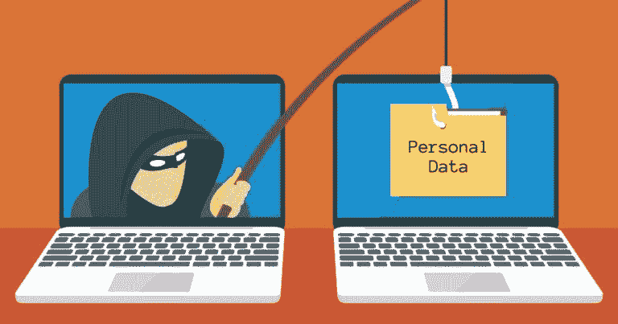
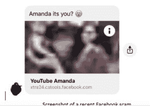

# 保护自己免受社交媒体诈骗

> 原文：<https://www.social-engineer.org/general-blog/protect-yourself-from-social-media%e2%80%afscams/>

技术和社交平台让我们以前所未有的方式联系在一起，改变了我们作为社会成员的交流和互动方式。 W 我们生活在一个蹒跚学步的孩子能够比他们的祖父母更好地驾驭智能手机的世界。以前，我们看晨报；现在，我们醒来后做的第一件事就是查看我们的社交媒体账户。这是我们与世界保持联系的新方式。只需轻轻一点，我们就可以看到异国情调的图片、让我们像喝咖啡一样开心的小狗小猫的视频，以及最受欢迎的名人、作家和艺术家的个人想法。

社交媒体让我们以前所未有的方式保持联系。然而，这种连接也带来了脆弱性。随着人类互动方式的改变，骗局 也随之改变。 因此，我们需要警惕社交媒体骗局，以及如何保护自己。

## **社交媒体诈骗**

当我们想到骗局的时候，很多人会想到著名的 [【尼日利亚王子】](https://www.scamwatch.gov.au/types-of-scams/unexpected-money/nigerian-scams) 。我们大多数人都听说过，甚至还有关于它的笑话。然而，它在当时是非常成功的。现在变得不那么成功了吗？大概吧。当代的许多人都是精通技术的用户，我们越来越多地接受像这样的“显而易见”的方案。但是，随着我们的进步和认识的提高，这些攻击和攻击者也在进步。

社交媒体诈骗正迅速变得越来越流行。 《福布斯》指出， “在脸书、Instagram、Snapchat 上活跃的人，由于曝光率和信息分享的增加，成为欺诈受害者的可能性增加了 30%。 各种社交媒体骗局利用 基本社交工程技术来 [快速建立融洽关系](https://www.social-engineer.org/framework/psychological-principles/instant-rapport/) 。使用 同情主题和开放式问题、验证目标和 描绘无私的技巧只是让这些骗局更可信的几种技巧。这对我们意味着什么？随着这些攻击的变化，我们的心态也必须变化。我们必须准备好 [保护我们自己](https://www.forbes.com/sites/forbestechcouncil/2019/09/09/top-social-media-scams-and-how-to-avoid-them/#7a5dd343873d) 和我们周围的人免受这些威胁。

## **透过门面看**

现在，您对当今恶意社交工程攻击的常见载体之一有了更多的了解，您已经成功了一半。深呼吸。这听起来很可怕，事实也可能如此。然而，如果你意识到与社交媒体和一些更常用的攻击相关的风险，你就能很好地避免它们。那么，如今通过社交媒体使用的一些常见攻击是什么呢？

### ***浪漫骗局***

浪漫骗局 的独特之处在于 罪犯 利用目标对情感联系的需求来实施骗局。 骗子会 与目标 取得联系，试图与他们建立浪漫的联系。随着 关系的进展，骗子会开始想办法要钱。为了 [保护自己](https://www.bbb.org/article/news-releases/17012-bbb-tip-romance-scams) 免受这个骗局有几件事你可以 do:

*   注意是否有人在照片中显得“太完美”。你可以在 images.google.com 的上做一个反向图片搜索，看看用户是否在从网上复制自己的个人资料图片。
*   询问具体的问题，警惕任何不一致的地方。
*   警惕那些总是找借口解释为什么不能亲自见面(经常出差、出国、军事)并不断推迟见面计划的人。
*   最重要的是，永远不要给没见过面的人送钱。T3】

如果你想了解更多关于爱情骗局的信息，请查看十月简讯上的 [框架](https://www.social-engineer.org/framework/general-discussion/categories-social-engineers/scam-artists/) 和 我们的 [。T13T15T17】](https://www.social-engineer.org/newsletter/romance-scams-stealing-hearts-money/)

### ***社交钓鱼***

任何人都可以被一个 [社交媒体钓鱼](https://inspiredelearning.com/blog/social-phishing/) 抓住–的把柄。 上周 ， 我在[insta gram](https://www.bleepingcomputer.com/news/security/instagram-phishing-attack-baits-with-copyright-infringement-note/)上收到了一个密友的直接消息。上面写着“我找到了一些你可能会喜欢的东西”，还附有一个链接。感觉有些不对劲，就问是不是真的是她送的。她说没有 和 她从朋友 — 和 那里收到了同样的 消息 说 她的账户在她点击链接时已经被攻破。这种攻击不是针对 Instagram 的，虽然 。 [【脸书】](https://www.news4jax.com/consumer/get-a-weird-facebook-message-it-might-be-an-attempt-to-scam-you) 、Twitter、[YouTube](https://nakedsecurity.sophos.com/2019/09/24/youtube-influencers-get-2fa-tokens-phished/)、 Snapchat、LinkedIn 等社交媒体平台也存在同样的潜在漏洞。你如何保护自己？

<figure id="attachment_12381" aria-describedby="caption-attachment-12381" style="width: 300px" class="wp-caption aligncenter">

<figcaption id="caption-attachment-12381" class="wp-caption-text">Screenshot of a recent Facebook scam</figcaption>

</figure>

*   保持警惕。留意任何看起来不自然的措辞或信息。

*   不要因为链接是朋友发给你的就点开， [先检查一下](https://www.thebalancecareers.com/how-to-check-emails-for-fake-hyperlinks-3515356) 。 要警惕点击网址中含有多余字母和数字的链接，比如上图中的“xtra24.cstools”。
*   牢记 ， 你不知道一个陌生人请求关注或联系你的动机 。有可能他们是完全无辜的，没有恶意。请记住，允许陌生人 与 您联系，他们就可以访问您 r 个人资料中包含的任何个人详细信息，以及您执行的 、 操作，例如 发布 ing、喜欢和评论 。T32

### ***小测验***

没有什么比从《萤火虫》中找出你最喜欢的河谷镇角色，或者你和谁最合得来(我的意思是，谁没有迷恋过那个帽子里的马尔？).不幸的是，骗子可以使用这些朗朗上口的 [小测验](https://www.myidcare.com/articles/single/social-media-quizzes-the-best-answer-is-no) 来植入恶意软件或收获个人信息。即使测验是合法的，仍然会收集个人信息，这些信息可用于定向广告 。

在这种情况下，保护自己免受潜在骗局的最好方法就是不要参加测验。如果你只是 *需要* 来知道哪个迪士尼公主会是你最好的朋友(心虚)，一定要看看小字。大多数人会说，通过参与测验，您同意该网站的使用条款或服务条款。通常，您会发现该协议授权第三方合作伙伴访问您的社交媒体、好友列表等。您将需要确定是否所有这些需求都是您希望该方能够访问的。

了解更多关于这些广泛使用的攻击 并找到真实生活中的例子 可以帮助你在遇到攻击时更加谨慎。

## **小心——不要害怕**

T 何面对 社交媒体及其诸多固有风险 时可以采取的最重要步骤 就是花时间去了解攻击者的心态。如果你知道他们在找什么，你就能保护自己。花点时间，从攻击者的角度看一下你的社交媒体账户。你会公开发布关于生日和纪念日的帖子吗？你会在简历中公布你工作的地方吗？上周在你最喜欢的餐馆吃饭时，你知道你的位置吗？这些是信息 攻击者 寻求 的 位 。 一个 孤零零的这些零碎的 的数据 可能看起来不像是多少信息。然而，当你把它们加在一起，它们就构成了你生活的一幅画面。攻击者可以利用这些信息向您发送有针对性的网络钓鱼电子邮件 以及有针对性的可视电话 。

避免向攻击者提供这些信息的一个简单方法是:将你的个人资料设置为私人。 请务必定期检查您的隐私设置 ，查看是否有任何设置被添加、编辑或删除 。作为保持更安全的尝试，社交媒体平台经常更新其隐私设置。因此，您的设置可能会在您不知情的情况下受到影响。一定要定期检查，这样你就可以随时了解和掌握你的个人信息是如何被分享的。

## **继续学习**

从报纸发展到智能手机，从尼日利亚王子发展到有针对性的网络钓鱼，技术和社交平台让我们前所未有地联系在一起。这种联系的能力带来了一些危险。希望它也能给人们带来更多的意识和更广泛的教育。 我们邀请您浏览我们的博客 [档案](https://www.social-engineer.org/?s=social+media) 了解更多关于社交媒体诈骗的信息。此外，您可以访问 social-engineer.org 网站:[https://www . social-engineer . org/framework/general-discussion/](https://www.social-engineer.org/framework/general-discussion/)以了解有关该主题的更多信息。在那里，您可以找到几十个关于骗局的例子，了解它们背后的心理，并更好地应对攻击。

如果你已经是社交媒体骗局的受害者，或者收到了诈骗短信，请务必向发生此事的社交媒体平台举报。这有助于平台保持当前的安全性，并保护其用户的安全。有了这些和其他资源，你可以学习如何更好地保护自己和周围的人。

*来源:
[https://www . Forbes . com/sites/forbestechcouncil/2019/09/09/09/top-social-media-scams-and-how-to-avoid-them/# 7a5dd 343873d](https://www.forbes.com/sites/forbestechcouncil/2019/09/09/top-social-media-scams-and-how-to-avoid-them/#7a5dd343873d)
[https://www . ki vitv . com/news/BBB-scammers-using-social-media-in-new-phishing-scammers](https://www.kivitv.com/news/bbb-scammers-using-social-media-in-new-phishing-scam)
[https://www . social-engineer . org](https://www.social-engineer.org/framework/attack-vectors/attack-cycle/)*