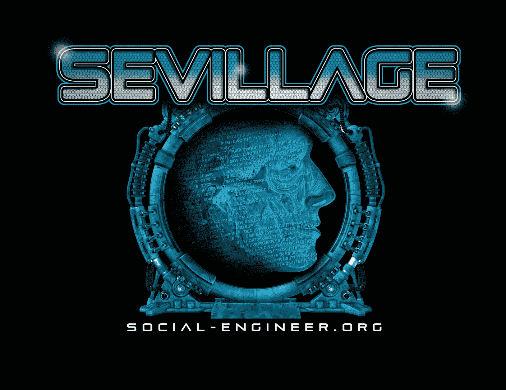

# DEF CON 27 更新！

> 原文：<https://www.social-engineer.org/social-engineering/sevilllage-at-def-con-27-updates/>

<header class="entry-header">

<header class="entry-header">

# [T4】](https://www.social-engineer.org/newsletter/social-engineer-newsletter-vol-06-issue-82/attachment/sevillage-2/)

</header>

你可以在 DEF CON 27 总结博客[这里](https://www.social-engineer.org/social-engineering/the-sevillage-wrap-up-from-def-con-27/)阅读 SEVillage！

DEF CON 的[服务区位于 DEF CON 18，是所有社会工程的一站式商店。从我们简陋的小房间和隔音棚开始，到现在举办 4 场活动和一个“人的轨道”,在那里进行社会工程讲座。在](https://www.social-engineer.org/sevillage-def-con/) [DEF CON](https://www.defcon.org/) 的服务区，不仅是我们的国旗船活动、社会工程师捕获国旗活动[的地方，也是不可能完成的任务、儿童活动](https://www.social-engineer.org/sevillage-def-con/the-sectf/)和青少年活动[的地方！](https://www.social-engineer.org/teenctf/)

## [更新&日程](https://www.social-engineer.org/sevillage-def-con/)

</header>

## [SECTF 记分牌](https://www.social-engineer.org/se-ctf-scoreboard/)

## [总结](https://www.social-engineer.org/social-engineering/the-sevillage-wrap-up-from-def-con-27/)