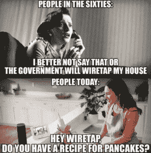

# 物联网和数字存储 PII:可避免还是不可避免？

> 原文：<https://www.social-engineer.org/general-blog/the-internet-of-things-iot-and-digitally-stored-pii%e2%80%afavoidable-or-inevitable%e2%80%afthe-internet-of-things-iot-and-digitally-stored-pii%e2%80%afavoidable-or-inevitable%e2%80%af/>

[物联网](https://www.forbes.com/sites/jacobmorgan/2014/05/13/simple-explanation-internet-things-that-anyone-can-understand/) (IoT)迅速出现在日常生活的各个方面，并收集[大量个人身份信息(PII)](https://www.social-engineer.org/general-blog/identity-thieves-phishing-and-pilfering-your-pii/) 。从智能家居恒温器到一键购买，物联网设备收集 PII 来为消费者提供个性化体验。在一个日益数字化和互联的世界中，前所未有地沉浸在便利、知识和无障碍的环境中已成为常态。虽然这是一个激动人心的时代，但始终如一地管理围绕物联网和数字存储 PII 的个人和专业漏洞势在必行。正如蜘蛛侠经典所建议的那样，“[拥有强大的力量就意味着巨大的责任](https://quoteinvestigator.com/2015/07/23/great-power/)，探索和[权衡便利](https://arstechnica.com/information-technology/2017/11/rethinking-our-approach-toward-personal-threat-models-in-an-iot-world/)与安全和保障的风险是至关重要的。

### 一切都是相连的

在一个过去的时代，有趣的事实是从祖父母的百科全书集的适当的书上取下的。事实上，语音控制设备现在可以回答宇宙中所有重要的问题，这是一个全面的游戏规则改变者。

如 [Libelium Smart World 信息图](http://www.libelium.com/libelium-smart-world-infographic-smart-cities-internet-of-things/)所示，物联网有潜力产生大规模的积极影响。交通基础设施、环境危害检测和食品供应安全监控可以改善数百万人的生活质量、商业效率和盈利能力。T3】

物联网和数字存储 PII 的阴暗面通过[被黑的婴儿监视器](https://www.npr.org/sections/thetwo-way/2018/06/05/617196788/s-c-mom-says-baby-monitor-was-hacked-experts-say-many-devices-are-vulnerable)、被入侵的[设备发起恶意的全球电子邮件攻击](https://www.infoworld.com/article/2930366/internet-of-things/welcome-to-the-smart-home-of-horror.html)和对[植入式起搏器的威胁生命的访问](https://thehackernews.com/2017/08/pacemakers-hacking.html)来警告家庭暴力。虽然一些公司声称“确保”加密并承诺不共享用户信息，但利用家谱网站抓捕连环杀手的[已经开创了以意想不到的方式使用消费者信息的先例。倡导创新和培养风险意识之间存在微妙的平衡。](https://time.com/5256835/how-did-golden-state-killer-genealogy-websites-online-dna-police/)

### 物极必反

人们经常感觉生活在以惊人的速度运转，因此物联网和数字存储的 PII 提供的便利，如一键订购和[破折号](https://www.digitaltrends.com/home/what-is-an-amazon-dash-button/)，是一个受欢迎的喘息机会。然而，进入一个[电话移植骗局](https://www.social-engineer.com/your-phones-betrayal/)，有人窃取另一个人的手机号码，突然一个恶意的行为者可以非常容易地访问保存的零售网站、购买历史、支付方式和家庭地址。所有这些信息提供了足够的材料来发动复杂的[社会工程](https://www.csoonline.com/article/2124681/social-engineering/what-is-social-engineering.html)攻击，并向预期目标的家庭、朋友和同事网络公开攻击媒介。

### 威胁缓解

物联网产品和服务的制造和购买只会增加。近年来，可用产品激增，并且有望逐年成倍增长。没有监管标准来监控这种繁荣，因此安全和安保的责任落在个人用户的肩上。承担可预测的风险是高度主观和个人化的，因此每个人都需要[研究](https://www.intel.com/content/www/us/en/internet-of-things/infographics/guide-to-iot.html)和[自学](https://www.forbes.com/sites/bernardmarr/2015/10/27/17-mind-blowing-internet-of-things-facts-everyone-should-read/)物联网和数字化存储的 PII 如何融入并影响他们的生活。寻求专家对隐私控制策略的建议，比如前政府计算机犯罪调查员迈克尔·巴兹尔的采访和书。做一个知情的消费者，用购买力来支持认真对待安全性的公司和产品。[定期监控账户和设备](https://security.berkeley.edu/resources/best-practices-how-to-articles/top-10-secure-computing-tips)检测任何异常情况。实施良好的[网络卫生](https://digitalguardian.com/blog/what-cyber-hygiene-definition-cyber-hygiene-benefits-best-practices-and-more)的最佳实践，例如设置可靠的密码，不要对多个设备或帐户使用同一个密码。T13】

### 对数字连接感到舒适吗

随着涉及 PII 的物联网和在线行动朝着不可避免的方向发展，关注任何人都可以采取的避免数字焦虑的实际行动是有帮助的。以下是一些可能有帮助的步骤:

*   看服务条款:“可是没人看这些！”一些文章中概述的权限和访问权限的数量相当惊人；看一看，以便做出更明智的决定。
*   用虚假信息建立“虚拟”账户:在网上注册一些东西时，经常会有提示将新平台与现有的电子邮件或社交媒体账户连接起来。创建匿名电子邮件地址或虚假的社交媒体资料，以满足设置参数。这可以屏蔽大量应用程序和聚合的个人信息。
*   使用预付费信用卡: 在进行一次性购买或参与“免费试用”时，使用预付费信用卡将消除在多个网站使用个人信用的风险。甚至有可能使用过期或空的预付费信用卡进行免费试用，这样当试用期结束时，它就开始在文件上对卡收费，这就不是一个可用的帐户。
*   将物联网设备(如智能安全摄像头)放在自己的网络上，该网络利用单独的防火墙，因此主网络被隔离。
*   监控手机应用程序和访问:
    Wi-Fi 连接安全吗？蓝牙连接有必要吗？定位功能是否会与应用程序连接，以便在靠近某个恰好有销售的商家时发送警报？是的，这种情况会发生，是的，这是令人毛骨悚然的！  
*   拔下不用的设备，这样它们就不会一直“听着”选择有设备但不能接触敏感对话的特定房间。 T2】

### 调查并获得信息:

*   知道[有哪些数据存在，哪里可以删除](https://www.tomsguide.com/us/how-to-secure-alexa,news-26881.html)，自己拥有哪些信息。
*   思考各种可能性和概率。放在互联网上的任何东西都不会真正消失，条款、条件和法律都会改变。
*   DNA 检测公司风靡一时。事实上， [one 刚刚与一家制药公司](http://www.pharmtech.com/gsk-23andme-partner-genetic-drug-development)合作。这些数据会被用来对付人吗？T3】

  许多公司都以数字方式存储极其个人化的数据，如种族、民族、激素水平、生育统计、过敏、DNA 等。每个公司都有不同的隐私政策，每个政策都容易受到改变指导方针、黑客攻击、传票、人为错误和恶意行为者的影响。意识到并确定个人风险容限，因为它们与物联网和数字存储的 PII 有关，是决定信息共享的内容、时间、地点和方式的关键。

这是我们的世界前进的方向，所以现在是一个很好的机会来接受适当的教育，并准备好处理日益普遍的物联网和数字存储 PII 的新现实。尽可能让思考和采取安全预防措施成为一种习惯，可以让你安心。

*来源:*
*[https://www . Forbes . com/sites/Jacob mor gan/2014/05/13/simple-explain-internet-things-that-any one-can-understand/# 655027 f91d 09](https://www.forbes.com/sites/jacobmorgan/2014/05/13/simple-explanation-internet-things-that-anyone-can-understand/)* *[https://www . social-engineer . org/general-blog/identity-things-and-pii/](https://www.social-engineer.org/general-blog/identity-thieves-phishing-and-pilfering-your-pii/)* 
*[https://www . csoonline . com/article/2124681/social-engineering/what-is-social-engineering . html](https://www.csoonline.com/article/2124681/social-engineering/what-is-social-engineering.html)* *[https://www . Forbes . com/sites/louiscumbus/2018/06/06/10-charts-that-will-challenge-your-perspective-of-of-iots-growth/# 55](https://www.forbes.com/sites/louiscolumbus/2018/06/06/10-charts-that-will-challenge-your-perspective-of-iots-growth/)*