# DEF CON 26 的塞维利亚总结

> 原文：<https://www.social-engineer.org/social-engineering/the-sevillage-wrap-up-from-def-con-26/>

社会工程师团队正在集体总结他们的年度后 DEF CON 迷雾状态，从他们的积压中解脱出来，并回忆在 DEF CON 26 上的惊人服务。我们能说“哇”吗？这是 SEVillage 迄今为止最大的(也可以说是最好的)一年，尽管它花了整整两周的时间来克服基本的生存模式，并作为完全有生产力的人重新进入社会，但这是一个巨大的胜利，这要感谢团队和所有令人惊叹的支持参与者。

<figure id="attachment_8390" aria-describedby="caption-attachment-8390" style="width: 1024px" class="wp-caption aligncenter">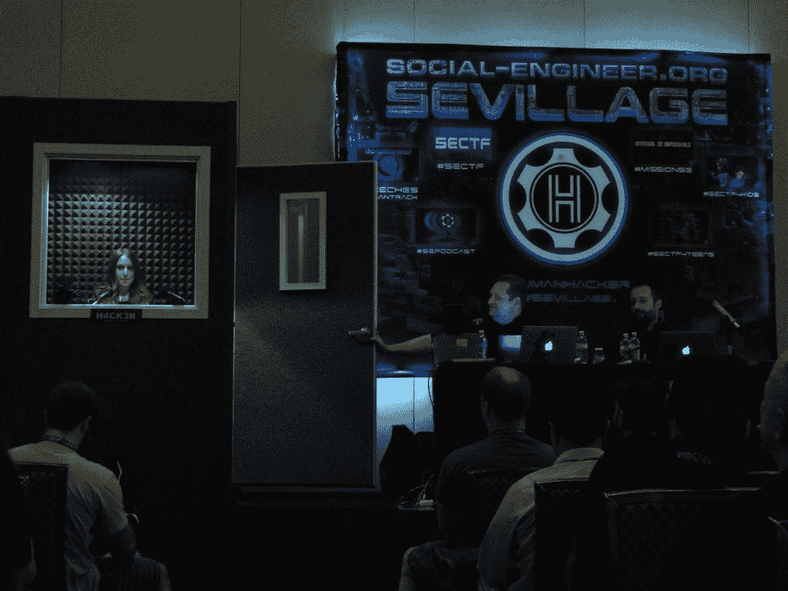

<figcaption id="caption-attachment-8390" class="wp-caption-text">*The SECTF at SEVillage*</figcaption>

</figure>

今年，DEF CON 于 8 月 9 日至 12 日在凯撒宫举行，之前在曼德勒湾举行了 Black Hat。黑帽从社会工程有限责任公司(Social-Engineer，LLC)带来了一些新的乐趣，因为我们能够在黑帽举办两个，是的，你看到了，**两个**单独的课程:由克里斯和凯特参加的为期四天的高级实用社会工程(APSE)课程，以及由瑞安和科林参加的为期两天的高级开源智能(OSINT)课程。周围挤满了座位，先进的 OSINT 学生学习新的技巧和工具来完成挑战。两个班都有团队成功地完成了实际的挑战，只剩下令人紧张的几分钟。这些团队赢得了令人垂涎的 2018 年社会工程师挑战赛硬币。APSE 的学生将自己推出舒适区，完成令人惊叹的社会工程壮举。一名学生甚至征用了一个舞台和麦克风，招募了整个拉斯维加斯的酒吧来帮助完成那天晚上的作业——这让我们印象深刻！但是在黑帽的“放松”周遇到了即将到来的名为 DEF CON 的列车。

## 设置日！–8 月 8 日星期三

周三，SECOM 黑帽船员迁移到凯撒宫，而那些远道而来的人在 LAS 着陆，我们都立即进入状态。我们得到了迄今为止最大的房间——几乎是去年的两倍。一个 500+的社会工程师的房间能惹上什么样的麻烦？嗯，在我们发现之前，Dan 和 Tim 从 Billy 的家里递送了 10 亿个包裹(这是一个粗略的估计，但我们相信是准确的)——快速喊出来给 Billy。没有他，在 DEF CON 的塞维利亚将是不可能的。谢谢比利！！！

于是，丹和蒂姆把所有的东西都装进了我们的搬家卡车(是的，一整辆搬家卡车，你可以用它来盖房子),并把它们带给了在凯撒码头等候的其他团队成员。这些“东西”包括，但不限于，一个半吨重的声音亭，需要一起困惑。

<figure id="attachment_8391" aria-describedby="caption-attachment-8391" style="width: 1024px" class="wp-caption aligncenter">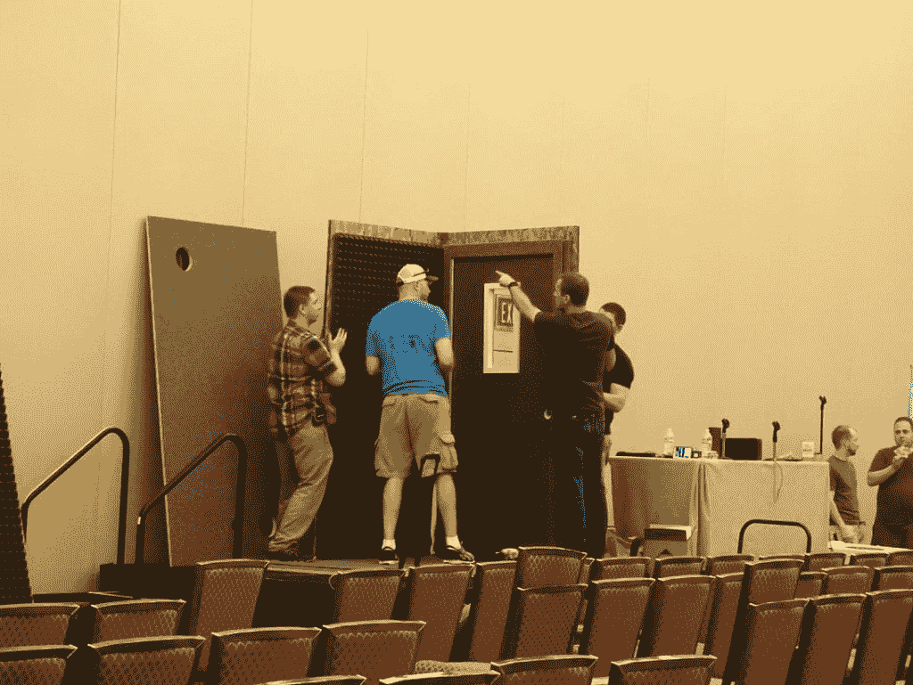

<figcaption id="caption-attachment-8391" class="wp-caption-text">*“Where does that wall go?” Struggles in assembling a mobile sound studio*</figcaption>

</figure>

尽管它让我们遍体鳞伤，但我们最终还是组装了有史以来最令人惊叹的 SECTF 展台。是 LEGEN，等一下… DARY。稍后会有更多相关信息…

当布思·俄罗斯方块在塞维利亚的前台和中心发生的时候，吉姆努力抹平我们所有的标志，无数的挂绳被应用到日程表上，瑞安和斯潘塞组装了《碟中谍》( MSI ),团队 swag 组织了我们所有的甜蜜购物！

<figure id="attachment_8392" aria-describedby="caption-attachment-8392" style="width: 908px" class="wp-caption aligncenter">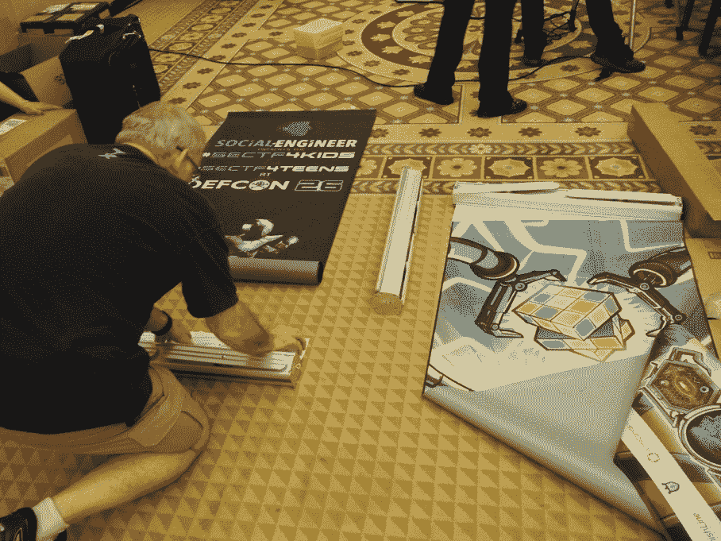

<figcaption id="caption-attachment-8392" class="wp-caption-text">*Perfect signs*</figcaption>

</figure>

<figure id="attachment_8393" aria-describedby="caption-attachment-8393" style="width: 1014px" class="wp-caption aligncenter">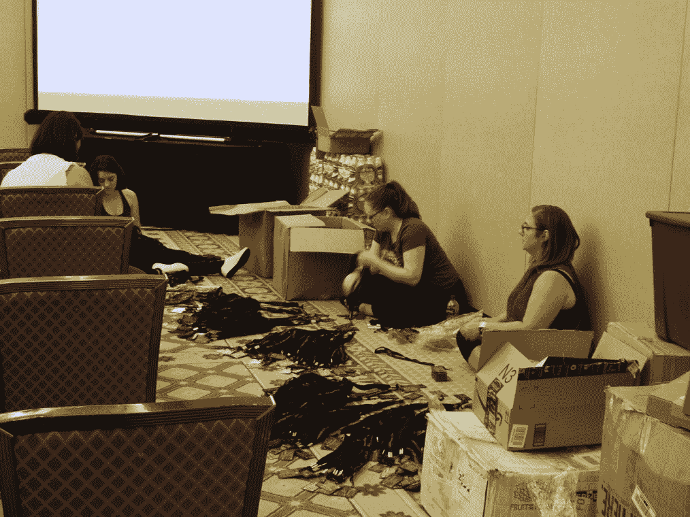

<figcaption id="caption-attachment-8393" class="wp-caption-text">*Lanyards for Dayzzzz*</figcaption>

</figure>

<figure id="attachment_8394" aria-describedby="caption-attachment-8394" style="width: 920px" class="wp-caption aligncenter">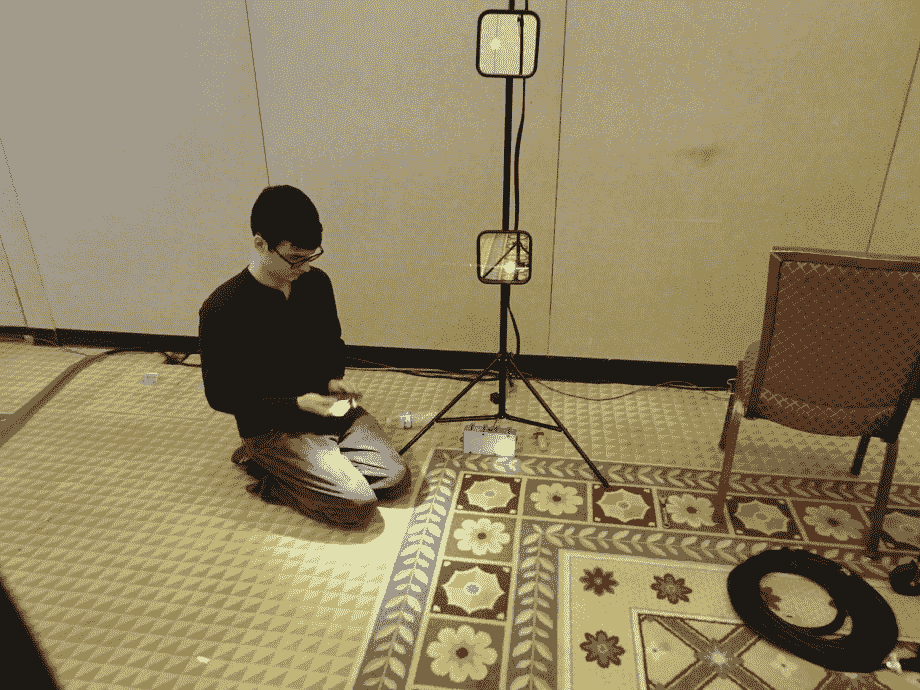

<figcaption id="caption-attachment-8394" class="wp-caption-text">*Spencer testing some lasers*</figcaption>

</figure>

<figure id="attachment_8395" aria-describedby="caption-attachment-8395" style="width: 900px" class="wp-caption aligncenter">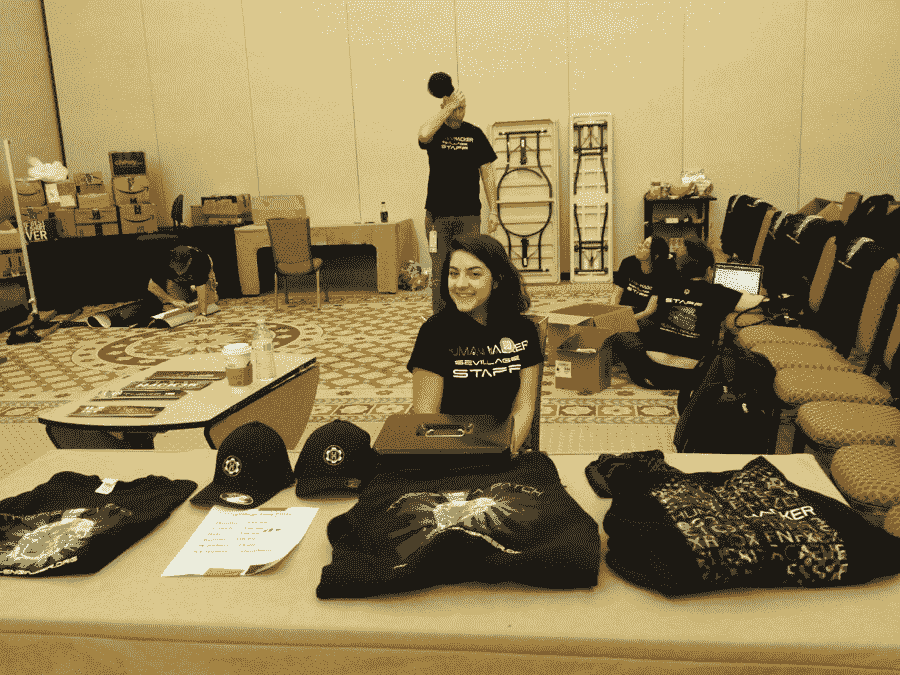

<figcaption id="caption-attachment-8395" class="wp-caption-text">*Merch merch merch with Hannah!*</figcaption>

</figure>

原来，斯潘塞是一个巫师，但没有用他的力量来组装所有的东西。对我们有所隐瞒，斯宾塞。

<figure id="attachment_8396" aria-describedby="caption-attachment-8396" style="width: 946px" class="wp-caption aligncenter">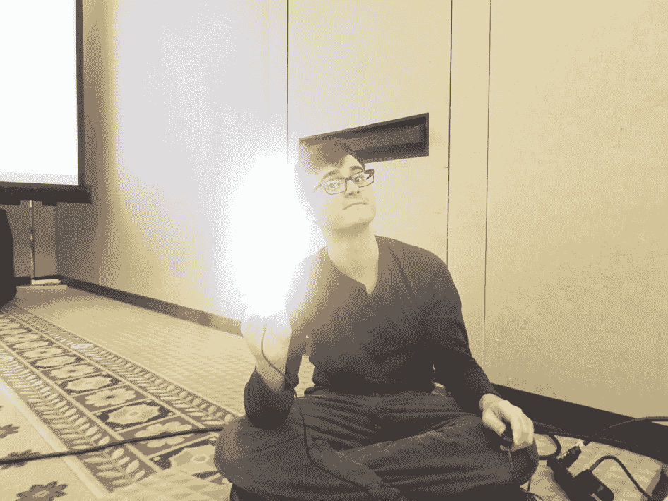

<figcaption id="caption-attachment-8396" class="wp-caption-text">*Wizard*</figcaption>

</figure>

## 第一天:开场白，碟中谍，满座！–8 月 9 日星期四

周四是 DEF CON 的开始，但即使是到达日，截至上午 10 点 15 分，DEF CON 26 的 SEVillage 中的 500 个座位都挤满了，我们有数百人排队。哇！我们从上午 10:30 的开场白开始。然后，村子被直播了！

<figure id="attachment_8397" aria-describedby="caption-attachment-8397" style="width: 823px" class="wp-caption aligncenter">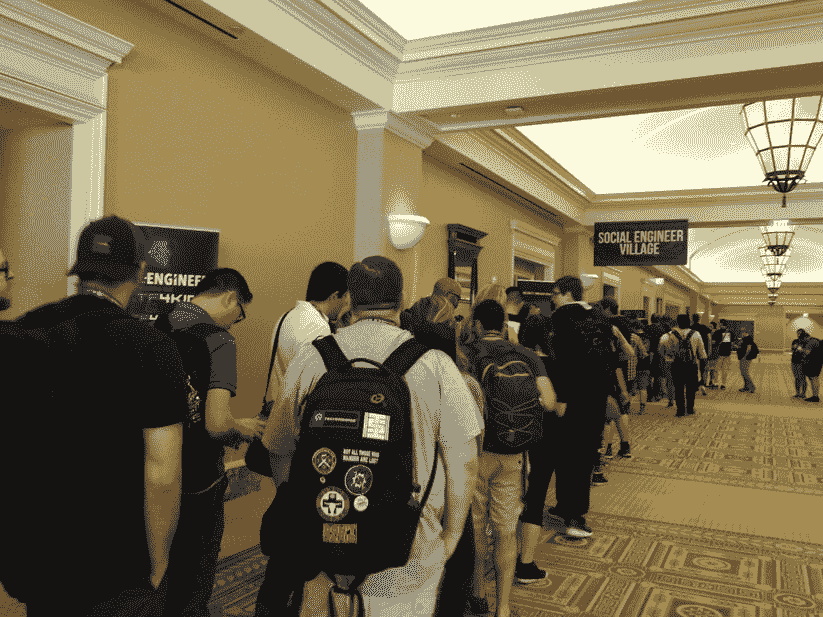

<figcaption id="caption-attachment-8397" class="wp-caption-text">*This Thursday line was CRAZY long*</figcaption>

</figure>

<figure id="attachment_8398" aria-describedby="caption-attachment-8398" style="width: 900px" class="wp-caption aligncenter">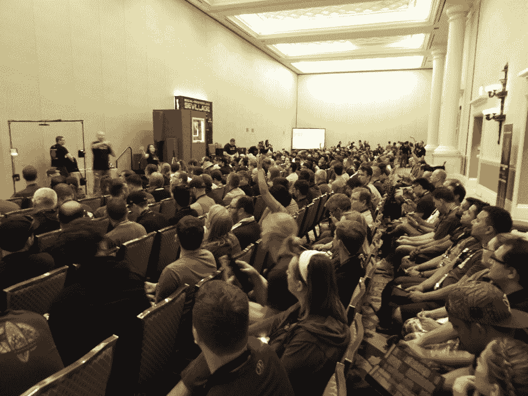

<figcaption id="caption-attachment-8398" class="wp-caption-text">*Full house!*</figcaption>

</figure>

我们无畏的领导者，克里斯，研究并找到了一个专业的声音亭，以提高 SECTF 游戏到一个新的水平，这也意味着我们有一个升级的 MSI 的“牢房”。监狱牢房？什么？你会问，这如何应用于社会工程？嗯，MSI 是一门社会工程障碍课程，它提出了一个问题:如果你被抓到订婚，你能逃离办公楼吗？在这个场景中，你，SE，被抓了起来，戴上手铐和脚镣，关在办公室的牢房里(毕竟这些都是真实的事情)。为了逃脱，你必须垫上手铐，走出牢房，撬开锁，正确识别保罗·艾克曼博士微表情训练的 3 种面部表情，穿过一个布满鲨鱼的激光网格，找到通往自由的路。时间最快的 SE 获胜！！

<figure id="attachment_8399" aria-describedby="caption-attachment-8399" style="width: 822px" class="wp-caption aligncenter">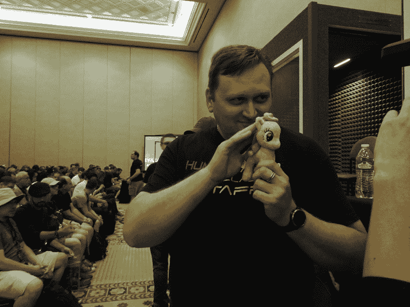

<figcaption id="caption-attachment-8399" class="wp-caption-text">*Getting the team ready for MSI*</figcaption>

</figure>

我们第一天就报名了，队伍排得很长！我们有一百多个名字。今年，我们有 20 个人参加比赛，比往年多了 6 个人。除了新的展位，我们还有一个新的锁箱，由塞维利亚的朋友里克制作！它设计得非常巧妙。我们遇到了一个小问题，其中一个锁发生了意外事故，Toool 在比赛中修好了锁，救了我们。这些都是很棒的人！

SEs 通过了挑战，我们只剩下一名获胜者……祝贺我们的第一名获胜者——VACHE！！！

<figure id="attachment_8400" aria-describedby="caption-attachment-8400" style="width: 925px" class="wp-caption aligncenter">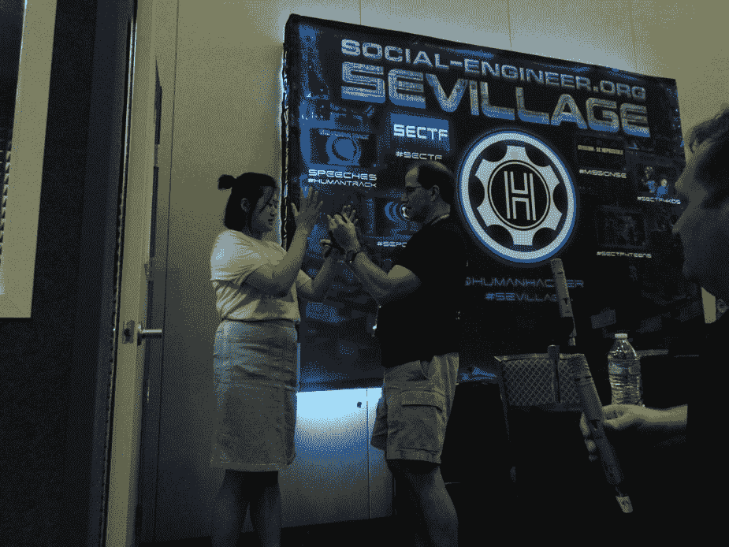

<figcaption id="caption-attachment-8400" class="wp-caption-text">*Getting cuffed!*</figcaption>

</figure>

<figure id="attachment_8401" aria-describedby="caption-attachment-8401" style="width: 951px" class="wp-caption aligncenter">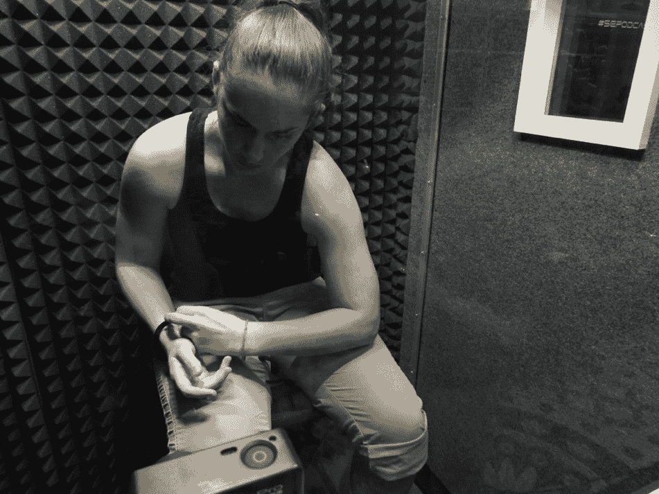

<figcaption id="caption-attachment-8401" class="wp-caption-text">*Escape the cuffs!*</figcaption>

</figure>

<figure id="attachment_8402" aria-describedby="caption-attachment-8402" style="width: 934px" class="wp-caption aligncenter">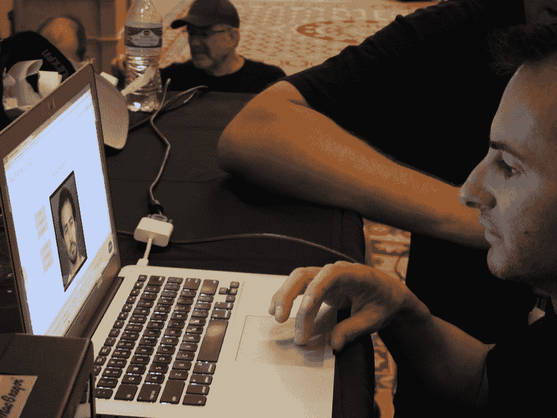

<figcaption id="caption-attachment-8402" class="wp-caption-text">*Vache (winner) Identifying some Micro-Expressions*</figcaption>

</figure>

<figure id="attachment_8403" aria-describedby="caption-attachment-8403" style="width: 884px" class="wp-caption aligncenter">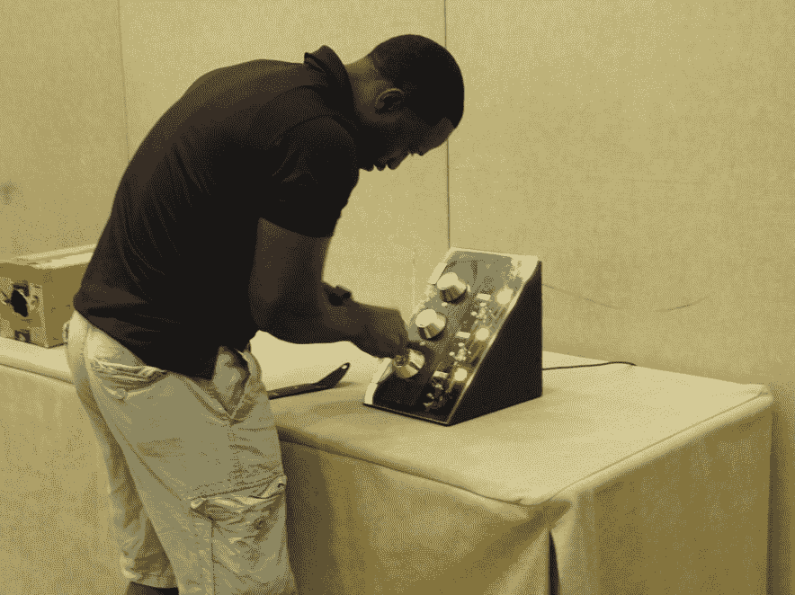

<figcaption id="caption-attachment-8403" class="wp-caption-text">*Pick ALL THE LOCKS (jk – just one)*</figcaption>

</figure>

<figure id="attachment_8404" aria-describedby="caption-attachment-8404" style="width: 900px" class="wp-caption aligncenter">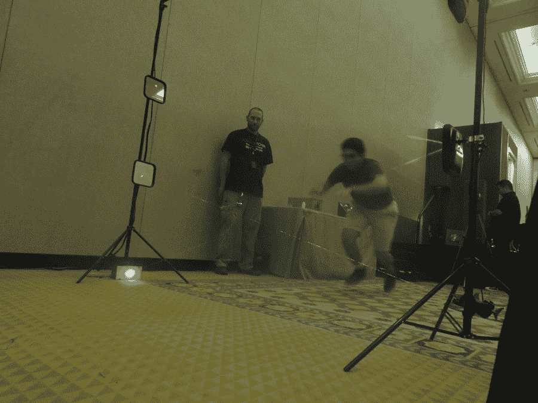

<figcaption id="caption-attachment-8404" class="wp-caption-text">*DODGE THE LASER-SHARKS*</figcaption>

</figure>

<figure id="attachment_8405" aria-describedby="caption-attachment-8405" style="width: 897px" class="wp-caption aligncenter">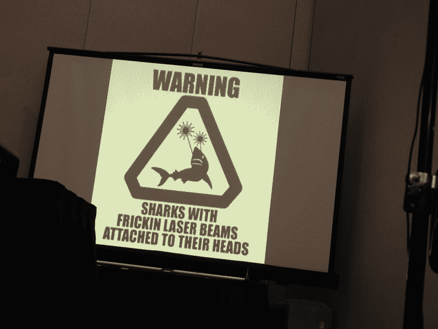

<figcaption id="caption-attachment-8405" class="wp-caption-text">*Lasers. And sharks. Sharks and lasers.*</figcaption>

</figure>

经过紧张的第一天，团队以晚餐、饮料和几个小时的酣睡结束，直到…

## 第四节，第五节，和第一天的会谈！！–8 月 10 日星期五

周五，DEF CON 26 的 SEVillage 以 SECTF4Kids 的正式开始拉开帷幕，这是一项针对 6-12 岁小人类的社会工程挑战。拥抱 DEF CON 26 的前奥威尔主题，孩子们在 [Ready Player One](https://en.wikipedia.org/wiki/Ready_Player_One_(film)) 的设置中参与了 SE 日的相关任务。他们必须解决密码，谜语，并作为团队穿越 DEF CON，以拯救世界从一个邪恶的公司手中崩溃的可能性。为此，他们一起工作，运用沟通技巧，应用社会工程策略，并为他们的大逃亡制造赛车。

祝贺我们的第一名团队——复活节彩蛋，尼古拉斯和布兰登，以及蓝色独角兽团队中充满活力的女士二人组，雅典娜和希尔瓦娜。

<figure id="attachment_8406" aria-describedby="caption-attachment-8406" style="width: 841px" class="wp-caption aligncenter">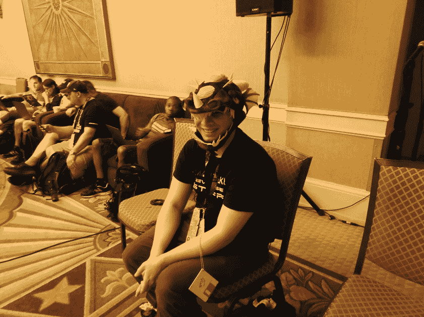

<figcaption id="caption-attachment-8406" class="wp-caption-text">*Watch out for those rogue hacker dragons*</figcaption>

</figure>

<figure id="attachment_8407" aria-describedby="caption-attachment-8407" style="width: 845px" class="wp-caption aligncenter">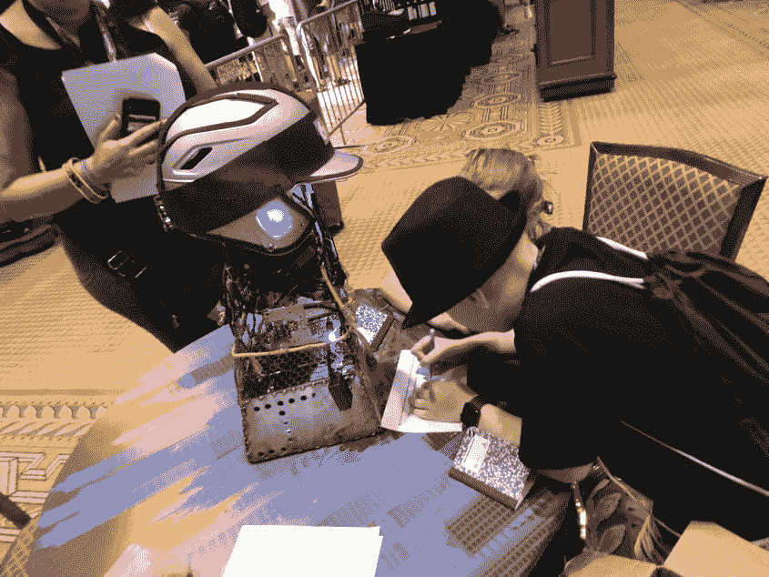

<figcaption id="caption-attachment-8407" class="wp-caption-text">*Escape the bad guys!*</figcaption>

</figure>

<figure id="attachment_8408" aria-describedby="caption-attachment-8408" style="width: 851px" class="wp-caption aligncenter">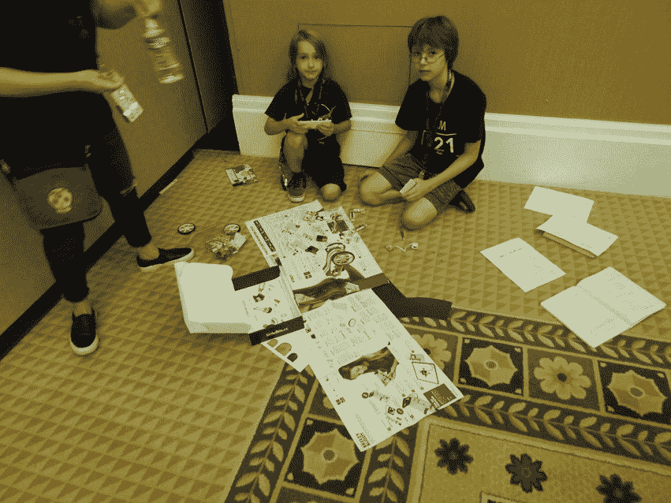

<figcaption id="caption-attachment-8408" class="wp-caption-text">*SECTF4Kids winners Nicholas and Brandon assembling a car*</figcaption>

</figure>

回到 SEVillage 的主厅，在 DEF CON 26 上，社会工程捕捉旗帜(SECTF)比赛开始了，有一些真正令人惊讶的电话和一位令人兴奋和惊讶的嘉宾评委。来自 Clutch 的 Neil Fallon 与 Chris 一起担任 SECTF 的评委，将他令人惊叹的技术支持技能带到了 SECTF 舞台。

<figure id="attachment_8409" aria-describedby="caption-attachment-8409" style="width: 880px" class="wp-caption aligncenter">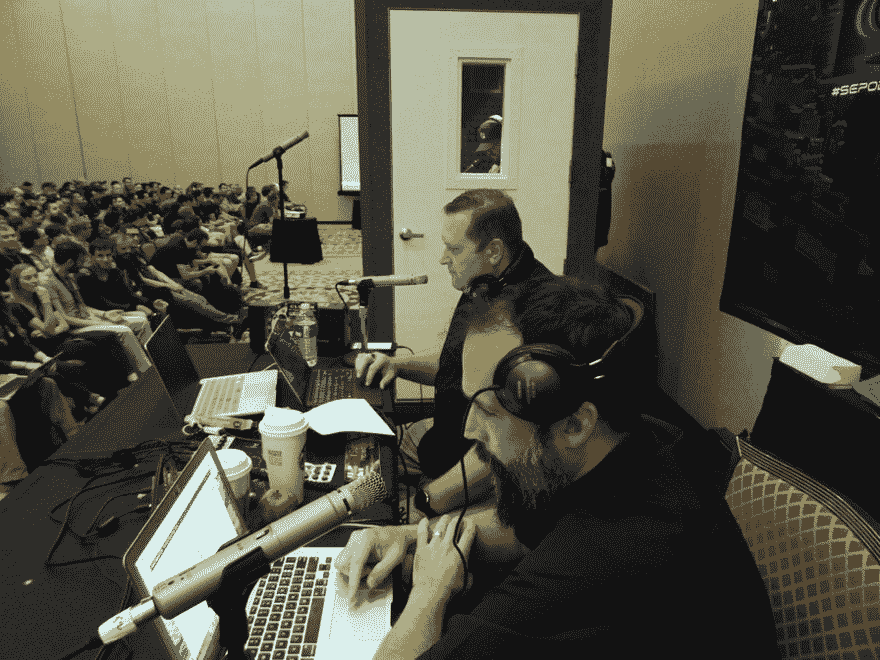

<figcaption id="caption-attachment-8409" class="wp-caption-text">*#NeilFallonIsMyTechSupport*</figcaption>

</figure>

今年 SECTF 的主题是运输公司，周五的目标包括 Delta，Old Dominion，Estes，Ryder，Budget，Heartland Express 和 Southeastern。星期五为我们带来了第一名和第二名的获胜者。从第二名开始我们有三年的第二名冠军，瑞秋·托巴！！你可能记得她是拥有最多噩梦视频的选手。与往年相比，今年有一个重大的不同，她没有屈居第二，而是叫“克里斯”。相反，惠特尼·麦克斯韦轻而易举地以几个不可思议的电话赢得了第一名。老实说，她几乎能得到多个目标的每一面旗帜。这确实令人印象深刻，这一整天再次强调了社会工程作为攻击媒介的有效性和风险。

女士们，祝贺你们的胜利！！今年的比赛真的很精彩。

<figure id="attachment_8410" aria-describedby="caption-attachment-8410" style="width: 966px" class="wp-caption aligncenter">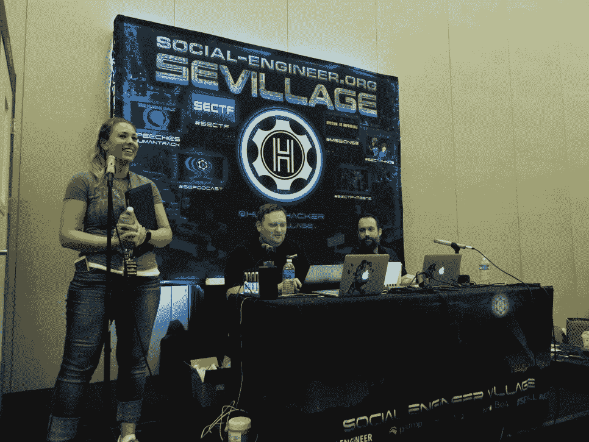

<figcaption id="caption-attachment-8410" class="wp-caption-text">*SECTF at DEF CON 26 winner, Whitney, answering Q&A*</figcaption>

</figure>

<figure id="attachment_8411" aria-describedby="caption-attachment-8411" style="width: 951px" class="wp-caption aligncenter">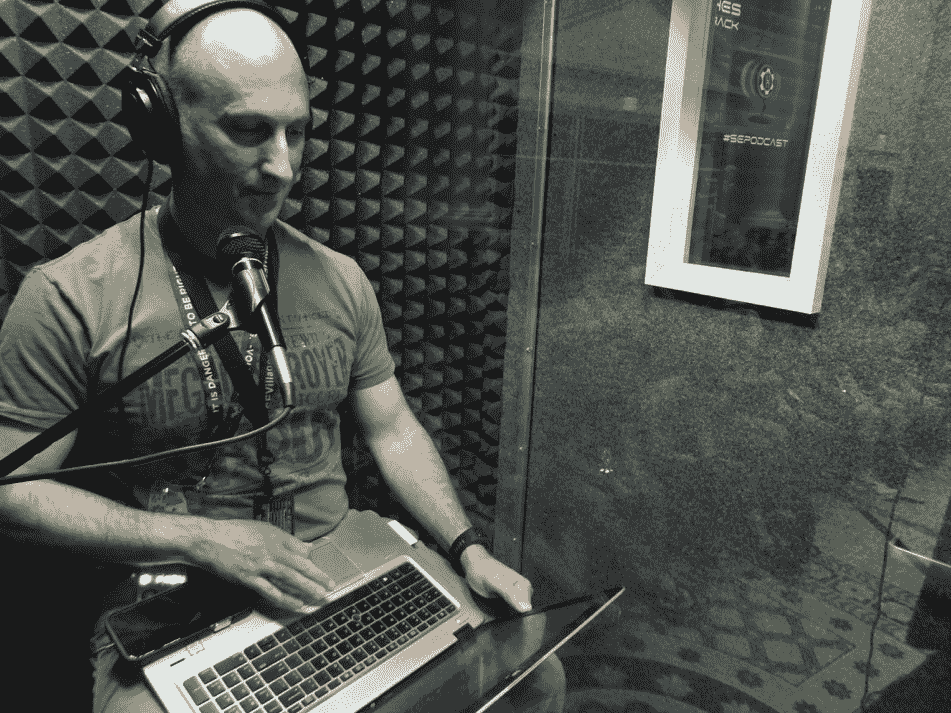

<figcaption id="caption-attachment-8411" class="wp-caption-text">*Computers are great SECTF Props*</figcaption>

</figure>

<figure id="attachment_8412" aria-describedby="caption-attachment-8412" style="width: 934px" class="wp-caption aligncenter">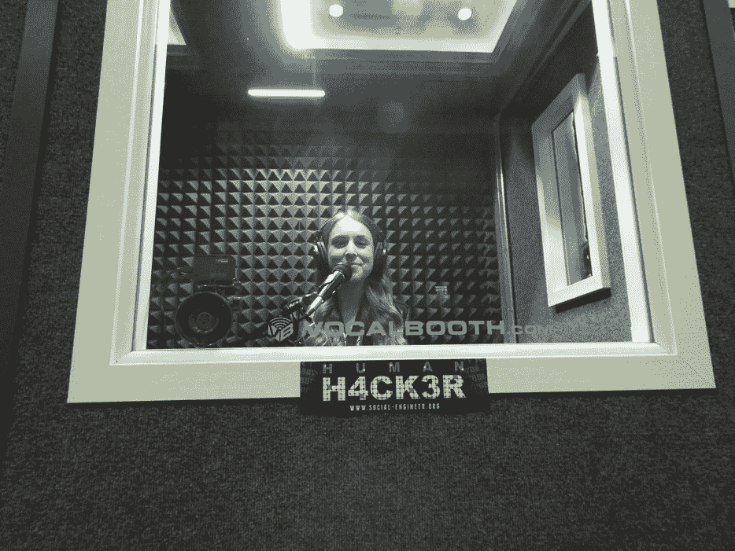

<figcaption id="caption-attachment-8412" class="wp-caption-text">*Rachel Tobac IS Chris/Human Hacker*</figcaption>

</figure>

<figure id="attachment_8413" aria-describedby="caption-attachment-8413" style="width: 989px" class="wp-caption aligncenter">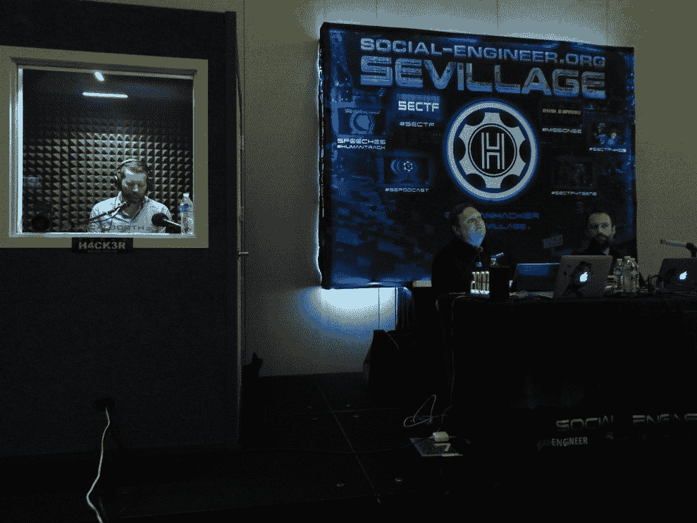

<figcaption id="caption-attachment-8413" class="wp-caption-text">*Focus in the booth*</figcaption>

</figure>

请关注几个月后 SECTF 报告的发布，其中详细介绍了 SEORG 2018 年 SECTF 所有比赛的一些统计亮点。

在周五的 SECTF 结束后，DEF CON 演讲者的人类轨道开始了。今年主题的质量和多样性确实令人惊叹，包括:
——我的脱衣舞娘名字是 Bubbles Sunset:SEO Meme 营销对 Hannah Silvers 社交工程的意义，
——从内向者到 Ryan McDougall 的旅程，
——Sinatra 先生将与 Neil Fallon 一起攻击你，
—In-N-Out——这就是 Billy Boatright 的全部，
—与 Wayne Ronaldson 的商战艺术，以及
—群体智能和增强现实游戏

许多这样的演讲都可以在网上看到，所以请保持警惕。

星期五的一个非常精彩的演讲来自我们的瑟格家族；Ryan MacDougall 分享了他从内向到真正鼓舞人心的社会工程力量的旅程，让观众热泪盈眶。如果以后有机会看到他演讲，千万不要错过！这个演讲得到了长时间的起立鼓掌。

<figure id="attachment_8414" aria-describedby="caption-attachment-8414" style="width: 829px" class="wp-caption aligncenter">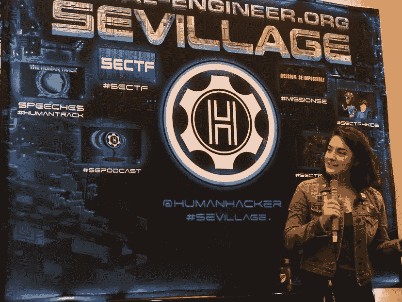

<figcaption id="caption-attachment-8414" class="wp-caption-text">*Featured above: Bubbles Sunset*</figcaption>

</figure>

<figure id="attachment_8415" aria-describedby="caption-attachment-8415" style="width: 837px" class="wp-caption aligncenter">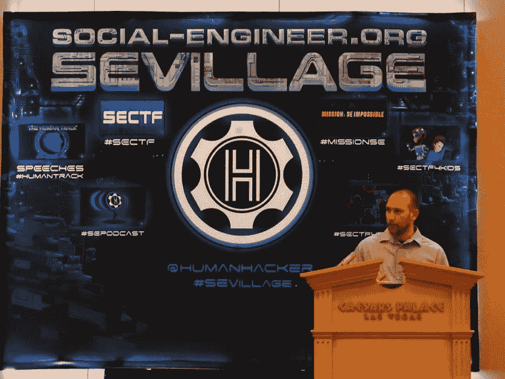

<figcaption id="caption-attachment-8415" class="wp-caption-text">*From Introvert to SE*</figcaption>

</figure>

<figure id="attachment_8416" aria-describedby="caption-attachment-8416" style="width: 904px" class="wp-caption aligncenter">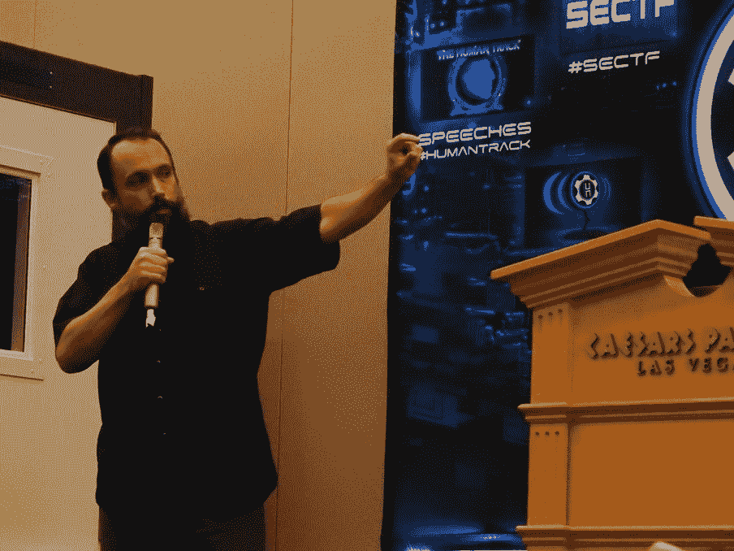

<figcaption id="caption-attachment-8416" class="wp-caption-text">*Mr. Sinatra will Hack you now*</figcaption>

</figure>

<figure id="attachment_8417" aria-describedby="caption-attachment-8417" style="width: 899px" class="wp-caption aligncenter">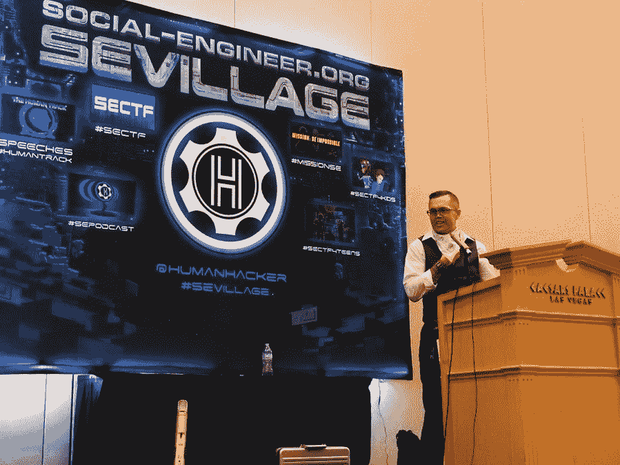

<figcaption id="caption-attachment-8417" class="wp-caption-text">*In-and-Out does not always reference burgers*</figcaption>

</figure>

<figure id="attachment_8418" aria-describedby="caption-attachment-8418" style="width: 861px" class="wp-caption aligncenter">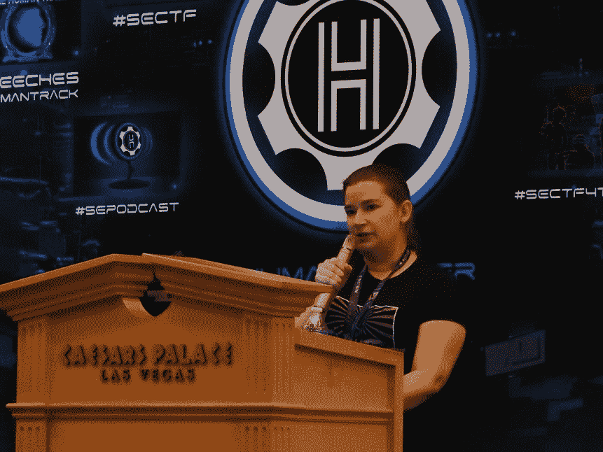

<figcaption id="caption-attachment-8418" class="wp-caption-text">*Teaching about that swarm intelligence!*</figcaption>

</figure>

在一个令人惊讶和激动的周五学习和分享后，DEF CON 26 团队爬进他们的房间喝威士忌，放松一下。

## SECTF、SECTF 4 tenes 和无辜生命基金会的最后一天——8 月 11 日星期六

这仅仅是第二年，第十四届又回来了，与一屋子兴奋的青少年见面。今年，我们有 22 名青少年报名，在最后一分钟想加入的青少年形成了一个等候名单。如果你正在读这篇文章，明年就提前注册吧！我们很乐意接受每一个青少年，如果你提前注册，我们绝对可以。注册在春末开始，仲夏结束。

我们今年真的提升了青少年的游戏，要求他们使用我们作为专业 se 每天使用的许多技能。这些谜题也是以“一号玩家”为主题的，但与孩子们的比赛不同，他们必须扮演邪恶公司“创新在线产业”的成员，以泄漏数据并拯救世界。他们解开密码，翻垃圾箱，研究开源情报(OSINT)，撬锁，垫手铐，最令人印象深刻的是，每个完成正式检查的青少年。这是特别令人印象深刻的，因为它要求青少年收集线索，形成一个有效的前文本，以找到必要的，缺失的信息。许多人体验到了为你的借口精心选择正确的电话号码的价值，或者用其他创造性的方法来提出要求。看着青少年尝试打电话，重新审视他们的策略，并再次尝试是真正令人敬畏的。他们勤奋、专注，那些最终成功的人很有礼貌，他们让我们的“服务台支持”感觉更好。第一个成功获得所需用户名的青少年是我们的第二名获奖者 Marissa！

视觉可以承受很大的情绪压力。它要求打电话的人以另一个人的身份发短信，给不认识的人打电话，并冒着被关机的风险。事实上，这些青少年都打破了他们的舒适区，并给它一个尝试是美妙的。

最后，青少年们就如何进入 SE 和信息安全行业展开了讨论。他们问了令人惊讶的问题。

我们的冠军 Carter 赢得了一台 3D 打印机，而第二名 Marissa 赢得了一架无人机。恭喜他们两个！！！

青少年——想要学习新东西，享受乐趣，赢得超酷的奖品？尽早在网上报名参加 DEF CON 27 的第 4 节。

<figure id="attachment_8419" aria-describedby="caption-attachment-8419" style="width: 896px" class="wp-caption aligncenter">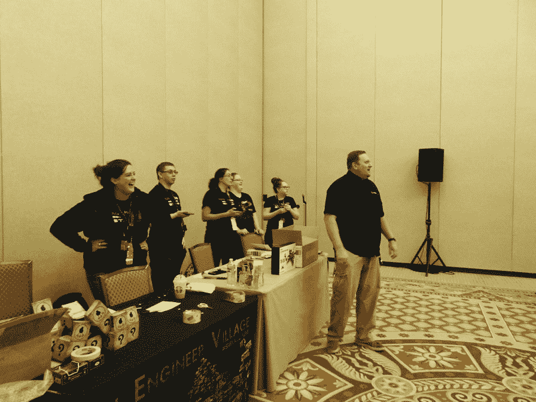

<figcaption id="caption-attachment-8419" class="wp-caption-text">*The SEVillage team kicking off the SECTF4Teens*</figcaption>

</figure>

<figure id="attachment_8420" aria-describedby="caption-attachment-8420" style="width: 878px" class="wp-caption aligncenter">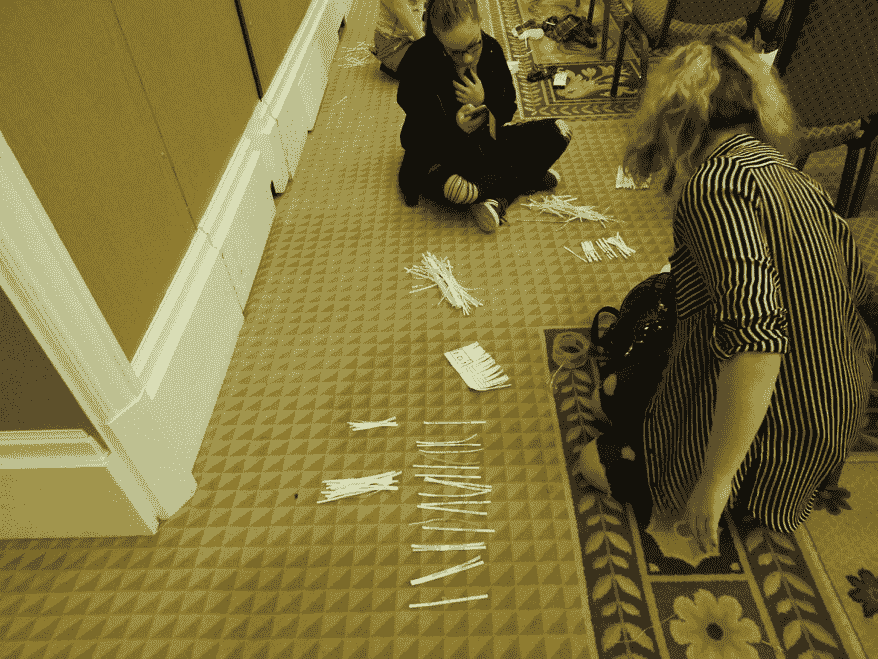

<figcaption id="caption-attachment-8420" class="wp-caption-text">*Dumpster diving takes organization!*</figcaption>

</figure>

<figure id="attachment_8421" aria-describedby="caption-attachment-8421" style="width: 1024px" class="wp-caption aligncenter">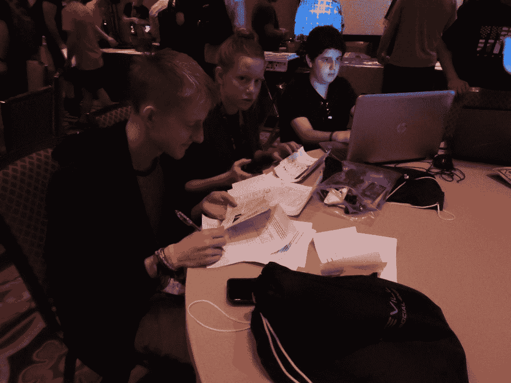

<figcaption id="caption-attachment-8421" class="wp-caption-text">*OSINT for your life!!*</figcaption>

</figure>

<figure id="attachment_8422" aria-describedby="caption-attachment-8422" style="width: 843px" class="wp-caption aligncenter">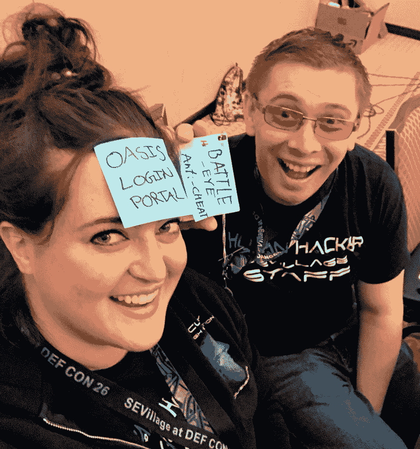

<figcaption id="caption-attachment-8422" class="wp-caption-text">*This is definitely how human hacking works*</figcaption>

</figure>

<figure id="attachment_8423" aria-describedby="caption-attachment-8423" style="width: 945px" class="wp-caption aligncenter">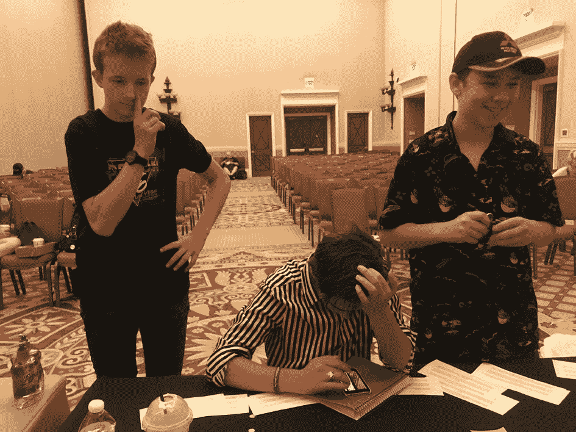

<figcaption id="caption-attachment-8423" class="wp-caption-text">*The faces of people figuring out vishing pre-texts*</figcaption>

</figure>

<figure id="attachment_8424" aria-describedby="caption-attachment-8424" style="width: 654px" class="wp-caption aligncenter">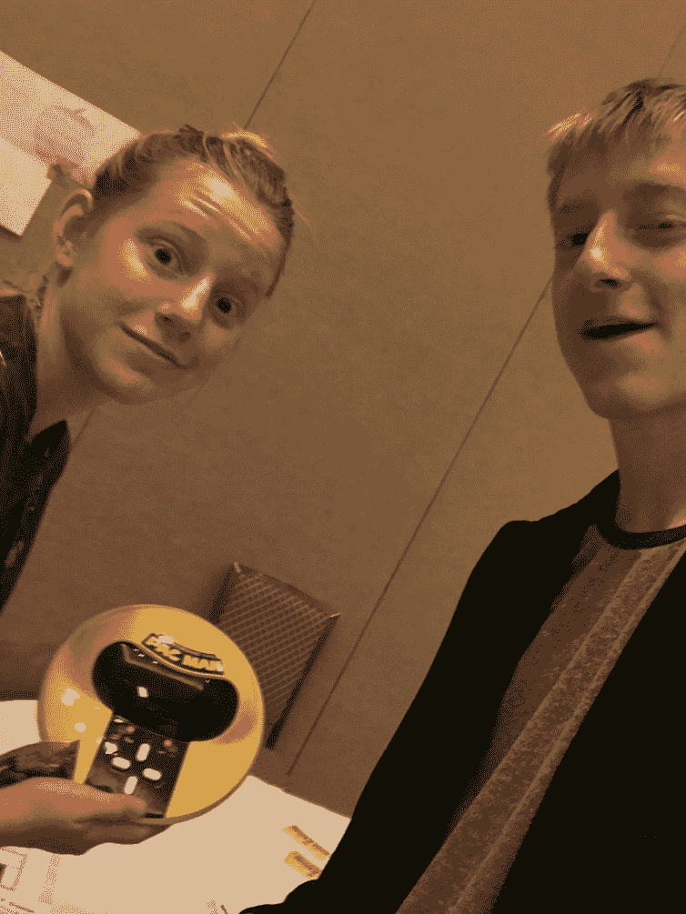

<figcaption id="caption-attachment-8424" class="wp-caption-text">*1st and 2nd place winners on their scavenger hunt for bonus points!*</figcaption>

</figure>

在主会议室里，SECTF 向前推进，目标是阿拉斯加航空公司、联合航空公司、联合出租公司、美国航空公司、J.B .亨特公司、赫兹公司和企业公司。所有相关社会工程师的精彩表现，特别是对在阿拉斯加航空公司发生劫机事件后第二天处理该事件的社会工程师的欢呼。

<figure id="attachment_8425" aria-describedby="caption-attachment-8425" style="width: 833px" class="wp-caption aligncenter">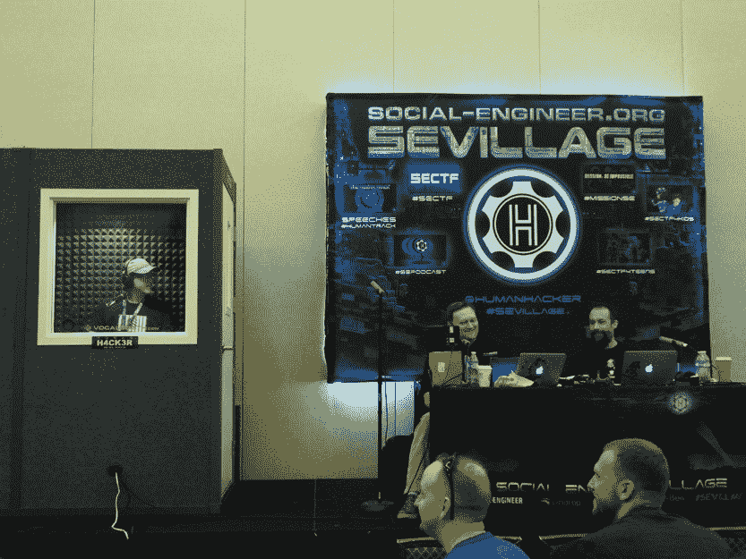

<figcaption id="caption-attachment-8425" class="wp-caption-text">*Laughter during calls is the best!*</figcaption>

</figure>

<figure id="attachment_8377" aria-describedby="caption-attachment-8377" style="width: 841px" class="wp-caption aligncenter">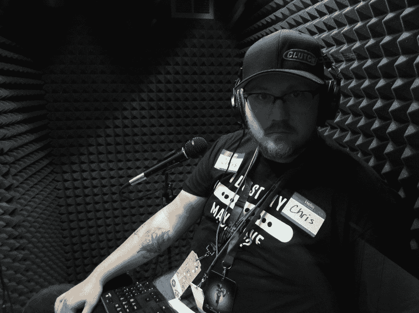

<figcaption id="caption-attachment-8377" class="wp-caption-text">*Hello, Chris V.28454*</figcaption>

</figure>

<figure id="attachment_8378" aria-describedby="caption-attachment-8378" style="width: 830px" class="wp-caption aligncenter">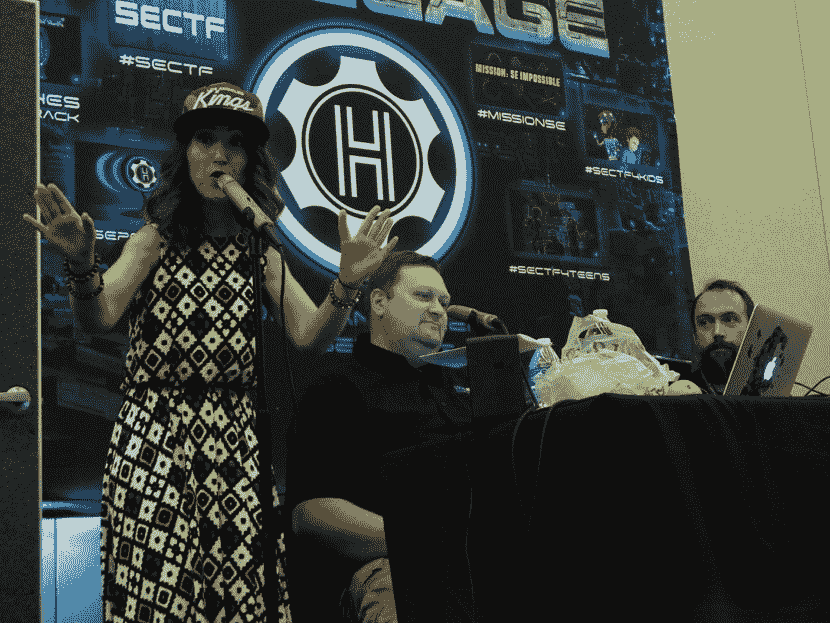

<figcaption id="caption-attachment-8378" class="wp-caption-text">*Q&A O’Clock!*</figcaption>

</figure>

这一天结束了另一轮，也是最后一轮出色的会谈，包括:
-凯瑟琳·马林的《从 CISO 的角度看社会工程》，
-深渊正在招手……克里斯·罗伯茨，
-狩猎掠食者:克里斯·哈德纳吉、尼尔·法伦和 AJ·库克的《SE Style》，
-狩猎:与克里斯·西尔维斯一起黑掉狩猎小组，
-与奥恩舒尔·雷吉一起进行本科生社会工程课程项目。

值得注意的是，包括 Neil Fallon、AJ Cook 和 Chris Hadnagy 在内的 Innocent Live Foundation (ILF)董事会成员概述了为什么 ILF 的工作如此必要，以及去年非营利组织的发展进展如何。

<figure id="attachment_8379" aria-describedby="caption-attachment-8379" style="width: 757px" class="wp-caption aligncenter">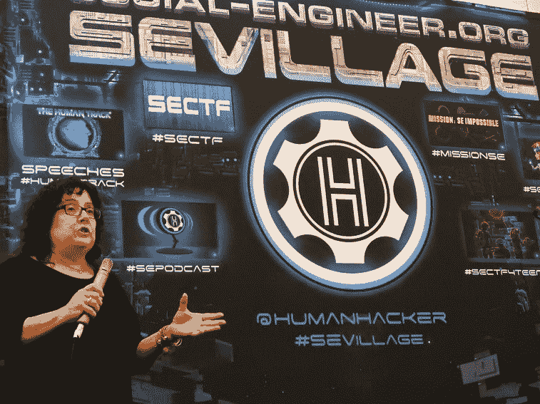

<figcaption id="caption-attachment-8379" class="wp-caption-text">*Social Engineering from a CISO’s perspective*</figcaption>

</figure>

<figure id="attachment_8380" aria-describedby="caption-attachment-8380" style="width: 834px" class="wp-caption aligncenter">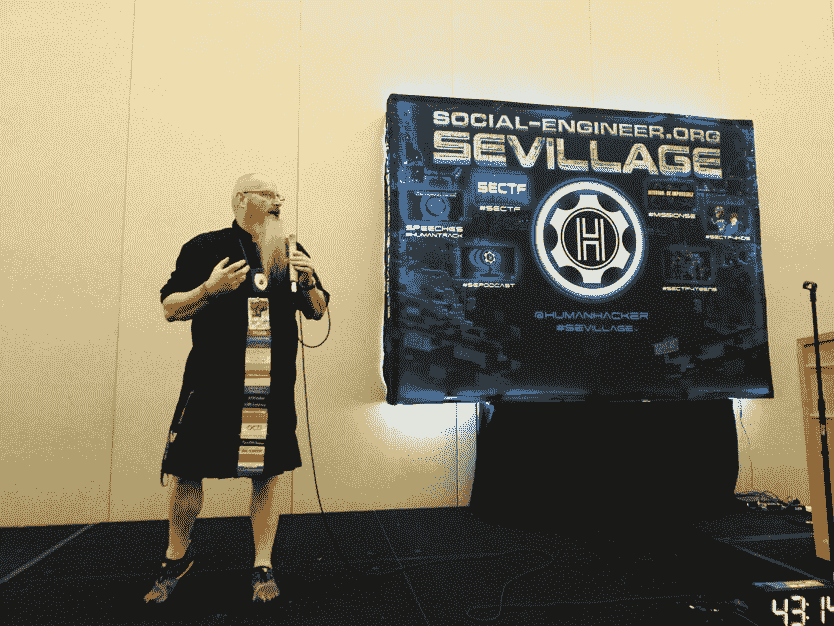

<figcaption id="caption-attachment-8380" class="wp-caption-text">*The Abyss is Waving Back…*</figcaption>

</figure>

<figure id="attachment_8381" aria-describedby="caption-attachment-8381" style="width: 888px" class="wp-caption aligncenter">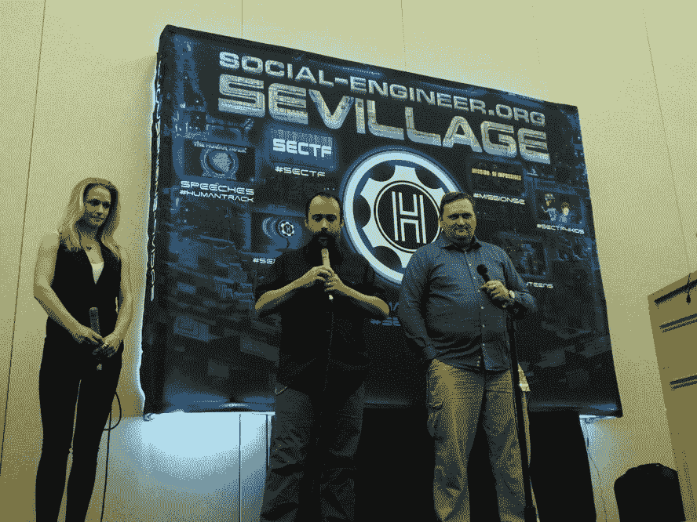

<figcaption id="caption-attachment-8381" class="wp-caption-text">*Hunting Predators: SE Style with the board of the ILF doing Q&A*</figcaption>

</figure>

<figure id="attachment_8382" aria-describedby="caption-attachment-8382" style="width: 836px" class="wp-caption aligncenter">

<figcaption id="caption-attachment-8382" class="wp-caption-text">*D’awww – the Hadnagys are adorable*</figcaption>

</figure>

周六，我们邀请了我们的学生、客户和朋友，无论是老朋友还是新朋友，一起出去玩，享受彼此的陪伴。

## SEPodcast，清理，颁奖，以及第 26 届 DEF CON 的结束–8 月 12 日星期日

天啊。我们已经到达了 DEF CON 的最后一天。周日，团队在睡眠不足的情况下醒来，但退出了另一年的精彩 DEF CON。我们与嘉宾 Neil Fallon 一起参加了 SEPodcast，在那里我们讨论了过去和现在所有 DEF con 的故事、成就和问答。

播客结束后，我们对村庄进行了打包，包括对赃物进行分类，拆卸半吨重的录音棚，以及清点所有的东西。最后，我们都参加了颁奖典礼，我们的第一名获奖者 Whitney 赢得了一枚黑色徽章，可以无限期参加 DEF CON。

<figure id="attachment_8383" aria-describedby="caption-attachment-8383" style="width: 933px" class="wp-caption aligncenter">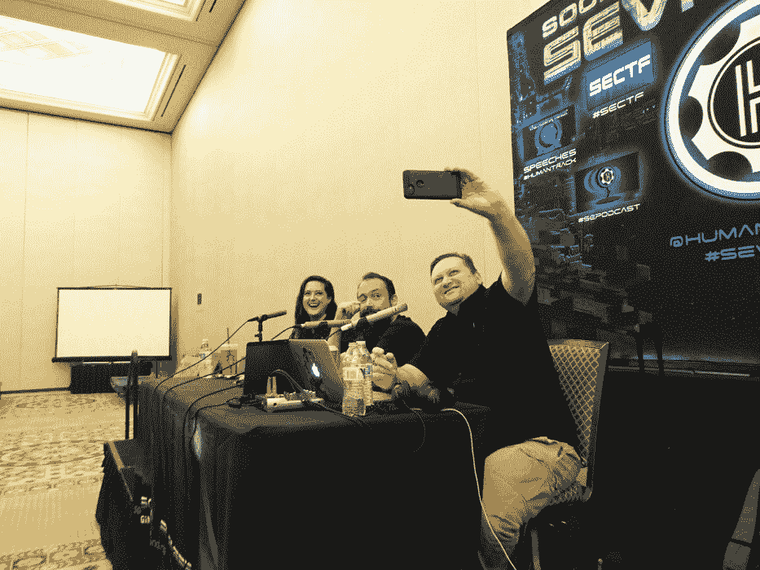

<figcaption id="caption-attachment-8383" class="wp-caption-text">*The SEPodcast*</figcaption>

</figure>

<figure id="attachment_8384" aria-describedby="caption-attachment-8384" style="width: 979px" class="wp-caption aligncenter">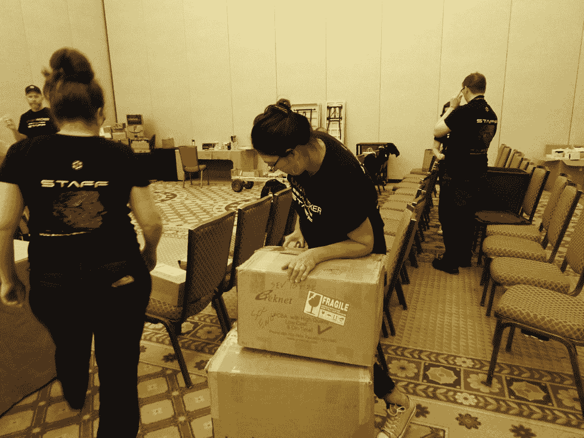

<figcaption id="caption-attachment-8384" class="wp-caption-text">*Pack, pack, pack it up!*</figcaption>

</figure>

<figure id="attachment_8385" aria-describedby="caption-attachment-8385" style="width: 965px" class="wp-caption aligncenter">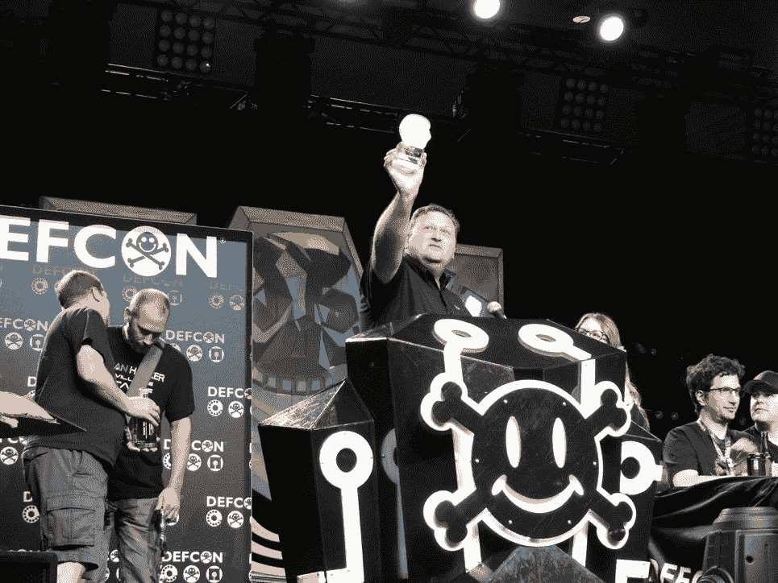

<figcaption id="caption-attachment-8385" class="wp-caption-text">*Trophies!*</figcaption>

</figure>

<figure id="attachment_8386" aria-describedby="caption-attachment-8386" style="width: 1024px" class="wp-caption aligncenter">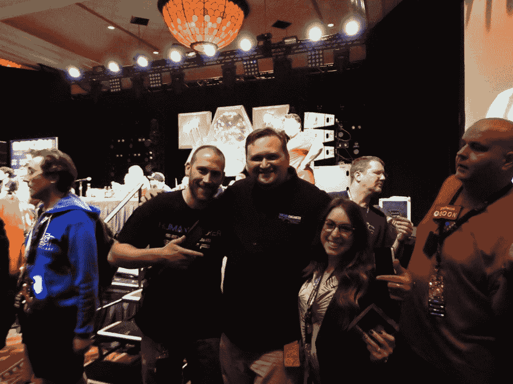

<figcaption id="caption-attachment-8386" class="wp-caption-text">*Ryan and Chris with 2nd place winner Rachel*</figcaption>

</figure>

没有朋友、家人、赞助商和我们了不起的团队的大力帮助，塞维利亚是不可能的。塞维利亚队，我们非常感谢你！

非常感谢我们的赞助商——know be 4、Pindrop Security 和 Hillbilly Hit Squad。这是如此美妙的一年，我们迫不及待地想在 DEF CON 27 上再次见到大家！！！！

<figure id="attachment_8387" aria-describedby="caption-attachment-8387" style="width: 936px" class="wp-caption aligncenter">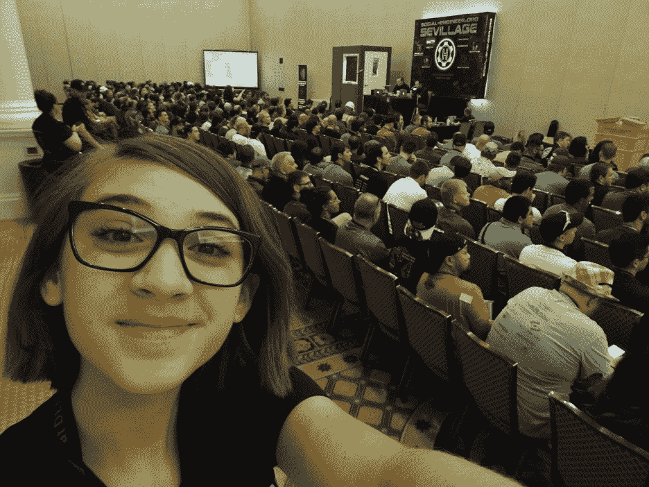

<figcaption id="caption-attachment-8387" class="wp-caption-text">*Our photographer Amaya*</figcaption>

</figure>

<figure id="attachment_8388" aria-describedby="caption-attachment-8388" style="width: 1024px" class="wp-caption aligncenter">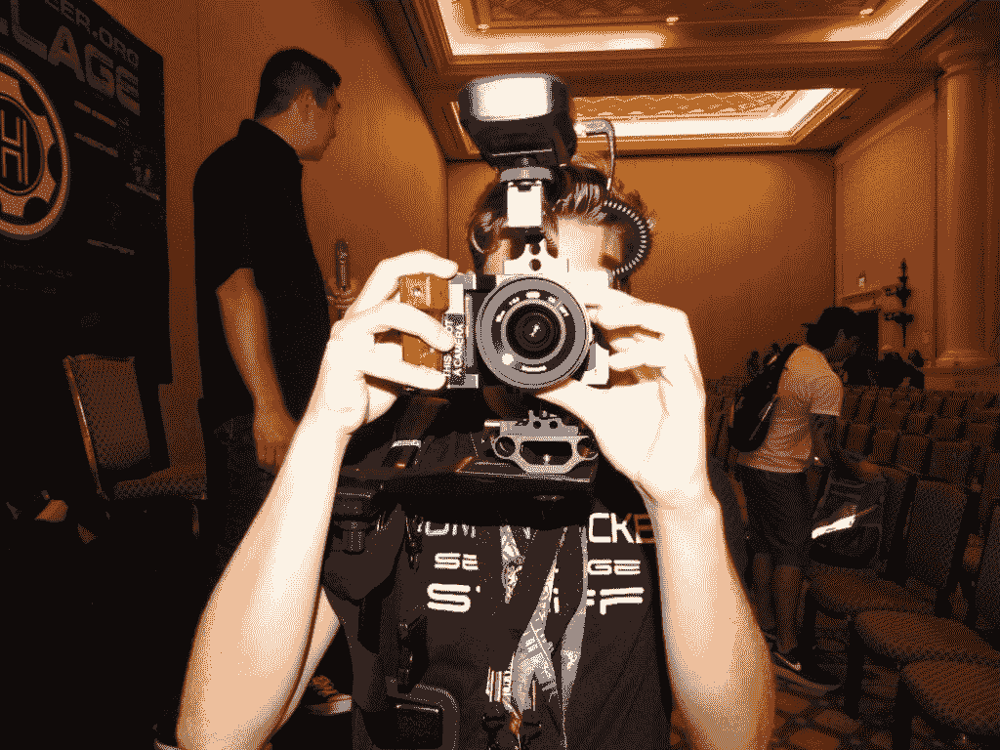

<figcaption id="caption-attachment-8388" class="wp-caption-text">*Videographer: Toby*</figcaption>

</figure>

<figure id="attachment_8389" aria-describedby="caption-attachment-8389" style="width: 1024px" class="wp-caption aligncenter">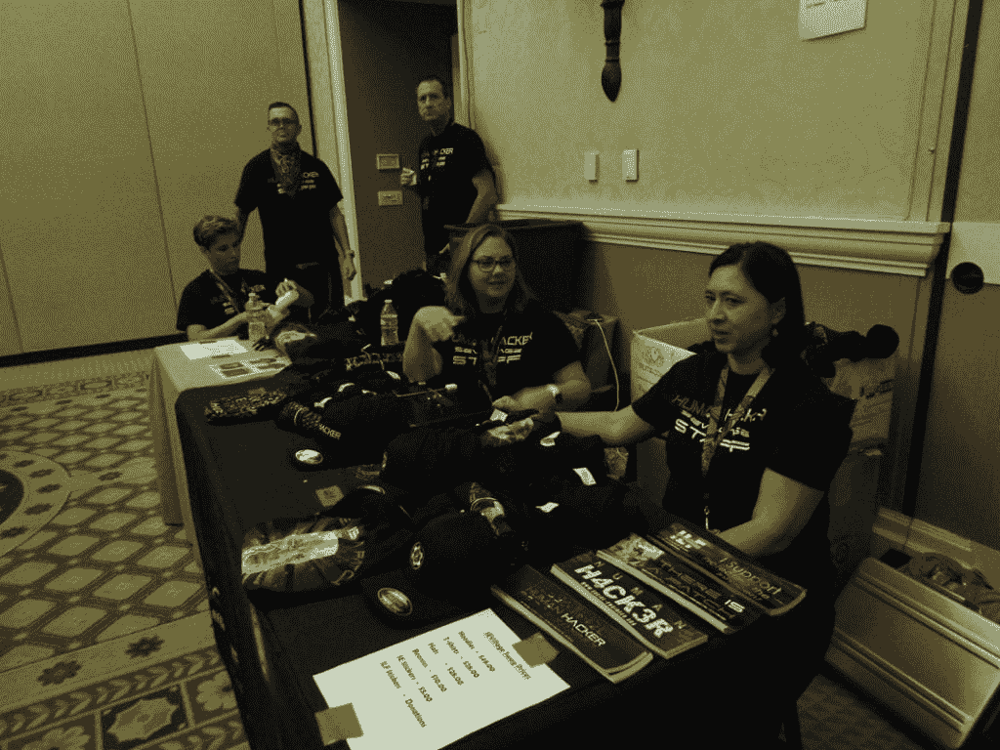

<figcaption id="caption-attachment-8389" class="wp-caption-text">*Amazing friends, family, and staff at swag: Toby, Billy, Mike, Kris, and Areesa*</figcaption>

</figure>

“感谢塞维利亚的所有工作人员:克里斯、汉娜、克里斯、蒂姆、丹、斯潘塞、托比、保罗、埃文、詹恩、艾琳、科林、吉姆、卡兹、凯特、尼尔、比利、迈克、阿蕾莎、阿玛雅和克里斯”

*大多数照片的图片来源:Amaya Hadnagy