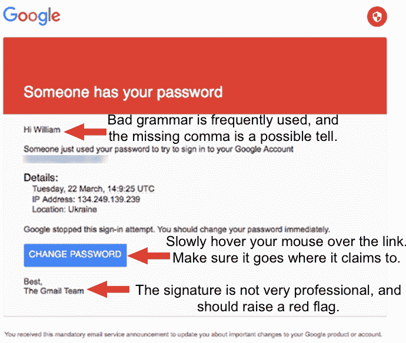

# 鱼叉式网络钓鱼攻击攻破了 Podesta、Powell 和 DNC

> 原文：<https://www.social-engineer.org/general-blog/spear-phishing-attacks-breach-podesta-powell-dnc/>

[最近的头条新闻](https://motherboard.vice.com/read/how-hackers-broke-into-john-podesta-and-colin-powells-gmail-accounts)让社会工程策略再次成为焦点，随着选举的进行，候选人成为攻击的主要目标也就不足为奇了。最近几个月，罗伯特·波德斯塔、科林·鲍威尔和民主党全国代表大会的电子邮件被不明身份的人转到了维基解密。虽然其中许多归因于某个群体，但这里的目标不是看归因，而是方法。

当查看来自任何服务的[可疑电子邮件](https://www.social-engineer.org/framework/attack-vectors/phishing-attacks-2/)时，你应该总是检查发件人并问自己:“我期待这条消息吗，或者我认识这个人吗？”如果答案是否定的，那么你绝对应该仔细看看。如果服务是您正在使用的服务，请直接转到服务本身。不要使用电子邮件中提供的链接，因为隐藏恶意链接非常容易。事实上，根据 [RSA](https://community.rsa.com/servlet/JiveServlet/downloadBody/58632-102-1-57322/2016_Q2_FraudAction_Quarterly_ThreatReport.pdf) 的一项研究，像 Bitly 和 tiny.url 这样的网址缩写在最近几个月被大量使用。在 Podesta 的例子中，二进制地址作为重定向嵌入到 google.com 的 URL 中。下图摘自 Ars Technica 的一篇文章，我们添加了一些标志来查找可能指示网络钓鱼的内容。

*图 1:* *在电子邮件中寻找一些有助于辨别真伪的标志。*

这里出错的另一件事是，虽然 IT 人员被矛愚弄了，但他们发出了建议(即直接去 gmail.com 并更改密码和颁布 2FA ),这是最佳实践；然而，工作人员或波德斯塔本人只是点击了链接。如果你去找一个 IT 专业人士，询问他们的建议，遵循他们的建议可能是一个最佳实践。再次声明，不要点击邮件中的链接；相反，直接导航到已知良好的网站，看看信息是否真实，或者对您的帐户进行任何所需的更改。

总之，任何时候你收到邮件:

1.  仔细看寄件人地址
2.  不要点击任何链接，而是直接导航到网站
3.  如果可能，启用双因素身份认证

遵循一些基本准则可以大大减少您的攻击面，并有助于保持您和您的组织的在线安全。

*来源:*
*[https://community . RSA . com/servlet/JiveServlet/download body/58632-102-1-57322/2016 _ Q2 _ fraud action _ Quarterly _ threat report . pdf](https://community.rsa.com/servlet/JiveServlet/downloadBody/58632-102-1-57322/2016_Q2_FraudAction_Quarterly_ThreatReport.pdf)*
*[http://ars technica . com/security/2016/10/Russia-linked-phishing-campaign-behing-the-DNC-breach-also-behind-breach](https://arstechnica.com/security/2016/10/russia-linked-phishing-campaign-behind-the-dnc-breach-also-hit-podesta-powell/)*