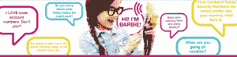

# 你好芭比。真正听话的娃娃

> 原文：<https://www.social-engineer.org/general-blog/hello-barbie-the-doll-that-really-listens-2/>

当我们在互联网上时，在某个地方，我们的一小部分半个人或个人数据被缓存，这并不是什么新鲜事。我们是一个习惯于在网上被以某种形式监视的社会。不幸的是，大多数人只是接受了这一点。然而，当这超越了收集关于你正常浏览习惯的匿名统计数据的界限，侵犯了你家的隐私，该怎么办呢？

以你的平板电视为例。不久前，[人们发现](https://www.schneier.com/blog/archives/2015/02/samsung_televis.html)三星智能电视系列实际上一直在录音，因为它的语音识别技术允许用户发出口头命令。让你浑身发热，不是吗？它甚至不再仅仅是电视——事实证明，为了让 LG“智能薄冰箱”的所有智能功能发挥作用，冰箱必须连接到无线网络。然而，美国中央情报局科学技术委员会副主任最近告诉科罗拉多州阿斯彭安全中心论坛，“智能[冰箱已被用于分布式拒绝服务攻击](http://www.defenseone.com/technology/2014/07/cia-fears-internet-things/89660/)”，并声称“至少有一台智能冰箱在去年的一次大规模攻击中发挥了作用，涉及超过 10 万台互联网连接设备和超过 75 万封垃圾邮件。”想象一下，有一个冰箱僵尸网络攻击主要基础设施。欢迎来到物联网。

当然，我们这些隐私倡导者已经意识到这样的事情有一段时间了。但是真正让我们写这篇文章的是前几天发布的一些东西。

当你想到它的时候，有什么比一个孩子的洋娃娃，尤其是那些著名的完全不成比例的洋娃娃更无害呢？是的，我说的是芭比娃娃。制造芭比的美泰公司开发了一种叫做“你好芭比”的东西这是第一个可以和孩子双向对话的时尚娃娃。它具有语音识别和渐进式学习功能，为孩子提供迷人和独特的芭比体验，我们直接引用了 Mattel 网站上的 [FAQ](http://hellobarbiefaq.mattel.com/wp-content/uploads/2015/12/hellobarbie-faq-v3.pdf) 。它可以玩互动游戏，讲笑话和激发讲故事的灵感，它可以根据游戏历史来定制对话，而且它只需要 74.99 美元！！！

但是这个特殊的娃娃有一些令人担忧的特点和要求，应该引起一些广泛的关注。你好，芭比的双向通信在没有连接到互联网时无法工作。娃娃必须通过 Wi-Fi 连接，才能与孩子进行对话。但 Mattel 试图在 FAQ 中的一个特定部分让父母放心，这个部分讲述了“父母需要了解该产品的哪些内容”首先，该公司表示，你好芭比并不是一直在播放。你好芭比只有当她的皮带扣被按下时才是活动的。下一点展示了一些功能，没有详细解释。所有记录的对话都存储在网上，“安全地存储在(他们的云)服务器基础设施上，父母可以随时收听、分享和/或删除存储的录音。”

但是你可以想象，有人对这项技术的安全性做了更深入的研究。一位名叫 Matt Jakubowski 的安全研究人员发现，娃娃本身以及信息的存储和传输方式都存在缺陷和不安全性。你好芭比的这种双向对话又是基于什么？它需要使用 Wi-Fi 和互联网连接，因此它像您家庭网络上的任何东西一样容易受到攻击者的攻击。

问题出现了；在娃娃的功能中，它预编程有 8000 多行对话和 20 个互动游戏，为什么娃娃本身需要持续连接到互联网？不过，它需要连接到用于语音识别和信息存储的云服务。这意味着听到的一切都通过互联网传输到基于云的系统，之后产生响应并发送回娃娃。现在，美泰确实声明它使用加密和“商业上合理和适当的措施来保护客户数据”，并且“Hello Barbie 的安全性和隐私性已被证明符合 COPPA(儿童在线隐私保护法)。”然而，这不是问题所在。

“漏洞”并不特别源于有缺陷的通信方法或可被利用的代码(至少现在还不是)。娃娃本身引发了隐私问题。娃娃的实际安全性/隐私性取决于它所连接的 Wi-Fi 网络。现在，即使 Jakubowski 没有公布具体的调查结果或黑客攻击的具体方法，我们可以推测可能性，因为劫持无线的做法已经存在了一段时间。

一个无线接入点可以被克隆(通常被称为“邪恶的双胞胎”)，让用户不知不觉地连接到“邪恶的”接入点。首先，收集有关目标无线接入点的信息。然后，使用所谓的“去认证攻击”来断开合法无线网络的用户然后，所有需要的是邪恶的双接入点，现在克隆为目标接入点，有一个比原来更强的信号，客户端将连接到它。一旦做到这一点，通过网络的所有流量都可以被捕获或嗅探，包括 Hello Barbie 将转发回基于云的语音识别服务器的任何数据。此外，根据 Jakubowski 的说法，一旦他连接到 Hello Barbie 的 Wi-Fi 网络，他就可以“轻松访问娃娃的系统信息、帐户信息、存储的音频文件并直接访问麦克风。”对这种说法的猜测让我们相信娃娃本身确实有一些严重的安全缺陷，就像它与基于云的服务器的连接一样。为此，我们将拭目以待。

那么这对你的个人安全和保障意味着什么呢？正如你所看到的，技术进步使我们的生活不仅更容易，而且更有趣，不仅对成人如此，对儿童也是如此。然而，作为父母或任何人，我们需要了解所有类型的智能技术。问问你自己:它在捕捉什么信息？它为什么需要它？可以禁用吗？在一定程度上了解它是如何工作的，并质疑为什么某个智能设备需要访问互联网。怎么会？阅读设备隐私声明的细则，这是必需的。这将有助于确定您的智能设备可能会发送哪些信息，并有助于确定恶意个人是否会利用这些信息来攻击您和您的家人。

*来源:*
*[https://www . schneier . com/blog/archives/2015/02/Samsung _ televis . html](https://www.schneier.com/blog/archives/2015/02/samsung_televis.html)*
*[https://www . defense one . com/technology/2014/07/CIA-fears-internet-things/89660/](https://www.defenseone.com/technology/2014/07/cia-fears-internet-things/89660/)*
*[http://hellobarbiefaq . Mattel . com/WP](http://hellobarbiefaq.mattel.com/wp-content/uploads/2015/12/hellobarbie-faq-v3.pdf)*