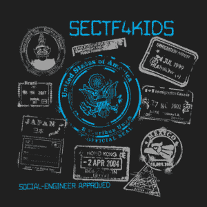

# DEF CON 23 的第 4 节 Kids - Back

> 原文：<https://www.social-engineer.org/event-updates/defcon-updates/sectf4kids-back-for-def-con-23/>

让您的家人做好准备，因为 SEORG 和 SEVillage 在 DEF CON 开始接受报名参加将于 8 月 8 日星期六在 DEF CON 23 举行的#SECTF4Kids 比赛。去年的比赛让孩子们和他们的父母忙了几乎一整天。我们无法告诉你让孩子们如此勤奋地完成所有的活动和谜题是多么值得。尽管获胜的队伍已经完成了比赛，但其他队伍却乐此不疲，为了完成比赛而奋力向前。它使小时和小时(和小时！)我们投入设计的东西值得！

 今年的主题是**一场从一个国家(好吧，DEF CON 的一部分)到另一个国家的惊人比赛**，同时各队完成活动、谜题和密码，看谁将第一个冲过终点线获得惊人的奖金。我们还增加了一些新的逻辑谜题和更多的社会互动(由父母安全监控),以鼓励孩子们探索社会工程的世界。一如既往，这项活动旨在教授孩子们批判性思维、团队合作、毅力和创造性解决问题的技能。我们对今年 DEF CON 的新位置感到兴奋，我们打算充分利用它！我们今年有几个令人兴奋的转折，包括一个有创意和有趣的任务，这将有助于提高黑客 4charity 的意识(甚至可能是资金)，是的，nerf guns 将会出现。

为了帮助决定孩子们(让我们面对现实吧，父母也一样)是否会喜欢做 SECTF4Kids，我们提出了一套指南，概述了为所有人提供最高质量的娱乐和快乐而推荐的熟练程度。如果你想快速进入，现在就去[登记](https://www.social-engineer.org/ctf/social-engineering-capture-the-flag-for-kids-at-def-con-23/)。

特别声明:我们将再次帮助注册的家长和孩子获得 DEF CON 通行证，注册详情将会发送给他们。

希望在那里见到你！