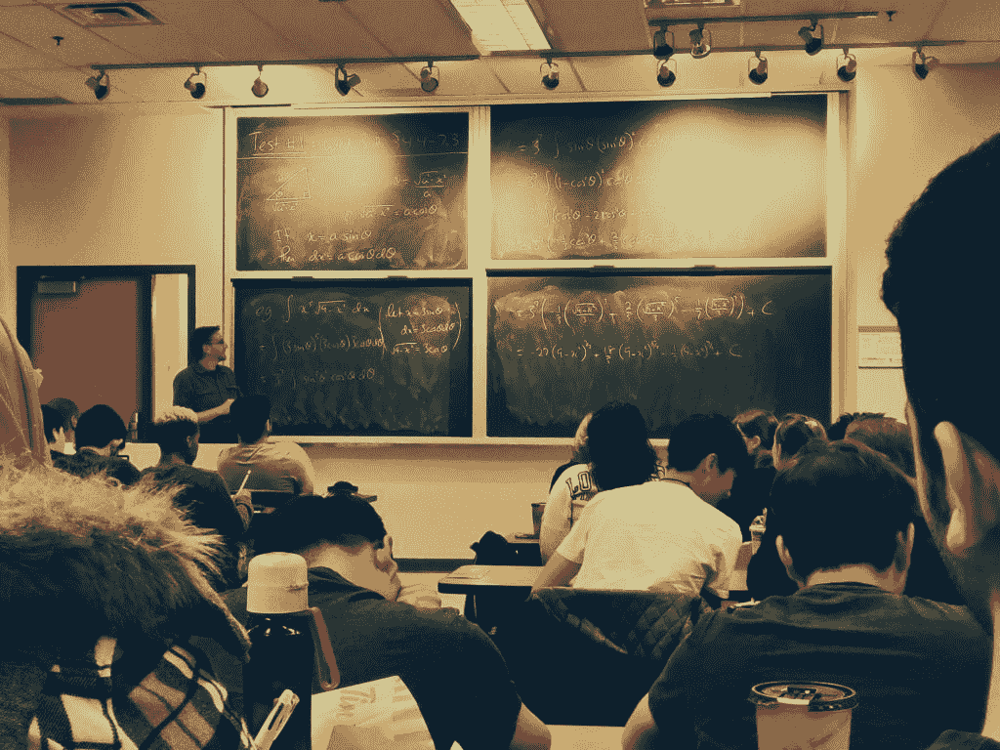

# 身份盗窃和学生

> 原文：<https://www.social-engineer.org/social-engineering/identity-theft-student/>

你认为你是安全的，因为你是一个正直的公民，不参与危险的网络行为？再想想。 [两名身份窃贼](https://archives.fbi.gov/archives/atlanta/press-releases/2013/two-arraigned-in-identity-theft-scheme-targeting-emory-students) 最近试图在窃取他们的身份并利用窃取的信息获得贷款后，欺骗一百多名埃默里大学的毕业生。

当局认为，Maario Coleman 和 Angela Russell 在网上查看学生并参加毕业典礼后选择了他们的受害者，以获得姓名并创建目标名单。然后，两人在以学生的名义申请贷款之前，使用在线数据库查找匹配的社会安全号码和出生日期。这两个小偷能够通过访问埃默里的学生用户帐户提供他们能够获得的信息，向 Discover Bank 提供学校成绩单。贷款被存入用被盗身份开立的银行账户，资金在 ATMS 被提取。

到目前为止，执法部门已经发现了拉塞尔和科尔曼伪造的 20 多万美元的贷款申请。这两个人在五月开始这个计划，并在十一月被逮捕。埃默里大学在事件发生后发布了一份关于学生个人信息隐私和安全的声明。

## 一个很好的提醒

这起特殊的犯罪很好地提醒了我们，身份盗窃并不只是针对那些利用个人信息从事冒险或粗心行为的人。这个故事中的受害者被选为目标，因为他们从大学毕业，获得了良好的学位，这使得他们对研究生贷款的贷款人更具吸引力。这些学生的成功使他们容易受到小偷的阴谋的伤害，并适合他们。

即使你觉得安全，监控你的信用和财务状况也是一个好主意。罪犯喜欢有安全感的目标；意味着受害者没有在找他们。正如最近埃默里大学毕业生的不幸所表明的那样，你永远不知道谁在打量你。

*来源:*
*[https://archives . FBI . gov/archives/Atlanta/press-releases/2013/two-arranged-in-identity-they-stealty-targeting-emory-students](https://archives.fbi.gov/archives/atlanta/press-releases/2013/two-arraigned-in-identity-theft-scheme-targeting-emory-students)*
*[https://www . social-engineer . org/framework/general-discussion/categories-social-engineers/identity-theives/](https://www.social-engineer.org/framework/general-discussion/categories-social-engineers/identity-theives/)*

*图片:*