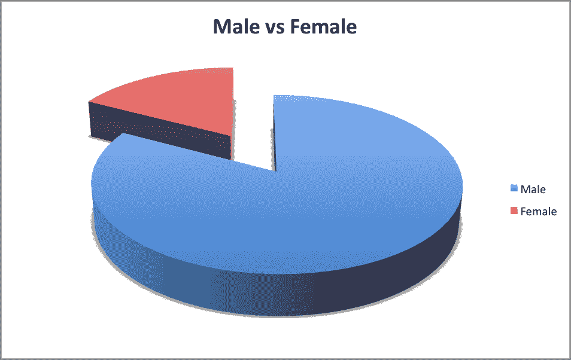
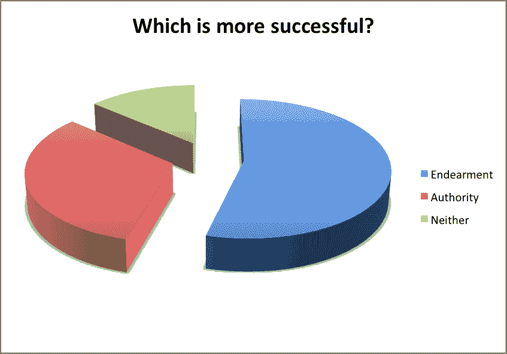
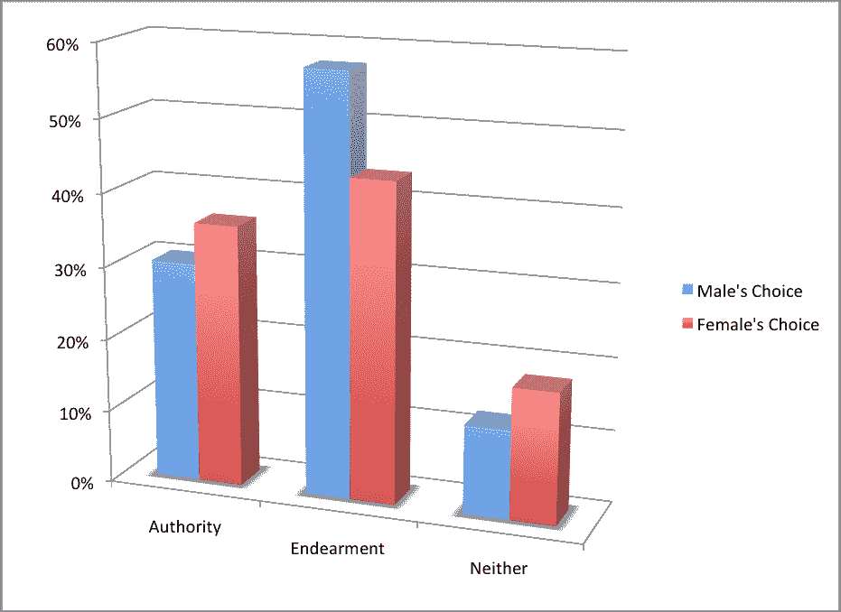

# 社会工程民意调查——爱与权威

> 原文：<https://www.social-engineer.org/social-engineering/social-engineering-poll-endearment-vs-authority/>

是的，我们已经很久没有进行社会工程调查了。但是我们准备公布迄今为止最成功的一次选举的结果，并开始新的投票。

**亲情 vs 权威**

这项民意调查基于两个不同的故事。第一个案例展示了一个恶意的社会工程师是如何利用[钟爱](https://www.social-engineer.org/framework/influencing-others/influence-tactics/liking/)原则的。

第二个故事涉及一个社会工程师，他运用了[权威原则](https://www.social-engineer.org/framework/influencing-others/influence-tactics/authority/)。一个社会工程师仅仅拿着一个写字板并负责，就能操纵人们放弃有价值的数据吗？

这两种情况都有第三种选择，但都行不通。结果如何？

我们允许在很长一段时间内收集尽可能多的数据。我们唯一要求的是性别、工作领域和他们的选择。这些统计数据不仅能让我们了解哪个更受欢迎，还能让我们了解基于性别的哪个更受欢迎。

我们的第一个数据集是最简单的，它为民意调查设定了一个基线，性别。

[T2】](https://www.social-engineer.org/polls/social-engineering-poll-endearment-vs-authority/attachment/malefemale/)

同样，在我们的大多数民意调查中，参与调查的男性远远多于女性。(是的，我们需要找到一种方法来激励你们这些女士去投票……我们认为在这个[月的社会工程民意调查](https://www.social-engineer.org/social_engineering_polls/ "Social Engineering Poll")中我们已经有了这种方法)虽然这不一定会扭曲男性更多的结果，但我们发现有趣的是，在知道男性更多的情况下，结果是如何出来的。

[T2】](https://www.social-engineer.org/polls/social-engineering-poll-endearment-vs-authority/attachment/moresuccess/)

在他们认为可行的方法中，亲密似乎占了最大的比例。亲昵行为被定义为“表达爱意的术语或行为”我们可能会猜测大多数人会选择权威，但事实上，我们同意在更多的情况下，亲昵行为比权威更有效。一句简单的话或一个简单的动作就能让某人感觉到你的关心，这将有助于建立融洽、信任和关系，让那个人愿意给你你想要的信息。

尽管我们有这种感觉，而且似乎大多数人作为一个整体也有这种感觉，但我们还是想看看同性之间的结果是否相同。

[T2】](https://www.social-engineer.org/polls/social-engineering-poll-endearment-vs-authority/attachment/typebygender/)

男女都认为亲昵行为是最有效的方式，因此仍然占据首位。男性的权威远远落后，我们也发现这很有趣。

为什么？人类是天生的信任动物。我们想帮助那些需要帮助的人，我们想相信所有人都有善良的一面，我们想为那些提出要求的人提供答案。不仅如此，我们对那些我们认为是朋友的人更加重视和热情。因此，一个能让我们喜爱的社会工程师可以创造一个环境，让我们几乎不可能对任何请求说“不”。

正是这种信任的态度导致许多人不幸被黑。你能做什么？

我们不是说不要相信别人，而是说要成为一个批判性的思考者。对你提出的要求，提出的问题——它们有意义吗？真的需要向这个人回答这些问题吗？批判性思维大有裨益。其次，接受教育。注意正在使用的[攻击媒介](https://www.social-engineer.org/framework/attack-vectors/)，并了解它们是如何被促进的。可以让你保持警觉。

现在进入我们新的[社会工程投票](https://www.social-engineer.org/social_engineering_polls/ "SE Polls")并投票。