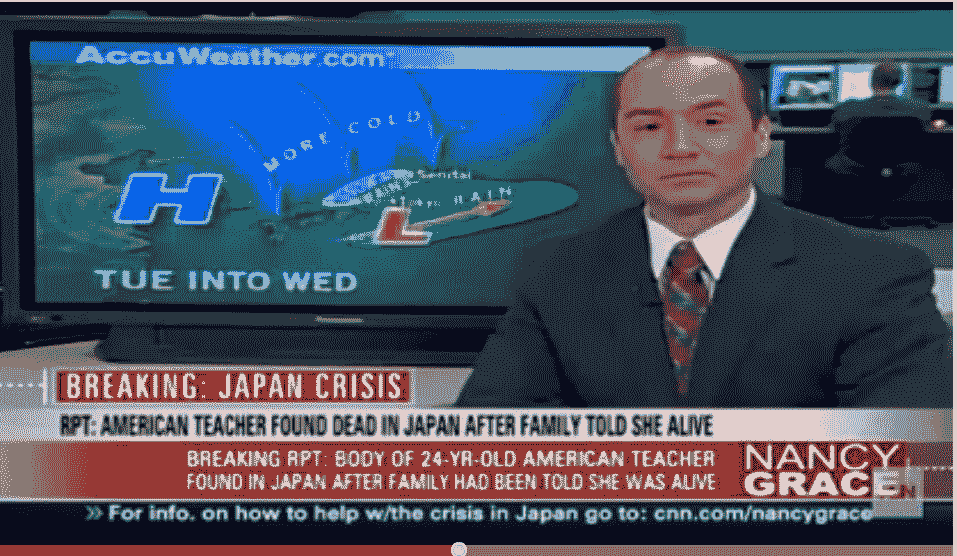
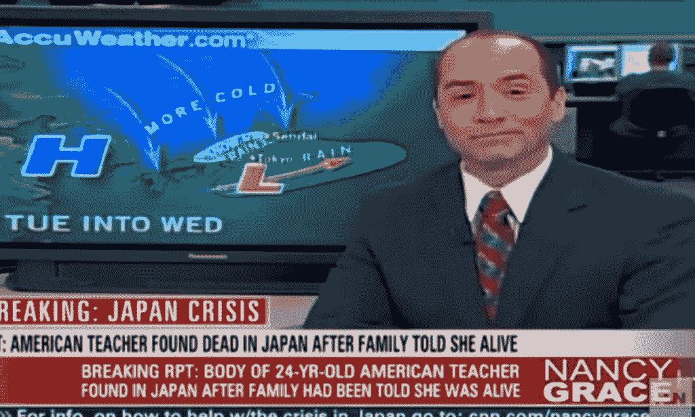
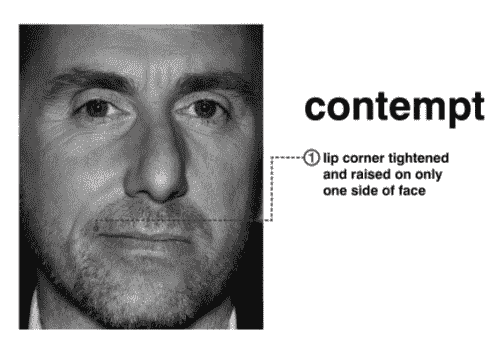
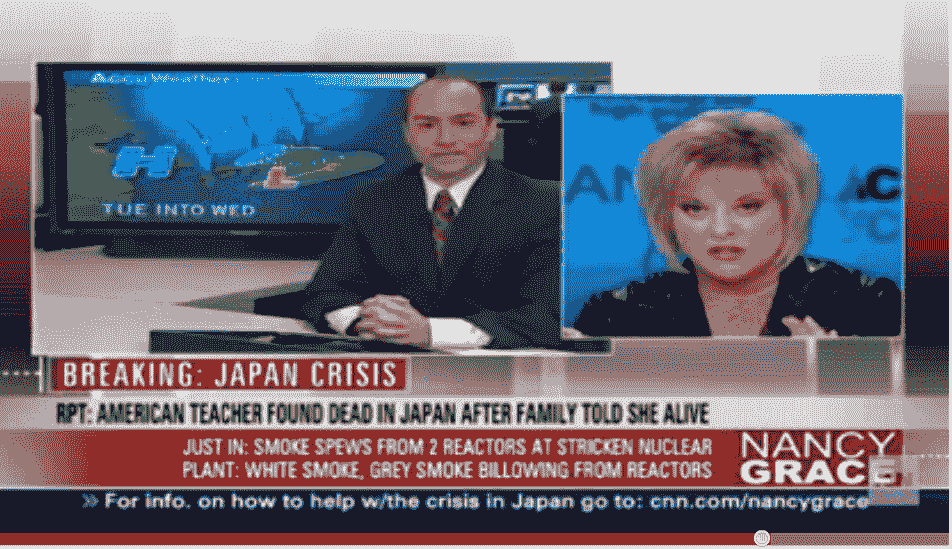
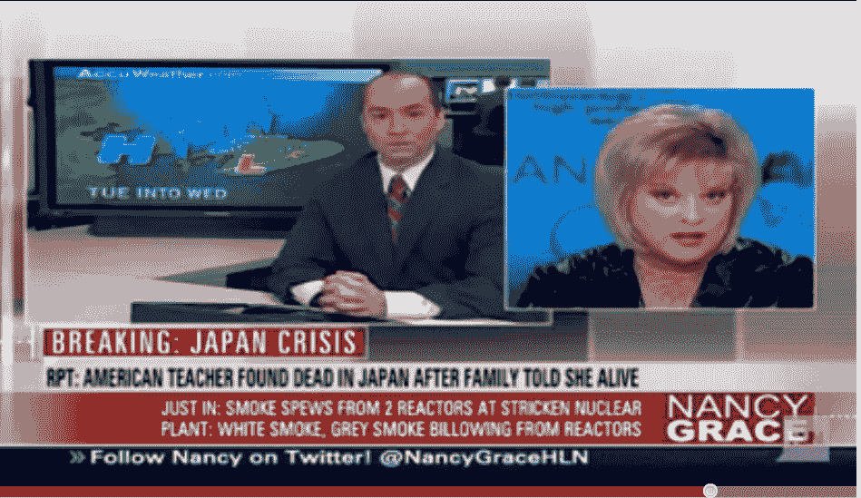
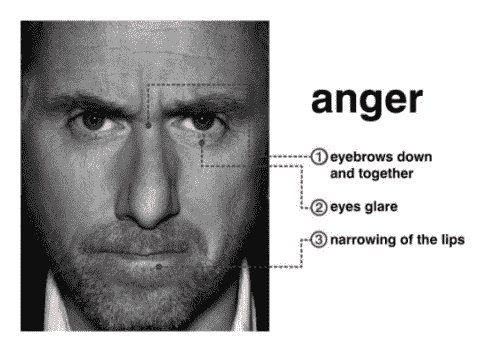

# 微表情——研究人类行为的一把钥匙

> 原文：<https://www.social-engineer.org/social-engineering/microexpressions-a-key-to-studying-human-behavior/>

自从我的书 *[社会工程:人类黑客的艺术](https://www.amazon.com/Social-Engineering-The-Human-Hacking/dp/0470639539 "The Official Social Engineering Book")，*发布以来，已经有很多人和我谈论第五章，都是关于[微表情](https://www.social-engineer.org/framework/psychological-principles/microexpressions/)和[非语言交流](https://www.social-engineer.org/framework/information-gathering/communication-models/)。

的确，非语言交流很难理解，对于我们这些社会工程师来说，我觉得这很重要。能够破译人类的情感可以改变你的交流方式。理解别人在说什么，甚至不说什么，都可以让交流变得容易得多。在[社会工程审计中，知道如何控制自己的微表情也是向你的交流对象甚至是你的目标描绘正确信息的关键。](https://www.social-engineer.org/framework/general-discussion/categories-social-engineers/penetration-testers/)

话虽如此，我喜欢看新闻剪辑，寻找非言语与言语不相符的地方。我觉得这有助于我更好地理解人们，也是阅读这些非语言信号的很好的练习。

**最近的一个案例**

最近我在美国有线电视新闻网上看到一则新闻报道，南希·格雷斯痛斥一名气象员，因为他对日本有害辐射袭击美国土地的看法。不管你喜不喜欢南希的风格，大多数人都认为她很有攻击性，但有时看着她痛斥一个试图改变对过去罪行解释的罪犯也很有趣。

事实并非如此。伯尼·雷诺(Bernie Rayno)是一名 Accuweather 气象学家，他就日本的悲剧以及辐射如何不会影响美国西海岸提出了一些非常有效的观点。花点时间看看这个片段，看看你是怎么想的。

[https://www.youtube.com/embed/ncey9ShigUs](https://www.youtube.com/embed/ncey9ShigUs)

在这段视频的 41 秒左右，伯尼开始解释日本的辐射对那个国家的穷人来说是多么可怕，但它不会对美国人产生任何负面影响。在 49 秒时，伯尼公开承认他知道南希将要攻击他，但这才是真正有趣的地方。从那时起到 1:30 左右，伯尼一直在捍卫自己的立场，但他继续在脸上露出专业的“微笑”，试图显示他有多文明。在 1:30 左右，他说，“也许我们应该求同存异……”紧接着，在 1:32 左右，你可以从这里看到几秒钟或更短时间内发生的一些事情。首先，在反驳她之后，你可以看到他的鼻子和左边的嘴唇微微皱起。一秒钟的最初几分之一是非常微妙的。看看这个:

<figure id="attachment_1822" aria-describedby="caption-attachment-1822" style="width: 536px" class="wp-caption aligncenter">

<figcaption id="caption-attachment-1822" class="wp-caption-text">Do you see this subtle Microexpression?</figcaption>

</figure>

在不到一秒钟的时间里，他接着说:

<figure id="attachment_1823" aria-describedby="caption-attachment-1823" style="width: 840px" class="wp-caption aligncenter">

<figcaption id="caption-attachment-1823" class="wp-caption-text">This is not so subtle</figcaption>

</figure>

你觉得这像什么？一个微妙的鼻子起皱和嘴唇卷曲在一边的脸…

上面的两个截屏都显示了先微妙后明显的蔑视。就在被南希攻击后，他试图微笑着说“让我们保留不同意见吧”，但他的非语言面部表情与他所说的不相符。

从那里开始，事情变得更加有趣。伯尼花了下一分钟反驳她的攻击和微笑。对于普通观众来说，他做得很好，看起来好像他在压力下保持冷静和镇定。

但是在 2 点 27 分，南希把她的侮辱降到了最低点。她一边说着“让我来教你吧”，一边谈论着她的学位将如何让她现在能够在天气法则方面教育伯尼。他非常热情地问道，“哦，你要教我吗？”语气平静，笑容迷人。但是他的脸在说什么？

在 2:34 到 2:36 之间，我们看到:

<figure id="attachment_1825" aria-describedby="caption-attachment-1825" style="width: 610px" class="wp-caption aligncenter">

<figcaption id="caption-attachment-1825" class="wp-caption-text">The brow is being pulled down and the lips are tightening</figcaption>

</figure>

紧接着，这个表达被明确地展示出来:

<figure id="attachment_1826" aria-describedby="caption-attachment-1826" style="width: 607px" class="wp-caption aligncenter">

<figcaption id="caption-attachment-1826" class="wp-caption-text">The lips now very narrow and the glare is full on</figcaption>

</figure>

哇哦。世界上所有的微笑都无法掩饰这种微表情不被看到。你能看出这是什么吗？

像白天一样清楚，伯尼已经亲切了足够长的时间，现在正在展示他的真实情感，愤怒。经过几分钟的侮辱和抨击，现在“教育”他不能再用他迷人的微笑掩盖它。

**有什么意义？**
这一切有什么意义？这不是侮辱南希或揭露雷诺先生的秘密，一点也不是。但关键是，我们可以使用这样的新闻剪辑来帮助我们学习和练习如何阅读外部情绪背后的真实内容。

一旦我们练习这样做，它将增强我们在安全领域的能力。它将帮助我们辨别一个人的真实情绪，并帮助我们更有效地沟通。它还可以帮助我们看到其他人对我们所说或所做的事情的真实反应和感受。

下次见..

像白天一样清楚，伯尼已经亲切了足够长的时间，现在正在展示他的真实情感，愤怒。如果你问我，也理所当然。经过几分钟的侮辱和攻击，现在“教育”他不能再用他迷人的微笑掩盖它。