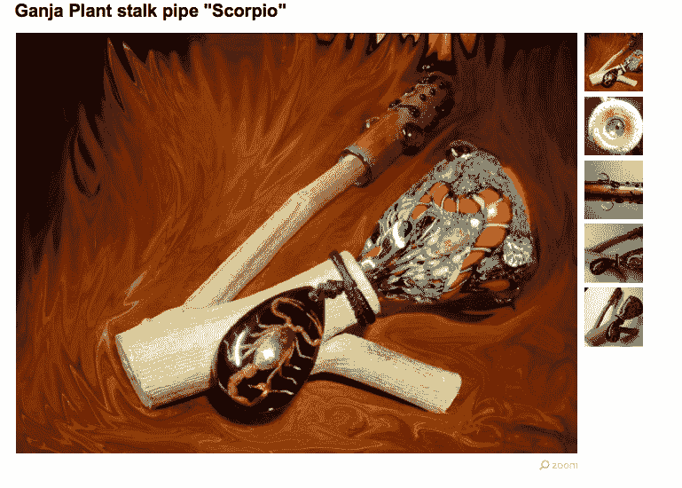
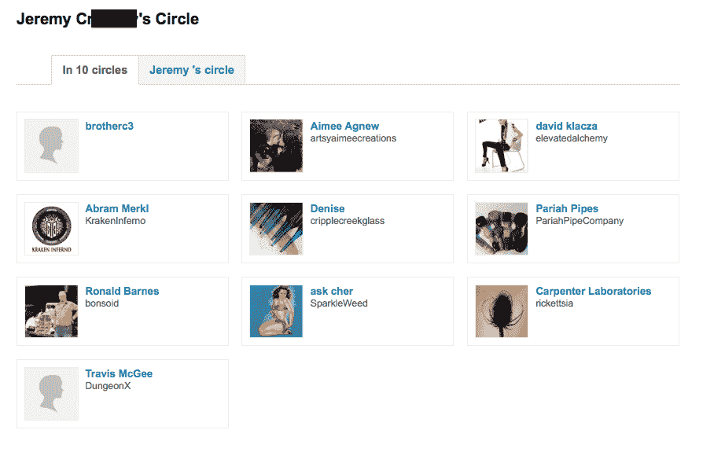
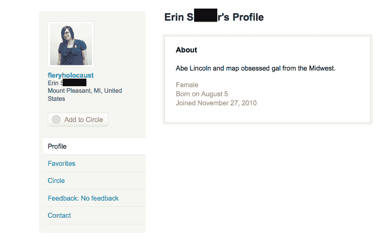
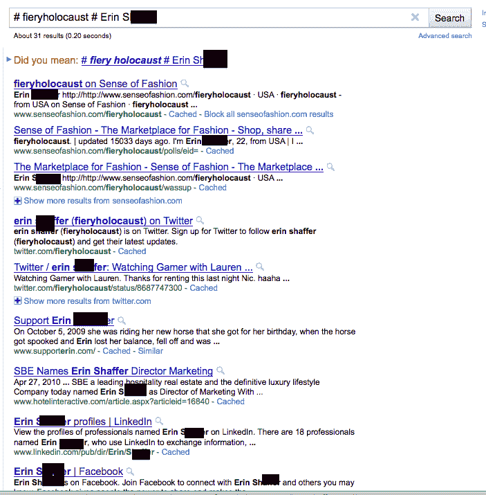

# Etsy -你买什么就是什么

> 原文：<https://www.social-engineer.org/social-engineering/etsy-you-are-what-you-buy/>

你可能会认为，在过去几年脸书、 [blippy](https://www.social-engineer.org/newsletter/SocialEngineerNewsletterVol02Is06.html "Social Media Gone Wild") 和其他各种社交媒体混乱的丑闻之后，这个行业会开始变得明智起来，对他们在网上发布的用户个人信息更加小心。然而，这是一个长期的问题，例如，几年前 Sophos 做了一项研究，发现他们调查的人中有超过 41%的人很容易并愿意与网上完全陌生的人分享个人信息(电子邮件、出生日期、地址和电话号码)。目前没有迹象表明情况正在好转。

对于我们大多数阅读这篇文章的人来说，这很令人惊讶，如果你的信息被分享了，而你不是那个愿意分享它的人，会发生什么呢？

这就是今天 Etsy.com 的情况。3 月 9 日，Etsy 的管理员兴奋地在他们的网站上发布了一个帖子，声称他们有了一个新的“功能”,可以让其他人在他们的网站上搜索用户、买家和卖家。

听起来够无辜了吧？嗯，是的，直到你发现这个搜索功能现在影响到你的个人数据，以及缓存在谷歌。
 **前车之鉴**
Etsy 是一个类似于 Ebay 的网站，但面向喜欢出售独特而艺术的物品的人。尽管在 Etsy 上发现人们买卖吸毒用具和性玩具并不罕见。现在我不确定你，但我愿意猜测，在那个网站上购买和销售这些东西的大多数用户不希望他们的父母、朋友、老板和同事知道他们购买习惯的这种隐私细节。

这离脸书在网上发布各种个人信息的丑闻不远了。脸书可怕的安全政策导致许多人的账户被泄露，许多故事被公开，涉及年轻女性被勒索在网上进行性行为，以便不发布在他们账户中发现的照片。

在那之后，你可以想象，大多数涉及这种数据的网站会采取额外的预防措施来确保用户的安全。Etsy 也是这样吗？

**协助网络跟踪者**
让我们想象一下，我是一个[心怀不轨的人](https://www.social-engineer.org/newsletter/SocialEngineerNewsletterVol02Is16.htm "Cyber Stalking")，想在今天醒来后毁掉别人的生活。所以我去 Etsy 搜索“BONGS”

经过一番搜索后，你发现一家商店似乎卖了很多药品，烟斗和类似的物品。

[T2】](https://www.social-engineer.org/social-engineering/etsy-you-are-what-you-buy/attachment/screen-shot-2011-03-15-at-9-28-07-am/)

接下来，我所做的就是点击用户名，令人惊讶的是，我看到了他的所有信息:
DankDezigns
杰瑞米~~克兰尼~~T4【天堂，美国
男
出生于 11 月 14 日
加入 2011 年 1 月 9 日

哦，不要以为它就此打住。情况会变得更糟。

把他的全名输入谷歌，会在 Etsy 网站上弹出一个链接列表，其中一个叫做他的“圈子”。去那里向我们展示了他的朋友圈，似乎也卖毒品使用用品，管道和其他此类物品。

[T2】](https://www.social-engineer.org/social-engineering/etsy-you-are-what-you-buy/attachment/screen-shot-2011-03-15-at-9-36-59-am/)

回到他的销售页面，你也可以点击标签为:“[查看谁最喜欢这家店](https://www.etsy.com/hearts_me.php?user_id=12486571)”的链接

这将打开一个页面，向您显示每一个购买过该卖家或对其说过好话的用户。

点击其中任何一个都会引导你走上同样的道路:

[T2】](https://www.social-engineer.org/social-engineering/etsy-you-are-what-you-buy/attachment/screen-shot-2011-03-15-at-10-18-29-am/)

只在谷歌上搜索她的名字和昵称:

[T2】](https://www.social-engineer.org/social-engineering/etsy-you-are-what-you-buy/attachment/screen-shot-2011-03-15-at-10-19-28-am-2/)

网站、博客、推特、Linkedin、脸书——天啊！

这并不太难确保这些是正确的，因为我们有她的出生日期和全名，甚至她居住的城市。

**现在怎么办？**
显然，Etsy 让用户生活更轻松的伟大想法只会让用户更容易妥协。现在在用户设置中有一个功能，他们可以将他们的信息保密，但是没有多少 Etsy 用户知道，因为它没有被广播。此外，默认情况下，所有用户都选择将他们的信息共享给全世界。非常危险的环境。

如果您有一个 Etsy 帐户，即使您创建它只是为了登录一次来购买一个产品，您也会想要登录并更改您的设置。这是另一个例子，说明在线社交媒体世界和缺乏真正的安全政策是如何让公司向人们开放妥协的。这种趋势将持续一段时间，直到我们开始意识到个人数据的价值。所以，请小心你在哪里分享的数据，因为今天是私人的并不意味着明天也会是。