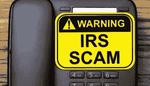

# 2021 年——税务骗局之年

> 原文：<https://www.social-engineer.org/social-engineering/2021-year-of-the-tax-scam/>

又到了一年中的这个时候，纳税季节！税收的不可避免性带来了另一个不可避免性——涉税诈骗。攻击者总是在变化和适应。每年，他们的方法都在变得更加多样、复杂和大胆。他们总是准备好抓住最新的趋势，利用最新的技术找到最快的途径来窃取你的身份和金钱。

## 期待什么

你早上醒来，就到了纳税的季节！但你只是还没有时间去做。在你的手机上，你看到一个语音邮件通知，所以你听它。当你听到这个消息时，你的脸变得苍白，你的心跳加速…甚至在你喝第一口咖啡之前。一条[自动消息](https://faq.ssa.gov/en-us/Topic/article/KA-10018)威胁要取消你的社会安全号码，报警，并逮捕你！为了避免这些行为，你所要做的就是打电话给一个特定的号码，并使用预付借记卡来清除这一切。

当天晚些时候，你收到一条[短信。](https://www.irs.gov/newsroom/irs-warns-people-about-a-covid-related-text-message-scam)来自一个陌生号码，自称来自你喜欢的税务软件。该消息称，您可以通过点击显示的链接，然后填写在线表格来获得税收奖励。或者短信声称来自美国国税局(IRS)，让你知道有一张 1200 美元的经济影响支付支票在等着你，只需按照这个链接并填写表格即可领取。

然后在上班的时候，当你查看邮件的时候，你收到了一封来自国税局的邮件！甚至还有一个名为“纳税成绩单”的附件需要你审核。

## 做什么

这三个例子只是攻击者现在用来针对我们每一个人的骗局的一个例子。有些骗局是针对已经提交了纳税申报表的人的，有些骗局是针对没有提交的人的。现在甚至有在家用软件报税的人的骗局，有使用报税代理机构的人的骗局。不管是哪种情况，纳税季都是攻击者利用人们的时机。那么你能做什么呢？

### 保持消息灵通

这不是唯一一篇关于税务欺诈的博客或文章，也不是我们第一次写这方面的文章。意识到外面的威胁有助于保护你的安全。[链接的国税局网页](https://www.irs.gov/newsroom/tax-scams-consumer-alerts)有一个常见骗局的列表和关于每个骗局的文章。它们都同等重要。回顾文章，让自己保持消息灵通。

### 点击前请三思

不要点击任何链接，当你不确定他们的来源或身份。不要点击来自你不知道的地址的链接。如果你不确定一个链接的真实性，你可以检查它。谷歌有一个方便的小工具,你可以把链接粘贴进去，检查它们的可信度。

### 纪念

[IRS 网站声明，](https://www.irs.gov/)“IRS 不会通过电子邮件、短信或社交媒体渠道主动联系纳税人，以获取个人或财务信息。”

### 不要回电

如果你收到一个恐吓电话，不管是机器人的还是其他的，不要回电。通过这样做，你让骗子知道你对他们的计划投入了感情，并愿意为此花费时间。所以他们更有可能继续攻击。相反，你可以查找他们声称的任何机构的官方号码。如果您对收到的任何信息有任何疑问，请使用官方号码直接联系该机构。

## 举报骗局

如果您发现骗局、网络钓鱼邮件或其他形式的税务或身份欺诈，请举报！这样做有可能关闭攻击途径，保护他人和/或您的公司(如果您的公司阻止来自这些地址的攻击)。美国国税局有一张[图表](https://www.irs.gov/individuals/how-do-you-report-suspected-tax-fraud-activity)，上面有几种报告欺诈活动的有用链接。

## 告诉你的家人、朋友和同事

对骗局最有效的防御之一是知识。通过分享你在这里学到的和通过你的研究，你正在创建你自己的小安全倡导团体。鼓励你周围的人也这样做。共同努力确保彼此的安全和知情。在这个纳税季节保持安全。请保持警惕，因为我们共同努力，让骗子和攻击者在海湾。

*来源:*
*[https://faq.ssa.gov/en-us/Topic/article/KA-10018](https://faq.ssa.gov/en-us/Topic/article/KA-10018)*
*[https://www . IRS . gov/news room/IRS-warns-people-about-a-covid-related-text-message-scams](https://www.irs.gov/newsroom/irs-warns-people-about-a-covid-related-text-message-scam)*
*[https://www.usa.gov/irs-scams#item-214333](https://www.usa.gov/irs-scams#item-214333)*
*[https://www . social-engineer . org/general-blog/lookout-for-tax-scams/](https://www.social-engineer.org/general-blog/lookout-for-tax-scams/)*

*图片:*
*[https://www . AARP . org/money/scams-fraud/info-2020/IRS-tax-scams-list . html](https://www.aarp.org/money/scams-fraud/info-2020/irs-tax-scams-list.html)*