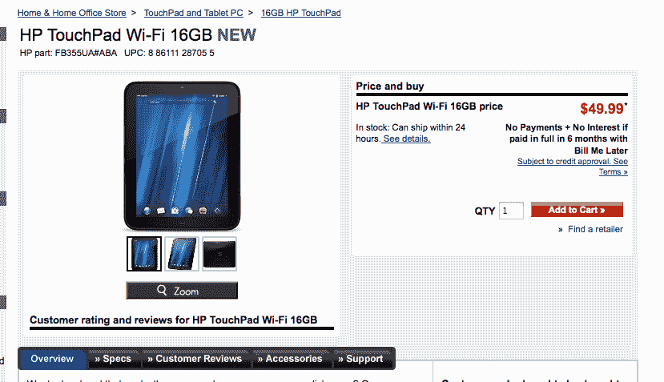
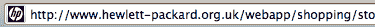
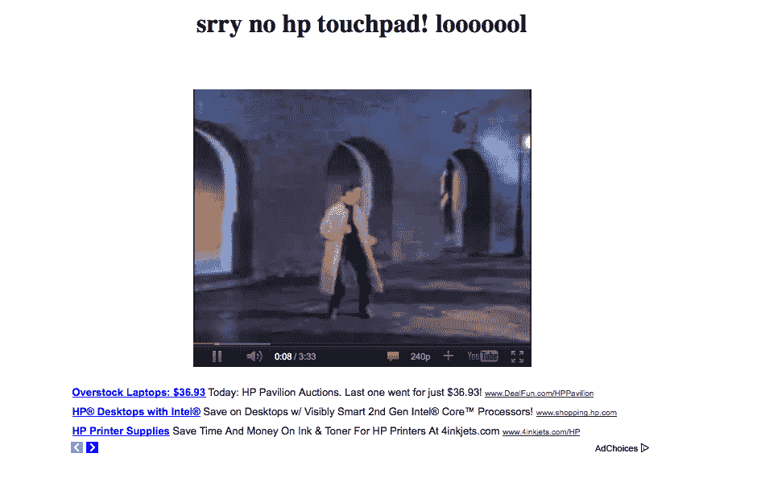

# 99 美元的惠普平板电脑——社会工程、骗局还是真实交易？

> 原文：<https://www.social-engineer.org/social-engineering/99-hp-tablets-social-engineering-scams-or-a-real-deal/>

当惠普上周宣布其平板电脑将大幅降价时，地球上的每个平板电脑迷都在以惊人的速度点击他们的刷新按钮。当大多数平板电脑迷开始兴奋时，社会工程师也开始兴奋了。

哪里有需求和欲望，哪里就有骗子，这也没什么不同。

首先，我要说的是，惠普的平板电脑售价为 99 美元。这不是一个骗局，但看看这个在 http://www.hewlett-packard.org.uk 网站上看起来无害的网址。

首先请注意，这个网站看起来和感觉上都是合法的。所有正确的标志，所有正确的图形。然后诱饵来了:

惠普平板电脑的售价为 49 美元！有多少人会这么快点击？有多少人想要确保他们不会像以前那样错过交易？

让我们分析一下人们是如何发现这是一个诈骗网站的。

1)网址:

  

惠普什么时候变成非营利组织了？。org？这应该会让大多数人有一点怀疑。此外，网站上的每个链接都指向 something.hp.com，而不是惠普。

2) [WHOIS](https://www.social-engineer.org/framework/information-gathering/) 信息:

一个快速的域名 WHOIS 向我们展示了

谁是 hewlett-packard.org.uk

域名:
hewlett-packard.org.uk

注册人:
菲利普·沙利文

注册人类型:
非英国个人

注册人地址:
埃德塞尔路 4966 号
洛杉机
加州
90017
美国

注册服务商:
eNom，Inc. [Tag = ENOM]
网址:http://www.enom.com

相关日期:
注册日期:2011 年 8 月 23 日
续期日期:2013 年 8 月 23 日
最后更新日期:2011 年 8 月 23 日

注册状态:
注册请求正在处理中。

域名服务器:
ns1.he.net
ns2.he.net
ns3.he.net
ns4.he.net
ns5.he.net

WHOIS 查找时间为 2011 年 8 月 23 日 18:24:26

有洛杉矶注册商的英国网站？今天做的？不错——但我怀疑惠普的动作会有那么快。

3)图像

看看英国的链接和真正的惠普。英国链接上的图像是像素化和颗粒状的。不像真实网站那样清晰、明快和美观。这是在诈骗网站/电子邮件上常见的说法。

4)尝试购买？

是的，最后一点是，如果你试图以 49 美元的价格购买 pad。

里克·罗尔！！！当然，是谁建立了这个页面，这只是一个玩笑，并没有恶意…

但是让我们花点时间反思一下。如果这实际上是一个恶意的骗子，有多少人会点击？

有多少人会插入信用卡信息？

有多少人会填写姓名、地址、电话和电子邮件信息？

那些寻求廉价平板电脑的人还会发动多少次攻击？

**我们可以吸取的教训**

在一天结束的时候，让我们把这作为一个学习的教训。常识、批判性思维和花时间回顾本可以让许多人免于这个“骗局”。谢天谢地，这只是某个陌生人开的玩笑，但有多少人不是呢？[网络钓鱼](https://www.social-engineer.org/framework/general-discussion/real-world-examples/phishing/)与恶意链接相结合是一种日益增长的威胁，一份报告指出，截至今年 1 月，与去年相比，某些地区的增长高达 50%,而其他地区则超过 100%。

批判性地思考，自我教育，不要急于在思考前点击。

互联网是一个危险的地方——注意安全。

感谢[克里斯·尼克森](https://www.lares.com/ "Chris Nickerson")帮我找到这个链接！