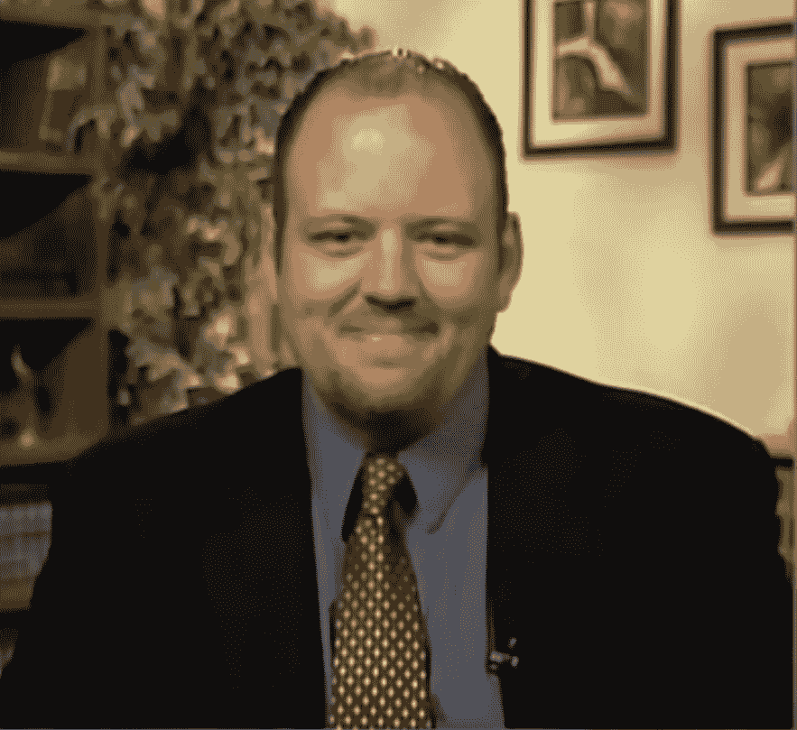
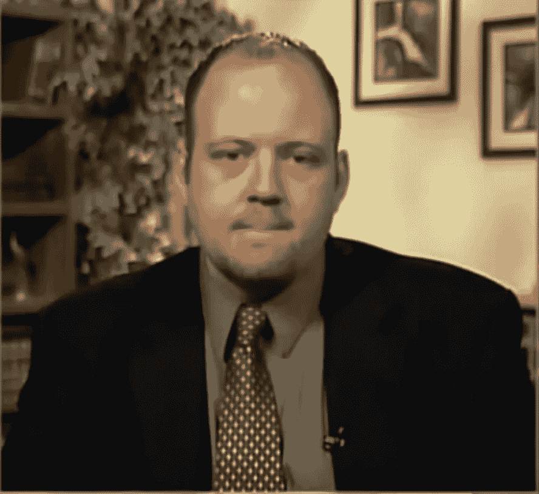
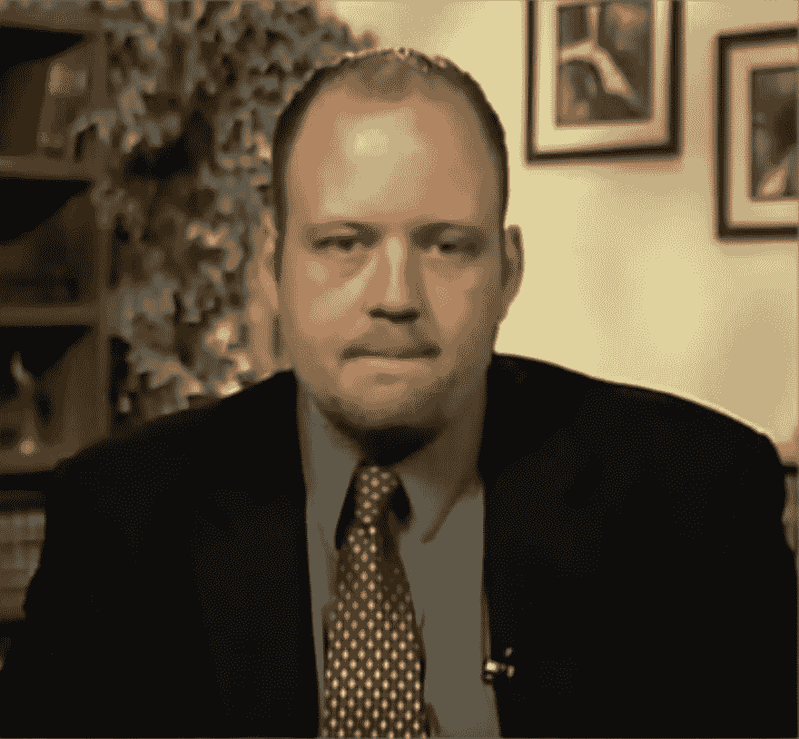
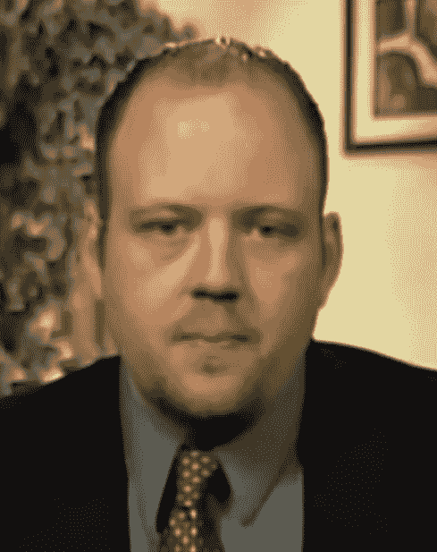
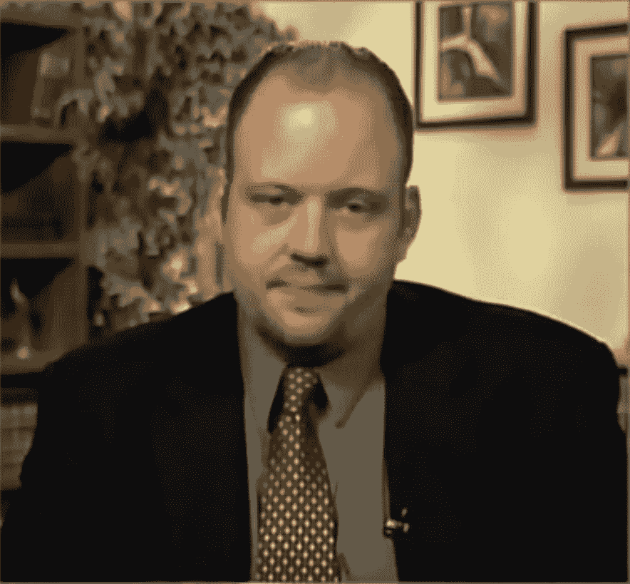

# 大卫·肯尼迪给我们上了一堂阅读非语言的好课

> 原文：<https://www.social-engineer.org/social-engineering/a-good-lesson-on-reading-nonverbals-by-david-kennedy/>

来自可信证券交易委员会的大卫·肯尼迪今天有幸在 CNN 上讨论了中国对美国政府和公司的黑客攻击。他干得非常出色，表现得非常聪明，谈吐得体。

但是我们不能错过这样一个机会，用这样一幅作品来深入观察人性，看看这张脸是否能告诉我们一些别的东西。

首先，视频是在线的，但现在已经不可用了，所以让我们仔细看看一些事情。

戴夫的采访在视频中大约 1:35 开始，我们看到一个非常好的表情。1 点 48 分，戴夫露出了真诚的微笑:

我们可以看到这是一个真正的微笑，因为眼睛参与其中，眼睛侧面的皱纹和整张脸都参与其中。这种微笑会自动让人放松，并让他们确信这个人将要说的话。干得好戴夫。

然后他被问到一个问题，戴夫很擅长回答这个问题。但紧接着，可以理解的是，他肯定感到紧张，并在 2:39 表现出高度不适的迹象:

每当我们看到有人抿嘴唇或舔嘴唇时，我们知道这是不舒服的迹象。这种反应是有道理的，上 CNN 会让任何人紧张。此外，他只是说了他的第一个观点，正常的怀疑可能会引起恐惧和不适。

以此为基线，我们看到了一些非常有趣的东西。新闻播音员开始谈论奥巴马的新网络安全法。任何听社会工程师播客的人都知道戴夫不是总统法律的最大粉丝。在 3:35 我们注意到了什么？

如果你认为这是上述图像的副本，它不是，看看 3:35，你会看到。他很快地做了几件事，但首先我们看到了高度不适的迹象。戴夫可能在想，“我不在播客上，我得注意我说的话！”

3 秒钟后，在 3:38，我们看到戴夫仍在考虑如何回答，他现在给了我们一个大老噘嘴唇的动作。这不是一个吻，不，而是嘴唇噘起是不同意的标志。这是他对新闻播音员提到奥巴马的法律帮助网络攻击的反应。也请注意，在 3:44，眼睛和前额有轻微的愤怒，这是非常微妙的迹象

这就是构成鄙视的面部动作。当我们的一侧脸抬起，可能会有轻微的卷唇时，轻蔑就产生了。戴夫，你为什么会感到如此轻蔑？此处无可奉告🙂

戴夫以另一个真实的微笑结束，给新闻播音员和观众留下了很高的评价。

总的来说，干得不错，Dave，谢谢你给我们一些东西来分析。

干得好