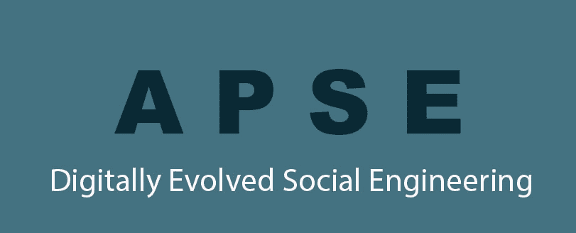

# APSE:虚拟世界中的实用课程

> 原文：<https://www.social-engineer.com/apse-a-practical-course-in-a-virtual-world/>

许多社会工程都是通过技术实现的——最典型的例子就是[网络钓鱼](https://www.social-engineer.org/framework/attack-vectors/phishing-attacks-2/)和[视觉](https://www.social-engineer.org/framework/attack-vectors/vishing/)(语音钓鱼)。然而，举办社会工程课程实际上并不是 Social-Engineer，LLC 掉以轻心的事情。我们自己的高级实用社会工程(APSE)课程是一门高度互动的课程，平衡了实践讲座和讨论与多次动手练习、演示和一些非常有创意的家庭作业。它的设计并没有考虑到数字传输。我们的目标是使高级实用社会工程成为虚拟世界中的实用课程

## 房间里的大象

新冠肺炎引发了大范围的停工，扰乱了工作环境和我们的日常生活。因此，远程工作迅速增加。数字化在一夜之间加速了，将应该亲自传达的东西转换成数字传递是一个不小的壮举。直截了当地说，这就像一边飞行一边建造飞机。

在这样一个不稳定和不可预测的环境中，我们 Social-Engineer，LLC 不确定如何不折不扣地交付 APSE。我们希望以一种确保课程中包含的实用和应用信息不会从数字裂缝中溜走的方式来讲授课程。不仅如此，我们还想知道如何才能产生数字信任。不惜一切代价，包括课程的费用，社会工程师决定 APSE 将不会被数字化传播，如果这样做变得不那么有价值的话。

## 期望与现实

剧透提示:APSE 顺利发射。

在开始有史以来第一个 APSE 数字课程之前，社会工程师研究了疫情时期的数字化，以减轻已经出现或上升的风险。我们研究了如何确保该技术支持新的工作方式以及数字交付。因此，没有可能提供稀释课程，我们动员，稳定和战略。我们知道一切都取决于我们课程的关键流程和我们对它们的交付。

课程的第一天，我们遇到了一个技术问题，原因是一个网络会议促进应用程序。通过切换到另一个我们和学生都更习惯的平台，这个问题很容易解决。我们做梦也没想到这是我们遇到的唯一一个真正的问题。令人惊讶的是，的确如此。

起初，我们期望这门课程的新授课方式是危机管理的结果。事实证明情况并非如此。我们发现，对材料的传递方式进行一些调整，实际上使现实变得更加伟大:APSE 现在是一个进化的过程。学生们似乎获得了与之前亲自授课的学生相同的关键收获、质量和改变思维的数字化体验。我们得到的互动和反馈表明，APSE 可以数字化交付，这样做不会有任何损失。换句话说，APSE 现在是多功能的，符合当今学生的需求。我们非常兴奋。

##### 正如一名学生所说:

> *“通常我对在线课程有点怀疑，但这一次打破了所有的规则——棒极了&相关内容结合现实生活中的故事，大量具有挑战性的实践&使这次经历成为我参加过的最棒的在线课程之一！”*

### ****

## 什么、如何、何时和为什么

什么:APSE 是一个高级培训项目，旨在使个人具备社会工程中使用的高级技术和工具。在课程中，学生有机会通过来自经验丰富的社会工程师的个性化反馈来实践这些技能。

方法:这很简单。我们使用流行和易于使用的托管软件，我们有无与伦比的内容。那不是吹牛。APSE 汇集了世界上一些最重要的专家和最伟大的头脑的知识，从罗宾·德雷克，罗伯特·钱迪尼博士，乔·纳瓦罗和保罗·艾克曼博士，仅举几例。

时间和原因:这很难解开，但最终，我们相信 APSE 应该走向虚拟化，我们可以为学生提供他们在 COVID 之前注册的课程。黑帽，我们对这个虚拟背景的第一次尝试似乎是迎接挑战的正确地方。

正如我们的另一个学生所说:

> “真是太棒了。除了明显的红队应用之外，在这里学到的技能对改善日常交流也很有价值，我感到非常幸运能够参加。”

剩下唯一需要回答的问题是:我们什么时候再这样做？由于我们第一次虚拟会议的成功，来自我们学生的反馈和 APSE 的发展，SECOM 正在安排[另一次虚拟 APSE 培训](https://www.social-engineer.com/training/advanced-practical-social-engineering-training/)，从 11 月 17 日上午 9:00 开始，持续到 11 月 20 日下午 5:00 CST。

## APSE 及其学生的进步

众所周知，APSE 是一门广阔而又吸引人的课程。它不仅是为学生设计的，也是为学生的职业设计的。它包括多个动手练习、演示和独特的家庭作业练习。正如社会工程是安全和社会技能的交集，APSE 是学生身份和真实世界经验的交集。在这里，他们走到一起，揭示了正确应用时的影响力。所有这一切都发生在四天内。所以，这是一种既疲惫又兴奋的感觉。现在，它可以数字化传输，丝毫不漏。