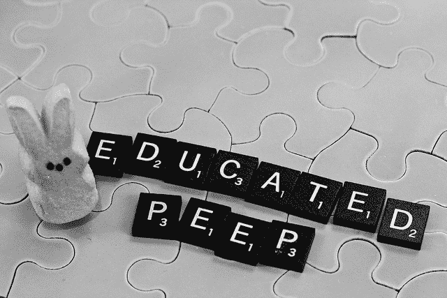

# 改变——教育，有效果吗？

> 原文：<https://www.social-engineer.org/general-blog/change-education-working/>

本月早些时候, [Dark Reading](http://www.darkreading.com/perimeter/poll-employees-clueless-about-social-engineering-/a/d-id/1316280?) 发表的一篇文章仍然在新闻中备受关注。大家争相跳上的大乐队马车是什么？很简单。对员工进行社会工程策略培训。文章指出，超过一半的安全专业人士表示，社会工程战术如此有效，是因为员工没有受到足够的教育来对抗它们。

为什么每个人都引用这个简单却突然变得尖锐的事实？因为在过去的几个月里,“大”黑客的数量已经从一年几个增加到一个月几个，现在是一周几个(Snapchat、Kmart、Target、Staples、Home Depot)。攻击是否在升级，是否有更好的问责制，或者媒体只是更多地报道它？有趣的问题。我们会调查此事，并在下个月回复你。

如果你浏览黑暗阅读文章上的一些评论或引用它的其他评论，你会发现有相当一部分安全专业人员都不知道什么是有效的培训。IT 界还有人对合规不等于保护感到惊讶吗？不，我们不这么认为。让我们根据学习理论家和社会心理学家的观点来分析是什么让培训变得有效。

1.  联系和互动:你可以雇人来宣讲或展示漂亮的 Powerpoint 幻灯片，但直接的授课形式已被证明在学生中产生的保留率较低([比尔斯&鲍登，2005](https://www.ncbi.nlm.nih.gov/pubmed/16342633) )。你必须和你的观众建立联系，他们才会在意。千篇一律的演示不如个人互动有效。营销专业人士从 20 世纪 80 年代就开始使用这种方法了([韦茨，苏扬&苏扬，1986](http://warrington.ufl.edu/centers/retailcenter/docs/papers/weitz1986.pdf) )。这会增加培训成本吗？是的。为你实际得到某种保护的培训付费值得吗？是的。我们需要停止打勾，开始教育。
2.  正确的动机:训练本身只是一个临时的补丁，因为足够多的人愿意相信它不会发生在他们身上。许多专业人士在黑暗阅读民意调查中评论说，人们可以不理会，因为他们认为自己太聪明了，不会落入社会工程策略的圈套。社会工程师并不赞同指责用户的方法，而是相信如果你想激励某人改变，从长远来看，你必须让人们相信这是正确的事情。这种形式的激励不需要外部惩罚或奖励，而是一种态度的改变，以实现新信念的*内化*，这将反过来改变*行为* (Aronson，2011)。你希望员工按照他们接受的培训行动吗？针对态度，而不是陈词滥调。
3.  起泡、冲洗、重复:研究表明，如果“上钩”，带有教育信息的网络钓鱼活动最多只能有效约六个月( [Purkait，2012](http://www.emeraldinsight.com/doi/abs/10.1108/09685221211286548) )。有趣的是，这种保护似乎没有被广泛地推广到多种形式的网络钓鱼；例如，如果他们迷上了电子贺卡网络钓鱼，他们会学到在获得电子贺卡时应该寻找什么，而不是内部寻找的鲸鱼网络钓鱼(然而，需要进行研究来证实这一点)。经验教训需要反复总结。轮换发送钓鱼邮件的类型，并提供最新的教育建议。
4.  政策:这是一个没有人喜欢谈论的丑陋的词，但在某些时候，它将不得不被解决。如果任何员工尽管接受了教育和指导，但始终未能通过社会工程 pentests，这是一个很好的时机来看看您的教育计划的有效性以及该员工在公司数据方面可以扮演的角色。现在，这必须与员工个人权利相平衡，但责任不是一个肮脏的词。问责制工程(沃克曼，2008 年)。

培训可能是一个敏感的话题，因为不是每个人都从单一的形式中学到了最好的东西。有些人在视觉材料方面做得更好，有些人需要亲身经历来巩固记忆。寻找可以结合多种方法交流课程的培训显然是一个很好的特点，但这并不总是可能适用于大量员工。或许我们能从中得到的最好的收获之一就是找到合适的培训需要仔细的思考和计划。考虑您组织的规模和员工的教育水平，甚至进行测试，这些测试可以直接应用于构建满足您需求的课程。

考虑到这个博客的普通读者，这可能是我们在向唱诗班布道。我们听说当前的很多培训都无法完成工作。好吧，这是一个展示影响力的机会，看看我们能否改变这种状况。在这场斗争中，社会科学是我们的朋友，我们可以利用上述研究来帮助倡导社会工程培训，教授员工做出正确决策所需的批判性思维技能。改变*现状*很难，但在当今大数据泄露的大环境下，超越合规性并努力追求更好的组织将成为领先的企业。成为你想看到的改变。

*来源:*
*[https://www . dark reading . com/perimeter/poll-employees-clueless-about-Social-engineering-/a/d-id/1316280](https://www.darkreading.com/perimeter/poll-employees-clueless-about-social-engineering-/a/d-id/1316280)*
*[https://www.ncbi.nlm.nih.gov/pubmed/16342633](https://www.ncbi.nlm.nih.gov/pubmed/16342633)*
*[https://www . Amazon . com/Social-Animal-Elliot-Aronson/DP/1429233419](https://www.amazon.com/Social-Animal-Elliot-Aronson/dp/1429233419)*