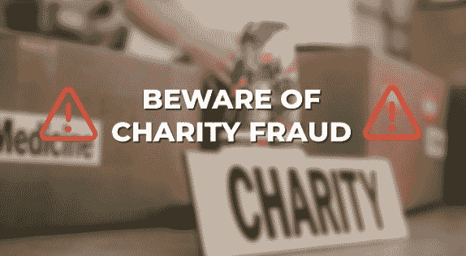

# 慈善欺诈:如何避免骗局并明智地给予

> 原文：<https://www.social-engineer.org/social-engineering/charity-fraud-how-to-avoid-scams-and-give-wisely/>

你认为慈善的最大原因是什么？自然灾害救济、恐怖袭击救济、世界饥饿、医疗保健基金和自杀预防只是慈善机构最大的几个主题。不幸的是，这些也是慈善欺诈的最大领域。自新冠肺炎开始以来，网络安全公司[“domain tools”](https://www.domaintools.com/)已经将超过 10 万个含有新冠肺炎相关域名的网站标记为“高风险”欺诈网站。记住这一点，理解什么是慈善欺诈对我们来说很重要。我们还需要知道这种情况发生的原因和方式，以及我们如何避免和发现欺诈性的慈善机构。

<figure id="attachment_89946" aria-describedby="caption-attachment-89946" style="width: 574px" class="wp-caption aligncenter">

<figcaption id="caption-attachment-89946" class="wp-caption-text">*Image: [Amaya Hadnagy](https://www.social-engineer.com/social-engineer-team/amaya-hadnagy/)*</figcaption>

</figure>

## 什么是慈善欺诈

慈善欺诈可以被描述为使用欺骗手段从那些相信自己支持有益慈善机构的人那里获得金钱。Fbi.gov 的一篇文章指出，“虽然这些骗局可能在任何时候发生，但它们在引人注目的灾难发生后尤其普遍。犯罪分子经常利用悲剧来剥削你和其他想要帮助的人。”从攻击者的角度来看，在悲剧和危机时刻，人们更容易受到伤害，更有可能捐钱。

任何领域的骗子都喜欢玩弄你的情绪，以达到他们想要的结果。慈善诈骗更是如此。想象一下:你刚刚在 Instagram 上滚动浏览了至少 5 篇关于可怕的火灾、洪水和飓风发生在你有朋友和家人的地区的帖子。你满脑子想的都是逝去的生命和被毁的房屋。你看到的下一个帖子是一个广告，上面写着，“为有需要的人提供救灾资金。你捐的每一块钱都捐给了一个无家可归的家庭。”同情和悲伤是非常强大的情绪，很容易让你在不核实来源的情况下进行捐赠。

## 慈善欺诈诈骗媒介和社会工程技术

骗子使用许多战术技巧来欺骗和激励你去捐赠。其中包括[网络钓鱼、](https://www.social-engineer.org/framework/attack-vectors/phishing-attacks-2/)、社交媒体和众筹平台。让我们详细了解一下为什么这些策略可能被用于慈善诈骗。

### 网络钓鱼

网络钓鱼攻击是通过电子邮件进行的，是骗子和网络罪犯最常用的手段之一。在 2018 年加州 Camp 和 Woosley 火灾期间，袭击者趁机瞄准了企业。他们会以公司首席执行官的身份向员工发送电子邮件，指示他们购买礼品卡来帮助火灾受害者。骗子对目标员工使用紧急和权威的策略，因为他们冒充 CEO，员工更有可能毫无疑问地服从。
T3】

### 社会化媒体

2021 年 7 月的一项统计显示，全球超过 44.8 亿人使用社交媒体。考虑到几乎世界各地都有多少人在使用社交媒体，这就解释了为什么骗子会在欺诈性慈善机构中如此成功。例如，[脸书](https://www.bbb.org/article/news-releases/22110-bbb-scam-alert-dont-be-fooled-into-thinking-thats-your-friend-on-facebook)上流传着一个流行的骗局，其中“朋友”会给你发消息，声称正在为因新冠肺炎疫情而需要帮助的慈善机构或组织筹集资金。他们会试图说服你通过链接到一个虚假的慈善网站或礼品卡来捐款。由于这些信息来自所谓的朋友和熟悉的个人资料，你更有可能相信他们。

### 众筹平台

早在 2017 年，有一个关于无家可归的退伍军人的病毒式故事，他把所有的钱都给了路边一个没有汽油的女人。她一回到家，她的男朋友就把这个故事贴了出来，并发起了一个 GoFundMe 来为这个无家可归的人筹集资金。这次活动非常成功，筹集了 40 多万美元，并在《早安美国》节目中播出。不幸的是，2020 年，这对夫妇承认了电信欺诈、洗钱等罪行。简而言之，这场运动是一场骗局。是什么让这个骗局成功了？首先，同情这个无家可归的人。第二，相信可信和详细的故事。第三，社会证据，从故事成为病毒都是这个成功骗局的关键。

### 视觉

电话诈骗怎么办？我相信我们都听过“我们打电话是为了你的车的延长保修期”或者“国税局需要你的 SSN 来确认你的身份”但是涉及慈善机构的电话诈骗呢？2021 年 3 月， [FTC 终结了一场骗局](https://www.pcmag.com/news/ftc-shuts-down-massive-robocall-charity-scam),该骗局从自以为向慈善机构捐款的公民手中窃取了超过 1 . 1 亿美元。联邦贸易委员会称，“被告欺骗美国人向非营利组织捐赠了数千万美元，他们声称这些组织帮助了乳腺癌患者、患有癌症的儿童的家庭、无家可归的退伍军人、火灾受害者等等。–实际上，几乎没有钱用于向捐赠者描述的慈善目的。”这些电话中至少有 90%涉及预先录制的信息。操作员会收听并选择特定的音频片段来回答人们的问题。

## 保护自己免受慈善欺诈，明智地给予

虽然这可能看起来很可怕或令人难以想象，但我们有办法保护自己免受慈善欺诈并发现危险信号。

危险信号:

1.  立即捐款的压力。许多慈善骗局会给你压力，或者利用紧迫感尽快拿到你的钱，几乎没有时间思考。一个合法的慈善机构不会强迫你捐款，而且会欢迎你选择的任何捐款。
2.  只接受礼品卡、现金或电汇付款。骗子喜欢这些支付方式，因为这些钱很难甚至无法追踪。
3.  注意那些与知名组织同名或相似的组织，尤其是在大规模灾难中突然出现的新组织。

您可以做什么:

1.  总是做你的研究，寻找有信誉的组织。联邦贸易委员会建议用“高评级慈善机构”、“投诉”和“骗局”等词来搜索慈善机构的名称或你想支持的事业。
2.  不要把你的 SSN、出生日期或银行账号等个人和财务信息透露给任何寻求捐赠的人。骗子利用这些数据窃取你的钱和身份。
3.  不要点击或打开陌生人的链接。欺诈链接可以窃取您的信息，并在您的设备上发布恶意软件。
4.  在捐赠或提供任何信息之前，使用像 CharityNavigator.org 这样的网站来检查慈善机构的有效性和声誉。

总之，总是检查你的来源，做你自己的研究。同样重要的是，千万不要点击未知链接。此外，不要用礼品卡或电汇的方式向任何你不认识的“组织”汇款。最后，一定要看看我们众多关于诈骗、网络安全和其他话题的博客和时事通讯，比如 social-engineer.org 上的这些

*来源*
[*https://www.domaintools.com/*](https://www.domaintools.com/)
*[https://www . FBI . gov/scams-and-safety/common-scams-and-crimes/charity-and-disaster-fraud](https://www.fbi.gov/scams-and-safety/common-scams-and-crimes/charity-and-disaster-fraud)*
*[https://www . social-engineer . org/framework/attack-vectors/phishing-attacks-2/](https://www.social-engineer.org/framework/attack-vectors/phishing-attacks-2/)*
*[https://www . social-engineer](https://www.social-engineer.org/framework/attack-vectors/vishing/)*