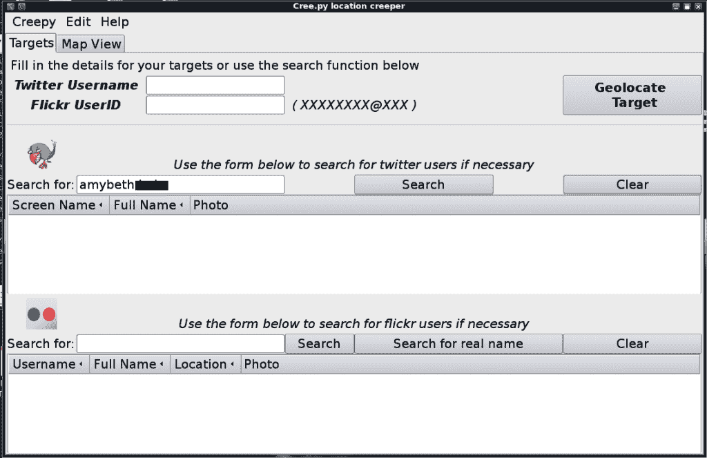
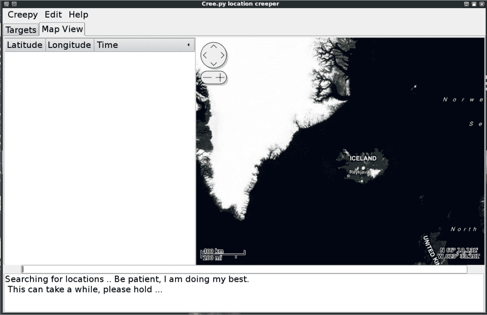
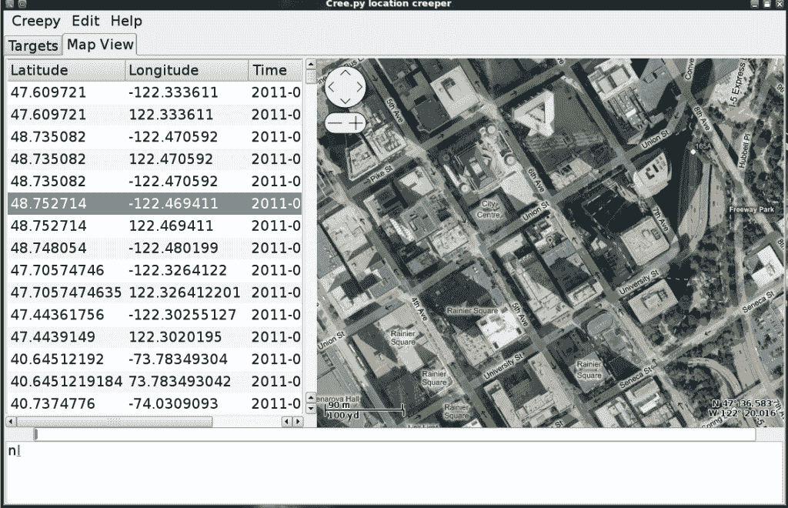
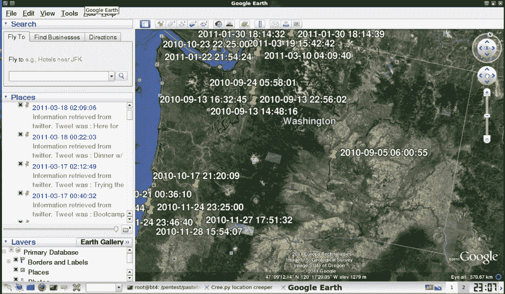

# 社会工程师和信息收集的令人毛骨悚然的工具

> 原文：<https://www.social-engineer.org/social-engineering/creepy-tools-for-social-engineers-and-information-gathering/>

***UPDATE:****As of 2013 BackTrack is now Kali Linux [https://www.kali.org/](https://www.kali.org/)**This website may also be useful. It covers the best (and worst) virtual private networks/VPNs for Linux users. [https://www.comparitech.com/blog/vpn-privacy/best-vpn-for-linux/](https://www.comparitech.com/blog/vpn-privacy/best-vpn-for-linux/)*

一段时间以来，定位一直是社会工程界的热门话题。作为一名社会工程师，能够有效地描述你的目标是很重要的。像 [SET](https://www.social-engineer.org/framework/se-tools/computer-based/social-engineer-toolkit-set/) 和 [Maltego](https://www.social-engineer.org/framework/se-tools/computer-based/maltego/) 这样的工具使得社会工程参与变得更加容易。

然而，到目前为止，还没有一种工具可以帮助社会工程师追踪他们的目标的物理位置。当然，你可以去他们的 twitter、facebook、4square 和其他社交媒体账户，收集他们的所有信息，然后找到包含地理数据的帖子，然后花时间收集所有细节并理解它们。

如果有一种方法可以从 Twitter 和 FourSquare 上检索到信息。此外，如果你能从 flickr、twitgoo.com、yfrog.com、img.ly、plixi.com、twitgoo.com、foleext.com、shozu.com、pickhur.com、moby.to、twitgoo.com 和 twitgoo.com 收集任何地理位置数据，那会令人印象深刻吗？

亚尼斯·卡卡瓦斯先生出场了。亚尼斯带着一个他称之为 Cree.py 的工具的测试版来找 Social-Engineer.Org。我能说的就是令人毛骨悚然。

安装几分钟后，它就可以在 BackTrack 4、Linux 或 Windows 上运行了，你可以从他们的推特和社交媒体上追踪任何目标的地理位置。

**安装:**

正如我提到的，回溯安装非常简单:

在命令控制台中，键入:

**Nano/etc/apt/sources . list**

在结尾加上这个:

**黛比·http://people.dsv.su.se/~kakavas/creepy/双星/**

然后在控制台中键入:

**apt-get 更新**

然后要安装 cree.py，请键入:

**安装令人毛骨悚然的**

令人毛骨悚然的是现在在全球菜单下的应用程序->互联网。

或者可以通过键入以下内容来运行

**Creepymap**

进入控制台。

**Running Cree.py**

一旦你开始爬行，你会看到一个非常漂亮的图形用户界面:

<figure id="attachment_1845" aria-describedby="caption-attachment-1845" style="width: 840px" class="wp-caption aligncenter">

<figcaption id="caption-attachment-1845" class="wp-caption-text">Creepy Interface</figcaption>

</figure>

在“搜索”框中，输入目标的全名，然后点击“搜索”:

<figure id="attachment_1846" aria-describedby="caption-attachment-1846" style="width: 840px" class="wp-caption aligncenter">

<figcaption id="caption-attachment-1846" class="wp-caption-text">Searching with in Creepy</figcaption>

</figure>

搜索完成后，您可以滚动浏览所有选项并双击它们。这将把他们的 nick 放入用户名字段。

之后，单击“地理定位目标”按钮:

<figure id="attachment_1847" aria-describedby="caption-attachment-1847" style="width: 840px" class="wp-caption aligncenter">

<figcaption id="caption-attachment-1847" class="wp-caption-text">The Geolocation Map</figcaption>

</figure>

这将打开地图视图选项卡，并开始浏览目标的推文和其他信息，寻找地理位置数据。完成搜索后:

<figure id="attachment_1848" aria-describedby="caption-attachment-1848" style="width: 840px" class="wp-caption aligncenter">

<figcaption id="caption-attachment-1848" class="wp-caption-text">Geo Data Galore</figcaption>

</figure>

Cree.py 的其他一些伟大功能是，你可以将目标地图导出为谷歌地球过滤器，然后在谷歌地球中打开它。

<figure id="attachment_1849" aria-describedby="caption-attachment-1849" style="width: 840px" class="wp-caption aligncenter">

<figcaption id="caption-attachment-1849" class="wp-caption-text">Google Earth Data</figcaption>

</figure>

正如你所看到的，Cree.py 就是这样——令人毛骨悚然，但却是一个收集信息和建立目标档案的伟大工具。

这也应该是一个非常粗鲁的觉醒，我们发布了多少信息。

感谢 Yiannis Kakavas 的努力。据我从他那里听到的，有一些新功能即将推出。请继续关注 social-engineer.org 以及下一版的回溯，因为这个工具将会成为特色。

如果你想与 Yiannis 取得联系，你可以访问他的网站了解更多信息。