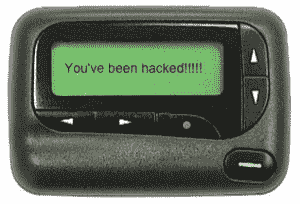

# 许多敏感信息行业中的加密缺失

> 原文：<https://www.social-engineer.com/crypto-missing-many-industries-sensitive-information/>

有多少人记得这个节目？疯狂的步伐，连珠炮似的戏剧？如果你是一个技术呆子，你记得齿轮。主要是那些老式寻呼机。趋势科技最近进行的一项研究表明，许多主要行业仍然使用寻呼机来尝试让员工了解各种紧急情况。这些领域包括工业控制系统、HVAC，尤其是医疗领域。

这可能看起来无伤大雅，直到你看到所使用的传输方法，以及所有页面都是以明文形式通过空中传送的事实。借助软件定义的无线电和价值 20 美元的加密狗，趋势科技能够截获约 5400 万条记录，其中超过 200 万条来自医疗领域，包含字母数字文本。这意味着个人健康信息、诊断、姓名、医生和治疗建议。它只需要大约 40 美元的硬件，并在发射机的范围内。这件事的影响可能是巨大的。Ars Technica 指出，一些页面来自核设施，包含有关反应堆和冷却棒状态的信息。像这样的信息，以及医疗页面中包含的 PII，是恶意攻击者的金矿，不仅有助于针对个人的定制攻击，也有助于针对组织的定制攻击。了解患者的诊断或治疗将使精心策划的鱼叉式网络钓鱼或假冒攻击变得容易得多，使个人获得他们原本不会获得的常识的有效性，并使目标更有理由信任此人。不仅如此，关于关键基础设施的页面可以告诉攻击者谁是可信任的维护来源以及需要做什么，这就为人员假冒攻击打开了大门。这些攻击被反复证明是毁灭性的有效。

解决这个问题的选项不是很多，但考虑到社会工程攻击的成本以及 HIPAA 和其他相关立法可能征收的罚款，这是值得研究的。有几个新服务提供带有公钥加密的页面，以及移动到基于智能手机的应用程序。不幸的是，从基础设施的角度来看，这两者都是一个挑战，因为构建新设备需要额外的成本，或者蜂窝和 Wi-Fi 频谱可能会干扰医疗设备。

挑战在于做什么。不幸的是，真的没有明确的解决方案，但第一步是教育员工，设置软件发送没有 PII 或敏感信息的数据，而不是发送编码信息，直到技术解决方案到位。通常情况下，最好从人开始。

*来源:*

[*https://www.hipaajournal.com/hipaa-compliance-and-pagers/*](https://www.hipaajournal.com/hipaa-compliance-and-pagers/)

 *[*https://www . trend micro . com/cloud-content/us/pdf/security-intelligence/white-papers/WP-leaking-beeps-health care . pdf*T3】](https://www.trendmicro.com/cloud-content/us/pdfs/security-intelligence/white-papers/wp-leaking-beeps-healthcare.pdf)

[*https://arstechnica . com/security/2016/10/nuclear-plants-leak-critical-alerts-in-encrypted-pager-messages/*](https://arstechnica.com/security/2016/10/nuclear-plants-leak-critical-alerts-in-unencrypted-pager-messages/)

[*https://www . csoonline . com/article/3137175/critical-infra structure/encrypted-pagers-a-security-risk-for-hospitals-power-plants . html*](https://www.csoonline.com/article/3137175/critical-infrastructure/unencrypted-pagers-a-security-risk-for-hospitals-power-plants.html)*