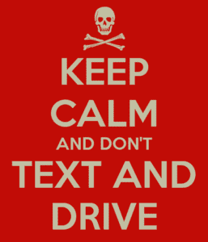

# 危险:多巴胺成瘾

> 原文：<https://www.social-engineer.org/general-blog/danger-dopamine-addiction/>

人们喜欢被欣赏，知道自己擅长做什么。这适用于社会工程 [pentesters，](https://www.social-engineer.org/framework/general-discussion/categories-social-engineers/penetration-testers/)也是如此。我们被约定像坏人一样思考，但实际上却是好人。这意味着我们不会在社交媒体上发布我们发现的一个很酷的黑客*通过特定组织的安全措施的细节。让客户难堪从来都不是什么好买卖！尽管系统工程师不经常与客户讨论他们的成功故事细节，但只要我们擅长我们所做的，我们就可以在[的高度认可](https://www.social-engineer.org/newsletter/Social-Engineer.Org%20Newsletter%20Vol.%2004%20Iss.%2042.htm)中一扫而光。这意味着我们可以被同样高的神经递质所控制，我们依靠这种神经递质来鼓励他人提供信息。我们从这个人身上获得的信息越多，我们对自己的技能就越有信心，从而提高了我们的多巴胺水平。诀窍是不要陷得太深，以至于看不到是时候离开了。*

《时代》杂志最近的一篇文章谈到了一个简单的短信提醒对我们大脑的影响，即使我们正在做其他事情，比如开车(Worland，2014)。这种无害的声音刺激大脑，多巴胺被释放出来，因为我们很高兴被关注。问题是多巴胺有一个缺点，一个被社会经济学家一直利用的优点:它让你做你知道你真的不应该做的事情。尽管人们知道他们不应该发短信开车，但他们还是会这样做，部分原因是他们对多巴胺的流动上瘾了。[同一主题的另一篇文章](http://www.techtimes.com/articles/19689/20141108/blame-it-on-dopamine-heres-why-people-text-and-drive-despite-being-aware-of-risks-involved.htm)提出，问题不在于人们需要被告知风险(他们知道他们不应该发短信和开车)，真正的问题是让人们承认他们是有问题的人(马米特，2014)。

当我们成功地获取信息时，同样的事情也可能发生在 SEs 身上；我们忽略了一个事实，那就是我们的多巴胺水平也很高，而且我们可能对自己的多巴胺成瘾视而不见。在社会工程师，我们称之为“管理你的期望”,这样你就知道在你“崩溃”和可能搞砸整个任务之前什么时候该离开。你必须意识到你内心深处的那个声音，这个声音陶醉于你的成功，激励着你去获取更多的信息，然后你必须忽略它，走开。我们知道以此为借口继续下去的风险，但无论如何，天生的兴奋让我们冒了这个险。像任何成瘾项目一样，解决方案始于知道问题的存在。我们需要承认，作为人类，我们同样容易受到我们从高认可中获得的感觉的影响，然后我们需要自我控制来保护自己，以免成为我们可能针对的相同弱点的牺牲品。

跟我说:我是一名社会工程师。我会沉迷于对工作的良好感觉。我需要有意识和自制力来知道什么时候离开一个完全有效和健谈的目标。

没那么难，对吧？诀窍是记住它，并付诸行动。肯尼·罗杰斯在某处歌唱，而我正离开这个岗位。

通过了解和尊重你的极限来保持安全！

*来源:*
*[http://www . tech times . com/articles/19689/2014 11 08/kill-it-on-dopamine-heres-why-people-text-and-drive-Justin-be-aware-of-risks-contracted . htm](http://www.techtimes.com/articles/19689/20141108/blame-it-on-dopamine-heres-why-people-text-and-drive-despite-being-aware-of-risks-involved.htm) *[http://time.com/3561413/texting-driving-dangerous/" target = " _ blank " rel = " noopener no referrer ">http://time.com/3561413/texting-driving-dangerous/">http://time.com/3561413/texting-driving-dangerous/](https://time.com/3561413/texting-driving-dangerous/)*
*Org %新闻信件% 20 卷。%2004%20Iss。% 2042 . htmT15**