# DEF CON 23 -概述，更新和更多！

> 原文：<https://www.social-engineer.org/event-updates/defcon-updates/def-con-23-recap-updates-and-more/>

我们刚刚从昏迷中醒来，意识到我们还没有更新你们所有人在 DEF CON 23 上发生的事情。所以，我们从地上爬起来，开始写作。

DEF CON 今年在一个全新的场地举行，这是我们个人从未去过的地方；所以当然，我们对事情的发展感到忧虑和紧张。此外，今年的会议比以往任何时候都大！它分布在两家酒店，比赛/活动场地和所有演讲发生的地方之间有相当大的步行距离。今年，我们还负责开发和举办一个全新的活动，这是 DEF CON 上唯一的周四活动。

不用说，今年我们怀着紧张兴奋的心情接近了 DEF CON。有太多新的未知挑战，超过 3000 平方英尺的新房间，一个新的事件，和一个更大的团队。

**周三–设置日**

由于我们必须为周四做好准备，我们将周三作为我们的设置和测试日。它始于我们的常驻不朽者，不朽者比利(是的，这确实是他的名字)，向我们的活动场地运送了大约 4，528，082，927 个箱子。

[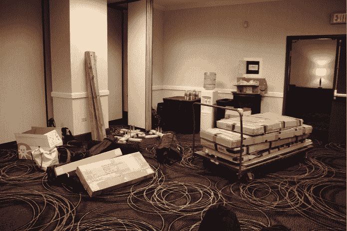](https://www.social-engineer.org/wp-content/uploads/2015/08/picture1-wednesdaysetup.png)

箱子到达后，团队迅速打开包装，整理并重新组装所有的东西。

[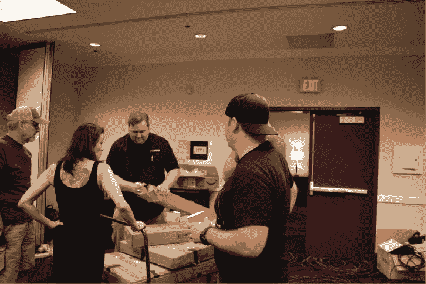](https://www.social-engineer.org/wp-content/uploads/2015/08/picture2-as-boxes-arrived.png)

没过多久，房间里就充满了活力。

[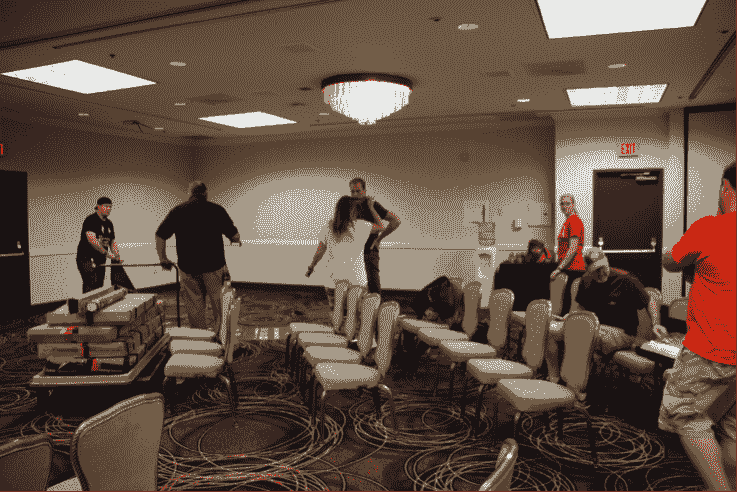](https://www.social-engineer.org/wp-content/uploads/2015/08/picture3-buzz-with-energy.png)

当然，仅仅是布置横幅就需要一名测试员、一名工程师、一名系统管理员和一名社会工程师。

[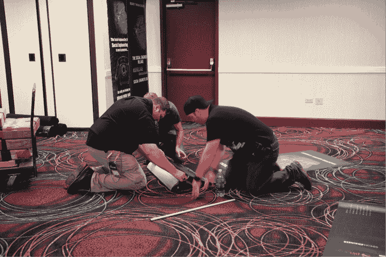](https://www.social-engineer.org/wp-content/uploads/2015/08/picture4-banneraseembly.png)

短短几个小时内，房间就布置好了。Mister_X 建造的激光阵列(稍后将详细介绍)和令人惊叹的新视频和音频显示器(由 Evan 提供)都运行得非常好。

[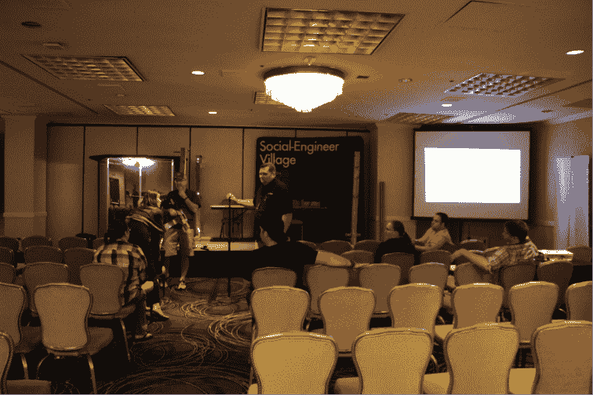](https://www.social-engineer.org/wp-content/uploads/2015/08/picture5-room-setup.png)

我们甚至有一个来自 1057 的访客向我们展示了今年的优步徽章。

[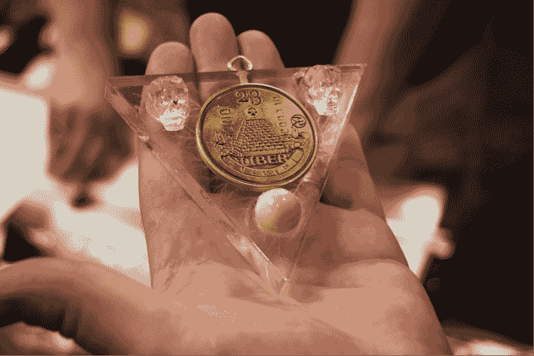](https://www.social-engineer.org/wp-content/uploads/2015/08/Picture6-uberbadge.png)

他在我拍了这张照片后告诉我，它被注入了辐射或类似的东西，所以我现在实际上是一个绿色的庞大的愤怒。谢谢，1057！

随着设置接近完成，我们都又累又饿，但仍然很兴奋地看着我们的首次周四活动将如何进行。我们召开了一个团队会议来讨论注册问题，我们的驻地 DEF CON n00b，Colin 提出了一个非常天才的想法…非常令人惊讶…它解决了我们所有关于如何即时处理注册的问题…..彩票。

是的，他建议收集所有的注册信息，然后从帽子里抽出前 10 名成为我们周四活动的第一批参与者,“不可能完成的任务”。

怎么样了？

**不可能完成的任务——周四**

我们都在周四一大早就到了，为大事件前的最后一分钟做准备和检查。杰斯甚至准时到了那里——太神奇了

[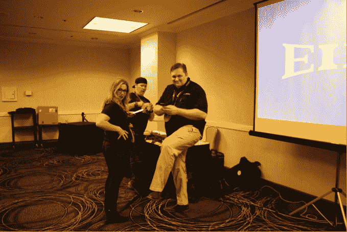](https://www.social-engineer.org/wp-content/uploads/2015/08/picture7-jess-on-time.png)

当团队注册时，杰斯和我有一个惊人的机会现场采访一位记者，我们的朋友和伟大的运动员凯文·鲁斯，来自 Fusion TV。

[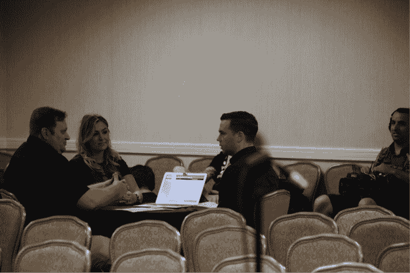](https://www.social-engineer.org/wp-content/uploads/2015/08/picture8-fushionTV.png)

当杰斯和我忙于拍摄时，团队的其他成员都在努力工作。嗯……我说努力工作！！

[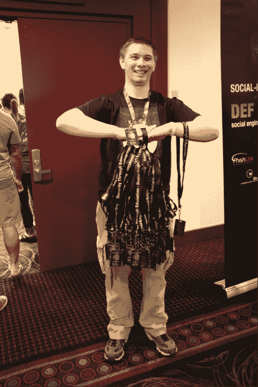](https://www.social-engineer.org/wp-content/uploads/2015/08/colin-hard-work-.png)

[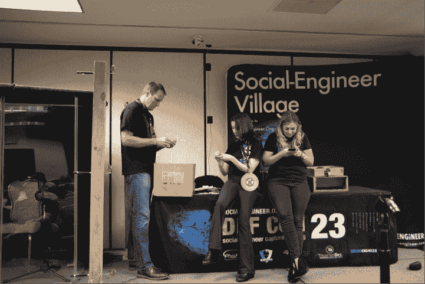](https://www.social-engineer.org/wp-content/uploads/2015/08/picture10-hardwork.png)

我们有很多人参加了不可能完成的任务！150 人参加了 10 个名额的抽奖活动。真的很神奇，对吧？

我们抽出我们的 10 个名字，房间里很快充满了期待。

[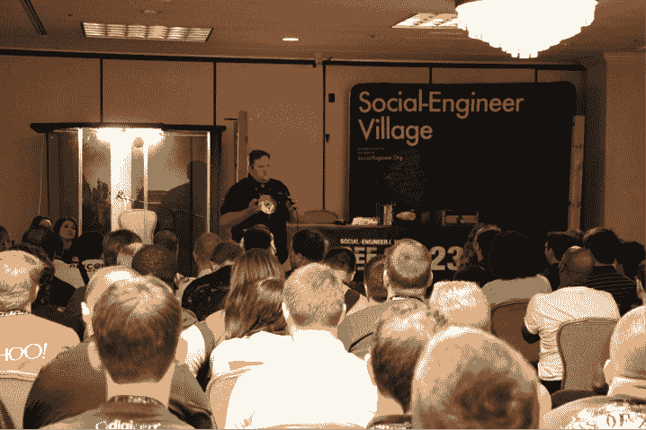](https://www.social-engineer.org/wp-content/uploads/2015/08/picture12-10-names.png)

[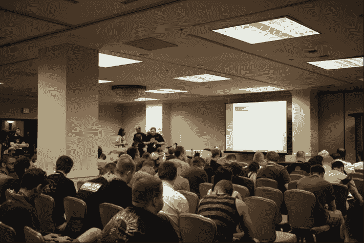](https://www.social-engineer.org/wp-content/uploads/2015/08/picture13-10-names.png)

当我们到达活动开始时间时，房间里挤满了热情的观众！。

《碟中谍》是这样概述的:

主题:我的一名员工正在进行企业间谍活动，并计划窃取我所有的企业商业机密。然而，正当他们要泄露超级骗子的秘密数据时，邪恶公司发现有竞争情报要获取，于是派了一名“间谍”(参赛者)先去窃取数据。那个间谍被抓住了，并被关进了拘留室。利用一系列身体和精神工具，间谍将试图进入我办公室的保险箱，成功窃取数据。

第一阶段:

警察尼克，用手铐和脚镣锁住每个“间谍”,我们的超级骗子秘密拘留室。

[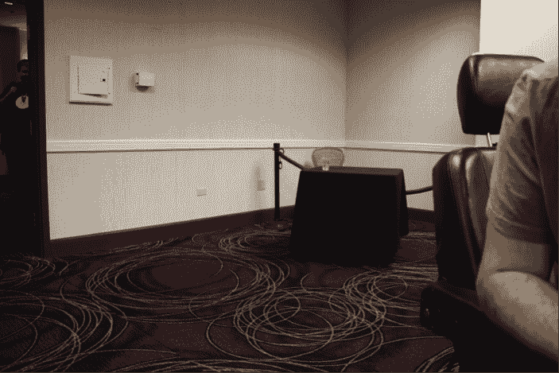](https://www.social-engineer.org/wp-content/uploads/2015/08/picture14-secureholdingcell.png)

是的，就是它…太棒了，不是吗？出于某种未知的原因(可能是甜甜圈)，尼克没有看到选手伸手可及的地板上的手铐垫片或回形针。他还不小心留下了一个绝密文件夹(里面有线索)，忘了没收选手的手机。伙计，尼克，真是个糟糕的保安！

一旦参赛选手挣脱了手铐，他们就有机会检查文件夹，里面有一些线索和一个奇怪的模板(这两个都是挑战后期需要的)。

第二阶段:

参赛者需要去收发室:

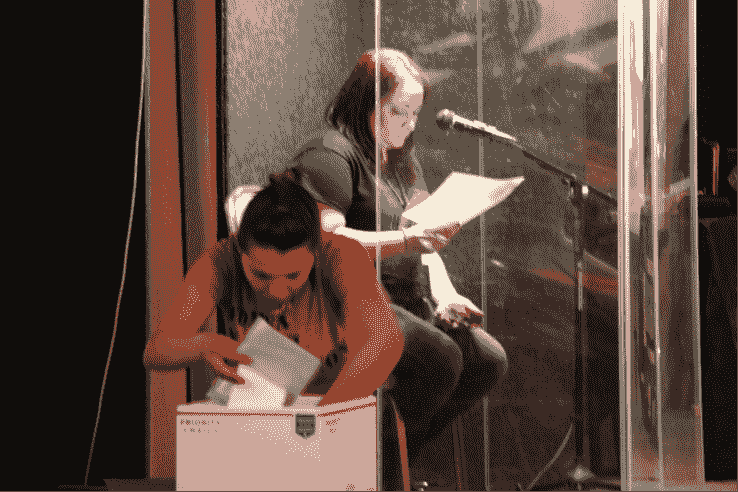

是的，是的，我知道，一个盒子不是一个邮件室，但我们在这里使用我们的想象力。参赛者需要找到一封特定的信给文件中列出的人。一旦他们打开它，他们会发现一条来自邪恶集团的信息，概述了如何打开保险箱。

第三阶段:

他们需要进入我的办公室。但是我没有办公室。不，我的办公室被一个激光阵列(由 Mister_X 定制)保护着，一旦被触发就会触发警报。如果警报响了，安全狙击手吉姆会严令待命，开枪。

[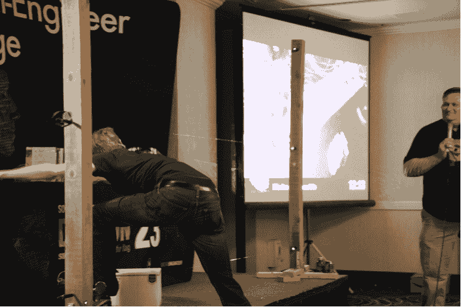](https://www.social-engineer.org/wp-content/uploads/2015/08/picture16-stage-3.png)

看那些神奇的激光…只是不要看得太近，它们是绿色激光，所以可以很快让你失明。

参赛者需要利用批判性思维技能，将怪异的模板(包含在第一阶段的文件夹中)与第二阶段给他们的使用正确 ISBN 的书匹配起来。然后，参赛者必须从书中找出三个单词交给一名特工(阿曼达)。如果提供了正确的单词，那么密探提供了完成第三阶段所需的线索。如果有一两个单词不正确，参赛者将会被淘汰。

一旦参赛者从 Amanda 那里获得了线索，他们需要通过将目前获得的信息与办公室内的其他线索相结合来打开我的保险箱。一旦保险箱被打开，任务就完成了，时间也停止了。时间最快的选手是获胜者。

对参赛者来说,《碟中谍》被证明是复杂的，但是如果你需要一点点可爱来让你的一天变得更好，你总是可以…

[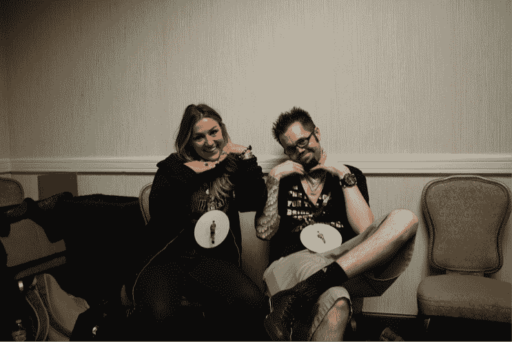](https://www.social-engineer.org/wp-content/uploads/2015/08/picture17-jess-and-billy.png)

不，不要看那里…我会说放弃，离开这个村庄。

除了一个令人惊讶的事件，我们也有一些可靠的采访。我们来自日本的合作伙伴 Asgent 在一个很棒的日本新闻团队的陪同下专程飞过来采访我们。

[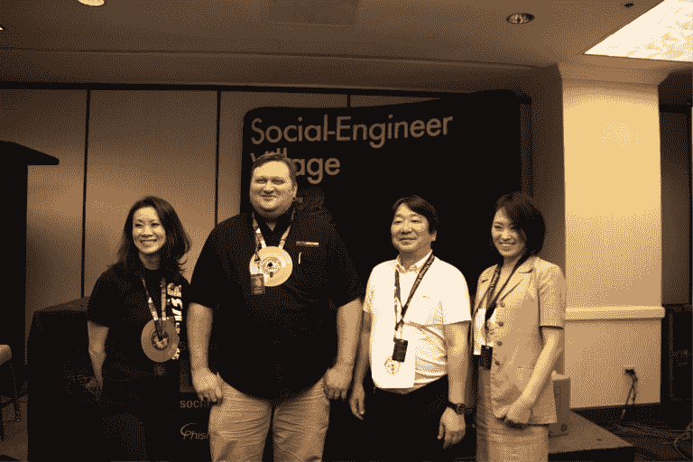](https://www.social-engineer.org/wp-content/uploads/2015/08/picture18-asgent.png)

像往常一样，我们喜欢分享一些关于当前社会工程趋势的知识。

最后，是时候为 SECTF 进行彩排了，所以我们把 Jess 放在了展位上，并测试了一些东西。

[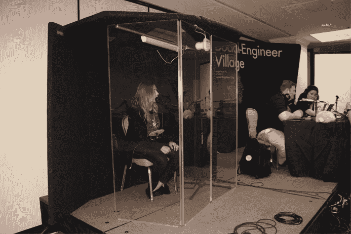](https://www.social-engineer.org/wp-content/uploads/2015/08/picture19-jess-testing-.png)

当她的故事和歌曲变得太多的时候，我有一个粉红色的 TRIBBLES 作为安慰，因为我们的常驻呆子安娜，决定为团队买一整袋 TRIBBLES

[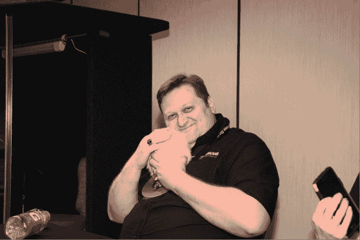](https://www.social-engineer.org/wp-content/uploads/2015/08/picture20-tribble.png)

**第一节–周五**

我们一大早就回到了 SE 村(拉斯维加斯的早上 9 点就像日出一样)，为 SECTF 做准备。在过去的几年中，这项活动在 DEF CON 与会者中广受欢迎。我们很快就知道今年也不会有什么不同，因为上午 9:30 座位就已经很少了——比活动开始时间提前了整整 30 分钟。埃文格外努力地工作，以确保一切准备就绪。

[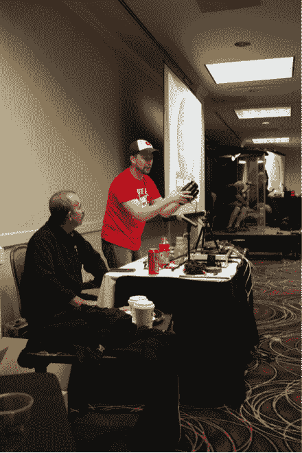](https://www.social-engineer.org/wp-content/uploads/2015/08/picture-21-SECTFFriday.png)

此外，我们有我们的社会工程师进行人群控制，以确保房间保持拥挤，但不存在消防代码的危险。

[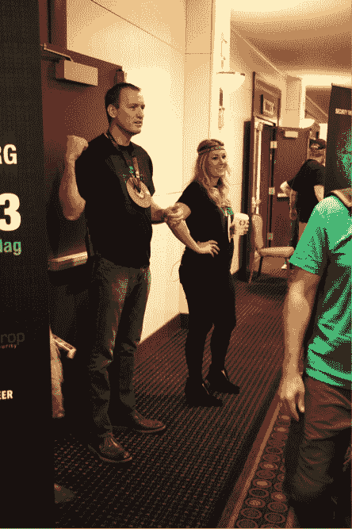](https://www.social-engineer.org/wp-content/uploads/2015/08/picture22-firecodedanger.png)

到上午 10 点开始的时候，我们已经在房间外面排起了长队。

[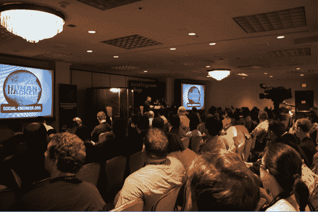](https://www.social-engineer.org/wp-content/uploads/2015/08/lineoutsidetheroom.png)

今年，我们很幸运地邀请到了来自 White Canvas Group 的 Tim Newberry 加入我们的评委席，帮助我们对这些评价进行评论。

[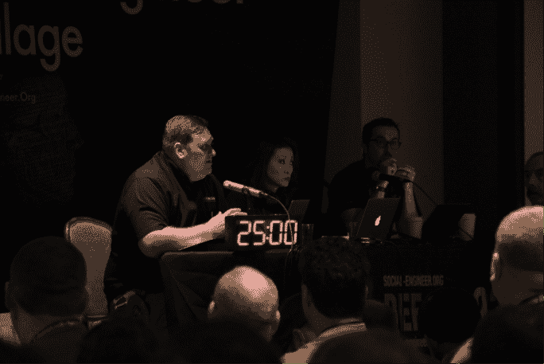](https://www.social-engineer.org/wp-content/uploads/2015/08/timnewberry.png)

当我们到达第一天结束的时候——电话很棒，人群很棒，我们需要的只是吉姆的一点爱。

[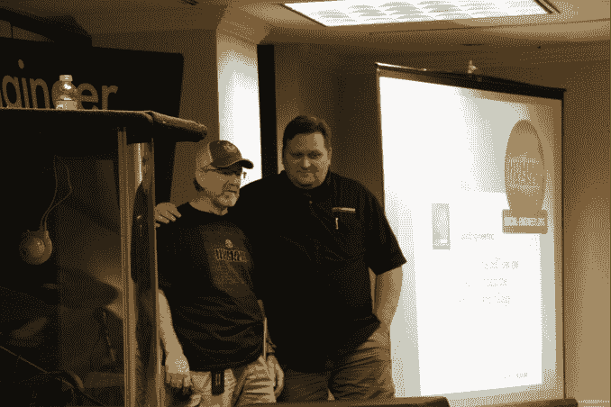](https://www.social-engineer.org/wp-content/uploads/2015/08/lovefromjim.png)

在结束了当天的 SECTF 活动后，我们在 SE 村启动了 DEF CON 的首个官方人类赛道。我们有一个惊人的阵容。

我们以 Noah Beddome 关于社会工程应用降级的精彩演讲开始，随后是我们的首席影响代理 Michele Fincher 关于心理学在安全和决策中的应用的精彩演讲。Michele 的演讲之后是 Ian Harris 关于自然语言处理的智能演示，John Ridpath 以关于莎士比亚笔下的恶棍和社会工程的演讲结束了当晚的演示。

这里有一些来自 SE 村谈话的图片供你欣赏。

[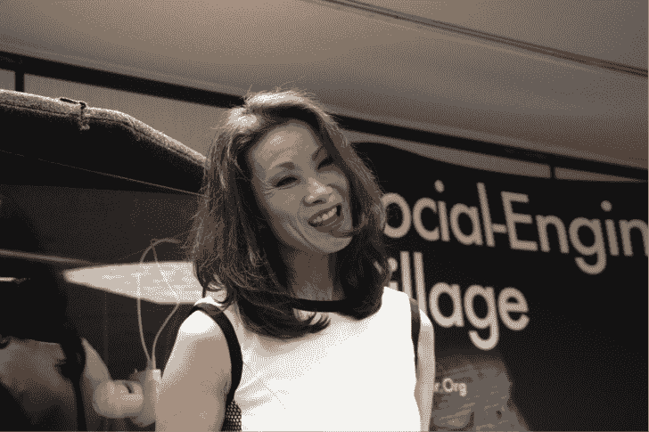](https://www.social-engineer.org/wp-content/uploads/2015/08/sultryasian.png)

Michele，又名@SultryAsian，发表了一个引人入胜、充满智慧的演讲。

[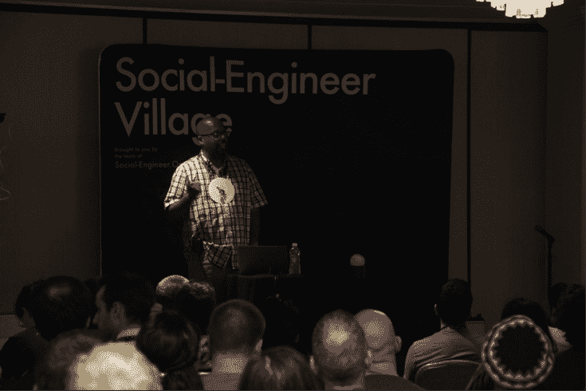](https://www.social-engineer.org/wp-content/uploads/2015/08/ianharris.png)

伊恩·哈里斯关于自然语言处理的演讲激起了听众的热情

当它们出来的时候，你能在 DEF CON DVDs 上看到这些和其他的。

**第 4 节儿童、第 2 节和服务演示**

好像第一天还不够，我们以更棒的开始了第二天。

我们引以为豪的成功故事 Ashley 今年再次回到我们身边，帮助我们举办 SECTF4Kids 活动。该死，我爱那个女孩。她现在是世界机器人联盟的成员，在全球范围内踢机器人的屁股。

[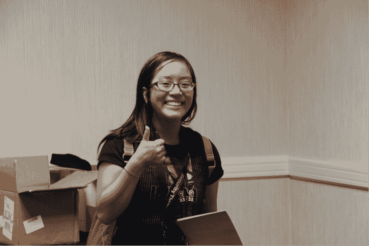](https://www.social-engineer.org/wp-content/uploads/2015/08/ashley.png)

我想这是阿曼达唯一的手势，它告诉我闭嘴，因为我们给孩子们和家长们第四区的起跑线。随着一声“走！”这一天推出了令人惊叹的 Race SECTF4Kids 版。阿曼达，塔玛拉，比利和安娜都像疯子一样跑来跑去，让孩子们保持挑战和参与。

[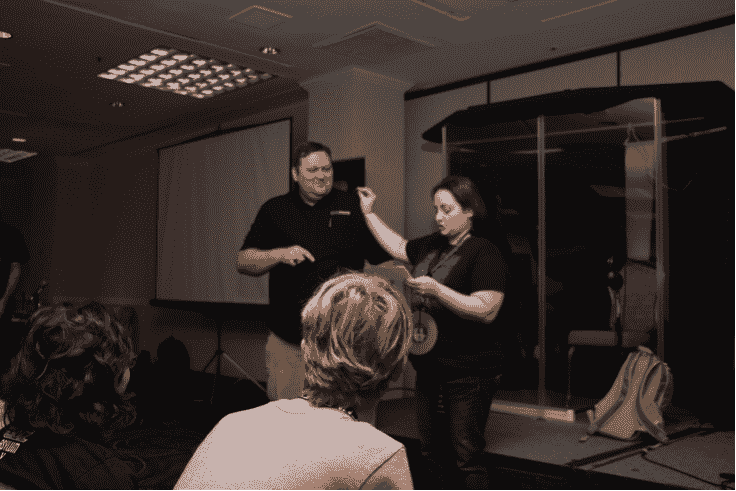](https://www.social-engineer.org/wp-content/uploads/2015/08/shutupchris.png)

此后不久，我们的播客嘉宾 r·保罗·威尔逊停下来打招呼，并会见了苏格兰狂热爱好者吉姆·曼利。

[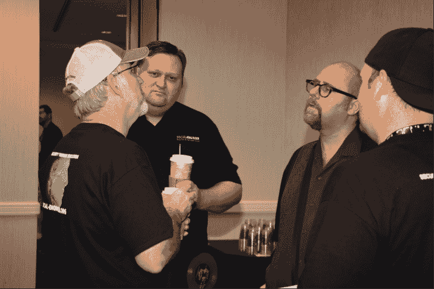](https://www.social-engineer.org/wp-content/uploads/2015/08/paulandjim.png)

与此同时，孩子们正在努力破解密码，用他们的大脑做各种各样令人惊叹的事情。

[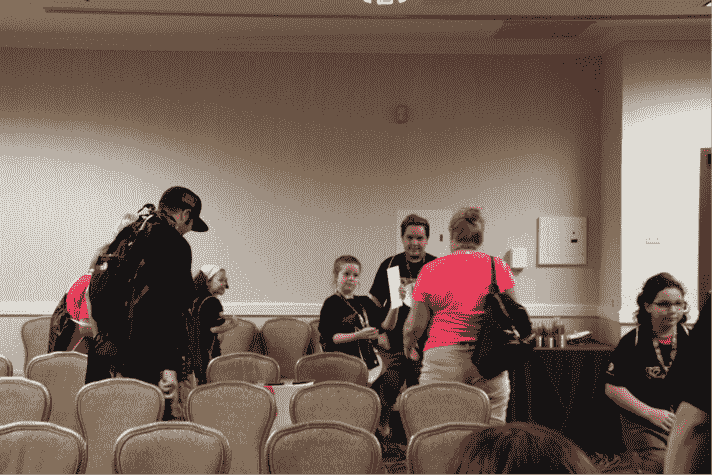](https://www.social-engineer.org/wp-content/uploads/2015/08/kidschallengedandengaged.png)

就在第二天开始之前，我们进行了一些最后的测试。

[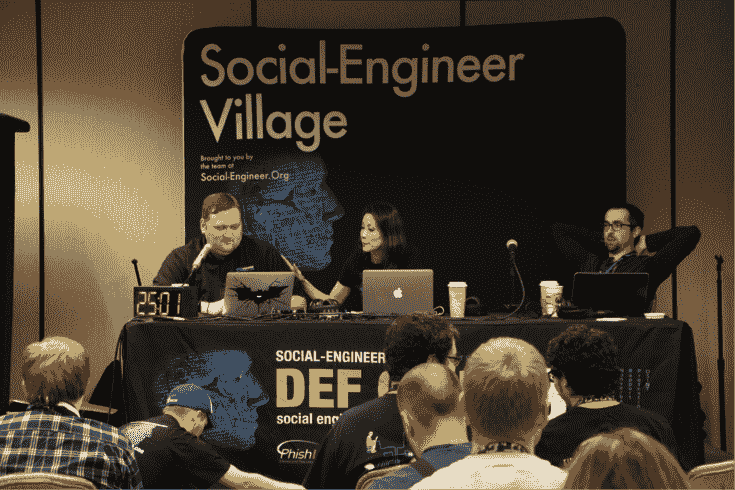](https://www.social-engineer.org/wp-content/uploads/2015/09/lastminutetesting.png)

我们今天的第一位参赛者(也是比赛的最终获胜者)完全让我们大吃一惊。

[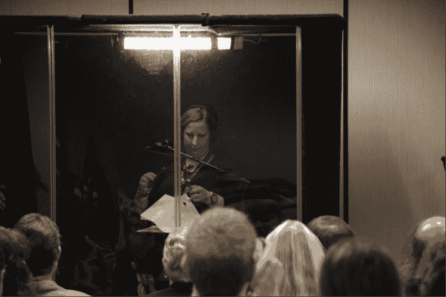](https://www.social-engineer.org/wp-content/uploads/2015/09/firstcontestant.png)

这个电话太棒了，让我的团队感觉……

[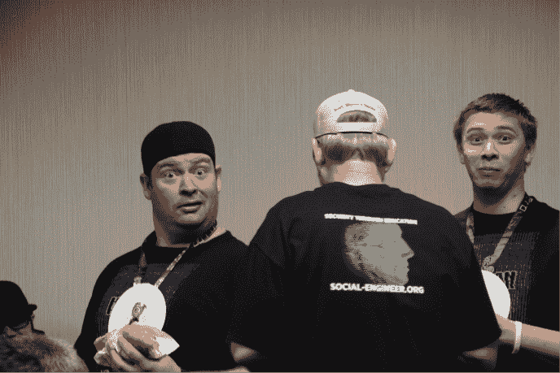](https://www.social-engineer.org/wp-content/uploads/2015/09/leftmyteamfeeling.png)

与此同时，孩子们仍然像小间谍一样在地上爬着寻找隐藏的二维码…我们喜欢它！

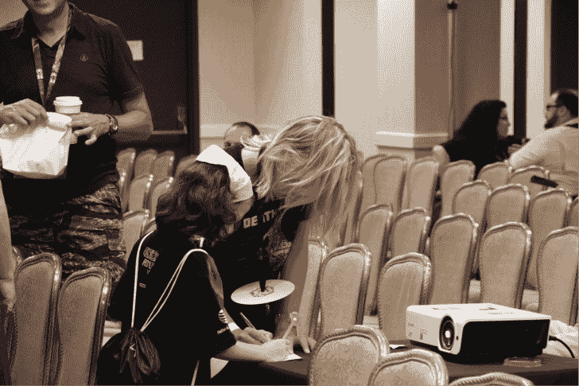

科林不断给我们送来食物和饮料。

[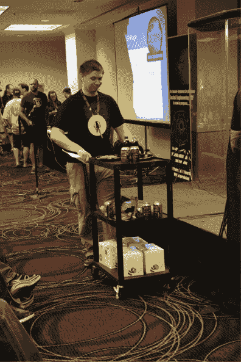](https://www.social-engineer.org/wp-content/uploads/2015/09/colinwithfood.png)

如果他能给我们带个马桶，那就太好了。

我们今年有几个人没有参加 SECTF，但幸运的是，两名志愿者挺身而出，在不到两个小时的准备时间内进入展位进行现场直播。一名候补选手，惠特尼，在 5！！！很神奇吧？

在最后的 SECTF 电话会议之后，我们再次与 Jayson Street、Tim Newberry、Chris Hadnagy、Dave Kennedy 和 Adam Compton & Eric Gershman 一起启动了我们的 SE Village 演示。

杰森对座无虚席的观众讲述了如何闯入 bad。

[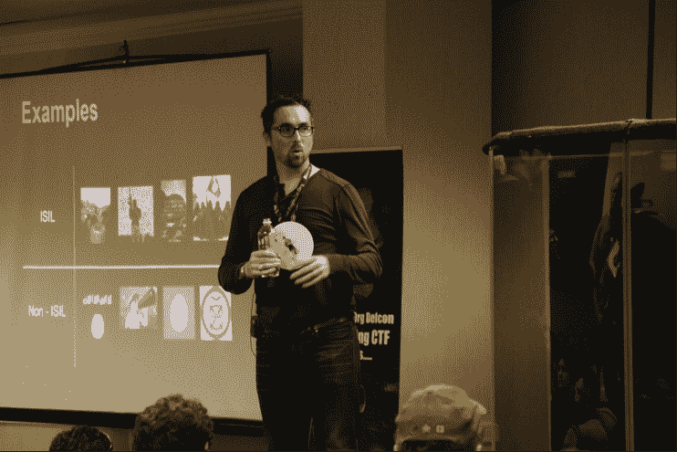](https://www.social-engineer.org/wp-content/uploads/2015/09/timnewberryspeech.png)

Tim Newberry 在 Twitter、ISL 和 Tech 上的演讲让观众震惊不已。

[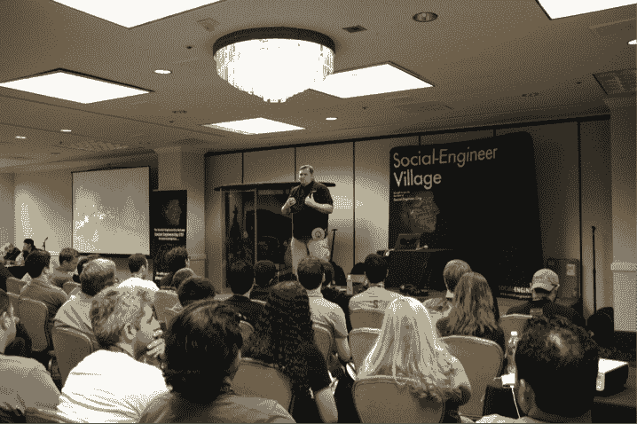](https://www.social-engineer.org/wp-content/uploads/2015/09/Chrisspeech.png)

我很荣幸地向大家介绍了 DEF CON SEVillage 的部门和发展历史。

[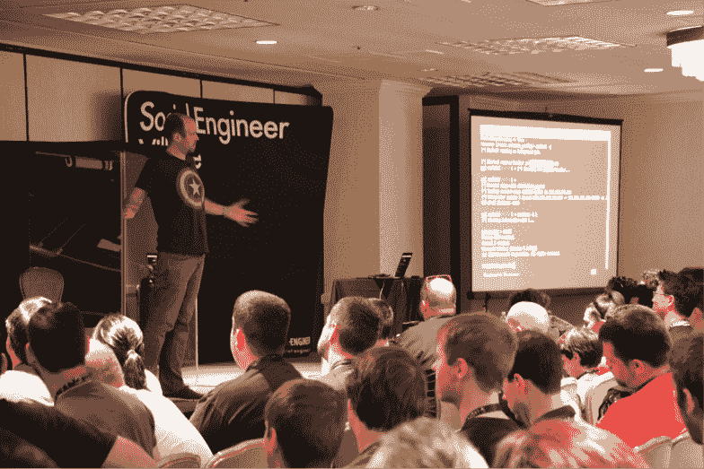](https://www.social-engineer.org/wp-content/uploads/2015/09/davespeech.png)

新的和改进的 Dave 2.0 提供了一些有趣的真实世界的终端用户攻击。

[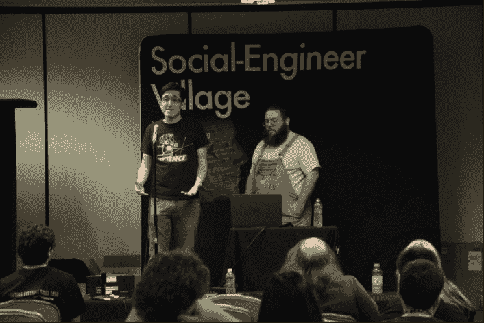](https://www.social-engineer.org/wp-content/uploads/2015/09/adamanderic.png)

最后，Adam 和 Eric 用一些关于 SpeedPhishing 框架的精彩内容结束了这个夜晚

虽然我们真的很累，但这并没有阻止我们举办我们的私人 SE 派对(地点和细节绝密)。

**接近尾声——周日播客**

周日对我们来说是美好的一天，有闭幕式、直播播客、大扫除和与整个 SE 团队的晚餐。

[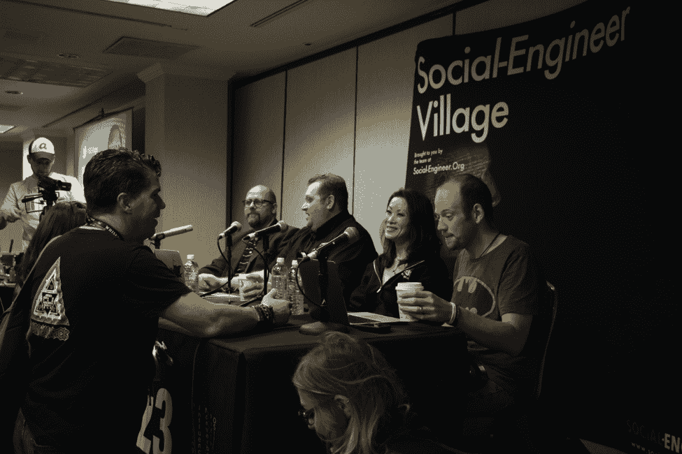](https://www.social-engineer.org/wp-content/uploads/2015/09/podcast.png)

是的，戴夫确实为播客做了一部分…我们的嘉宾 r·保罗·威尔逊既令人惊讶又令人着迷。

当戴夫不得不提前离开时，他决定拥抱我们的客人…唉

[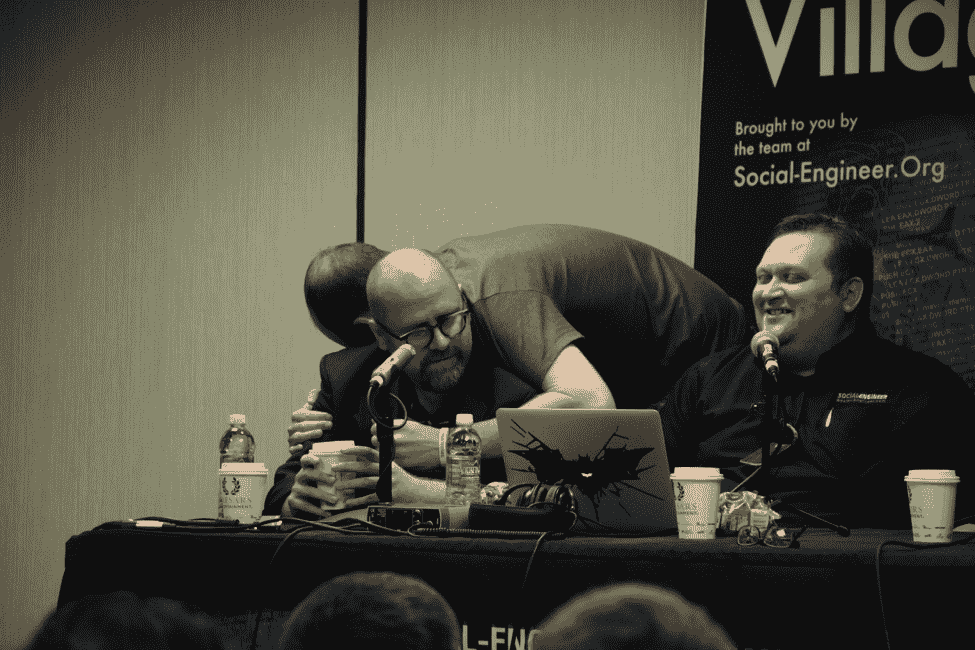](https://www.social-engineer.org/wp-content/uploads/2015/09/davehuggingpaul.png)

在离开时，他拥抱了大约 50 个人，包括迈克，他看起来很害怕。

然后我们打扫了房间，前往闭幕式。

[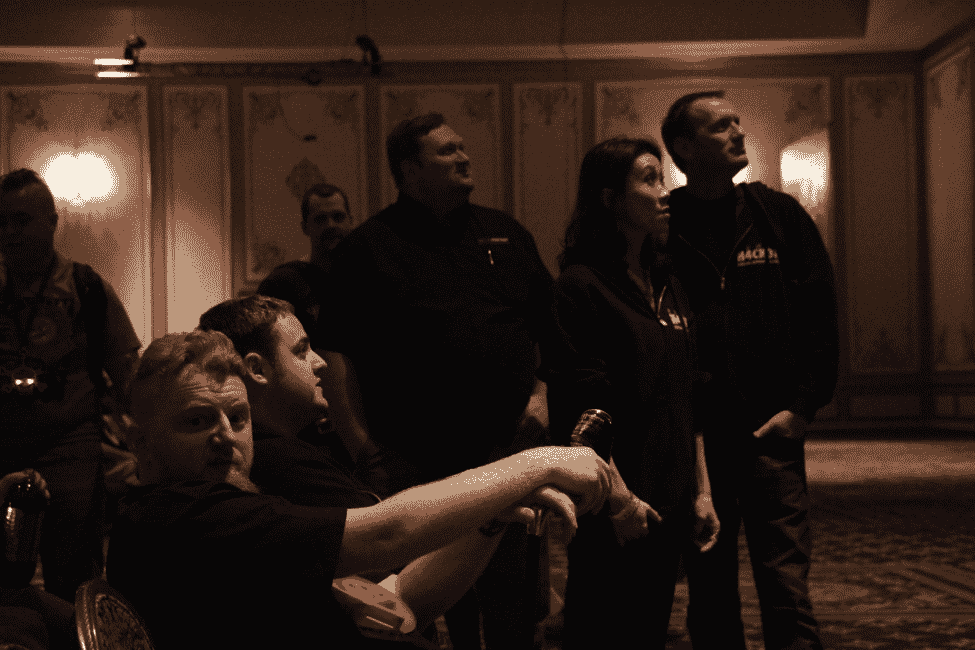](https://www.social-engineer.org/wp-content/uploads/2015/09/teamatclosingceremonies.png)

一个疲惫但令人惊叹的团队在看我们的照片。

[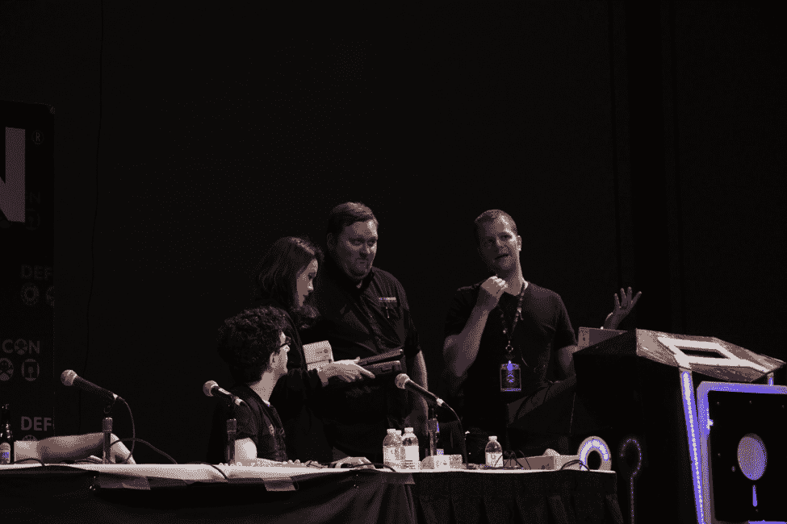](https://www.social-engineer.org/wp-content/uploads/2015/09/michelchrisgrifty.png)

米歇尔和我再次颁发了第一名和第二名的黑色徽章。我们为珍感到骄傲，她是我们今年的第一名，表现出色。

[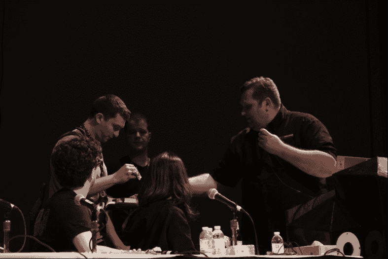](https://www.social-engineer.org/wp-content/uploads/2015/09/jenfirstplacewinner.png)

我们的第二名得主，乔恩·s。

[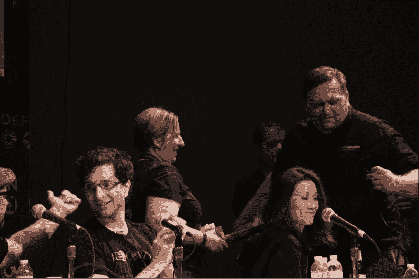](https://www.social-engineer.org/wp-content/uploads/2015/09/jenonstage.png)

第一名得主珍 f。

[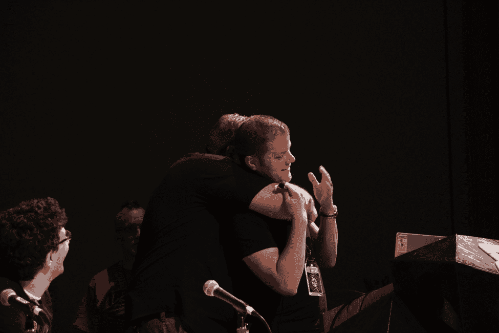](https://www.social-engineer.org/wp-content/uploads/2015/09/hugginggrifty.png)

没有拥抱我的朋友“Grifty ”,结尾是不完整的

[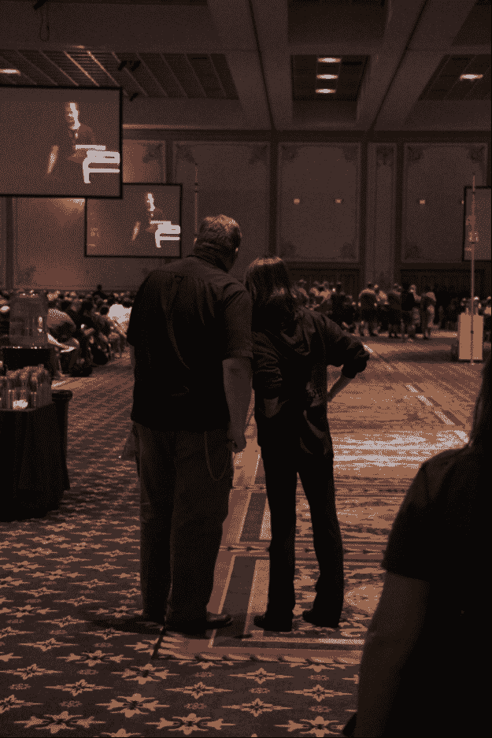](https://www.social-engineer.org/wp-content/uploads/2015/09/chrisandmicheldefcon.png)

我和 m 花最后一分钟看了看人群，向令人惊奇的一年说最后的再见。

我们的最后一项活动——SE 团队晚宴:

[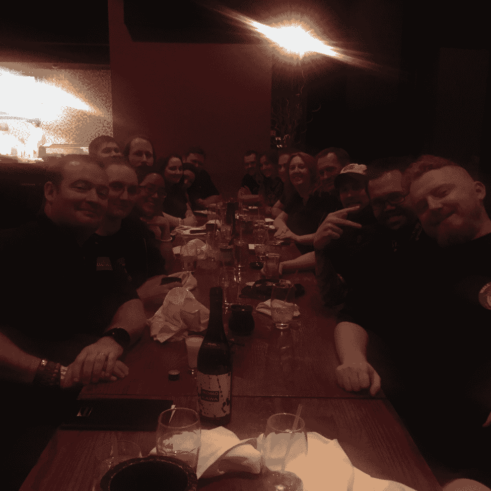](https://www.social-engineer.org/wp-content/uploads/2015/09/SETeamdinner.png)

**最终想法:**

[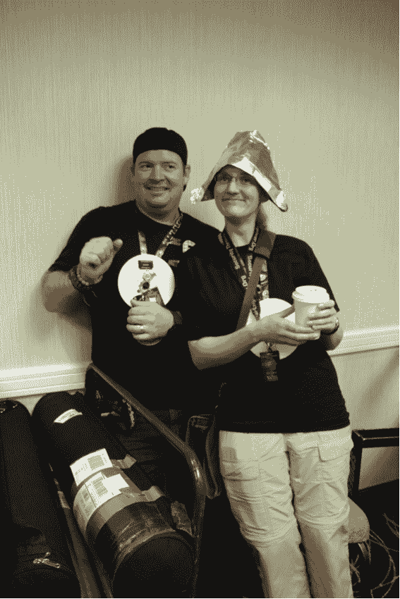](https://www.social-engineer.org/wp-content/uploads/2015/09/finalthought.png)

**让我先把这个放在这里……**

今年，一次又一次，我被告知一件事…我的团队是惊人的。Michele、Amanda、Nick、Jim、Evan、Colin、Jess、Mike、Dan、Ashley、Tamara、Bonez、Anna、Mister _ X & Billy——他们每个人都在 SE Village 的成功中发挥了不可或缺的作用！我们很幸运地在世界上最大的黑客大会上再次经营了一个非常受欢迎、非常成功的村庄，让人们因为见到了我们而感觉更好！！！

可悲的是，我们明年将继续没有塔玛拉。她已经去了更好的地方，人们会非常想念她。

[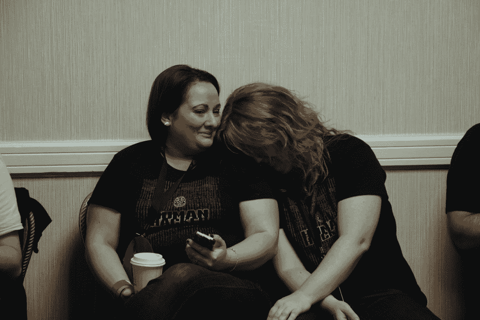](https://www.social-engineer.org/wp-content/uploads/2015/09/amanda-and-tamara.png)

我会把这个也放在这里…3

今年，我们再次了解到 SE 每次都是赢家。我们了解到，即使是 7-8 岁的孩子也能在批判性思维方面取得成就。我们了解到，穿着得体、聪明的人可以吸引大量人群进入一个关于人类黑客的村庄。我们了解到一个让任何人都可以参加的周四活动是非常成功的。最后但同样重要的是，我认识到我的团队……这个令人惊叹的、真正多样化的个人团体组成了一个团队，帮助这个社区成长、学习和变得更好……我认识到没有他们，我什么都不是，有了他们，我几乎可以完成任何事情！

[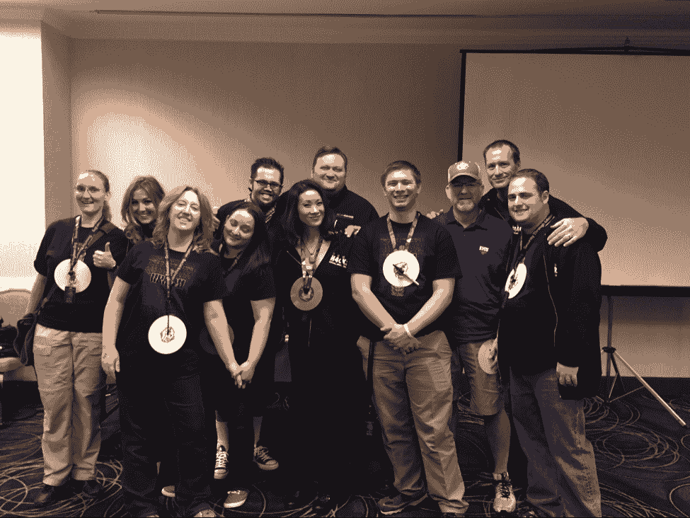](https://www.social-engineer.org/wp-content/uploads/2015/09/SETEAM-.png)

敬请期待，我们将为 DEF CON 24 宣布一些新的和令人惊讶的事情！