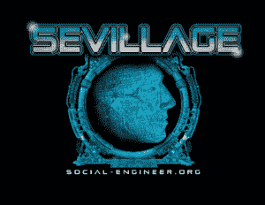

# DEF CON 28 塞维利亚更新

> 原文：<https://www.social-engineer.org/event-updates/defcon-updates/def-con-28-sevillage-update/>

好了，我们亲爱的朋友，是时候大声说出来了…“DEF CON 已经取消了。”我们知道，我们也不敢相信。随着 DEF CON 今年将虚拟化的宣布，许多人都很兴奋地看到他们最喜爱的村庄将如何参与其中。对于我们这些组织塞维利亚的人来说，过去的几周充满了深思熟虑和头脑风暴。正如你们中许多以前去过塞维利亚的人所知，它主要是基于人类的互动。这使得虚拟化有点棘手。所以我们写了这篇关于塞维利亚更新的博客，并提出警告…有一些好消息和坏消息。

## **让我们把这个坏消息说完吧……**

十多年来，社会工程捕捉旗帜(SECTF)一直是我们在 DEF CON 上的旗舰活动。每年都有数百人带着竞争的希望报名。今年也不例外。尽管事情存在不确定性，我们还是有几十人注册并提交了他们的视频，以获得竞争的机会。这就是为什么我们不得不怀着巨大的悲伤宣布我们今年将不再举办 SECTF 比赛。虽然我们尽了最大努力，但我们无法公平、安全、合法地(据我们的律师称，最重要的是)举办比赛。我们知道这将会让很多喜欢每年观看这项赛事的人失望。相信我们，当我们说，我们也很失望。我们希望在 2021 年将 SECTF 带到 DEF CON 29，我们期待在那里再次见到大家。

今年应该是我们在塞维利亚 DEF CON 举办 OSINT CTF 的第一年。在我们在 DerbyCon 取得巨大成功之后，我们非常兴奋能够再次举办这项比赛。不幸的是，我们没有办法虚拟地举办这个活动。如果你仍然有兴趣参加今年在 CTF 举行的比赛，我们建议关注克里斯·西尔维斯，他今年在[还有一场比赛](https://www.cgsilvers.com/osint-ctf)。

好了，我们保证这就是我们所有的坏消息。来说说好东西吧。

## **好消息**

虚拟化给了我们一些有趣的新想法，主要是针对儿童和青少年。我们可能无法做一些正常的有趣的事情(让我们为今年没有 MSI 而流泪..)，但我们带来的是 2 场虚拟赛事！让我们把它们分解开来。

## **虚拟扇区 4Kids**

让我们从几个词开始:《我的世界》、硒和寻宝。今年我们将带来一个全新的 SECTF4Kids 虚拟活动！基于一个特殊的《我的世界》服务器，孩子们将进入一个专为他们创造的世界。有了密码、谜题和传闻中的矿车发射器，我们非常兴奋地将这一事件带入生活。谁能竞争？抱歉，大人，这是专为 6-12 岁的孩子准备的。该活动将持续两天，即 8 月 7 日星期五**和 8 月 8 日星期六**。将会有几个时间段，所以我们希望能容纳来自世界各地的孩子。想给你的孩子报名吗？然后前往[我们的注册页面！](https://www.social-engineer.org/sevillage-def-con/)

## **虚拟扇区 4 个扇区**

我们努力了一段时间，决定如何为青少年举办一场虚拟的 DEF CON 活动。然后……进入克里斯和克里斯·西尔弗的活力二人组！他们创造了一个惊人的事件，涉及密码，视觉和现实生活。是的，我们是认真的。这项令人惊叹的活动将于 8 月 8 日星期六**举行。你的孩子感兴趣吗？然后让他们直接访问我们的注册页面，这样他们就可以告诉我们为什么要选择他们来参加比赛！**

## **直到我们再次相遇**

2020 年对我们所有人来说都很艰难。DEF CON 的取消只是令人失望的事件清单上又增加了一件事。然而，我们真的很期待我们能再次在一起的时间。我们真诚地希望您喜欢我们今年的虚拟活动。不想等到 2021 年夏天再来看我们？然后你可以随时来参加我们自己的[人类黑客大会](https://www.humanhackingconference.com/)！

在那之前，要健康，要安全，让他们因为遇见你而感觉更好。