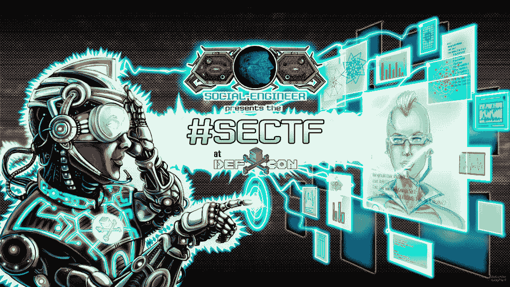

# DEF CON 25 SECTF 规则和注册

> 原文：<https://www.social-engineer.org/event-updates/defcon-updates/def-con-sectf-rules-registration/>

[T2】](https://www.social-engineer.org/ctf/def-con-sectf-rules-registration/attachment/sectf-banner-v7-rgb/)

**(这意味着 ***这一页上的每一个* *字*** )阅读完这一页再继续——规则很重要！**

 ****剧情简介**:

这个真正独特的活动将挑战你，测试你使用社会工程技能通过电话从不知情的公司收集少量数据的能力。每个参赛者将被分配一个目标公司。每位参赛者将提供旗帜，一份样本报告和他们的通话时间。你将有三周时间(严格，没有例外)来收集和报告信息。

在 DEF CON 上，在分配给你的时间段内，每个参赛者将有 25 分钟的时间给目标公司打电话，并尝试抽取尽可能多的旗帜。然后真正的战斗开始确定“世卫组织是社会工程师冠军。”

**如果你是:**

*   人类物种的男性或女性(如果你对这种说法有问题，请不要应用！)
*   愿意花时间参加一场精彩有趣的社会工程竞赛
*   想要赢得您自己的 SE 秘密套装吗
*   想要加冕 DEF CON 25 社会工程冠军

然后继续读下去。

**CTF 规则**

注册之前，**仔细阅读所有规则**(明白提示了吗？？？)!违反这些规则会导致直接的 DQ——所以要知道它们！

*   每位社会工程师都会通过电子邮件收到一份档案，上面有他们目标公司的名称和网址
*   将为参赛者提供一个包含所有标志及其相应值的列表。
*   在 DEF CON 之前，参赛者被允许使用公共开源情报(OSINT)收集尽可能多的信息。这包括但不限于谷歌、LinkedIn、你的目标自己的网站、脸书、Twitter 等来源。在 DEF CON 活动之前，参赛者不得出于 OSINT 目的打电话、发电子邮件或联系公司。我们将对此进行监控，对于“作弊”将扣分
*   您可以拨打您获得的号码，以确保在您拨打的当天和时间会有人接听。
*   每个社会工程师将被要求根据上述收集阶段获得的信息创建一份专业的报告。参赛者将收到一份样本报告，他们应该遵循作为指导方针。分数的很大一部分将由报告的质量决定。仅仅将几十页的信息“倾倒”到一个 Word 文档中是不可接受的。必须清楚地传达发现的项目及其重要性。在竞赛的这一阶段收集的信息将为您在随后的拜访中取得成功奠定基础，并为您的初始得分建立基准。这些报告仅供评分之用，Social-Engineer.org 不会公开。应合法代表的要求，报告的内容将提供给目标公司。
*   在您的专业报告中发现并确定的任何旗帜将被授予半分。在此阶段尝试收集尽可能多的旗帜符合您的最佳利益，因为您还可以在征集满分时再次收集这些旗帜。结合起来，您有可能每面旗帜获得 1.5 倍的积分。
*   参赛者将有三周时间完成上述信息收集和报告撰写阶段。
*   参赛者将在档案上给出的日期或之前向评审团提交他们的档案以供审查。迟交报告可能会取消你的参赛资格，甚至更糟的是被迫与吉姆·曼利在黑暗的壁橱里共度时光。
*   在 DEF CON 的选手时段，您将被安排在一个隔音的隔间中，并有大约 25 分钟*的时间打电话给您的目标并执行您的呼叫。在通话过程中，您将尝试捕捉尽可能多的标志。在此阶段捕获的旗帜将获得满分。*时间可能会根据参赛人数进行调整。但是所有参赛者都将获得同等的时间。

*   电话欺骗可能会被利用——参赛者必须在报告中明确标记的部分包括所有要打电话的号码和所有要欺骗的号码。
*   所有电话号码必须是美国的号码(没有加拿大，南美或任何跨越大西洋或太平洋)。
*   评分将包括预定义 CON 报告和半分标记、电话会议期间捕获的满分标记以及评委给出的主观评分。
*   **目标回忆:**我们不允许参赛者回忆目标来获取他们刚刚获得的相同信息。例如，你打电话给一个特定的目标，然后挂断电话，说“对不起，我刚刚丢失了所有的信息，我可以再得到它吗？”你可能不止一次呼叫一个目标并获得新的信息。
*   不允许为参与您的借口提供任何礼物、贿赂或奖励。

**标志:**“标志”是一个定制的特定信息列表，您必须在信息收集阶段和电话通话中发现这些信息。评审团创建列表，从列表中正确找到(并记录)的每个项目都将获得分数。如果您被选中参加比赛，该列表将与您的信息包一起呈现给您。

**奖品**

第一名——一个独特的社会工程第一名获奖者的工具包，一枚编号的限量版挑战硬币，第一名获奖者的奖杯，以及各种其他奖品。

第二名——一个独特的社会工程第二名获奖者的工具包，一枚编号和限量版的挑战硬币，第二名获奖者的奖杯，以及各种其他奖品。

**非做清单:**

*   这场竞赛的基本理念是:在这场竞赛中，没有人会成为受害者。社交工程技能可以在不从事不道德活动的情况下得到展示。比赛关注的是参赛者的技能，而不是谁造成的伤害最大。我们的目标是提高对当今社会工程给企业带来的威胁的认识。如果你违反了列表中的任何一项，你将会收到一个警告，然后可能会被取消比赛资格。
*   Activities that are NOT allowed at any point during the contest:
    *   试图获取机密、合法或个人目标数据(即 SS#、信用卡号、密码等。).
    *   以任何形式使用色情内容。我们试图始终保持东南村的家庭友好。
    *   任何能让目标感觉到他们以任何方式处于“危险”中的技术。(即“我们有理由相信您的帐户已被盗用。”或者“照做，否则你可能会被解雇！”).
    *   看似任何形式的政府机构、执法机构或法律责任实体的借口。
    *   打电话给任何不是目标公司员工的人。
    *   拨打员工的私人住宅或手机号码
    *   威胁或脏话的使用
    *   运用常识，如果有些事情看起来不道德，不要去做。如果你有问题，去问法官。

    **注册——重要阅读此**

    由于过去的失约率高于预期，我们设立了可全额退还的 20 美元保证金来参加比赛。如果你被选中参加比赛，你将被要求通过贝宝存款 20 美元。**不需要 PayPal 帐户，可以通过信用卡存款。抱歉，没有比特币。当你在 DEF CON(你的通话日的早晨)登记你的时间段时，你会得到一张 20 美元的钞票。

    一旦您被通知您被选中参加比赛，您将有 24 小时的时间存款。如果你不在 24 小时内提交你的存款，你将被另一个参赛者取代，所以请给我们一个你经常查看的电子邮件。

    * *如果你坚持让我们的生活变得痛苦，并且你绝对拒绝使用 PayPal 或信用卡进行存款，因为你有妄想症，需要专业帮助，如果你被选中，请与我们**联系。**

    所有注册者必须参加 3 天的 DEF CON。如果你不在那里，你就不能打电话。如果你不打电话，你就无法竞争。没有例外。

    如果您选择发送视频并被选中，您将因提交视频而获得 10 分的额外奖励。

    所有参赛者在参加任何由 Social-Engineer.org 或 DEF CON 社会工程村举办或附属的比赛时，必须穿着得体。这并不意味着我们在乎你穿什么样的*风格*的衣服，只要你穿得足够多，不会让我们或观众感到不舒服。我们拍摄了许多照片，我们不希望我们的参赛者的任何不光彩的照片出现在互联网上。

    正如其他任何比赛一样，由 Social-Engineer.org 或 DEF CON 的社会工程村举办或附属的比赛的评委对谁可以参赛拥有最终决定权，他们可以出于自己的原因随时取消或禁止任何参赛者参赛。所以好好表现。

    **【gravity form id = " 28 " title = " true " description = " true "】**

    ****T3】******