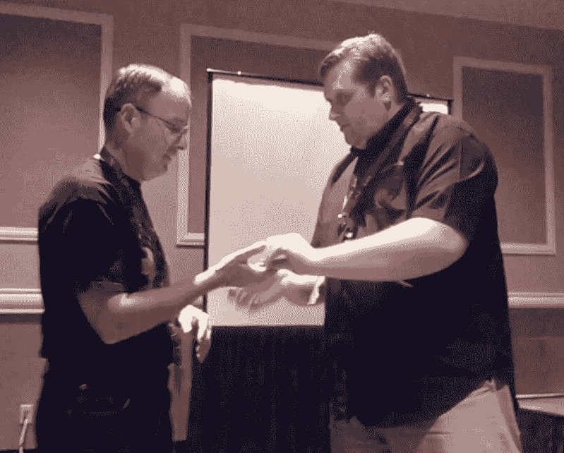
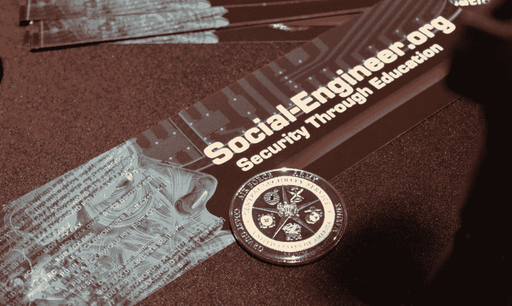
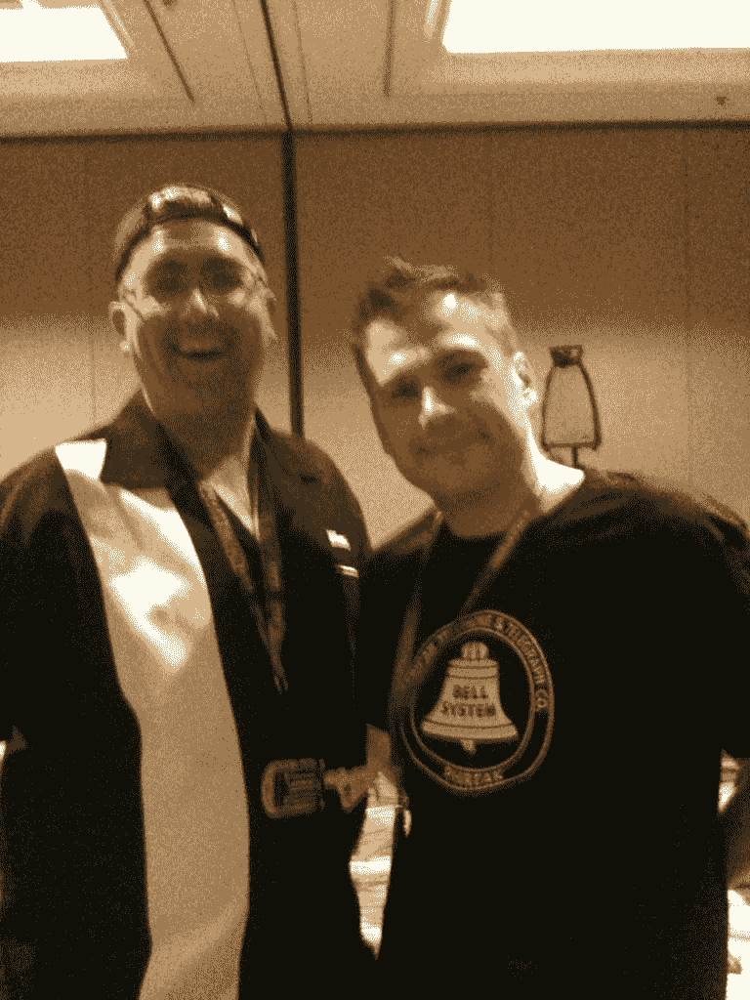
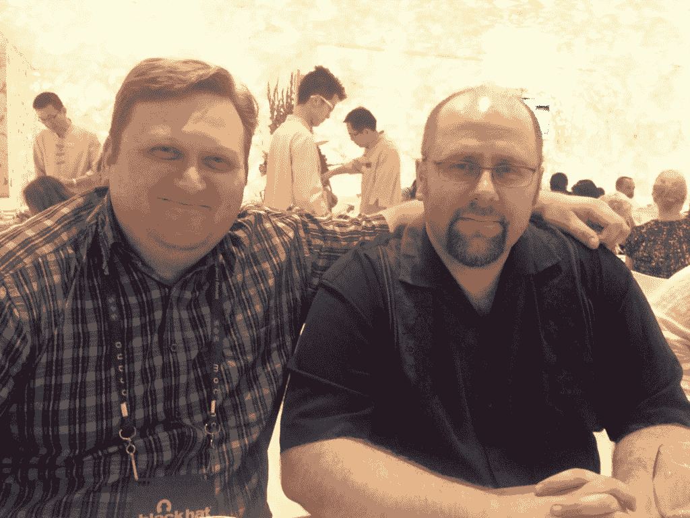
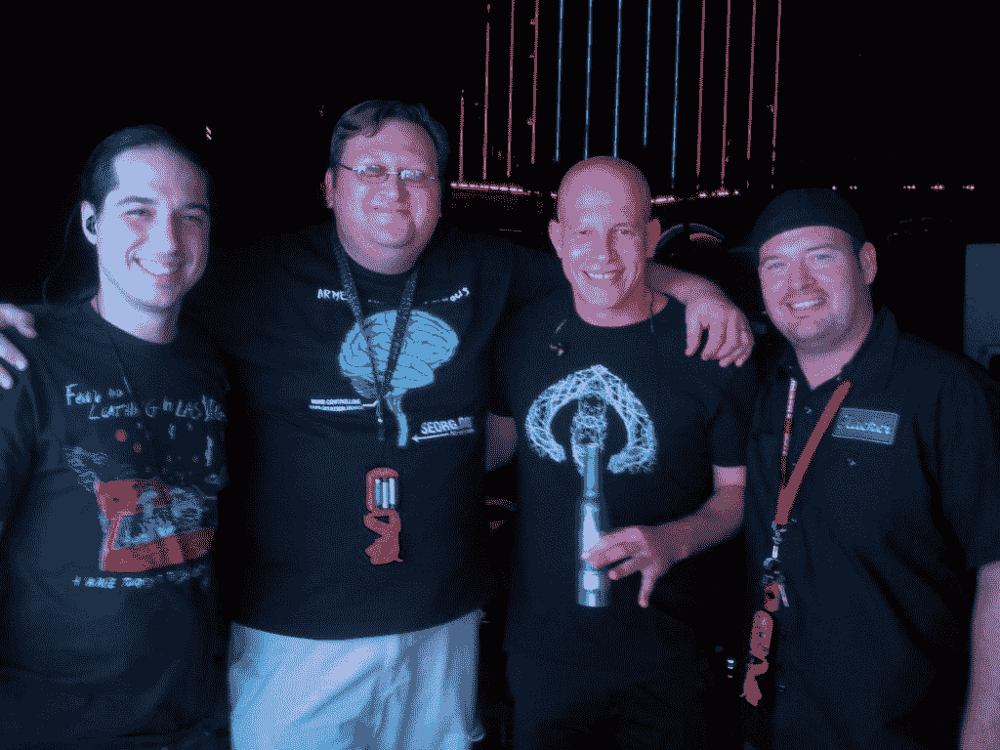
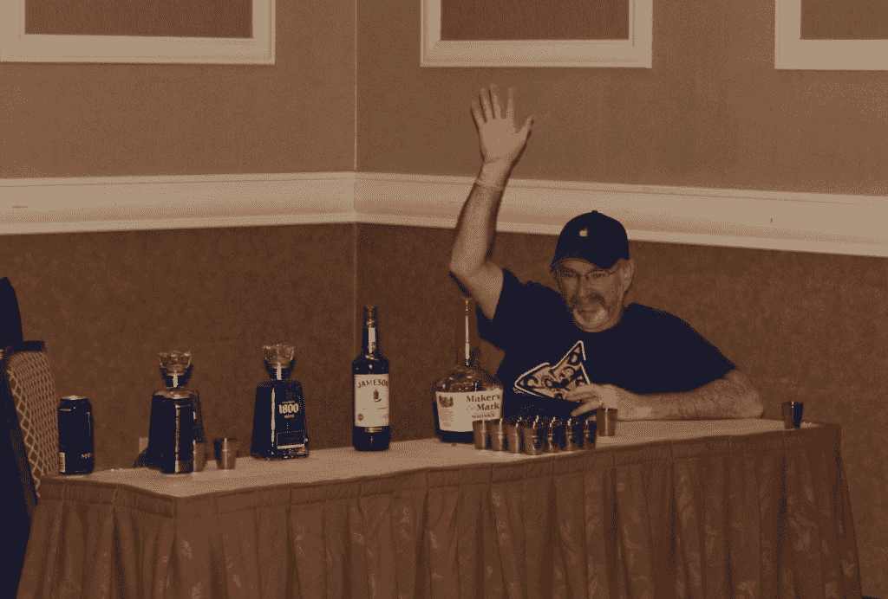
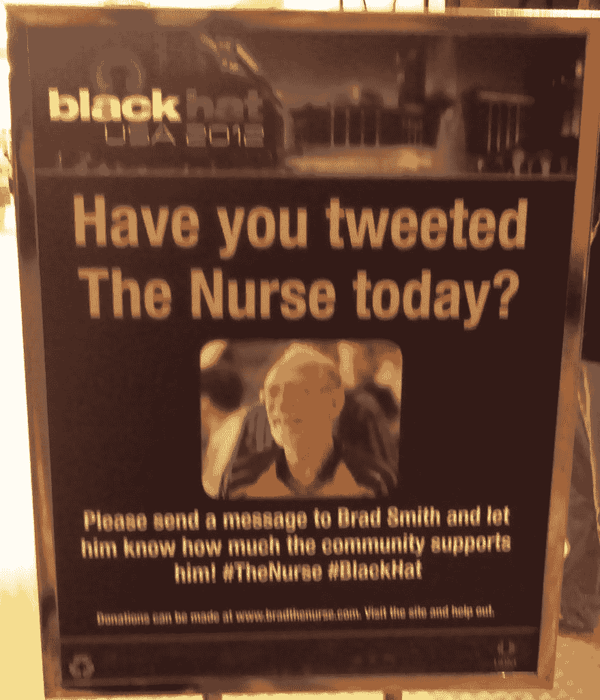

# 防御状态 20 -刚刚到底发生了什么？

> 原文：<https://www.social-engineer.org/event-updates/defcon-updates/defcon-20-what-the-heck-just-happened/>

我们将暂停我们的正常发布，仅仅给出一个大概很长的关于 Defcon 20 的事件的帖子。Defcon 20 被证明是自我们开始 social-engineer.org 之旅以来最艰难但最有意义的活动之一。

首先让我们开始一个 12 个月前的 Defcon 20… [Defcon 19](https://www.social-engineer.com/social-engineering-capture-the-flag-report "Defcon 19 SECTF Report") 刚刚结束， [Jim aka _Elwood_](https://twitter.com/_Elwood_ "_Elwood_") 和 Chris 正在讨论如何使 SECTF 变得新颖、富有挑战性和令人兴奋。他们已经开始冒险去做一些他们在过去两年中未能做到的事情——让女性参与竞争。我花了一年的时间写博客、做调查和采访，才知道 InfoSec 社区中有很多女性，只是我们不常见到她们。这带有“性别之战”的概念。

当我们今年发起比赛时，我们有超过 175 名参赛者注册，我们只需要 20 名，10 名男性和 10 名女性。我们没有得到每一个政府机构的正常可怕的媒体说，我们要掠夺他们的公司，窃取他们的数据。出奇的安静……但是以一种好的方式。我们选择了 10 名男性和 10 名女性，选择了我们的目标，开始了一场精彩的比赛。

克里斯花了 4 个月的时间为孩子们计划、测试和组织 Defcon 20 SECTF。此外，还有另一个令人惊讶的第一次——我们被黑帽学院接受培训我们的第一个社会工程班。拉斯维加斯是总结为一个惊人的事件，我们仍然有几个月了！

随着这一周的临近，克里斯应国家保险公司的邀请去俄亥俄州给他们的员工做了 5 个小时的安全意识演讲。克里斯唯一能做这个演讲的时间是在去拉斯维加斯参加黑帽的前一天。

克里斯飞往俄亥俄州，在那里花了几天时间准备演讲。与全国人民的合作非常愉快，看到一家公司如此认真地对待安全意识令人鼓舞。

但在那之后，是时候乘飞机去维加斯，准备乘坐名为黑帽和 Defcon 的过山车了。

首先，今年黑帽剧组的好话我说不够。Trey 显然做了巨大的工作，因为通用汽车和车队今年都在他们的游戏之上，并准备好摇滚。像往常一样，[平](https://twitter.com/vlkyri/ "Ping")是她光彩照人的自己，今年一切都很顺利。【T2

我们的[社会工程课](https://www.social-engineer.com/certified-training/ "Social Engineering Training")真的是另一次奇妙的经历。我们有 28 个人，来自世界各地，各行各业:一些测试员，一些安全爱好者，一些心理学爱好者，还有很多介于两者之间的人。

这个班真的摆脱了困境…学生们更加努力，做得更多，并且以惊人的程度完成了每一项任务。一个小组甚至在一夜的“功课”后，再现了 1950 年的偷拍电梯社会证明测试。

不用说，这堂课棒极了。当一周接近尾声时，学生们拿起标牌(在右边)，轮流在背面签名，然后把它作为礼物送给克里斯。

虽然黑帽周很精彩，但它不得不结束并导致了防御战。任何过去作为参赛者或观众参与 SECTF 的人都知道，我们通常在技术、网络、呼叫者等方面存在问题。我想坦率地说，今年这些都不存在。首先，我们的工作人员以闪电般的速度解决了一个小技术问题，网络问题根本不存在，我们只有 2 个来电者没有出现，这并没有影响我们的表现。

[T2】](https://www.social-engineer.org/social-engineering/defcon-20-what-the-heck-just-happened/attachment/se-ctf-femalecontestant/)

我们的船员今年刚刚在他们的 A 游戏之上。克里斯和埃里克，评委 Nick8ch，吉姆·曼利，绝地武士，米斯特克斯和酒保比利今年都支持我们。特别感谢 purehate 和 ZeroChaos 在活动开始前提供技术支持。他们每个人都震撼了全场，帮助我们推出了有史以来最成功的 SECTF。

此外，今年我们有两位演讲嘉宾——莎伦·康哈迪和凯文·米特尼克。

莎伦  康海迪关于成为一名职业社会工程师和一名女性的演讲赢得满堂喝彩。

观众(尤其是男性)对沙龙的演讲风格非常感兴趣，掌声持续了很长时间。

后来，有许多人想和即将进入这个领域的莎伦谈谈。这真的让我们很受鼓舞——把对这一领域的兴趣视为职业。

第二天，我们的第二位演讲嘉宾在午饭后就来了——凯文·米特尼克。

[T2】](https://www.social-engineer.org/social-engineering/defcon-20-what-the-heck-just-happened/attachment/kevinmitnick-sectf/)

凯文完全打包了房子，我们不得不锁上门，因为我们不能让更多的人在没有造成危险的情况下。

但凯文做了一个很棒的演讲，强调了他过去的一些故事，但重点是最近的一次攻击，以及骗取人们的信用卡号码是多么容易。

观众有很多问题要问凯文，他很有礼貌地在会后停留了一会儿，分发名片，签名售书，拍照和回答问题。

我们无法感谢莎伦和凯文，是他们让这个活动变得更加有趣。

令人兴奋的是，这是今年发生的其他事件之一，甚至还没有开始在现实中出现。在第[节开始时，克里斯的手机接到一个电话…](https://www.social-engineer.org/social-engineering-ctf-battle-of-the-sexes/ "SECTF Defcon 20")

"嘿，你能来一下 XXX 室吗国家安全局局长，亚历山大将军想要见你？"

克里斯-“嗯，我有点忙，他能来找我吗？”

嗯，你可能不明白我刚才提出的要求，请在 10 分钟内到 XXX 房间来。

克里斯收拾好机密文件，搁置了 20 分钟，然后去见国家安全局局长。当他站在这个房间里，不确定他是否会被逮捕，被告知停止或被祝贺时，他只是想他将如何处理每一件事。他很高兴看到他的 EFF 律师走进来，站在他旁边。🙂

毫无疑问，亚历山大将军走进来，握着克里斯的手说，“谢谢你教会美国的年轻人如何更好地使用像社会工程这样的技能。”

他目瞪口呆，不知道到底发生了什么，他花了一分钟整理思绪。他转向身旁的特工说，“刚才真的发生了吗？”他非常激动，问党卫军特工是否可以给将军一枚特别版的 SEORG 挑战硬币。特工检查它，以确保它不是一个爆炸装置，然后说:“当然。”

短暂的等待后，克里斯该回到比赛中了，他还没有和将军握手。他开玩笑地对代理人说，“告诉将军，欢迎他来我的办公室看我，但是我得走了……对不起”

会议继续进行，我们接了几个电话，这时一名特工走进房间说，“亚历山大将军将在 15 分钟内到达，准备房间”

[T2】](https://www.social-engineer.org/social-engineering/defcon-20-what-the-heck-just-happened/attachment/sectf-genalexanderandchris2/)

什么？？？？当这发生时，我们有史以来最年轻的选手在隔间里，我基本上告诉她，我们必须停下来，因为他很快就会进来。她的时间只剩下 2 分钟了，她对此没意见。当将军进入房间时，克里斯介绍了他，房间里爆发出热烈的掌声。他来到教室前面，问这个比赛是关于什么的，它是如何运作的。

克里斯开始向他解释所有的细节。当他到达终点时，将军问道:

“那么他们赢了什么？”

克里斯——“哦，我们有一些最酷的间谍装备要展示……呃……我指的是非间谍装备，比如没有隐藏摄像头的钢笔等等。”房间里爆发出一阵笑声，将军亲切地说，“哦，你是说测试设备？”

 尼斯救将军！

然后亚历山大将军打电话给最后一位选手，有史以来最年轻的女性选手，采访她在展台的经历。她非常出色——好像她已经为此准备多年了。比赛中人们素质的真实见证。她彬彬有礼，专业，回答完美。干得好汉娜。！

接下来克里斯向将军赠送了特别版 SEORG 挑战币。亚历山大将军愉快地接受了这枚硬币，做了一件完全出乎意料的事。当他和克里斯握手时，他给了克里斯一枚国家安全局局长的挑战硬币。据我们所知，每年只有 5-10 本这样的书被分发出去，现在它是克里斯最珍贵的财产之一。

[T2】](https://www.social-engineer.org/social-engineering/defcon-20-what-the-heck-just-happened/attachment/nsacoin1/)

整个活动开始时有点超现实，但这是一次史诗般的会议，让国家安全局局长告诉我们，我们为比赛而祝贺，为教会人们意识而祝贺，为成为改善美国的一部分而祝贺，这一切努力都是值得的。

谢谢你，亚历山大将军！

好故事不会停止。今年的 CTF 是我们有过的最好的一次。打电话的人是有准备的，借口是可靠的，技术水平是空前的高。

我们再次祝贺我们的冠军，谢恩·麦克道戈尔和亚军，JC，他们都做出了惊人的决定。

[T2】](https://www.social-engineer.org/social-engineering/defcon-20-what-the-heck-just-happened/attachment/sectf-malecontestant/)

谢恩今年打破了一些伟大的记录…得到了名单上的每一面旗帜，并且在他的第一个电话中就有一个来电者这样做了！干得好肖恩。

JC 接到了一个有趣的电话，因为他的“目标”是我的黑帽学生雇主之一的一家公司，而他就坐在观众席中！那是阿克沃德！“对不起”

另一个很棒的故事是，当送牛奶的人在电话亭里，他打电话给一家公司，假装成一个人…在他第二次以这个“人”的身份打电话后不久，这个人开始收到短信，为什么他打电话给中心，警告他们关于 Defcon。有意思？因为他坐在离防御中心 3 个房间的地方！他走进房间，看到他的销售代表坐在隔间里。[T2】](https://www.social-engineer.org/social-engineering/defcon-20-what-the-heck-just-happened/attachment/therealjoshlackey-2/)

请真正的乔希·莱基站起来好吗？

只有在防御状态下！史诗故事。

除了这些令人惊奇的乐趣之外，我们还有机会见到传奇人物 r·保罗·威尔逊。保罗和克里斯在网上成为朋友已经有一段时间了，但最终有机会聚在一起吃顿饭，分享一些故事。

保罗甚至几次来到会议室，帮助解答一些听众提出的关于冒充执法人员的合法性等问题。

感谢 Paul 让今年的 SECTF 变得更好！

[T2】](https://www.social-engineer.org/social-engineering/defcon-20-what-the-heck-just-happened/attachment/hangingwithpaulwilson/)

现在 SEORG 的全体人员都晕头转向了。我们来自法国巴黎 Nuit Du Hack 的朋友来了，我们有机会再次和他们在一起。特别感谢 Hicham，他让我们的巴黎之旅变得更加美好，并在维加斯再次给予我们帮助！

一天晚上，我们四处闲逛，看到了一张关于活跃派对的海报，其中一张海报上写着[受感染的蘑菇](https://twitter.com/infected "Infected Mushroom")正在播放…起初我们认为这是一场盛大的演唱会…我们最喜欢的乐队、朋友和播客嘉宾不可能和我们同时出现在拉斯维加斯。

这肯定是真的，不是梦。克里斯打电话给杜德夫，问我们几个人能否在演出前进去打个招呼。我们都准备好了，但是队伍总是很长，我们需要在 IM 开始之前进去。不要害怕，Nick8ch 走到保安面前，告诉他们“我们是乐队的”，他们让我们站在队伍的正前方。当我们进去的时候，他们说，“我们仍然需要你的卡。”Nick8ch 和 Chris 都交出了他们的身份证，然后就进去了。现在注意这个…埃里克是一个苍白的幽灵般的角色，当他看到太阳融化成一滩起泡的皮肤…而他是一个黑皮肤的摩洛哥人，留着浓密的黑胡子。埃里克把他的身份证递给那人，他说，“我忘带了”

埃里克思维敏捷，他说:“试试我的”，然后把他的驾照递给了保安。过了一会儿，我们都拿到了手镯，通过了安检！干得好伙计们！！

[T2】](https://www.social-engineer.org/social-engineering/defcon-20-what-the-heck-just-happened/attachment/gettingtohangwithim-copy/)

之后，我们和我们的伙伴 Duvdev 和 Erez 在舞台上，拍了一些照片，然后欣赏 IOActive 和[感染蘑菇](http://infected-mushroom.com/ "Infected Mushroom")上演的杀手秀。

这是一个深夜，但我们知道我们需要休息，因为第二天是我们的直播。该播客是为了庆祝我们的三周年纪念日，在我们的第 36 期播客中，有一个庆祝镜头和免费拍摄的眼镜，上面写着“[Social-Engineer.org # 36”。](https://www.social-engineer.org/podcast/episode-036-live-from-defcon-20-social-engineer-anniversary/ "Live From Defcon SEPodcast #36")

随着播客的结束，我们所能想到的就是今年有多棒，我们的工作人员有多棒，CTF 有多了不起，今年有多成功！

一些特别的标语和图片。

[T2】](https://www.social-engineer.org/social-engineering/defcon-20-what-the-heck-just-happened/attachment/podcastcrew/)

SEORG 播客团队(戴夫失踪了)

[T2】](https://www.social-engineer.org/social-engineering/defcon-20-what-the-heck-just-happened/attachment/sectf-seorgandmitnick/)

凯文和 SEORG 团队(克里斯“loganWHD”，尼克 8ch，凯文，乌尔巴)

[T2】](https://www.social-engineer.org/social-engineering/defcon-20-what-the-heck-just-happened/attachment/nick8ch-gettingpaidtowork/)

nick8ch 通过“工作”获得报酬

[T2】](https://www.social-engineer.org/social-engineering/defcon-20-what-the-heck-just-happened/attachment/theseorgphotographer/)

SEORG 的摄影师和臭名昭著的 MisterX

[T2】](https://www.social-engineer.org/social-engineering/defcon-20-what-the-heck-just-happened/attachment/sectf-jedi/)

绝地——帮助 SECTF 顺利运行

[T2】](https://www.social-engineer.org/social-engineering/defcon-20-what-the-heck-just-happened/attachment/sectf-jim/)

吉姆——苏格兰专家、酒杯保管员和 SECTF 助手

[T2】](https://www.social-engineer.org/social-engineering/defcon-20-what-the-heck-just-happened/attachment/sectf-drinkingwithsecurity/)

让安全快乐让每个人都快乐🙂

[T2】](https://www.social-engineer.org/social-engineering/defcon-20-what-the-heck-just-happened/attachment/sectf-billythebartender-2/)

比利-疯狂 SE 技能，疯狂调酒技能和 SECTF 的官方存储单元🙂

[T2】](https://www.social-engineer.org/social-engineering/defcon-20-what-the-heck-just-happened/attachment/security/)

这个部门的安全措施太差了

[T2】](https://www.social-engineer.org/social-engineering/defcon-20-what-the-heck-just-happened/attachment/seorgssmallestfan/)

这可能是 SEORG 最小的粉丝吗？

[T2】](https://www.social-engineer.org/social-engineering/defcon-20-what-the-heck-just-happened/attachment/hichamandthetom/)

Hicham 是怎么用 Eric 的 id 的？

[T2】](https://www.social-engineer.org/social-engineering/defcon-20-what-the-heck-just-happened/attachment/thenurse/)

虽然错过了…但从未错过。我们爱你布拉德。

感谢所有让今年真正成功的人。今年我们非常想念马体和吉姆，但很高兴我们能做到这一点！

直到明年！！等不及了…..