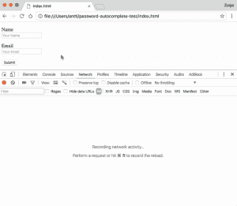
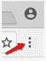
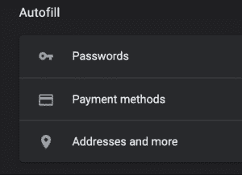

# 为什么应该禁用浏览器的自动填充功能

> 原文：<https://www.social-engineer.com/disable-autofill-browsers/>

完成网上订单 。 填林 克出另一张登记表。 这些只是一些在线任务，我们很乐意让自动填充为我们完成信息。为什么要禁用浏览器的自动填充功能？最近，web 开发人员vil jamiKuosmanen发现了一个漏洞，该漏洞可以通过网络钓鱼将您存储的数据暴露给恶意用户。 在这种攻击中，会发送一封钓鱼邮件，要求目标填写网页上的表格。一旦目标填写了其中一个(可见)字段，浏览器就会自动填充页面上的 multip le 不可见字段( 从存储的自动填充数据 ) )。T30
T32】T33】

以上是 的一个例子，你也可以在一个 [测试页面上自己测试一下。](https://anttiviljami.github.io/browser-autofill-phishing/) 有了这个，就有可能让攻击者获得你的地址、信用卡信息和其他敏感数据。 据 福布斯 密码保管员介绍，Last Pass 也容易受到 这个 漏洞的影响，可能会导致你在不知不觉中放弃自己的密码。

### 防范攻击

最可靠的方法之一是关闭浏览器的自动填充功能 。它的 很容易做到， 和 如果你正在使用 Chrome 你只需按照以下步骤:  

*   打开 Chrome，点击右上角的设置按钮。
*   在底部，单击显示高级设置。
*   在“密码和表单”下，取消选中“启用自动填充，只需一次点击即可填写 web 表单”
*   点击管理自动填充设置，并删除任何已经存储的数据。

如果您希望保护您的企业环境免受此类威胁，您需要教育您的用户不要点击和报告可疑电子邮件。 网络钓鱼邮件使用多种多样的策略，让员工了解这些策略将有助于他们防范攻击。 [【网络钓鱼即服务】(PHaaS)](https://www.social-engineer.com/services/phishing-as-a-service-phaas/)can为员工提供持续的测试和培训，帮助他们发现网络钓鱼邮件，并知道如何安全地与之互动。这是一项经过验证的措施，企业已经看到 点击率降低，报告增加， 网络上的恶意软件数量显著下降 。

请记住，如果电子邮件要求您访问网站或提交信息，您应该始终手动导航到已知的可信网站(如您的银行)登录并输入信息。不要点击可疑的电子邮件链接或下载来自未知发件人的附件，如果您继续使用浏览器的自动填充功能，请保持警惕。

*来源:
【https://github.com/anttiviljami/browser-autofill-phishing】T2*

[https://www . Forbes . com/sites/leemathews/2017/01/10/this-simple-phishing-attack-tricks-you-into-leaking-browser-auto fill-data/](https://www.forbes.com/sites/leemathews/2017/01/10/this-simple-phishing-attack-tricks-you-into-leaking-browser-autofill-data/)