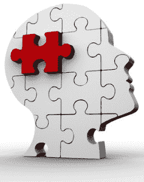

# 情绪和动机

> 原文：<https://www.social-engineer.com/emotions-motivations/>

社会工程领域主要研究人类动机。为了影响人们的行为和感受，熟悉一些这方面的基本理论和研究是有用的。因为动机是一个很大的话题，我们在这个博客中只强调一些简单的想法和研究。

情绪在一个人动机的形成中起着很大的作用。当被研究人员询问时，受试者在阳光明媚时对他们的生活有更积极的看法，而在下雨时则有更消极的看法。像天气这样简单的事情足以影响观点，晴天或雨天的不同可以改变一个人对他或她的生活的看法。这种影响显然是暂时的，但人们当时的感受会影响他们当时的思维和行为。
T3】

研究人员向我们展示了好的或坏的情绪会影响人们是否认为他们更有可能或更不可能获胜。我们的情绪为我们指明了方向，当我们感觉良好时，我们更有可能认为我们可以成功。坏心情会让我们认为自己没那么幸运。

积极和消极的情绪也影响着人们是否相信好事或坏事会发生在他们身上。研究参与者在看到积极的新闻文章后会[高估愉快事件的可能性](https://psycnet.apa.org/index.cfm?fa=buy.optionToBuy&id=1984-06740-001)并减少对风险的警惕。相反，给受试者看包含致命和非致命事故的负面文章可能会高估负面事件的发生频率，并感觉到风险感增加。

你越关注人们的感受，你需要处理的信息就越多。创造聪明的借口和风度翩翩肯定会在社会工程领域有所帮助，但不要忘记关注简单的细节，如一个人的情绪以及这对你意味着什么。

这个话题与克里斯·哈德纳吉的新书《揭露社会工程师:安全的人性一面》非常契合。