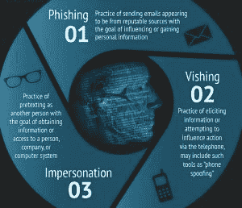

# 社会工程日益增长的威胁…你的团队准备好了吗？

> 原文：<https://www.social-engineer.com/growing-threat-social-engineering-poses-organizations-team-equipped/>

在过去的一周，FireEye 发布了其“ [Hacking the Street](https://www.fireeye.com/current-threats/threat-intelligence-reports/rpt-fin4.html) ”报告，表明一群高度老练的攻击者利用社交工程而不是恶意软件或其他技术攻击载体来利用华尔街。这个名为 FIN4 的组织通过收集信息发起攻击。据报道，他们联系了一系列公开交易的制药、医疗保健和生物技术组织，学习华尔街的术语。然后，该组织使用并购行话，向金融服务行业的专业人士发送极具说服力的网络钓鱼电子邮件，让他们相信电子邮件的合法性。电子邮件中充满了 Visual Basic 应用程序(VBA)宏，用来获取关键个人的用户名和密码。这一事件揭示了越来越多的没有先进技术手段策划的攻击，但更重要的是，展示了社会工程学的一个深刻方面:使用*正确*术语的能力。

使用“正确的”术语意味着什么？社会工程师使用社会证据作为建立可信度的一种方式。他们需要让目标相信他们是内部人员，是部落的一员。不管是什么组织、部门或行业，请放心，每一个人都有自己独特的语言。通过使用某些术语、短语、委婉语和首字母缩写词，社会工程师可以与目标公司的员工建立信任。如果攻击者发送一封请求技术升级信息的电子邮件，并正确引用公司内部网的内部名称，则员工很可能会认为该电子邮件是真实的。如果是视觉攻击，正确的术语加上融洽的关系可能会导致目标无意中泄露信息。

社会工程师一定是变色龙。他们必须适应他们试图渗透的文化；他们必须像普通员工一样思考、行动、走路和说话。随着时间的推移，最好的社会工程师收集、分享和存储信息，与不同的人交谈，并填补拼图的碎片。在信息收集阶段，目标不一定要披露公司的商业秘密。攻击者可以打电话给五个不同的部门，进行五次不同的对话，并拥有五条不同的信息来帮助验证他们何时想要获得员工 ID 或访问网络凭据。我想到的一个很好的例子来自电影《如果你能抓住我就抓住我》。有一个场景是莱昂纳多·迪卡普里奥扮演的弗兰克·阿巴内尔决定成为一名律师。他观察一个关于审判的电视节目，听到诸如“委托人”、“反对”、“陪审团”和“指控”等词语。在他与法官的第一次对抗中，他背诵了他在电影中看到的相同的演讲，但他没有在听证会的正确部分使用它们，在没有陪审团在场的情况下错误地对陪审团讲话。

假设您的组织将员工 ID 号称为“V”号，这是经过验证的员工身份的缩写。如果我给你的公司打电话或者从“公司”人力资源部发电子邮件，要求核实你的员工 ID，很可能会亮起红灯，因为你从来没有听说过这个术语。但假设我打电话，核实一些额外的公开信息，然后问你的“V”号码？你向我提供这些信息的机会要大得多，因为我已经确认了我的合法性。文字是强大的，以“正确”的方式使用它们会有很大的回报(如果你是一名社会工程师),或者如果你的组织是基于社会工程的攻击的目标，会有很大的反响。

看看 FIN4，毫不奇怪他们已经有效地运行了一年多。他们很可能作为一个团队工作，缓慢而稳定地联系不同的个人以收集信息，并花时间为他们想要有价值的信息制定一个铁一般的借口。

不幸的是，这些攻击非常成功，而且呈上升趋势。是时候问自己一些棘手的问题了:你的员工是否有足够的能力来应对假装成内部人员的局外人？员工知道报告可疑活动的适当协议吗？您的组织是否有在提供任何信息之前验证外部呼叫者的流程？你有安全意识计划吗？如果这些问题的答案是“不”，我们可以提供帮助。Social-Engineer 可以通过电话、电子邮件和亲自进行模拟内部攻击，评估您的组织对社会工程和网络钓鱼攻击的整体易感性。我们还可以进行全面的虚拟边界评估，或根据公开信息(如社交媒体)确定易受攻击的区域，以确定基准，然后通过持续的企业培训和认知计划来改善您组织的安全状况。老练的攻击者正在利用社会工程攻击所有行业，而不仅仅是银行和金融。是时候让您和您的员工成为保护信息资产完整性的防御机制的一部分了。

有关 Social-Engineer 提供的安全测试和培训服务的更多信息，请访问我们的[服务页面](https://www.social-engineer.com/services/)或发送电子邮件[【电子邮件保护】](/cdn-cgi/l/email-protection)