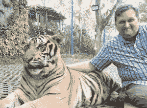
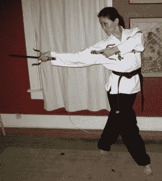
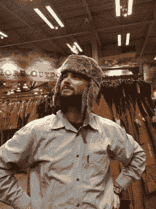
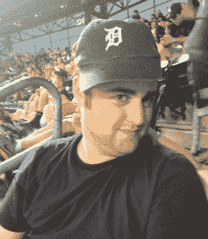
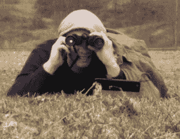
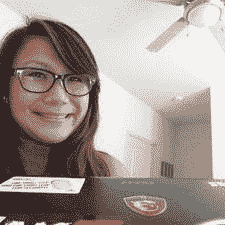
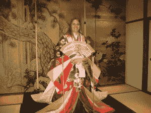

# 我们在这里再次成长.....

> 原文：<https://www.social-engineer.com/here-we-grow-again/>

在这里，我们再次成长…社会工程师团队

许多年前，当我开始独自在荒野中冒险时，我有一个想法……一个疯狂的想法。一个只专注于社会工程测试和服务的公司能成功吗？尤其是在 SE 还不是热门“卖点”的时候？

现在是第六年，社会工程师团队已经从只有我一个人发展到现在的 12 个人。很多人问我们公司有哪些人和什么样的人才，那么让我们来介绍一下这个团队。

我们的管理团队是:

 **哈达尼。** Chris 是 Social-Engineer，LLC 的首席执行官兼创始人。他一开始把 SE 作为一种爱好，并由此产生了 SE 框架、SEPodcast、SENewsletter 和博客，所有这些都是在 Social-Engineer.Org 完成的。这本书，社会工程:人类黑客的艺术，以及这家公司。后来，克里斯又写了两本书。和他的朋友兼导师保罗·艾克曼博士一起揭开这位社会工程师的面纱。然后钓鱼黑暗水域，与他的朋友和右手，米歇尔芬奇。Chris 是 OSCP 和 OSWP 的成员，也通过了核心小组的“物理渗透测试”认证。 

 **米歇尔·芬奇。**米歇尔是首席运营官的首席运营官，也是 Social-Engineer，LLC 的得力助手。她是前美国空军学院助理教授，野外训练治疗师，全能忍者(不开玩笑，你看到图片了吗？).她拥有人因工程学士学位、咨询硕士学位、CISSP、核心小组的“物理渗透测试”认证，以及一些令人惊叹的 SE 天赋。她也是 APSE 和 MLSE 的合作教练。

 **西山丽一行。** Kaz 是首席行政官(CAO ),最近加入了帮助组织、规划和保持我们理智的团队。Kaz 来自一个完全不同的行业，但已经很好地融入了 SE 的世界。作为 APSE 班的毕业生，他正在展示他喜欢社会工程。Kaz 拥有电气工程技术学士学位，他为公司带来了我们迫切需要的组织水平。

我们的核心团队不断壮大，所以让我们来介绍他们(按字母顺序)。

 **布莱恩·奥斯丁**。布莱恩是一个狂热的制造者……他喜欢把东西拆开，弄清楚它们是如何工作的，无论是漏洞、硬件黑客还是人(当然不是真的把 * 它们 * 拆开)。布莱恩是一个顾家的男人，非常渴望学习。他帮助进行网络钓鱼，是一个了不起的黑客，也是我们的常驻硬件黑客。Bryan 拥有多项技术证书，是 APSE 的毕业生。

 **凯伦 X** 。凯伦是我们的黑马。没有人知道她是真实的还是克里斯想象出来的，但是很多工作都归功于她。她亲自负责让我们的 SE 框架看起来更专业，并帮助我们管理社交媒体。

**丹福克**。丹是我们的高级网络分析师。说他真的很了不起是轻描淡写。丹更像是网络超人。不要被他孩子气的外表所迷惑，他是我们的技术保持活力和工作的原因。Dan 拥有信息保障硕士学位，有蓝队历史，是 APSE 的毕业生。

 **科林·哈吉**。科林是我们的住户之一。那只是说科林是个职业爬虫的一种花哨说法。他挖掘目标的丑闻，是一个伟大的观察者，并帮助我们管理众多身份的社交媒体资料。Colin 是 APSE 的毕业生，也通过了核心小组的“物理渗透测试”认证。

 **麦克纳吉**。迈克是钓鱼高手；职业钓鱼者。他帮助编写、创建和加载所有网络钓鱼活动。此外，他还帮助我们瞄准目标，在我们的许多班级里，他都是我们的全能地鼠。迈克是一个真正的团队成员，帮助我们保持积极的心态。Mike 是 APSE 的毕业生，也通过了核心小组的“物理渗透测试”认证。

 **李夏苏**。夏天是加入我们家庭的最新成员之一。Summer 是我们的首席网络测试员，但是在热爱黑客的背后是一个真正伟大的社会工程师。夏天是一个明星 visher，帮助与网络钓鱼，利用作家，并将协助在一些类。此外，她还是 AFA 网络爱国者计划的导师和各种地区大学网络防御(CCDC)竞赛的志愿者。夏天很快就要从 APSE 毕业了。 她主修计算机取证&计算机网络，还拥有 IT 系统安全学士学位。

**阿曼达·马楚克**。阿曼达是我的第一个员工。她从一开始就在我身边，陪着我们经历了所有的起起落落。阿曼达是正式的唠叨者、组织者和计划者。她在社交媒体、组织时事通讯、规划我们的课程等方面提供帮助。她惊人的工作为她赢得了“Orginagger”的称号，她自豪地戴着这个称号。

 **汉娜·西尔弗**。Hannah 第一次被介绍给我们是作为有史以来最年轻的人参加 DEF CON 20 的比赛。这只是意味着之后，她会加入我们的团队。汉娜目前在大学学习科技写作，她来找我们帮助完善我们的报告。除此之外，她是一个令人惊讶的 visher。这一定是她的南方魅力。随着汉娜在大学期间工作并最终全职加入我们的行列，这些才能也在不断增长。汉娜正在攻读英语文学学士学位，不久将从 APSE 毕业。

 **劳里·瓦尔纳**。Laurie 还参加了 DEF CON 21 的 SECTF 比赛，在那里我们第一次了解到她惊人的 SE 能力。她在竞争激烈的一年中获得了第二名。现在，她将这些才能用于一个女性呼叫中心。她比我见过的任何人都更有远见，而且她不仅仅关注数字——她有成功和天赋来支撑它。除此之外，Laurie 还是一个出色的组织者，一个社会工程师的发言人，一个狂热的钓鱼者(真正会游泳的人)和冲浪者(在现实生活中，不仅仅是网游者)。)Laurie 拥有信息保障硕士学位，是 APSE 的毕业生。

现在你已经见过了这个团队，我们期待着与你合作并了解你。我们在不断成长，所以我确信我们会很快加入这个名单。

作为一家公司，Social-Engineer 很自豪能在技术和安全领域(我差点说是“网络”)雇佣这么多有才华和敬业的男女员工。

感谢你加入我们的旅程。

下次见。