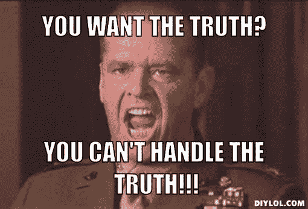

# 隐性偏见——很有可能，你就有一个

> 原文：<https://www.social-engineer.org/social-engineering/implicit-bias-chances-one/>

这是一首老歌，但很好听。一个男人和他的儿子遭遇了一场严重的车祸，两人都被送进了急诊室，失去了知觉。男孩被立即推进手术室。外科医生看了他一眼，说，“我不能给这个孩子做手术，他是我的儿子。”外科医生是谁？

当你决定了答案，要么沾沾自喜地恭喜自己，要么拍拍自己的额头继续。答错了(提示:母亲)即使你是女性，或者是女性平等的伟大信徒，也不代表你是坏人。它只是表明你在两个概念之间有一种无意识的联系，在这种情况下，男性和外科医生，在你脑海的某个地方浮动。这种联系会导致思维和行为的错误，被称为隐性偏见。它们来自许多不同的来源，包括我们的生活经历和教育。在许多情况下，它们可能与我们有意识地相信和报道的完全相反。

这对社会工程师很重要，因为我们的隐性偏见会影响我们待人接物和看待事物的方式。这些反应可以在我们没有意识到的情况下偷偷溜走。然而，我们的目标不是消除它们——那是不可能的。这只是为了让你更好地控制自己的行为和对待他人的方式。

如果你有兴趣了解更多，请查看网站[项目隐式](https://implicit.harvard.edu/implicit/)。他们有一些测试来衡量你有多快将某些品质与不同的人群联系起来。发现你把“好的”描述词和白人、年轻人或瘦人联系在一起，这让人很不舒服。但是想想理解这一点对你自己的重要性，以及这反过来如何能使你成为一个更好的社会工程师和更有意识的人。