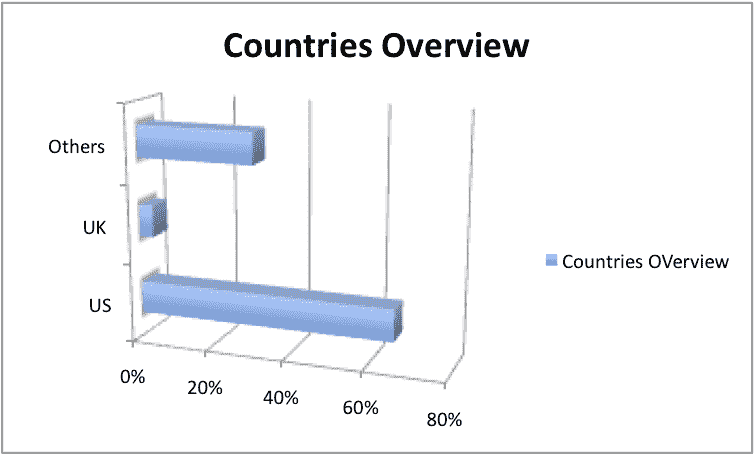
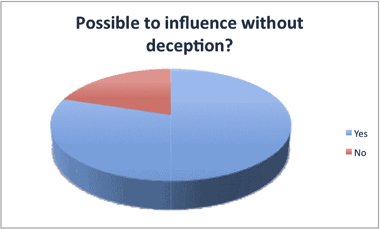

# 没有欺骗的影响-可能吗？

> 原文：<https://www.social-engineer.org/social-engineering/influence-with-out-deception-possible/>

在过去的几个月里，我们在网站上进行了一项调查，要求我们的访问者告诉我们，他们是否认为不使用欺骗手段也能影响一个人。这个问题没有看起来那么简单。

就在几个月前，我们问了一个类似的问题，“社会工程总是包含欺骗吗？答案是一个响亮的“是”。超过 60%的被调查者认为社会工程和欺骗是密切相关的。事情并没有就此结束……我们的常驻小丑戴夫·肯尼迪决定和我们讨论一下他是如何认为社会工程中不需要欺骗的。

虽然他不断输掉这场战斗，但他决定在 Shmoo Con 上与[约翰尼·龙](http://www.hackersforcharity.org/ "Hackers For Charity")和[双核](http://www.dualcoremusic.com "Dual Core")联手进行一场辩论，这使问题发生了很大变化。他们提出了这样一个问题，“在不使用欺骗手段的情况下，有没有可能影响某人采取不符合他们最大利益的行动？”

这个问题确实改变了游戏。而不是把所有的社会工程归为一类；这个问题问的是，是否有可能让某人做一些对他们并不真正有益的事情，而不必使用欺骗手段。

让我们来看看人们想出的一些想法，通过例子来证明这是可能的:

*   如果你影响某人做你知道不符合他们最大利益的事情，这可能是不同的，但即使在这种情况下，我怀疑你可以影响他们去做，即使直接告诉他们这不符合他们的最大利益，但会，例如，为了更大的利益。
*   当我报名参加我感兴趣的课程时，我通常会和老师交朋友，有时我这样做是因为我被允许跳过迟交的作业，在我应该只有部分或没有学分的时候得到满分。我不需要撒谎，也不需要编辑任何东西，我只是诚实地上交，解释我意识到已经晚了，并给一个真诚的道歉。我的作业没有不及格或被扣分，而是被接受了。老师很清楚，如果他们的部门发现他们可能会被指责偏袒，或受到严厉批评。
*   内疚和同辈人的压力是不使用欺骗就能做到这一点的常见方式。当然，这需要在这个向量工作之前建立某种关系。
*   如果这是为了其他人的最佳利益，你可以让他们相信其他人更重要
*   答案其实取决于你如何定义他们的最大利益。他冒着生命危险去救一个陌生人是为了自己的最大利益吗？这位爱国者心甘情愿为国捐躯？
*   对 se 来说，欺骗是认知上的，所以如果我真的不知道任何更好的东西，那就不是欺骗
*   如果人们认为他们将在法律上或财政上对某事负责，他们通常不会为了他们的最大利益而行动，而是出于恐惧。
*   在我们的社会中，大众缺乏批判性思考的能力。他们连续几个小时盯着电视屏幕。他们已经学会依靠自己思维过程之外的东西来形成自己的观点、价值观和生活方式。美国到处都是玩“猴子看猴子做”的大孩子，只要在 youtube 上看看人们模仿“蠢驴”节目的视频就知道了。需要更多的证据吗？我们是否处于人工逆向进化的状态？我想是的！
*   如果你满足了他们的吸毒习惯或勒索他们，他们完全知道他们在做什么，但还是会去做
*   露出你的胸部

最受欢迎的答案是:

*   如果你能让他们相信这是为了更大的利益。

这是多少人的真实想法吗？让我们先来看看。这项调查主要覆盖美国，但让我们来看看我们的选民来自哪里的统计数据:

“其他”类别包括伯利兹、奥地利、菲律宾、沙特阿拉伯、印度、巴西、西班牙和希腊等国家，以及大约 15 个其他国家。这成千上万的投票是如何统计的？

是的，看起来现在 80%的投票者认为，如果不使用欺骗手段，很有可能，甚至很有可能影响某人采取不符合他们最大利益的行动。实话告诉你，玩笑归玩笑，这个答案是 80/20 分是有道理的。我们可以想到很多不使用欺骗就能影响他人的方法。

这是一个伟大的调查，我们让它进行了几个月，只是为了确保我们有确凿的证据去这样或那样。我们期待着许多调查。如果您有一个您希望作为调查的想法，请发送电子邮件至[【电子邮件保护】](/cdn-cgi/l/email-protection)

谢谢，下次再见。