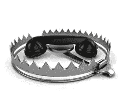

# 我们去看看吧

> 原文：<https://www.social-engineer.org/general-blog/lets-go-vishing/>

通过电话获取信息是一种常见的社交攻击媒介。事实证明，这是获取破坏组织所需信息的最成功的方法之一，即使是由没有经验的攻击者使用。当您无法通过 pentest 时，当您无法与您的红队合作时，当您的网络钓鱼被阻止或忽略时…只需打电话给某人，获取您需要的信息。

现在的问题是，我们如何成功？让我们回顾一下有助于成功视觉的五个简单要点。

对于我们的第一点，让我们看看孙子经常被引用的一句话，“据说如果你了解你的敌人和了解你自己，你就不会在一百场战斗中陷入危险……”这是一句常见的陈词滥调，但在这种情况下非常正确。事先尽可能多地了解你的目标是关键。每一个小信息都可以在你的参与中保持价值。在通话过程中，收集、分类并准备好您的信息。

其次，你的借口对一次成功的约会至关重要。有很多文章都在阐述一个好的借口，比如在我们的框架中的[借口部分](https://www.social-engineer.org/framework/influencing-others/pretexting/successful-pretexting/)中找到的那篇文章。这篇文章可能会帮助你理解一些需要记住的基础知识。例如，确保你选择的任何借口都与你给人的印象相符。如果你是一个年轻的男性，在电话中扮演某人的祖母是非常困难的，虽然使用其他媒介是可能的，甚至作为一个借口非常成功，但这很可能不是最适合你的。此外，最好有一个你觉得舒服的借口，如果不是你熟悉的借口的话。最好的情况是要么在你的借口领域有经验，要么让借口适合你的个性或技能。这会让你更充分地接受它，更可信地执行它。一旦你心中有了借口，就成为借口，像借口一样行动，在整个过程中像借口一样说话。

我们的第三个话题集中在另一个影响原则上，[承诺和一致性](https://www.social-engineer.org/framework/influencing-others/influence-tactics/commitment-consistency/)。一旦我们成为那个人，无论成功还是失败，我们都会保持那个人。我们打破角色的那一刻，就是我们的目标心中升起红旗的时候。他们不知道我们不是我们所说的那个人，他们通常也不知道他们所掌握的信息的价值。这使我们能够将注意力从安全意识上转移开，并成功地成为他们信任的人。不管他们问什么，扔什么，对我们说什么，我们都保持自己的个性。

我们视觉拼图的第四块是灵活性。有时，我们的信息不足，或者我们的借口受到质疑，即使是最坚定的攻击者最终也会在目标的脑海中升起一些旗帜。我们需要灵活，同时能够保持个性而不失去冷静，像借口一样行动和回应。我们的目标是有无限多样性和混乱能力的人类。事情发生了，我们必须适应。

我们最后的，也许是这个过程中最重要的部分，是文档。好的文档和笔记是关键。如果可能的话，在通话过程中以实物、数字或音频的形式做笔记。在一次成功的攻击(或者特别是一次不成功的攻击)之后，笔记对于回顾是非常有价值的。文档可以为未来的攻击提供关键信息，或者提供我们成功或失败的提示。

让我们回顾一下视觉成功的五个要素:

1.  知识就是力量，所以在你拿起电话之前，尽可能多地获取知识。
2.  一个可信且合适的借口，让*你*能够成功。
3.  坚持你的借口，承诺，并保持一致。
4.  要灵活。适应而不破坏性格。
5.  文档。认真对待。

这五个方面会让你成为一名成功的职业指导，甚至会让你在经历次“失败”后依然成功如果你遵循这些原则，你会发现自己正在成长为一名熟练的维舍曼。所以，“下次见…”去找了。”