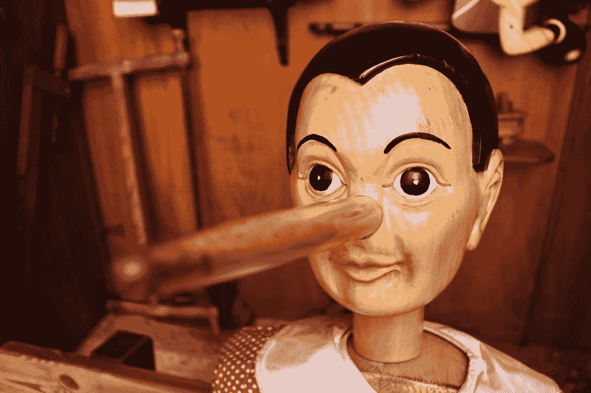

# 骗子，骗子你的手着火了....？

> 原文：<https://www.social-engineer.org/social-engineering/liar-liar-your-hands-are-on-fire/>

对于社会工程师来说，最热门的话题之一可能是如何检测谁在说谎，以及如何提高他们愚弄目标的能力。今天我们挑选了两篇文章来简单讨论一下这个话题。

第一份存档在[社会工程师档案](https://www.social-engineer.org/wiki/archives/BlogPosts/CatchALiar.html)中。这是一篇非常有趣的文章，它基于一项新的研究，这项研究可能指出了一个人描绘事件的方式和事件的真实性之间的联系。在一些令人惊讶的统计数据中，“描绘代理人”的结果能够识别 80%的说真话者和 87%的说谎者——这一结果优于大多数传统的面试技术。

它是如何工作的？他们确定一个人记忆事件的方式与他们描绘事件的“角度”有关。在场的人，说真话的人，会用肩扛摄像机的角度来画。而说谎者会遗漏很多细节，甚至把自己置身事外。

这和社会工程有什么关系？

就其本身而言，没什么。我们没有做过太多让目标为我们画一幅画的约定。那么我们如何利用这些信息呢？

我们的第二篇文章…实际上是一个视频。这是一个做得很好的视频，概述了检测谎言的 9 个部分。我们发现有趣的是，这些与绘画研究中的一些研究有多么紧密的联系。看一看:

#### 第一步:观察他们的手

研究表明，大多数人撒谎时都会“说”出来。过度摸脸或挠鼻子可能是说谎的一个很好的迹象。

#### 第二步:[跟着他们的眼睛走](https://www.social-engineer.org/tactics/the-truth-about-eye-contact-and-detecting-deception/)

眨眼——另一个想法是，一个经常眨眼的人可能在撒谎。现在，我们不会 100%地给这种想法开处方。有些人天生没有很好的眼神交流，所以这一点并不总是 100%确定的。然而，与其他一些混合在一起，它可以指向一个谎言。

#### 第三步:注意他们的话语

注意他们的话。说谎者会省略缩写——说“我没有”而不是“我没有”——并且避免代词，使用某人的全名而不是“他”或“她”

#### 第四步:检查他们的微笑

真实的微笑对虚假的微笑。假笑只是用嘴。真正的微笑来自眼睛、脸颊和整张脸。一个假笑的人在其他地方也可能是虚伪的表现。

#### 注意他们的姿势

注意他们的姿势。说谎者倾向于保持封闭的身体姿势(例如，双臂交叉)。再说一次，我们不会 100%地这样规定，但当与其他人混合时，这可能是谎言的迹象。

#### 第六步:回应前暂停

响应前暂停片刻；如果沉默让他们不舒服，他们可能在撒谎。当然，如果有人天生迟钝，那就不要算了。但是，如果看起来这个人正在停下来思考自然问题或故事的答案，这可能是一个很好的迹象。

#### 第七步:注意细节

注意细节。如果他们提供了不必要的信息，这是一个不好的迹象。人们在编故事时往往会过于具体。

#### 第八步:改变话题

换个话题。对话刚刚结束还是他们想快速改变？注意，看看这是否表明不真实。更好的是，你可以试着改变话题。他们看起来如释重负吗？可能是一种暗示。

有了所有这些步骤，就有了很多“可能”……我们将这些与阅读面部表情结合起来，你也许能更容易地发现说谎者。

我们要说，以此为起点的一个关键是，在证明无辜之前，不要试图将每个人都视为有罪。请注意细节，你会对你所看到的感到惊讶。

查看视频:

[https://www.youtube.com/embed/tW8KYtvAsrw](https://www.youtube.com/embed/tW8KYtvAsrw)
敬请关注更多即将到来的文章。

感谢 rAWjAW 向我们提交这些文章。