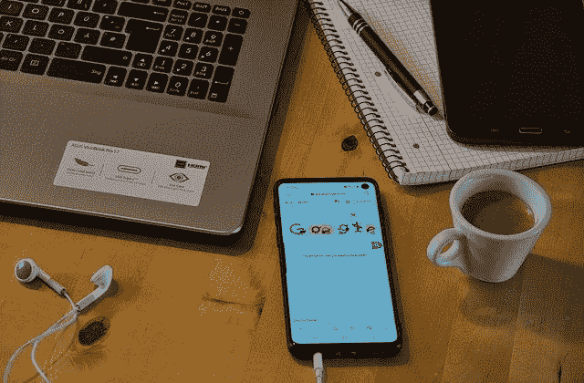

# 在家管理您的钓鱼防御

> 原文：<https://www.social-engineer.com/managing-your-vishing-defenses-at-home/>

在社会工程有限责任公司(SECOM)的过去 6 年里，我们给世界各地的公司打了 45000 多个电话。银行、创业公司、科技公司、制药公司、国防承包商和许多其他组织都与我们签约，让我们为他们做语音钓鱼电话。当我们给这些组织打电话测试他们的员工时，我们的目标是找出他们的防御在哪里很强，他们需要在哪里设防。现在，许多员工在家工作。这是一个完美的时间来回顾如何在家管理你的视觉防御。

在 SECOM，我们习惯于在家办公，但也有客户不习惯。他们处在一个新的环境中，[面临着新的挑战和利益](https://www.social-engineer.org/newsletter/working-remotely-cybersecurity-tips-to-work-from-home-safely/)。这将迫使他们以新的方式探索和处理事情。依靠监控软件和附近管理人员来捕捉不良电话和对话的公司可能会发现很难跟上来自世界各地的攻击。没有对员工进行最新培训的公司更容易成为受害者。这些攻击让他们的员工不知所措，甚至直接进入了他们的家中。

### **T2】**

## 渔业的进步和影响

克里斯·哈德纳吉(Chris Hadnagy)的突破性著作《社会工程，人类黑客的艺术》(Social Engineering，The Art of Human Hacking)于 2010 年出版，书中详细介绍了许多坏演员的常用策略和技术。时代变了，克里斯会告诉你去读他新更新的书， [*社会工程:人类黑客的科学*，](https://www.amazon.com/gp/product/111943338X/ref=as_li_tl?ie=UTF8&camp=1789&creative=9325&creativeASIN=111943338X&linkCode=as2&tag=socialenginee-20&linkId=2c732e1be0414eca5f512f2e9691d369)取而代之。虽然 Hadnagy 所写的原理可能是相似的，但我们今天看到的方法在不断适应。针对员工的攻击可能会损害他们的机器，泄露公司数据以及如何远程访问这些数据。在家工作的员工也有个人风险。被入侵的机器可能会给攻击者提供他们家的位置、他们个人网络上的设备列表等等。新闻报道已经详细描述了攻击者如何使用基于语音邮件的攻击，已经攻击了超过 100，000 个在家工作的目标。

这些报告显示，最危险的攻击之一就是一个简单的电话。它是有效的、个性化的，并且在方法上非常灵活。但是，随着攻击的不断发展和变化，您如何保护您的员工免受恶意攻击呢？

## 应用的防御技术

应用防御技术将使你的员工能够识别和避免攻击。以下是我们推荐的六种。

### 1.政策

应该教导员工应该共享哪些信息以及与谁共享。否则，他们将无法正常工作，也无法保护自己和公司。通过制定政策，你给了你的员工一条出路。如果公司政策不允许共享某些信息，员工可以说不，而不会感到内疚或不礼貌。

### 2.培养

不经过培训就依靠员工来获得安全感是行不通的。直接引用 SECOM Vishing 团队的一名成员的话:“我真的很喜欢人们试图‘抓住’我”，后来他提到，当他们处于这种心态时，他们总是会放弃妥协信息。如果没有适当的培训和策略，员工不太可能识别攻击，而熟练的攻击者可以利用这一点来获取更多信息。尤其是当一名员工因为相信他们已经“抓住”了一名攻击者而产生一股自信时。

### 3.确认

制定允许他们验证供应商和同事的政策。验证过程使您的员工能够对攻击者采取积极的行动。你不希望他们挂在实际的，真正的供应商和客户有轻微的问题或个性。

### 4.给予员工结束通话的权力

如果员工被训练得亲切友好，让打电话的人决定电话的长短和节奏，他们就会变得脆弱。“客户永远是对的”政策给你的员工增加了巨大的压力，迫使他们同意要求，使他们[不敢说不。](https://www.social-engineer.org/newsletter/social-engineer-newsletter-volume-4-issue-51/)同样，让员工在一定时限内解决电话，否则将面临后果，这实际上是给攻击者提供了权力，给员工带来了压力，从而导致信息泄露。让他们自己决定何时结束通话。

### 5.升级协议

你的员工需要能够在他们感到可疑时给更高层的人打电话。无论是专门负责安全的小组的专线，还是他们经理的专线。给所有在家工作的员工发一封提醒邮件，告诉他们如何升级他们的担忧，这可能是个好主意。

### 6.给你的经理额外的安全培训

多年来，多疑而聪明的员工多次将我们引向经理，然后我们通过经理危及组织。这意味着经理们自己需要在安全和正确处理电话和信息方面接受更好的培训。同样，如果员工不愿意给经理打电话，甚至不愿意向他们提问，攻击者就可以很容易地施加压力，员工就没有办法求助了。

## 准备的重要性

为什么现在在家庭环境中运用防御技巧变得更加重要了？因为，人是有压力的。他们在一个不同于以往的环境中工作，这可能会影响他们的心态，导致安全性的下降。当他们不在物理上接近时，公司需要有适当的通信系统。有时在测试时，我们被抓住仅仅是因为一个人在相邻的隔间里听到了可疑的对话。有时，当一家公司在午餐或一起喝咖啡休息时讨论陌生电话时，他们会变得更有防卫意识。袭击者还利用了许多被命令呆在家里的人所处的幽闭环境。人们希望彼此交谈；他们常常怀念他们已经习惯的友情。所有这些都可能成为攻击者现在变得特别有效的媒介。

这些指导方针在各个层面都是有效的。它们来自第一手资料，说明在 vishing 项目中是什么阻止了 SECOM 团队。来自客户与攻击者打交道的真实故事帮助我们提炼了什么是重要的，现在我们在这里分享它。当许多人在家工作时，这些步骤对保护你的员工和你的公司至关重要。它们是简单的、人性化的、可训练的东西，你不需要依靠新的技术解决方案就能学会。在为你的公司选择培训和设计政策时，警惕并牢记这些原则[。请密切关注我们关于新攻击媒介和防御方法的持续更新。](https://www.social-engineer.com/training/)

*来源:*
*[https://www . social-engineer . org/newsletter/working-remote-cyber security-tips-to-work-from-home-safely/](https://www.social-engineer.org/newsletter/working-remotely-cybersecurity-tips-to-work-from-home-safely/)*
*[https://health it security . com/news/voice mail-of-of-remote-workers-targeted-in-new-phishing-campaign](https://healthitsecurity.com/news/voicemails-of-remote-workers-targeted-in-new-phishing-campaign)*
*[https://www . social-engineer . org/newsletter/is-your-front](https://www.social-engineer.org/newsletter/is-your-front-door-secure/)*

*图片:*
*[https://www . dq India . com/five-practical-problems-making-work-home-difficult-lockdown/](https://www.dqindia.com/five-practical-problems-making-work-home-difficult-lockdown/)*