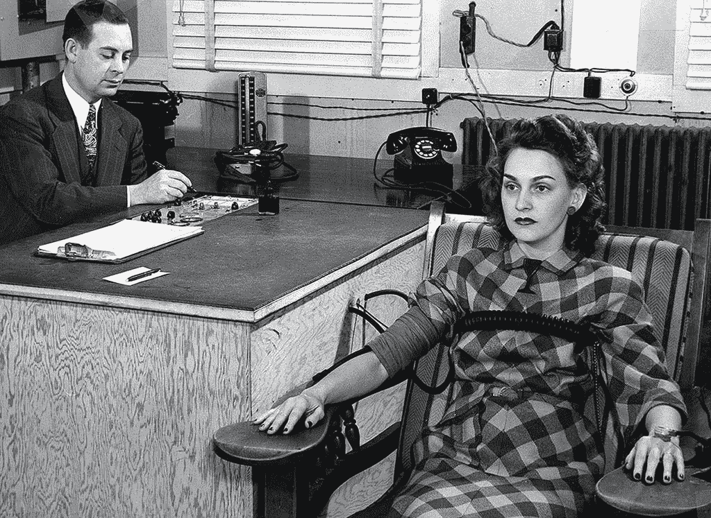

# 关于人类测谎的神话

> 原文：<https://www.social-engineer.org/general-blog/myths-about-human-lie-detection/>

“看着我的眼睛。”人们经常使用这样的短语来判断某人是否在说谎。我们可能认为这是一个有效的方法，毕竟谁能直视你的眼睛而撒谎呢？事实证明，有很多人在直视你的时候完全不介意撒谎。流行杂志和电视节目延续了许多关于如何辨别一个人是否在说谎的神话。还有自称的骗术专家，声称可以根据行为来检测骗术。他们还声称，这些测谎技能是可以教授的，让你成为一台人体测谎仪。这些说法背后有多少真实性？在这个问题上，真正的专家有什么要说的？让我们来探讨一些关于识破谎言的迷思和真相。

## 误区 1:眼球运动

人们普遍认为，当人们说话时，他们眼球运动的方向揭示了他们是否在说谎。如果这个人向左上方看了一眼，这表明他说的是实话。然而，如果他们看右上方，这是欺骗的信号。

这个神话来自 20 世纪 70 年代的一个理论，叫做神经语言编程(NLP)，一套帮助人们掌握社交互动的技术。然而，新的研究彻底揭穿了这些观念。NLP 长期以来一直被怀疑，因为没有科学支持来证明其理论。英国赫特福德郡大学进行了一项研究，志愿者们在说真话或撒谎时被拍摄下来。另一组志愿者随后观看电影，并试图确定谁在说谎，谁在说真话；仅仅通过观察他们的眼球运动。主持这项研究的心理学家怀斯曼教授说:“研究结果显示，说谎和眼球运动之间没有关系。”因此，这表明眼球运动和说谎之间没有明显的关系。

## 误解 2:紧张

口吃、坐立不安、看别处、摸鼻子或嘴巴，这些行为通常被认为是欺骗。然而，情况并非总是如此。压力会导致心率加快和肾上腺素增加，从而为四肢提供额外的能量，导致手或腿坐立不安。此外，在压力下，一些人会表现出自我安抚的行为，比如摸自己的头发、玩戒指或项链、揉脖子等等。这些行为是压力或不舒服的迹象，它们不一定意味着欺骗。

在最近的高级实用社会工程课上，一些学生被要求讲述一个关于他们自己的真实故事。另一组学生被要求讲一个假故事。班上的其他每个人都必须努力判断谁在说谎，谁在说真话。在讲述她的故事时，其中一名女学生坐立不安，然后在她讲完故事时把手放在脖子后面。许多人认为这是高度不适的迹象，并认为她在讲一个虚假的故事。这个学生确实很不舒服；然而，这并不是因为她在编造一个故事，而是她在分享她不久前经历的一次创伤性经历。这个练习证明，仅仅因为我们可以看到某人紧张或不舒服的迹象，并不意味着我们知道行为背后的原因。

## 误区 3:面部表情

当我们感到舒适时，脸上的肌肉就会放松。放松时，我们倾向于微笑或大笑。嘴唇饱满，下巴倾向于更向外。一旦出现心理不适，它就开始在某些区域显现。对一些人来说，这可能是额头的皱纹或眯眼。伴随着不适，还会出现下巴下缩、嘴唇紧闭，有时还会遮住眼睛。我们的脸展示了我们的情感，而我们却没有意识到。通过分析面部表情，我们所能确定的是行为是否与舒适或不适一致。

保罗·艾克曼博士因其对揭示隐藏情感的通用面部表情的研究而闻名于世。根据埃克曼博士的说法，“短暂的面部表情确实揭示了一种被掩盖的情绪，这是一种谎言，但受到怀疑的无辜者可能会掩盖他们的恐惧，或对被怀疑的愤怒。你需要找出他们为什么要隐藏自己的情绪……”面部表情可能表明一种被压抑的内在情绪骚动，但仅此而已。面部表情本身并不能揭示欺骗。

## 谎言能被识破吗？

科学研究和该领域的专家都认为欺骗没有固定的行为模式。人类的测谎就像在空中扔硬币一样准确。这是否意味着联邦调查局特工和其他执法机构依赖测谎仪进行测谎？虽然他们可能会使用测谎仪作为他们的工具之一，但就其本身而言，它并不是一种可靠的测谎方法。根据美国心理协会的说法，测谎仪是一种识别对问题反应的生理变化的仪器，但它没有检测谎言的能力。那么，专家如何确定一个人是否在说谎呢？

受过人类行为训练的专业人员会为感兴趣的人建立一个基线。当问一个问题时，他们寻找行为的转变。他们还寻找不一致的地方(言语上和身体上)，比如轻微的耸肩与口头的自信声明相吻合。此外，在口头说“是”的同时，微微摇头表示“不”这些不一致是一个“热点”,或者暗示出了一些问题。在这一点上，主持面试的专业人员会就导致不协调行为的话题提出进一步的问题。

## 最后

检测欺骗是非常复杂的。就像拼图一样，有许多块需要放置到位才能形成准确的图片。你不能仅仅依靠人类行为的一个方面来判断一个人是否在说谎。更确切地说，这是导致欺骗的*暗示*的一系列综合行为。提问的能力是一个关键的组成部分；这为您提供了一个验证所给信息是否准确的机会。前联邦调查局特工和国际肢体语言专家[乔·纳瓦罗](https://www.jnforensics.com/post/the-truth-about-lie-detection)说得好:“无论使用什么技术来寻找欺骗，真正了解真相的唯一方法是核实和确证某人所说的每一个细节。这就是测谎的真相。”

*来源:*
[*https://www . Forbes . com/sites/amymorin/2015/06/08/the-8-big-the-8-maximum-myths-about-lie-based-the-best-human-lie-detector-in-the-world/？sh = 191 D5 d864 d 11*](https://www.forbes.com/sites/amymorin/2015/06/08/the-8-biggest-myths-about-lying-according-to-the-best-human-lie-detector-in-the-world/?sh=191d5d864d11)
*[https://www . humintel . com/2020/01/lies-lies-and-more-lies-plus-the-top-5-myths-about-liers/](https://www.humintell.com/2020/01/lies-lies-and-more-lies-plus-the-top-5-myths-about-liars/)*
*[https://www . jn forensics . com/post/the-truth-about-lie-detection](https://www.jnforensics.com/post/the-truth-about-lie-detection)*
*[https://www.learning-mind.com/eye-movements-when-lying/【T2](https://www.learning-mind.com/eye-movements-when-lying/)*

*图片:*
[*https://www . Smithsonian mag . com/smart-news/lie-detectors-dont-work-advertised-and-they-never-do-180961956/*](https://www.smithsonianmag.com/smart-news/lie-detectors-dont-work-advertised-and-they-never-did-180961956/)