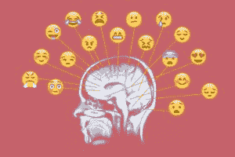
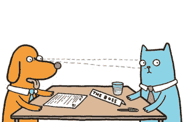
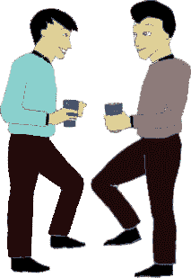

# 非语言交流——获得信任的重要工具

> 原文：<https://www.social-engineer.org/social-engineering/nonverbal-communication-a-valuable-tool-to-gain-trust/>

你可能听过“行动胜于语言”这句话。非语言交流也是如此。我们的姿势、手势和其他非语言暗示传递的信息比语言更深入人心。我们的非语言可以增加我们话语的有效性，也可以起到相反的作用。变得有自知之明并改善我们的非语言交流是获得他人信任的一个有价值的工具。什么是非语言交流？

非言语交际定义为不用言语的交流。包括面部表情、眼神、抚摸、语调等行为。还包括着装、姿势和距离。[加州大学洛杉矶分校](http://www.kaaj.com/psych/smorder.html)做了一项研究，发现大多数交流是非语言的。7%的信息是通过语言传递的，38%的信息是通过声音传递的，55%的信息是通过非语言传递的。非语言交流在我们如何交流中起着至关重要的作用(不管我们是否意识到)。无论你是销售人员、公共演说家还是社会工程师，你的成功很大程度上取决于有效的非语言交流。下面是三种你可以利用非语言交流的力量来建立更好的关系和获得信任的方法。

## 目光接触

你有没有第一次见一个人就有无法信任他的感觉？或者你在和一个朋友说话，而他在看手机？眼神交流是肢体语言的一种形式，在交流中是必不可少的。在西方文化中，保持目光接触是积极倾听[的一部分](https://www.social-engineer.org/social-engineering/active-listening-the-secret-to-any-successful-negotiation/)。它让我们交谈的人知道我们关注他们所说的，他们所说的很重要。理想的眼神交流应该持续 4-5 秒，当你看向别处时，慢慢地进行。太快转移视线会让你显得紧张。随着谈话的展开，你可以继续看着对方的脸(鼻子、嘴、下巴),并间歇地进行眼神交流，因为长时间的眼神交流可能会让人感到害怕。

此外，考虑对方的文化，了解在他们的文化中眼神交流是否被认为是尊重。眼神交流是建立信任的关键一步。你与之交谈的人更有可能信任你，因为眼神交流表明了交流的开放性。

## 反映

镜像是复制另一个人的肢体语言、言谈举止、重复他们的话的行为。你可能已经注意到，当人们进行愉快的谈话时，他们会微妙地(通常是无意识地)模仿对方的行为。通过模仿他们的肢体语言，你可以有意识地创造融洽的关系并获得信任。例如，如果他们向前倾斜，向里倾斜，或者如果他们用手做手势，尝试使用类似的手势。你应该巧妙地、自然地做这件事。你最不想做的事情就是让对方觉得你在嘲笑他们，或者让他们感到不舒服。镜像是一项需要时间来掌握的技能。如果做得正确，镜像会促进积极的感觉，并有助于获得信任感。目标是让对方觉得我们和他们一样。这将更容易在无意识的层面上建立信任。

## 不是你说的那样

不是你说什么，而是你怎么说。你如何获得信任，很大程度上取决于意识到你的有声非言语暗示。你可能在想——如果我用声音说话，非语言的暗示怎么用呢？据 [Quantified Communications，](https://www.quantifiedcommunications.com/blog/wsj-is-this-how-you-really-talk/)一家通信分析公司称，“你很难听到自己的声音。但那种声音可能会比你说的话更影响别人对你的印象。”我们的语言传达信息，而我们的语气传达感觉。例如,“那太糟糕了”这句话听起来会很不一样，这取决于你在和谁说话以及你想传达的信息。在一种情况下，这可能听起来讽刺，而在另一种情况下，你的语气可能传达出同情。

打电话时，我们的语调特别重要。Albert Mehrabian 在他的书《无声信息》中说，如果一个人的话语和语调之间存在差异，85%的情况下，人们会相信他们听到的语调而不是实际的话语。不管你的声音是什么，最重要的是你的语气传达出真诚。保持稳定的步伐，不要说得太快或太慢。以及在适当的时候微笑，可以把你的声音变成说服的工具。

## 熟能生巧

我们所有人都本能地使用非语言暗示来表达自己，然而掌握非语言交流的艺术需要时间、意识和练习。通过更多地意识到其他人的非语言暗示，我们可以更好地理解一个人真正想说的话。更多地意识到我们自己的非语言暗示，使我们能够更有效地与他人交流，并创造一种信任和同情的氛围。

这篇文章仅仅触及了非语言交流的表面，你想了解更多吗？今年的[人类黑客大会](https://www.humanhackingconference.com/)将于 3 月 11 日至 13 日举行，将包括由行为、生理学、欺骗、技术和心理学领域的世界知名领袖讲授的研讨会，以及包括非语言、SE 测试、身体和心理影响以及个人发展在内的专门学习。这些技能和见解将使与会者个人和专业受益，从学习如何“阅读”某人的思想，到发现欺骗和其他关键的肢体语言指标，到理解人们如何做出决定以及如何影响他们的决定，等等。

*来源*
*[https://www . social-engineer . org/general-blog/a-good-lesson-on-reading-non-less-by-David-Kennedy/](https://www.social-engineer.org/general-blog/a-good-lesson-on-reading-nonverbals-by-david-kennedy/)*
*[http://www.kaaj.com/psych/smorder.html](http://www.kaaj.com/psych/smorder.html)*
*[https://www . social-engineer . org/social-engineer/active-listing-the-secret-to-any-successful-negotiation/](https://www.social-engineer.org/social-engineering/active-listening-the-secret-to-any-successful-negotiation/)*

*图片*
*[https://www . the cut . com/2016/06/10-extreme-precise-words-for-emotions-you-not-even-know-you-had . html](https://www.thecut.com/2016/06/10-extremely-precise-words-for-emotions-you-didnt-even-know-you-had.html)*
*[https://www . Bloomberg . com/news/articles/2013-10-17/in-business-eye-contact-is-over-and-depends-to-the-the-the-the-situated](https://www.bloomberg.com/news/articles/2013-10-17/in-business-eye-contact-is-overrated-and-depends-on-the-situation)*