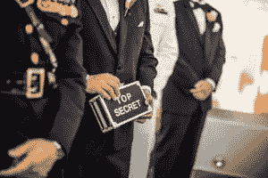

# 保护商业秘密免受物理入侵者的侵害

> 原文：<https://www.social-engineer.com/protecting-trade-secrets-from-physical-intruders/>

掌握商业秘密、知识产权或专有研究的公司受到的攻击。攻击是多方面的，包括网络和物理入侵。2018 年 3 月[Social-Engineer.org 快讯](https://www.social-engineer.org/newsletter/corporate-espionage-the-rise-of-the-cyber-mafia/) 中提到，网络间谍活动已经“从孤立的、个体化的攻击转变为由截然不同的群体 [运作的攻击，类似于传统的黑手党组织。](https://www.social-engineer.org/newsletter/corporate-espionage-the-rise-of-the-cyber-mafia/) “此外，保护商业秘密免受物理入侵者的侵害必须是首要任务。公司面临包括物理入侵在内的社会工程攻击的风险。 [尾随](https://www.social-engineer.org/framework/information-gathering/physical-methods-of-information-gathering/) 是入侵者获得未授权进入最常用的方法之一。入侵者还可能 [冒充](https://www.social-engineer.org/framework/attack-vectors/impersonation/) 为承包商、业务联系人、送货人或员工，以进入保存机密信息的受限区域。T34T36】

为了保护商业秘密免受物理入侵者 、 的侵害，包括技术和人力两方面的安全策略是必不可少的 。在工作场所对陌生人或陌生面孔保持敏锐的观察力可以提高安全性。制造和销售机器人手术产品的公司[med robotics](https://medrobotics.com/)发生的事情很好地说明了这一点。由于他们的工作性质，保护商业秘密和知识产权是公司的核心价值观。 

### 首席执行官抓住未经授权的入侵者

现在是 2017 年 8 月 28 日晚上 7 点半。T2 医疗机器人公司的首席执行官 Samuel Straface 博士是当天最后一个离开办公室的人。在他 外出的路上，他 注意到一个男人在公司的安全空间内的一间会议室里，拿着三台开着的笔记本电脑。斯特拉菲斯博士不认识这个人。他知道自己既不是承包商也不是业务联系人，他也知道此时没有安排会议。

塞缪尔·斯特拉菲斯有自己的个人政策；如果他不认识你，那么你已经赢得了介绍。这种领导风格有两个目的。首先，它增强了一种“团队”感为公司工作的每个人对他来说都很重要。其次，它增强了安全性。一张陌生的脸不可能不引人注目地溜进来。斯特拉菲斯博士没有忽视会议室里的那个人。相反，他介绍自己是首席执行官。他与陌生人的对话引发了“危险信号”他打电话给警察。反过来，警察打电话给联邦调查局。这名闯入者因涉嫌公司间谍指控而被捕。

### 入侵者是如何进入的？

2017 年 8 月 28 日标志着 Medrobotics 公司的一个重要里程碑。 当天早些时候，该公司的 Flex 机器人辅助手术系统已经在乔治华盛顿大学医院用于世界上首例无疤痕机器人结肠切除术。为了表彰这一成就，他们获准在附近的一家酒吧庆祝。高管、工程师和员工在离开去庆祝的时候冲进前门。据信，在这场激动人心的狂奔中，闯入者刘东溜了进来。尽管医疗机器人的政策要求访客签到，但当天的访客记录中并没有刘的记录。 他选择这个时间进入大楼纯粹是巧合吗？还不确定。然而，在联邦调查局的调查中，发现刘一直通过 LinkedIn 与 Medrobotic 员工联系。

### 保护商业秘密——吸取的教训

Medrobotics 和首席执行官 Straface 博士的经历说明了多层面安全方法的价值。将“人的一面”与技术的一面结合起来是很重要的。两个外卖要考虑:

1.  首席执行官的个人政策是一种防御策略。对陌生人保持警惕能增强安全感。因此，实施类似的政策。这样做可以降低陌生人溜进来的风险。
2.  当员工匆忙离开大楼庆祝公司的一个里程碑时，可能发生了安全疏忽。因此，为那些偏离正常或典型的特殊场合准备一个安全计划。  

在这个经济和商业间谍盛行的时代，保护商业秘密、知识产权或专有研究应该成为公司的核心价值观。不要等到为时已晚。 [安全培训](https://www.social-engineer.com/social-engineering-penetration-test/) 将物理入侵作为 [渗透测试](https://www.social-engineer.org/framework/general-discussion/categories-social-engineers/penetration-testers/) 的一部分是必要的。

*来源:* [*https://www . medicaldesignandoutsourcing . com/med robotics-CEO-subsidied-possible-corporate-sp 谍/*](https://www.medicaldesignandoutsourcing.com/medrobotics-ceo-thwarted-possible-corporate-espionage/) [*https://www . CNN . com/2015/07/24/politics/FBI-economic-sp 谍/index.html*](https://www.cnn.com/2015/07/24/politics/fbi-economic-espionage/index.html)