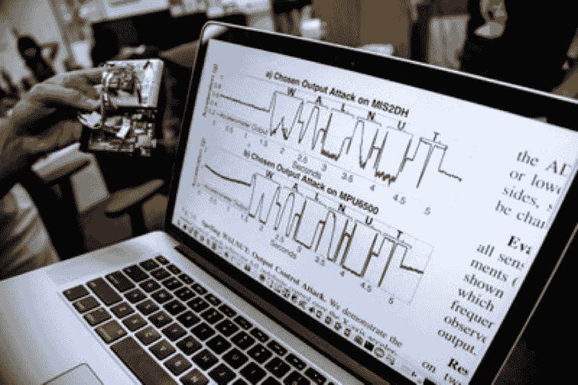

# 研究人员利用声波控制一部智能手机(严肃地说)和一辆汽车(理论上)

> 原文：<https://www.social-engineer.org/social-engineering/researchers-use-sound-waves-control-smartphone-seriously-car-theoretically/>

你戴在手腕上用来记录脚步的 Fitbit 与智能手机、汽车、医疗设备、防盗设备和无人机有什么共同之处？放弃？….微机电系统(MEMS)加速度计。这些小装置被用于手机的计步器、用户界面控制、纵向和横向模式之间的切换以及内置摄像头。它们还被用于摄像机中的图像稳定，并被用于计算机硬盘驱动器中，以检测笔记本电脑的自由落体并关闭硬盘驱动器以防止损坏。它们在汽车中用于检测汽车碰撞以展开安全气囊，并在军事和航空航天系统中使用，例如在飞机中用于导航。使用 MEMS 加速度计的器件不计其数。

现在你可能会认为这些设备不会被黑客攻击，对吗？嗯…没那么多。密歇根大学和南卡罗来纳大学的一组研究人员测试了声波对来自 5 家制造商的 20 种不同 MEMS 加速度计的影响。在一项测试中，他们通过播放带有特殊音调的 YouTube 音乐视频，欺骗智能手机的 MEMS 加速度计，输出类似字母数字串“胡桃”的信号。然后他们还做了其他令人担忧的事情。但是在我开始之前，你们中的一些人可能想知道:

## 什么是 MEMS 加速度计？

MEMS 加速度计是测量加速力的机电设备，即测量速度和位置的变化。它已经成为一个领域，其中机械元件，如悬臂或薄膜，已经在微电子电路的规模上制造出来。虽然电子电路是实心的并且具有紧凑的结构，但是 MEMS 具有孔、腔、通道、悬臂和膜，并且在某种程度上模仿了尺寸小于 100 微米的机械部件。Matej Andrejasic 在 2008 年发表的论文对 MEMS 加速度计及其制造方法进行了精彩的描述。

第一个 MEMS 加速度计于 1979 年在斯坦福大学设计，但直到 20 世纪 90 年代才真正得到应用，当时它们彻底改变了汽车安全气囊行业。随后，该行业迅速发展，其他类型的 MEMS 传感器被开发用于不同的应用，如压力传感器、生物 MEMS、光学 MEMS (MOEMS)、RF MEMS 等。

所以，不管我们是否意识到，它们就在我们日常使用的设备中。以你的车为例。它至少有 50 个 MEMS。它们用于安全系统，如安全气囊、电子稳定控制和轮胎压力监测系统。你一直带在身边的那个手机至少有 14 个 MEMS 传感器。在商业和军事领域，它们被用于卫星、无人机和飞机系统。在医疗领域，它们用于监测血压和许多其他领域。在游戏系统中，它们被用于 Xbox 和 Wii(如果你还有的话)。为了了解 MEMS 的许多应用，MEMS &纳米技术交易所的[站点](https://www.mems-exchange.org/MEMS/applications.html)给出了一份清单。

## 攻击是如何进行的？

对于我们正在讨论的漏洞，它与 MEMS 惯性传感器(或 MEMS 加速度计)有关。现在，研究小组所做的是，如果他们在目标 MEMS 传感器附近提供高强度的声音干扰，并试图欺骗传感器输出任意信号，会发生什么。(如果你想知道攻击的所有细节，有一整篇论文和视频来展示在密歇根大学的网站上发生了什么)。

在他们的第一次测试中，他们让 MEMS 输出“核桃”，但在其他测试中，他们将 steps 注入到 Fitbit 的一个简单的健身监视器中。在另一次袭击中，他们驾驶了一辆车，不是真正的车，而是一辆遥控车。他们对运行应用程序来驾驶遥控汽车的三星 Galaxy S5 进行了声学攻击。

## 我们为什么要担心？

你可能会想，为什么我要关心给我的 Fitbit 增加步骤或者控制一辆玩具车呢？问题是，相同类型的 MEMS 加速度计用于真实的汽车、无人机、飞机、医疗设备、自动驾驶汽车和其他设备。现在，这种攻击确实需要一些技巧，并且需要关于传感器数据和攻击者试图欺骗的信号的特定信息。但是，随着医疗设备使用的增加和自动驾驶汽车的发展，针对所有 MEMS 的攻击，而不仅仅是针对 MEMS 加速度计的攻击，应该得到严肃对待。从网站、电子邮件附件、智能手机上的 Twitter 链接等自动播放的音乐视频的未来可能性有多大？用来控制一辆自动驾驶的汽车？在社会工程环境中，误用的可能性类似于技术被用来欺骗某人做出不安全的行为或控制资源的其他情况。我们现在需要缓解所有的攻击媒介，因为我们的生命将取决于此。

## 能做些什么？

不幸的是，除了保持警惕并养成良好的反社会工程习惯，比如不点击来自未经核实的发件人的未知文件，我们目前无能为力。但是制造商可以做一些事情。作为负责任的研究人员，大学团队已通知制造商这些问题以及他们可以调整硬件设计来解决问题的方法，例如，设计他们使用安全的低通滤波器来更好地容忍声音干扰。他们还推荐了一些低成本的软件防御措施，可以最大限度地减少漏洞。你可以在他们的[报告](https://spqr.eecs.umich.edu/papers/trippel-IEEE-oaklawn-walnut-2017.pdf)中读到这些修正。希望制造商能听进去。否则，袭击将会带来灾难性的后果。

*来源:*
*[http://mafi ja . fmf . uni-LJ . si/seminar/files/2007 _ 2008/MEMS _ accelerators-kon CNA . pdf](http://mafija.fmf.uni-lj.si/seminar/files/2007_2008/MEMS_accelerometers-koncna.pdf)*
*[https://www . usenix . org/system/files/conference/usenixsecurity 15/sec 15-paper-son-updated . pdf](https://www.usenix.org/system/files/conference/usenixsecurity15/sec15-paper-son-updated.pdf)*
*[https:/](https://www.usenix.org/system/files/conference/woot16/woot16-paper-davidson.pdf)*