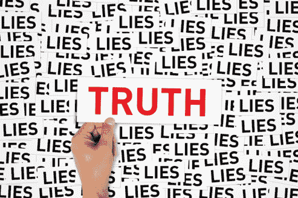

# 民族国家层面的社会经济环境

> 原文：<https://www.social-engineer.org/social-engineering/se-at-the-nation-state-level/>

自现任美国总统当选以来，许多新闻机构都在讨论社会工程被用作有针对性的影响活动的一部分的可能性，以及它们可能如何在 2016 年选举期间影响选民。

[联邦起诉书谈及](https://slate.com/technology/2018/02/what-we-know-about-the-internet-research-agency-and-how-it-meddled-in-the-2016-election.html)外国特工利用脸书和推特，通过自动账户根据期望的角度重新发布信息，推动叙事和改变对各种话题的看法，从而利用部落心态。[真实的美国公民也在使用这些技术](https://www.msn.com/en-us/news/technology/how-a-twitter-fight-over-bernie-sanders-revealed-a-network-of-fake-accounts/ar-BBKbTZ3?li=AA4Zoy)来推动他们自己的故事情节和话题，不管他们是否知道。

无论合法与否，这些都是传递信息的绝佳平台，但这并不是那场运动中看到的唯一形式的 se。

[据报道](https://www.npr.org/2018/02/17/586698361/the-russia-investigations-mueller-indicts-the-internet-research-agency)外国特工甚至来到美国本土，与各种政治和专业职位的美国人进行互动，试图获得更多关于他们目标的信息。他们会见了集会组织者和当地基层倡导者，以更好地了解人口中的市场，这些市场可以被操纵以符合他们的目标。在德克萨斯州举行的一次这样的会议揭示了关注“紫色州”的必要性，在那里，较小的受影响人口可能会产生更大的影响。T3】

举个例子，把一个蓝色的州变成红色的州，或者相反，要耗费更多的资源，但是一个紫色的州只需要几个额外的投票者就可以改变方向。针对特定人群的有针对性的影响力运动可以实现这一目标，同时仍然让他们认为这是他们的想法。

归根结底，你要充分了解你的目标、目的和障碍，以便用最少的努力完成你的目标。这适用于任何类型的影响力活动，无论是否专业。

使用钓鱼电子邮件和社交媒体帖子试图影响选民是一回事，但冒充同胞提供了一个机会，通过面对面建立融洽的关系来收集竞选的重要数据。

媒体讨论了抗议者可能被收买来表达特定观点的可能性，并且有消息称外国特工在一些抗议活动中使用了这种特定的技术。因此，可能有关于这些收益的可用信息，但它被归因于错误的参与者。T3】

还确定的是[外国特工正在建立他们自己的抗议活动](https://thinkprogress.org/black-matters-us-site-90625b18f262/)并通过社交媒体帖子的虚假账户和针对特定用户群体的定向广告进行营销，以至于实际上有数千人向他们展示。T3】

虽然这些可能是极端和罕见的例子，但它们被使用的事实表明了一个有动机的群体在试图影响特定人群时所愿意达到的水平。

从专业社会工程师的角度来看，所有这一切既令人不安又给人启发。知道这些技术在现实世界中被如此使用，并对公众舆论产生如此巨大的影响，确实令人震惊。T3】

## 对于这一切，我们能做些什么呢？

在当前的信息时代，可能很难确定哪些信息是真实的，哪些信息是由什么组成的，以巩固或改变你对某个话题的看法。社会工程意识培训通常促进批判性思维，将其作为抵御这些威胁的首选方式。

如今的信息过载，容易让人陷入共同思想的泡沫，所以只看到自己认同的信息。

为了应对这些威胁，人们需要走出这些泡沫，离线并与其他人交谈，甚至是那些他们可能不同意的人。

核实具有极端观点的新闻来源，甚至是那些不断出现在你的新闻提要中的新闻来源。这个新闻来源是试图解决一个问题的两个方面，还是像激光一样聚焦于一个特定的叙述？

一个可靠来源的网络可以大大有助于打击“假新闻”的出现和淹没你的社交媒体账户的自动帖子。

此外，如果一条新信息“不太对劲”，或者你“有一种奇怪的直觉”，花时间验证它的有效性，哪怕只是一点点，你可能会发现一个新的机器人和巨魔军团，这可能会显著改变你对新闻来源的看法。

此外，仅仅因为一条有趣的新闻符合你既定的观点，并不意味着它实际上是真实的，值得推广。向他人传递不正确或有偏见的数据只会使问题永久化，并进一步混淆事实。

将来很可能会有类似的活动，所以读者理解这些威胁并批判性地思考呈现给你的信息是至关重要的。

*来源:*
[*https://www . MSN . com/en-us/news/technology/how-a-Twitter-fight-over-Bernie-Sanders-discovered-a-network-of-fake-accounts/ar-bbk btz 3？李= aa 4 zoy*](https://www.msn.com/en-us/news/technology/how-a-twitter-fight-over-bernie-sanders-revealed-a-network-of-fake-accounts/ar-BBKbTZ3?li=AA4Zoy)
[*https://www . NPR . org/2018/02/17/586698361/the-Russia-investigations-mueller-inputs-the-internet-research-agency*](https://www.npr.org/2018/02/17/586698361/the-russia-investigations-mueller-indicts-the-internet-research-agency)
[*https://slate . com/technology/2018/02/what-we-know-know-about-the-the-internet-research-agency-and-how-it*](https://slate.com/technology/2018/02/what-we-know-about-the-internet-research-agency-and-how-it-meddled-in-the-2016-election.html)