# SECOM 团队建设和树顶静修

> 原文：<https://www.social-engineer.com/secom-team-building-treetop/>

这是 10 个同事的真实故事，他们被挑选去奥兰多，一起工作，并被记录下他们的生活。看看当人们不再彬彬有礼，开始变得**真实**……时会发生什么

我们不是真人秀明星，但其余的都发生在 SECOM 团队建设和树顶静修期间。上周，社会工程师团队参加了我们在佛罗里达州奥兰多举行的第二次年度企业务虚会。当世界上的其他人都在忙他们的事情时，我们从美国的各个角落来到这个度假小镇，目的是放下我们的手机和笔记本电脑，花一些时间一起学习、联系和成长。

### 周四:后勤杂耍表演——18 个成年人、8 个孩子和一只大狗

想象一下，让 10 名员工、配偶和家人从遥远的夏威夷来到镇上，入住酒店，然后去克里斯在奥兰多的住所。

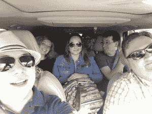

那天晚上是我们的一些家人和家人第一次见面。将阿玛亚的狗达科塔提升为球队吉祥物的动议获得一致通过。布莱恩的孩子像足球一样被传来传去。晚餐是泰国菜，家庭式的。顺便说一下，克里斯做了一道很棒的泰国咖喱菜。

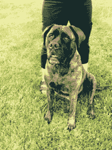 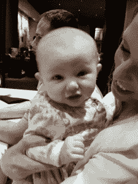

### SECOM 团队建设和树顶静修–星期五:我们相信我们能飞起来…

我们真的想要一项鼓励我们提高团队建设技能的体育活动。当克里斯和米歇尔在讨论悬吊绳索课程时，反馈回来的问题是，我们应该去半天还是一整天？“克里斯，”米歇尔说，“我们是电脑虫，最多从办公室搬回厨房。咱们干半天吧。”事实证明，她是对的。

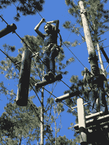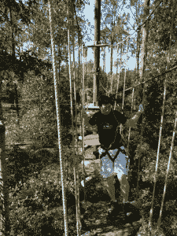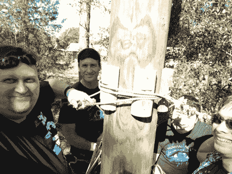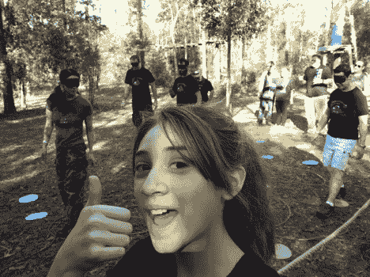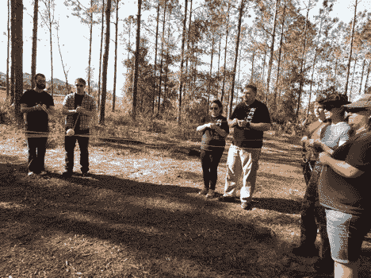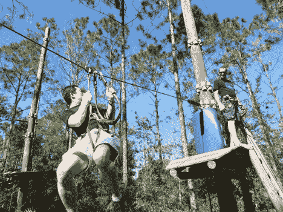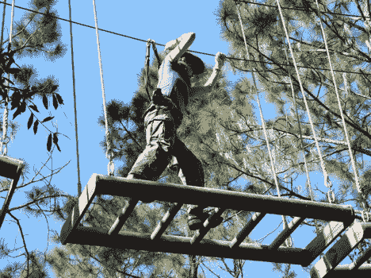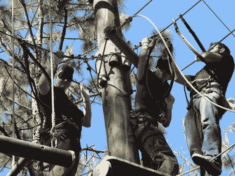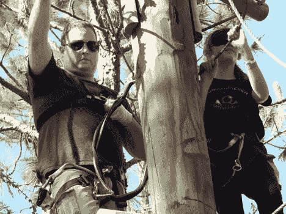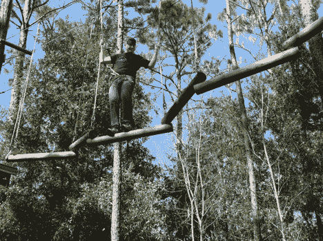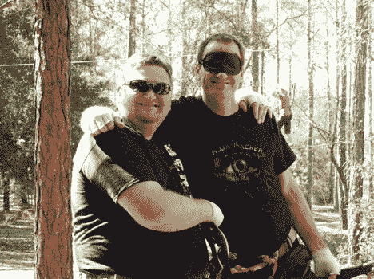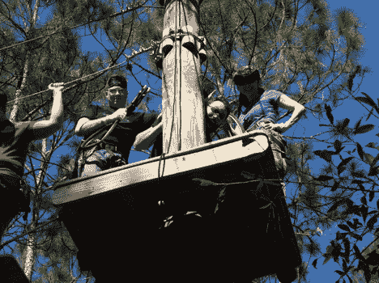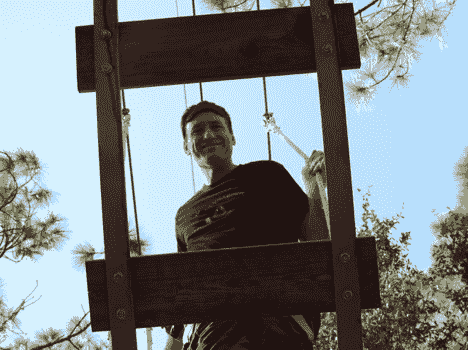

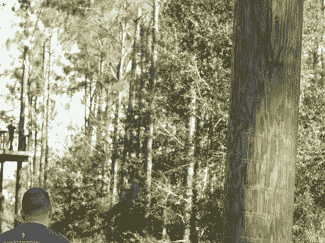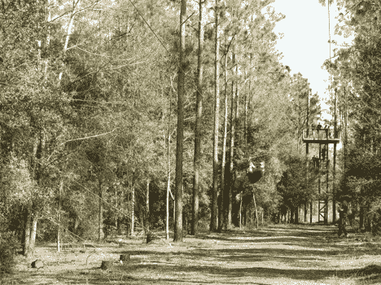

活动本身很棒。[奥兰多树之旅](https://www.orlandotreetrek.com/)是一系列悬挂在树上高达 40 英尺的绳索和障碍物，需要身体技巧和团队合作才能成功通过每一项挑战。为了让事情变得有趣，我们的辅导员让我们戴上眼罩，依靠队友的口头指示。不可思议的是，当没有其他人在旁边的时候，卡兹的所有伙伴都选择了坠落*。很奇怪，对吧？*

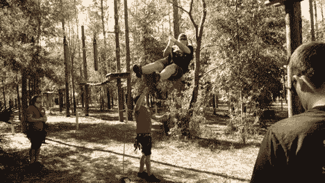

谢天谢地，我们的重伤相对较轻，但在 4 个小时后，我们都准备好了空调和冰淇淋。我们回到 Chris 家，与整个团队一起录制了一段很可能会很棒的播客，讨论如何成为一名专业 SE。在二月寻找它。

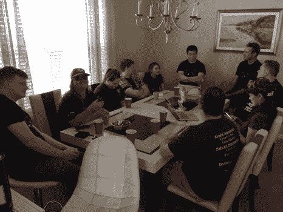

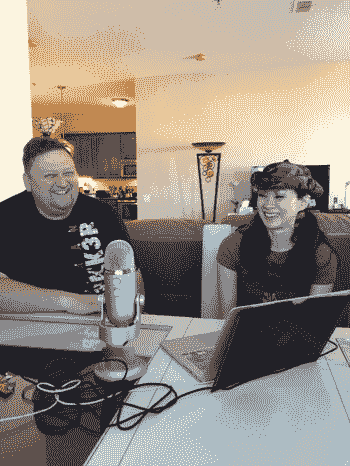

由于这一天的体力消耗很大，我们与配偶和家人在一家意大利餐厅吃了很多碳水化合物。有趣的事实:丹是儿童磁铁。在餐馆里，一个陌生的孩子非常依恋丹，不愿被赶走。她妈妈不得不来剥她的皮。两次。

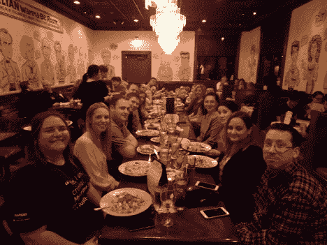

### 周六——艾米·赫尔曼和感知艺术

不久前，艾米曾是 T2 SEORG 播客的嘉宾，我们非常喜欢她和她的内容，所以我们决定带她来给我们开一个研讨会，讨论如何提高我们的观察技巧和有效沟通的能力。通过使用艺术作品作为我们磨练技能的媒介，它让我们大多数人走出了舒适区，并真正让我们专注于活动；“你看到了什么？”“你没看到什么？”“你在做什么假设？”“你如何向看不到你照片的人传达这一点？”

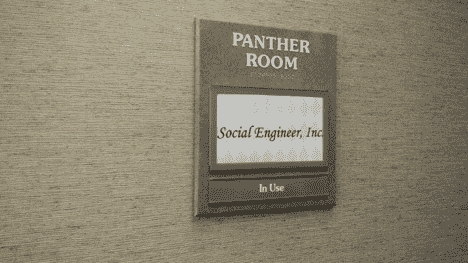 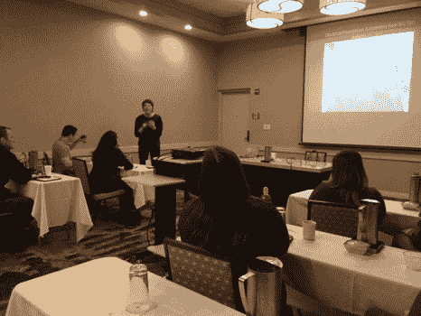

我想我们都从那一天走了出来，对我们的工作和我们如何与他人互动有了不同的想法。衡量一门课程和教师质量的一个很好的指标是，当学生们兴奋地谈论如何应用他们所学的知识时，这种情况相当多。我们强烈推荐这门课程。

为了充实我们的大脑，我们在一起的最后一个晚上是在公司最喜欢的 Fogo de Chã，在那里，如果你在晚饭后没有得到肉汗，你就做错了。Amaya 也可以证明那里的秀兰·邓波儿的质量——他们给你带来樱桃糖浆，你有责任把它混合到你喜欢的浓度的气泡酒里。

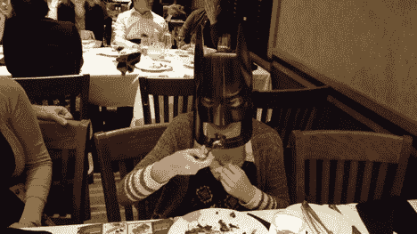

晚饭后，我们道别，直到 DEF CON，一些人回到克里斯的威士忌品尝，而其他人收拾行李红眼航班回家。

### 我们学到了什么？

好吧，我们不是身体最协调的一群。但是我们来自各种各样的背景，带来了不同的技能、才能、知识和经验。我们认识到我们的弱点之一可能是队友的超能力，以及认识到这一点并知道何时/如何寻求帮助的重要性(可能在你从障碍物上掉下来之前，科林！).我们了解到，在一个吸引眼球的科技和小发明的世界里，看一件经典的艺术品可以帮助你看到你以前没有见过的东西。最后，我们证实了，作为一个团队，我们远远大于我们各个部分的总和。

现在你对社会工程有了一点了解。感谢您成为我们的一员，并保持安全。下次见。