# 社会工程和 21 世纪定义

> 原文：<https://www.social-engineer.org/social-engineering/social-engineer-and-def-con-21/>

有人知道撞我们的那辆卡车的号码吗？–有人说 *黑帽& DEF CON* 在前面的烤架上…

社会工程师再次席卷了拉斯维加斯，我们知道我们的一些读者不能和我们在一起，所以我们想花一些时间写一篇关于我们活动的帖子，与你们分享，并分享一些图片和故事。

## 布莱克 2013 年

我们的拉斯维加斯之旅从黑帽开始。多好的课程啊！我们有一个特殊的 16 人小组，他们来自世界各地。有些人告诉我们这是他们第一次戴黑帽子，他们只是来上我们的课。令人羞愧，但听到这个消息也让我们有一种自豪感。

我们的 BH 课程为期 4 天，基于去年的反馈，我们决定将时间集中在课程的所有融洽、影响、心理和非语言部分。

我们给这个班级增加了一些新的特色，这肯定会让一些人大吃一惊。除了更多的心理学，更多的人类互动和对人类行为的更深入的分析，我们在最后一天增加了一些东西，这是本课程的一个亮点。

如你所知，我们每天晚上都派学生出去进行启发练习，以巩固当天的课程。我们的班级已经有 14、18、20、28 个人了，所以不可能让我们所有人都参与进来——这就是新的特色。

我们的团队出去找一个公众聚集区。然后我们选择一个目标，给每个小组发一条描述符和位置信息。当我们抓拍一些照片并监听他们的交战时，他们必须交战。我们都回到教室去分析他们的非语言表现以及他们是如何参与的。很快在 Social-Engineer.Com 网站上将会有一些以前班级关于这个新功能的故事和图片。

随着黑帽的结束，我们看到的是一类不想离开房间的人。他们留下来问更多的问题，互相交流，交换联系方式。我们不仅从这些学生身上学到了一些东西，还受到了激励，要更加努力地让班级变得更好。

我们得到的一些评论是:

*“这门课是我在黑帽上过的最适用的课程”*

“这不仅仅是一门社会工程课程，这是为地球上每一个人开设的课程。谢谢大家

*“这无疑是我职业生涯中上过的最好的安全课”*

*“谢谢你！我了解了自己，我学会了如何沟通，我学会了如何成为一个更好的人——谁会想到我会为此来到黑帽！”*

致我们所有的学生——**谢谢你们**！有你在我们的生活中，我们感到谦卑和荣幸，并感谢让我们成为更好的人的经历。

我们在凯撒酒店的时光以对永远可爱的艾丽西娅·韦伯的精彩的 SecureNinjaTV 采访而结束

[//www.youtube.com/embed/E8Q0cFlqERI](//www.youtube.com/embed/E8Q0cFlqERI)

## 我们的里约 DEF 大会，我们来了！

周四标志着我们开始了类似于海豹突击队地狱周的日子。我们用剥夺睡眠来惩罚自己，每天吃 1 到 2 顿饭，每天在 450 开尔文的房间里工作 20 个小时，并且缺乏适当的水合作用——我们热爱其中的每一秒钟。

以下是一些亮点。

我们的团队是由一群非常“有趣”的人组成的。

human hacker——一个大块头的笨蛋，几年前有了一个想法，后来变成了奴隶

Michele——这个亚洲人拥抱了大约 2/3 的 DEF CON，踢了几个与会者的屁股，只是为了好玩

阿曼达——我们的常驻名单制作者，衬衫失败者，生活的组织者，也是我见过的最好的行政助理

nick 8 ch–SECTF 设置的右手边。总是迟到，太多的玩笑，但是没有他我们做不到

urbal——我们的实习生、评委和最喜欢的水仙

亲爱的主啊，我该怎么说吉姆呢…我爱这个家伙。我最喜欢的喝苏格兰威士忌、列清单、有组织、黑客类型的家伙，在现实世界中太重要了，以至于不能为我们做他为我们做的事情

X 先生–真的吗？你不知道 X 先生？享受生活…当他不黑 WiFi 的时候，他是我们的摄影师

Anna _ X——正如你所看到的(通过 X 假人),依附于 X 先生，是我们所指的最善良有趣的人之一，叫她 Arnolda，她很开心。

Billy——Billy 是你能遇到的最鼓舞人心和最了不起的人之一。如果你不认识 Billy——在一次聚会或 DEF CON 上找到他，询问他的故事，你会大吃一惊——我是认真的。

史蒂文——地球上为数不多的回复“你知道怎么开枪吗？我们需要你来负责部门 4 kids”…他在电子邮件中写道“我能帮什么忙？”–我们最新的团队成员

把这些优秀的人放在一起，你就有了 SEORG SEVillage 团队。(都在最上面的图片中)

## 全新的塞维利亚

让我们来回顾一下发生的一些事情…

首先，我们发现的一件事是，如果你不让尼克有事做，这就是他对 X 先生所做的…

[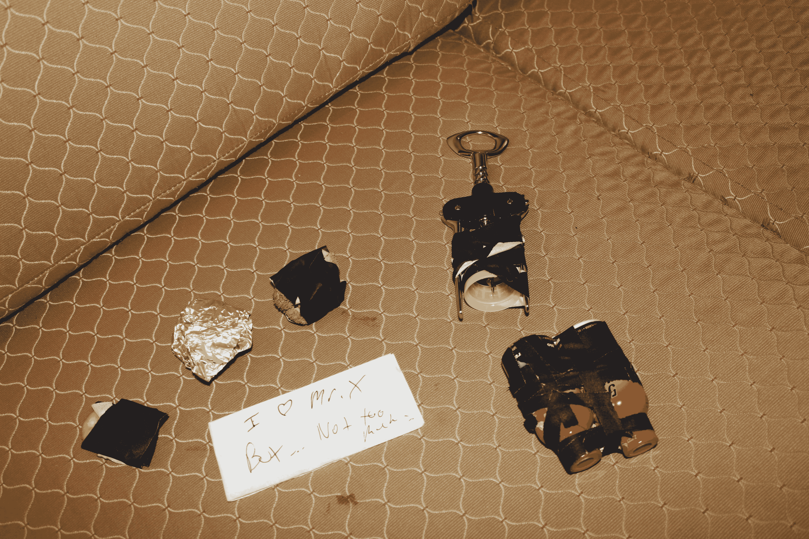T2】](https://www.social-engineer.org/social-engineering/social-engineer-and-def-con-21/attachment/2-whatnickdoestoxwhenbored/)

但我们没有问题，让他们都忙起来；以下是塞维利亚的一些场景:

[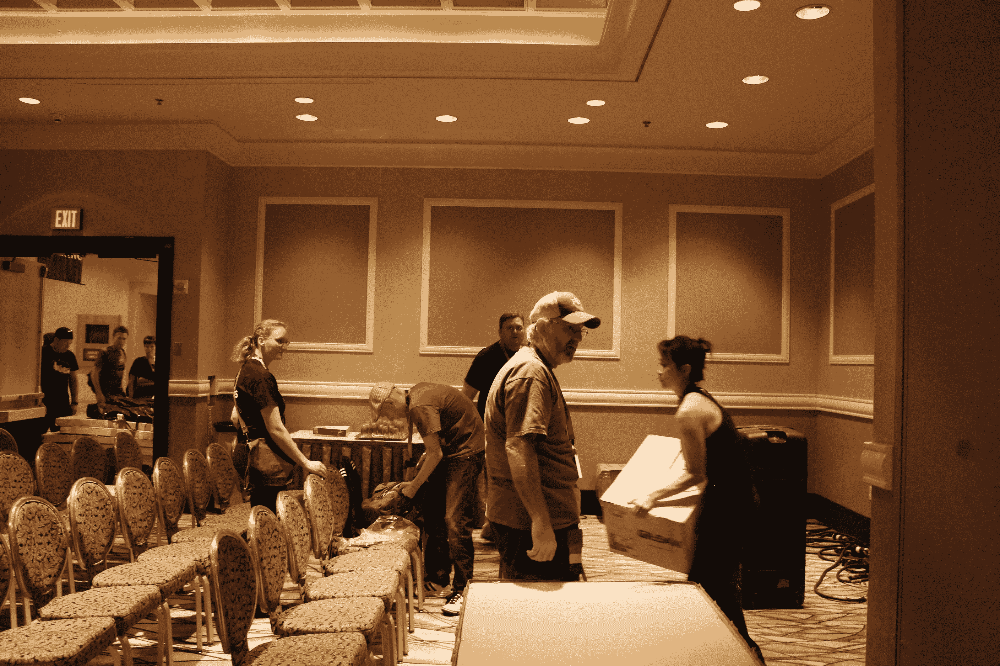T2】](https://www.social-engineer.org/social-engineering/social-engineer-and-def-con-21/attachment/3-sectfsetup/)

[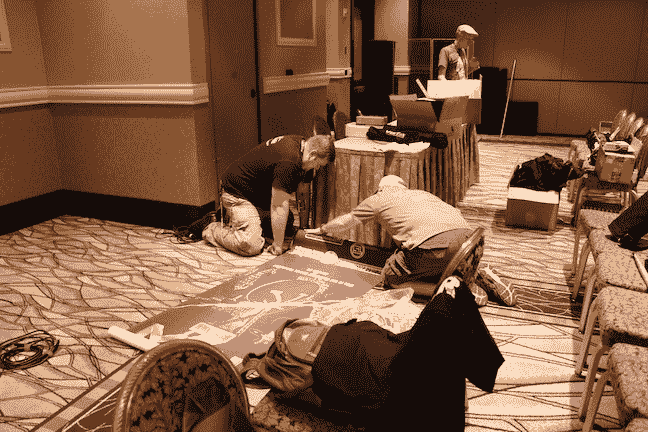T2】](https://www.social-engineer.org/social-engineering/social-engineer-and-def-con-21/attachment/4-howmanyengineerstoputtogetherasign-2/)

[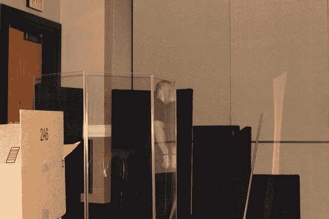T2】](https://www.social-engineer.org/social-engineering/social-engineer-and-def-con-21/attachment/5-nickputtingtogetherthebooth-2/)

[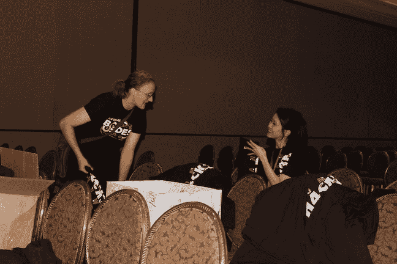T2】](https://www.social-engineer.org/social-engineering/social-engineer-and-def-con-21/attachment/6-annaandmichelefoldingshirts-2/)

学生和居民范，伦纳德，也帮助了:

[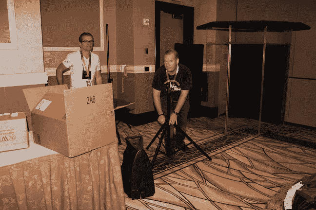T2】](https://www.social-engineer.org/social-engineering/social-engineer-and-def-con-21/attachment/9-evenleonardhelps/)

[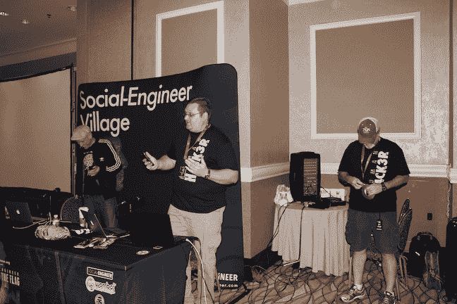T2】](https://www.social-engineer.org/social-engineering/social-engineer-and-def-con-21/attachment/11-readytolaunch/)

设置好后，是时候开始打电话了…

[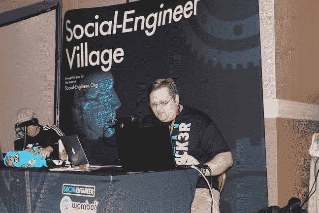T2】](https://www.social-engineer.org/social-engineering/social-engineer-and-def-con-21/attachment/12-startingcalls/)

我们总是有一个值得信赖的团队来帮助我们制作声音:

[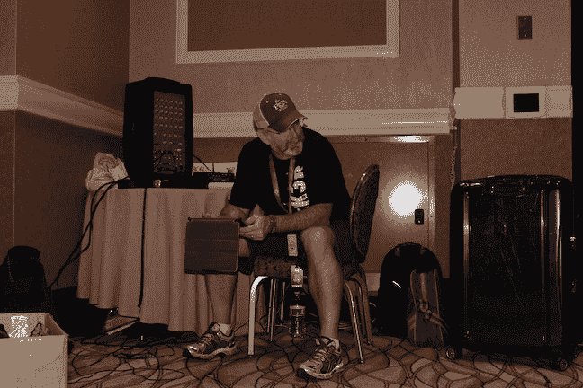T2】](https://www.social-engineer.org/social-engineering/social-engineer-and-def-con-21/attachment/14-jimthesoundman/)

成功了吗？这是这个房间在发布几个小时后的样子:

[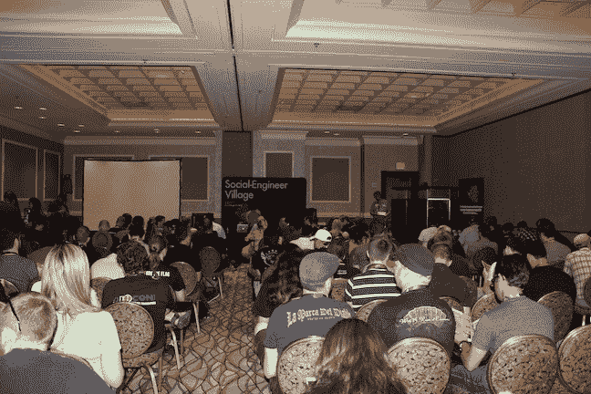T2】](https://www.social-engineer.org/social-engineering/social-engineer-and-def-con-21/attachment/18-sevillageday1/)

一些参赛者也让我们在展台上拍了一些很棒的照片:

[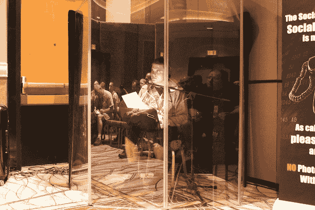T2】](https://www.social-engineer.org/social-engineering/social-engineer-and-def-con-21/attachment/13-contestant/)

[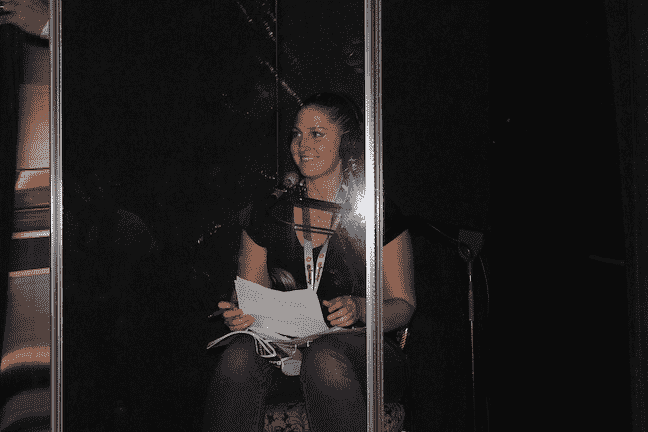T2】](https://www.social-engineer.org/social-engineering/social-engineer-and-def-con-21/attachment/21-contestantlilly/)

[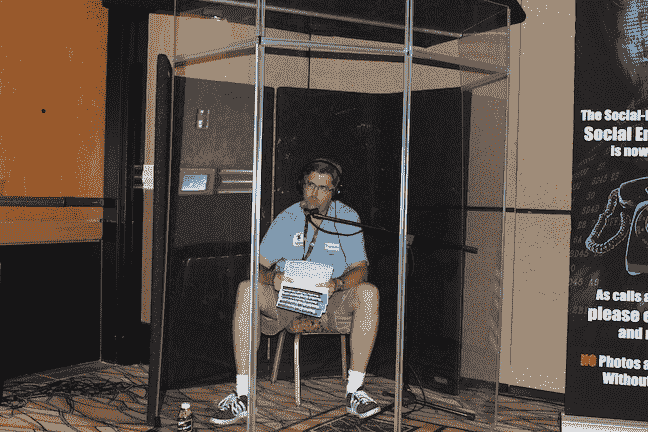 ](https://www.social-engineer.org/social-engineering/social-engineer-and-def-con-21/attachment/20-contestantdan/) [ 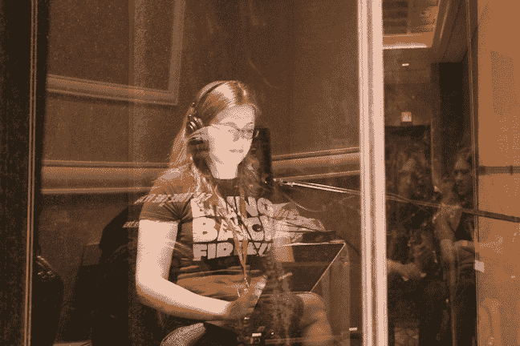](https://www.social-engineer.org/social-engineering/social-engineer-and-def-con-21/attachment/16-contestant/)

第一天的最后是一些演示，以及为参加第二天开始的第四部分的孩子和家长的介绍。

我们今年引入了一个新功能——护臂(针对 SECTF4Kids ):当小孩子试图完成任务时，团队成员会很乐意用改进的 nerf 枪砸他们的头。

[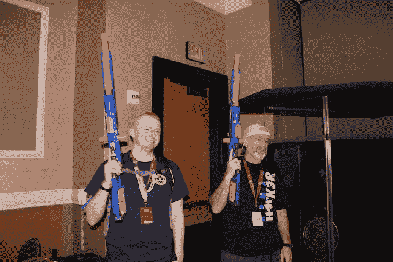T2】](https://www.social-engineer.org/social-engineering/social-engineer-and-def-con-21/attachment/23-oursnipersarmed/)

Michele 和 Amanda 今年管理着 4 个孩子，看看他们从 tortu 得到的快乐……呃……教育小孩子

[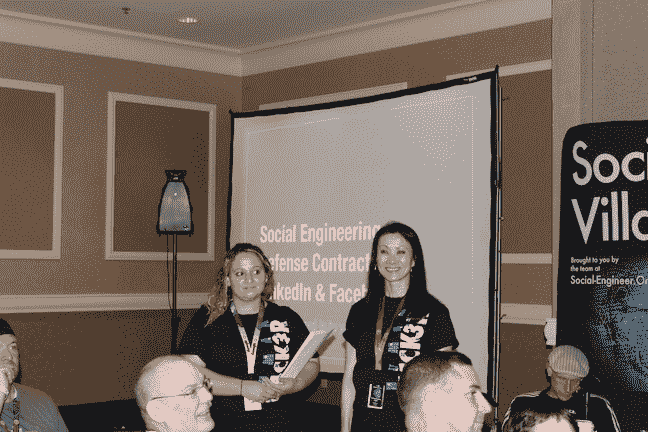T2】](https://www.social-engineer.org/social-engineering/social-engineer-and-def-con-21/attachment/25-yourgamemakers/)

在我们解散了父母和孩子之后，我们在塞维利亚进行了第一次演讲，乔丹·哈宾格:

[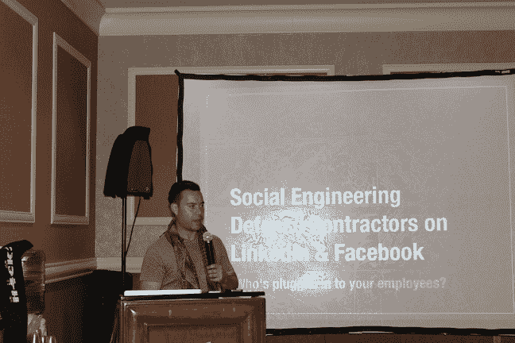T2】](https://www.social-engineer.org/social-engineering/social-engineer-and-def-con-21/attachment/26-jordanspeech1/)

接下来是我们的好友戴夫·肯尼迪的房间:

[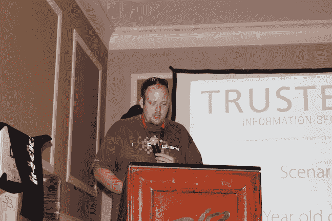T2】](https://www.social-engineer.org/social-engineering/social-engineer-and-def-con-21/attachment/28-davesspeech/)

## 第二天——更多的乐趣

第二天继续精彩的 SECTF 通话。真的，今年竞争很激烈。女人们只是在左右拍打男人，但男人们回来代表今年的战斗。

我们再次为我们的参赛者拍了一些很棒的照片:

[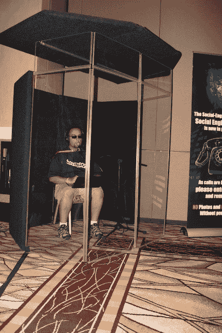 ](https://www.social-engineer.org/social-engineering/social-engineer-and-def-con-21/attachment/29-contestants/) 

当我们有一位女士没有出现时，这位选手主动请缨…她站了出来，在 25 分钟内，她就进入了摊位，并震撼了它！

[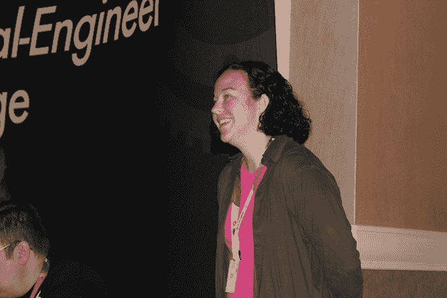T2】](https://www.social-engineer.org/social-engineering/social-engineer-and-def-con-21/attachment/32-lastminutecontestant/)

在第二天的通话中，我们让孩子们偷偷溜进来，试图通过将他们最后的线索放在一个盒子里来完成他们的试验，然后被我们的 nerf 专家狙击:

[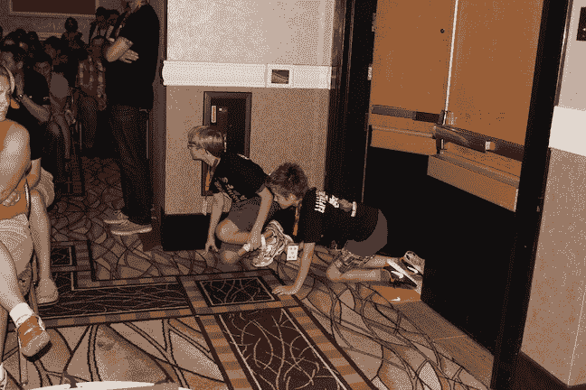](https://www.social-engineer.org/social-engineering/social-engineer-and-def-con-21/attachment/34-kidssneakingin/) 她不是什么小屁孩……[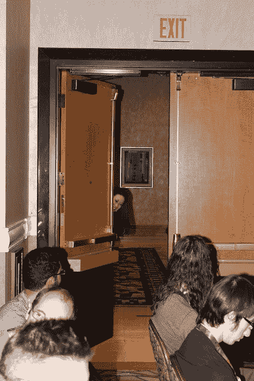](https://www.social-engineer.org/social-engineering/social-engineer-and-def-con-21/attachment/37-waitshesnotakid/)

选手们再次在展台度过了美好时光:

[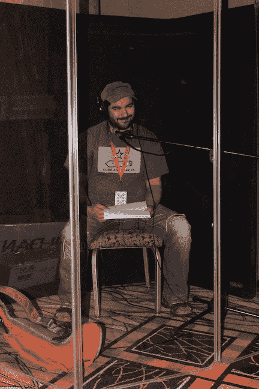 ](https://www.social-engineer.org/social-engineering/social-engineer-and-def-con-21/attachment/38-contestant/) [ 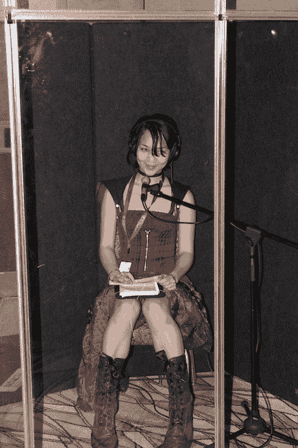](https://www.social-engineer.org/social-engineering/social-engineer-and-def-con-21/attachment/39-contestantcristina/)

[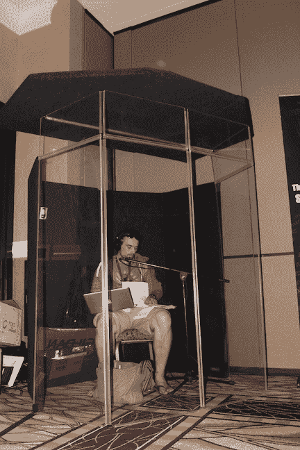 ](https://www.social-engineer.org/social-engineering/social-engineer-and-def-con-21/attachment/40-contestantmalcolm/) [ 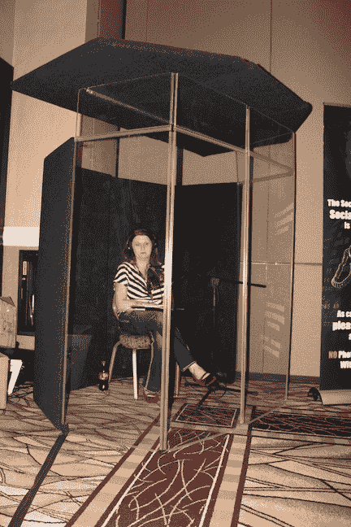](https://www.social-engineer.org/social-engineering/social-engineer-and-def-con-21/attachment/42-contestantshannon/)

今年我们喜欢的是这个房间是如何活过来帮助被困的参赛者…这里是永远乐于助人的雪莉…

[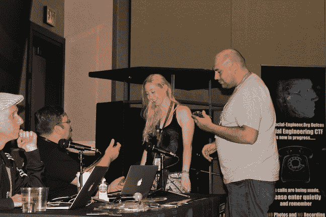T2】](https://www.social-engineer.org/social-engineering/social-engineer-and-def-con-21/attachment/36-theeverhelpfulsherry/)

更多照片来自第二天拥挤的服务…

[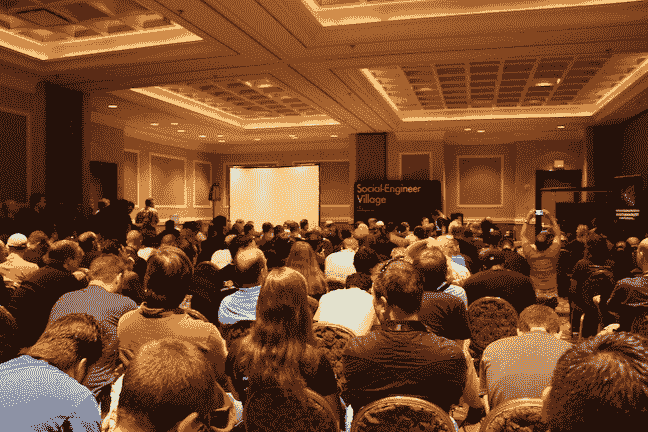T2】](https://www.social-engineer.org/social-engineering/social-engineer-and-def-con-21/attachment/42-sectfday2/)

那只是在里面；外面，有人在等着进来:

[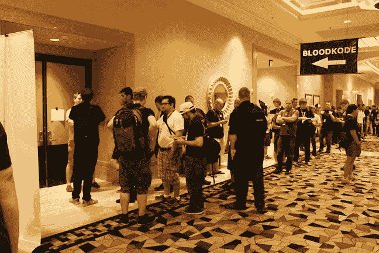T2】](https://www.social-engineer.org/social-engineering/social-engineer-and-def-con-21/attachment/43-lineforsevillage/)

第二天以凯文·米特尼克的精彩演讲结束:

[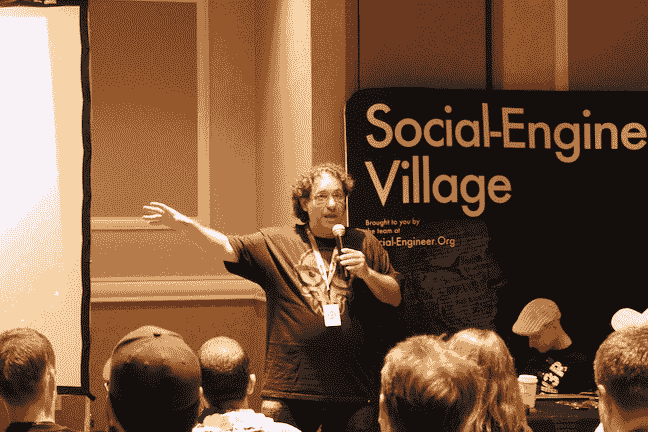T2】](https://www.social-engineer.org/social-engineering/social-engineer-and-def-con-21/attachment/45-mitnick/)

然后，在我们前往第三天… [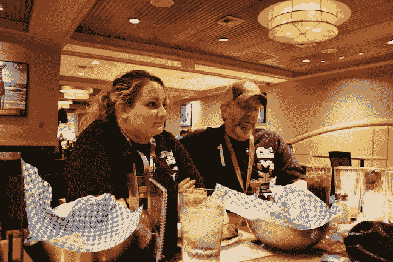](https://www.social-engineer.org/social-engineering/social-engineer-and-def-con-21/attachment/46-doublecs/) 的途中，吃了一顿急需的美餐

## 我们的最后冲刺

第三天，我们一大早就拖着疲惫的身躯去了塞维利亚，但是阿波罗·罗宾斯和我们一起参加国防会议，让我们充满了活力和兴奋。

阿波罗的到来给了 DEF CON 将我们带到第 4 轨房间的动力。再次感谢那些非常非常酷的人，他们接受了这个交换:

[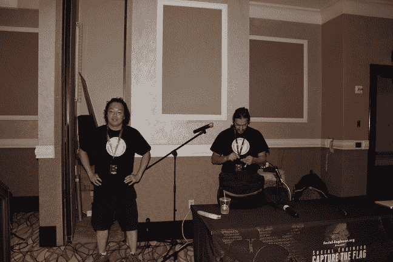T2】](https://www.social-engineer.org/social-engineering/social-engineer-and-def-con-21/attachment/48-niceguysmoved/)

现在是时候了；阿波罗、米歇尔和我正在做一个关于“骗子头脑中的 60 分钟”的联合演示——结果非常即兴，因为 3 个放映机同时死亡，阿波罗只是因为这个而浪费了大部分时间……哇，这个家伙太棒了！！

[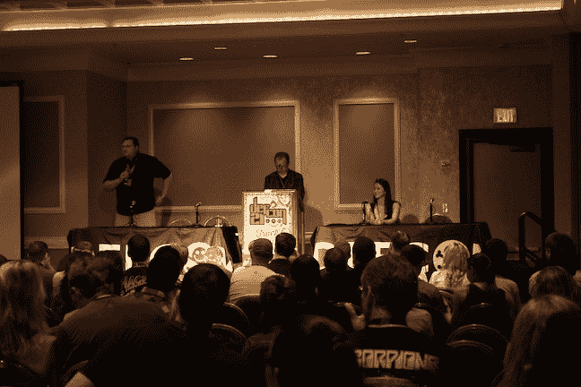T2】](https://www.social-engineer.org/social-engineering/social-engineer-and-def-con-21/attachment/48-apollochrismichele/)

[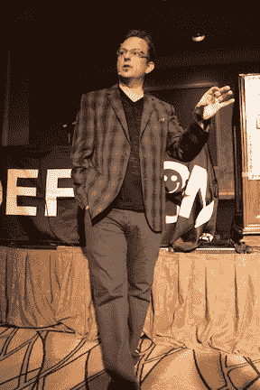 ](https://www.social-engineer.org/social-engineering/social-engineer-and-def-con-21/attachment/51-apolloawesome/) [ 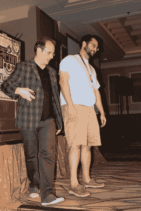](https://www.social-engineer.org/social-engineering/social-engineer-and-def-con-21/attachment/52-apolloswipedhiswallet/)

演讲结束了，(这不仅仅是谣言)我们有时间带威尔·史密斯四处逛逛。他是来听骗子演讲的。他参观了供应商区，然后我们有机会聊了一会儿。他走后，阿波罗回到会议室，我们道别，在等待阿波罗回来的时候，我们坐着想…“今天真的发生了吗？”

[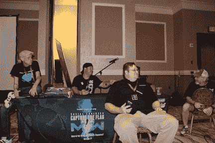T2】](https://www.social-engineer.org/social-engineering/social-engineer-and-def-con-21/attachment/84-exhaustedteam/)

但它发生了，克里斯不能让阿波罗不尝尝他自己的药:

[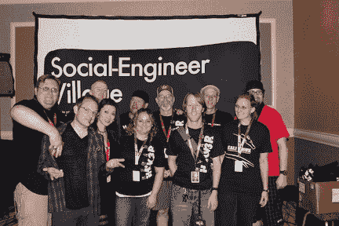T2】](https://www.social-engineer.org/social-engineering/social-engineer-and-def-con-21/attachment/87-teamwithapollo-pickpocketing/)

从右到左，从后到前

后排:克里斯、史蒂夫、尼克、吉姆、埃里克、比利

前排:阿波罗，米歇尔，阿曼达，托马斯，安娜

真的，DEF CON 最好的团队！

## 经验教训

一些最优秀的头脑，最敏锐的人和最有趣的人可以在 DEF CON 上看到。当然，拉斯维加斯会吸走你的灵魂，咀嚼它，然后把它吐回你曾经的躯壳里…但人就是它的全部。

DEF CON 21 有 28 个孩子参加[部分，第一名的获胜者 Bella 和 Esau 像帮助写任务一样完成任务…](https://www.social-engineer.org/sectf-for-kids-at-defcon/ "SECTF4Kids")

我们的第二名团队，康纳和蒂伯，也紧随其后。

孩子们——明年不会这么容易，所以要做好准备。

但是有一件事让我们非常自豪——没有一个孩子放弃！他们都坚持到了最后——即使是最后一个知道自己赢不了的队，他们也坚持到了最后。

在 SECTF 中，妇女被安排在第一和第二层；事实上，女性一直占据第五名！今年是女性年——多么伟大的比赛。继续检查，报告将在几个月或更短的时间内完成，结果会让你大吃一惊

明年将会更大、更好、更互动、更有趣。

与此同时，我们需要花些时间休息，为明年想出更多的邪恶。在那之前，注意安全！