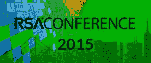

# 社会工程师@ RSA 2015

> 原文：<https://www.social-engineer.com/social-engineer-rsa-2015/>

还记得 RSA 是一个有几千名访问者的私密小秀的日子吗？我们也不知道！下周标志着 [RSA 2015、](https://www.rsaconference.com/)的开始，美国最大的信息安全会议将在旧金山召开。大约有 25，000 名预期与会者将是社会工程师团队，所以我们想确保你知道我们在整个会议期间要做什么！

[T3】](https://www.social-engineer.com/wp-content/uploads/2015/04/RSA-Conf-1.jpg)

RSA 拥有不止一个，而是两个巨大的展厅，挤满了参展商。我们预计您将体验到大量充斥着安全术语的展台，如“威胁情报”、“威胁防护”和“云安全”虽然安全产品是 RSA 的重要组成部分，但我们希望与会者更多地关注安全服务以及人的因素在安全和事件响应中的作用。请记住，技术控制和政策只是解决方案的一部分。如果你有兴趣建立一个安全程序来对抗恶意的网络钓鱼邮件或提高用户意识，我们当然希望你能看看 Michele 的演讲:**网络钓鱼黑暗水域:电子邮件的恶意一面。**此外，如果您有兴趣安排一次私人会议来讨论安全问题，请给我们发一封[电子邮件](/cdn-cgi/l/email-protection#b2978082dbdcd4ddf2c1ddd1dbd3de9fd7dcd5dbdcd7d7c09cd1dddf)，我们会尽力满足您的要求。

最后，人类黑客本人，刚从绝密训练中恢复过来，将在周四出现在你不想错过的签名售书会上！以下是下周 RSA 的社会工程师是谁，什么，何时，何地。你会参加会议吗？我们希望在那里见到你！

谁？社会工程师

介绍:米歇尔·芬奇

“网络钓鱼暗潮——防御恶意电子邮件”

2015 年 4 月 21 日，星期二，下午 1:10–莫斯康西 2022 室

2015 年 4 月 22 日，星期三，上午 11:30–莫斯康西 2020 室

**什么，什么时候&哪里:**签售会

克里斯·哈德纳吉&米歇尔·芬奇

[*钓鱼黑暗水域:进攻方&防御方*恶意邮件](https://www.amazon.com/Phishing-Dark-Waters-Offensive-Defensive/dp/1118958470)

4 月 23 日星期四上午 11:30