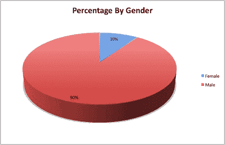
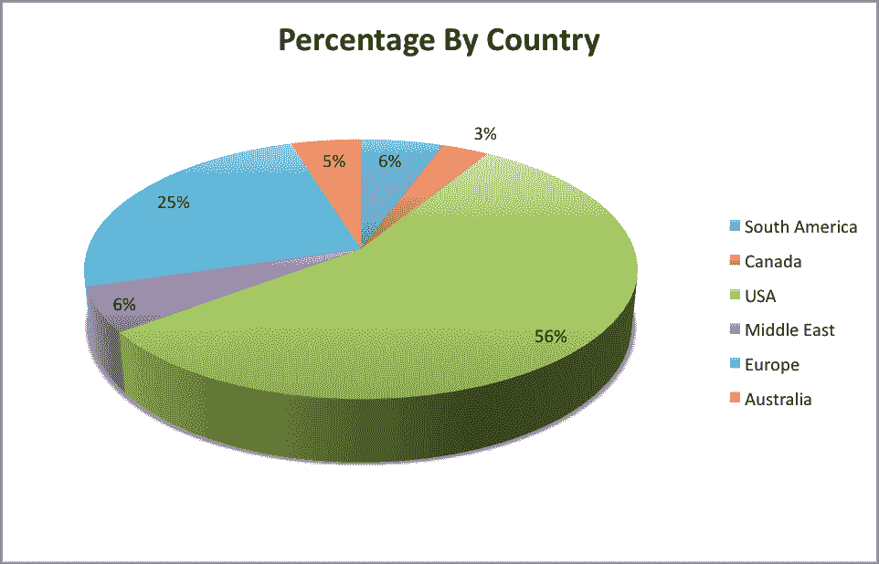
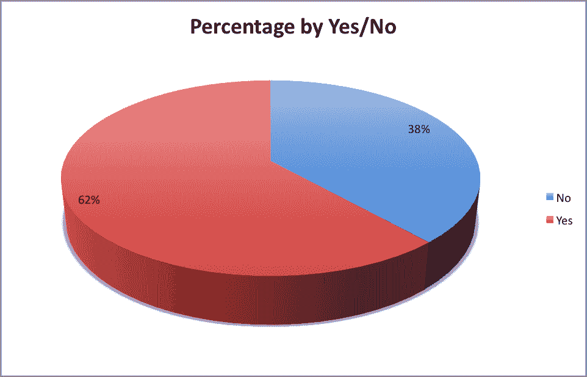

# 社会工程和欺骗-真相是什么

> 原文：<https://www.social-engineer.org/social-engineering/social-engineering-and-deception-whats-the-truth/>

一个多月前，在[社会工程播客](https://www.social-engineer.org/podcast/)上，我们发起了有史以来第一次基于社会工程的投票。在播客中，戴夫说他相信一些社会工程不涉及[欺骗](https://www.social-engineer.org/newsletter/Social-Engineer.OrgNewsletterVol.04Iss.47.htm)，而克里斯认为社会工程总是这样。

戴夫认为，某些形式的社会工程可以完全诚实地使用，并且仍然可以被归类为社会工程。克里斯认为所有形式的社会工程(不是社会工程的某些方面，如医生、律师等)都包含某种形式的[欺骗](https://www.social-engineer.org/podcast/episode-015-using-deception-as-a-social-engineer/)。

为了澄清这一点，我们采访了许多社会工程师，比如米施克和 T2，但他们本身并不是社会工程师。当然，他们的工作不需要多次使用欺骗手段，但是我们在争论，在实际的社会工程中是否有任何方法涉及或不涉及社会工程。

因为我们自己无法达成一个可靠的协议，所以我们向你们，公众，公开了这个协议。反响令人惊讶。以下是投票结果。

首先，我们在哪里的问题:
1)SE 是否总是使用欺骗(是)或者是否有不使用欺骗的 SE 形式(否)？
2)我们询问了调查者的国家
3)调查者的性别
4)调查者以什么为生
5)第一个问题是不，这是一个没有欺骗的 SE 的例子

在整理了成百上千的投稿之后，我们有了:

当我们按性别分解回答的人的百分比时。

没什么大惊小怪的，我们认为在这里会看到更多的男生比女生做出回应。然后我们按地理区域进行了细分:

我们看到了来自世界各地的优秀人才。

但是真正的问题是。大多数人是站在戴夫一边，认为你可以在不欺骗的情况下成为 SE，还是大多数人同意我的观点，认为 SE 总是包含某种形式的欺骗…

(请击鼓)

抱歉，戴夫，但我想你必须在另一次投票中再试一次。但正如我所料，对于 60%以上的技术人员来说，SE 将涉及欺骗是一个事实。

觉得这个有意思？

提交您的想法，参加另一项投票，为[【受电子邮件保护】](/cdn-cgi/l/email-protection)social-engineer.org 投稿