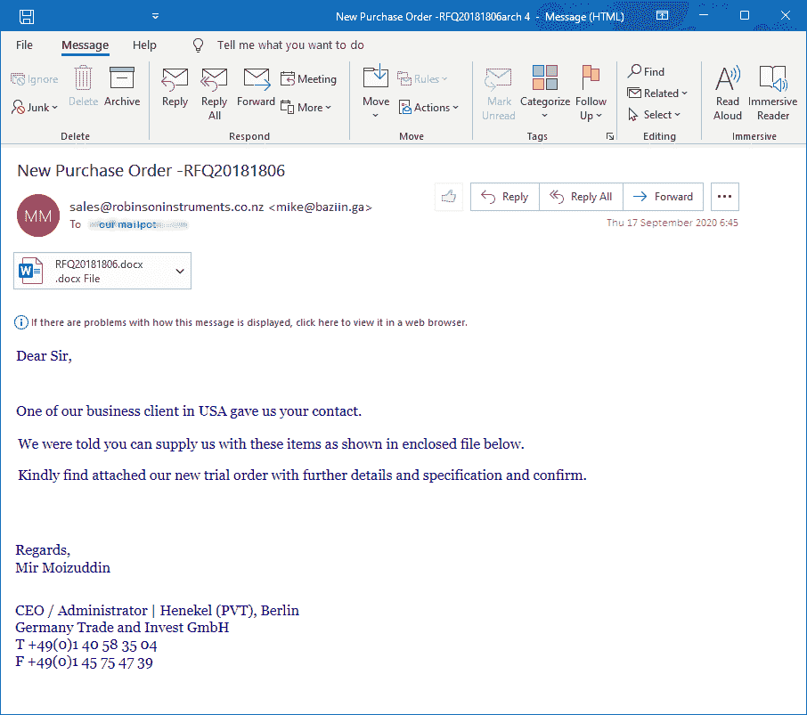
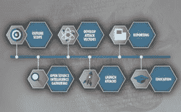

# 社会工程新闻:高度的网络安全问题

> 原文：<https://www.social-engineer.com/social-engineering-news-heightened-cybersecurity-concerns/>

乌克兰当前的事件引发了人们对网络安全的高度关注。出于这个原因，CISA(网络安全和基础设施安全局)发布了一个罕见的[“屏蔽”警报](https://www.cisa.gov/shields-up)，要求所有组织做好准备，应对破坏性的网络活动。值得注意的是，CISA 建议包括首席执行官在内的所有公司领导人采取以下行动:

有关每项 CISA 建议的详细信息，请参考 [Shields Up alert，针对高管的 5 项紧急网络安全措施。](https://www.cisa.gov/sites/default/files/publications/Focus_Areas_for_CEOs.pdf)

#### 以下新闻报道展示了威胁分子是如何针对乌克兰的基础设施、服务和政府的:

#### *针对乌克兰基础设施的网络钓鱼邮件*

据 Avast 报道，攻击者的目标是当地的通信基础设施、网络提供商和其他服务。据 Avast 称，带有恶意附件的电子邮件被发送到会计部门。这些附件。pdf 或。docx 包含窃取密码的恶意软件，如 FormBook 或 AgentTesla 和 rat(远程访问工具)。网络钓鱼电子邮件的主题与付款和发票相关，例如:

*图像:Avast*

#### *Proofpoint 发现针对欧洲政府人员的网络钓鱼活动*

攻击者可能正在使用一个受损的乌克兰武装部队成员的电子邮件帐户来攻击负责收集欧洲难民流动信息的政府人员根据 [Proofpoint](https://www.proofpoint.com/us/blog/threat-insight/asylum-ambuscade-state-actor-uses-compromised-private-ukrainian-military-emails) ，恶意电子邮件包括一个宏附件，该附件使用了与北约安全委员会紧急会议有关的社会工程主题。

在这个高度安全的网络环境中，安全意识和培训更加重要。有鉴于此，CISA 建议“所有组织——无论规模大小——在网络安全和保护其最重要资产方面采取更高的姿态。”

## 社会工程风险评估可以帮助您保护您的组织

[社会工程风险评估](https://www.social-engineer.com/services/social-engineering-risk-assessment/) (SERA)帮助组织评估他们独特的社会工程攻击的攻击面。有了 SERA，你可以选择对你的公司和高价值的内部人员进行[开源情报](https://www.social-engineer.com/glossary/open-source-intelligence/) (OSINT)调查。我们从公开来源收集数据，如社交媒体平台、公共记录、兴趣和爱好网站以及其他在线数据库。然后，我们会从收集的数据中搜索信息，以便威胁参与者对您的员工实施有针对性的攻击。我们还会找出可能让攻击者访问您的设施、帐户或其他敏感信息的漏洞。我们可以对整个公司或单个个人进行社会工程风险评估。我们的资源范围从开源的 Clearnet 一直到 DarkWeb 资源和工具。
在我们完成 OSINT 后，您可以选择让我们对目标进行网络钓鱼和视觉攻击。我们可以将这些攻击用于测试您的基础架构，就像我们在对手模拟中所做的那样，或者仅用于提供信息。事实上，这项服务完全可以由您和您的组织定制。

请[今天联系我们的团队](https://www.social-engineer.com/services/social-engineering-risk-assessment/)进行报价。