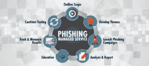

# 社会工程新闻:网络钓鱼

> 原文：<https://www.social-engineer.com/social-engineering-news-phishing-2/>

网络钓鱼仍然是当今企业面临的最大网络安全威胁之一。根据 [2021 年数据泄露调查报告](https://www.verizon.com/business/resources/reports/dbir/) (DBIR)，网络钓鱼是最常见的数据泄露策略，占报告泄露的 36%(高于去年的 25%)。后果可能是严重的。可能会面临监管罚款、公司价值和声誉损失以及业务流程中断。当然，还有金钱上的损失。联邦调查局 2020 年互联网犯罪投诉事件报告指出，[公司因为包括网络钓鱼在内的社交攻击损失了 54，241，075 美元。](https://www.social-engineer.com/services/se-phishing-service/)

## 什么是网络钓鱼

在 Social-Engineer LLC，我们[将网络钓鱼](https://www.social-engineer.com/glossary/phishing/)定义为*“发送看似来源可靠的电子邮件，目的是影响或获取个人信息的行为。”*

*Image:[https://cyber news . com/security/how-phishing-attacks-are-evolving-and-why-you-should-care/](https://cybernews.com/security/how-phishing-attacks-are-evolving-and-why-you-should-care/)* 
根据 2021 年 DBIR，在网络钓鱼攻击中受到危害的前 3 种数据类型是:

### 以下新闻报道展示了犯罪分子是如何成功实施网络钓鱼攻击的

##### **攻击者通过缩放邀请窃取 Microsoft Outlook 凭据**

[Armorblox 详细描述了一次巧妙的网络钓鱼攻击](https://www.armorblox.com/blog/blox-tales-zoom-meeting-with-a-phish/),目标是一家主要的北美在线抵押贷款经纪公司。电子邮件标题为“[外部]Zoom Meetings 11:00AM Eastern Time[美国和加拿大]”，正文包含消息“您的参与者已加入您的会议。”当最终用户单击“开始会议”按钮时，他们会被带到一个假冒的 Microsoft Outlook 登录页面，要求他们输入电子邮件地址和密码。

##### **网络钓鱼攻击欺骗美国劳工部(DOL)窃取账户凭证**

正如 Inky 报道的[，这些钓鱼邮件邀请收件人提交“正在进行的政府项目”的投标，并声称来自 DOL 负责采购的一名高级员工。每封钓鱼邮件都有一个 3 页的 PDF 附件。在第 2 页上，收件人被指示点击“投标”按钮以访问 DOL 的采购门户网站。然而，出价按钮是一个恶意链接，导致一个假冒的 DOL 网站。在虚假的 DOL 网站上，受害者被指示点击“点击这里出价”按钮，并进入他们的微软或其他商业电子邮件帐户进行登录和出价。](https://www.inky.com/blog/fresh-phish-phishers-lure-victims-with-fake-invites-to-bid-on-nonexistent-federal-projects)

##### **多阶段网络钓鱼攻击首先窃取凭据，然后分发网络钓鱼电子邮件**

攻击者通过发送网络钓鱼电子邮件来窃取凭据，从而开始这种多阶段攻击。在下一阶段，[微软报告](https://www.microsoft.com/security/blog/2022/01/26/evolved-phishing-device-registration-trick-adds-to-phishers-toolbox-for-victims-without-mfa/)攻击者使用窃取的凭证在目标组织的公司网络上注册设备，以进行进一步的网络钓鱼攻击。

##### **对国王女儿儿童医院的网络钓鱼攻击暴露了受保护的健康信息(PHI)**

国王女儿儿童医院的几名员工的电子邮件帐户在一次网络钓鱼攻击中遭到破坏。据 HIPAA Journal 报道[，电子邮件账户包含以下类型的受保护健康信息:全名、出生日期、患者账号、健康保险号和/或其他健康相关信息，以及有限数量的个人的社会安全号。](https://www.hipaajournal.com/phi-exposed-in-phishing-attack-on-childrens-hospital-of-the-kings-daughters/)

## 社会工程网络钓鱼服务—测试、培训和保护

您如何保护您的公司免受成功的网络钓鱼攻击的严重影响？ [Social-Engineer 的网络钓鱼服务](https://www.social-engineer.com/services/se-phishing-service/) (SEPS)是一项全面管理的计划，用于衡量和跟踪员工如何应对电子邮件网络钓鱼攻击。SEPS 提供以下内容:

了解网络钓鱼攻击威胁的员工不太可能点击恶意链接，而更有可能报告可疑活动。请[今天联系我们的团队报价。](https://www.social-engineer.com/services/se-phishing-service/#request)