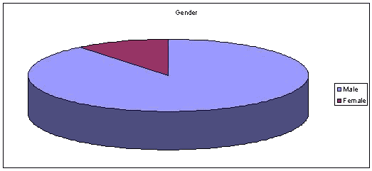
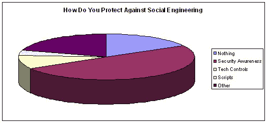

# 社会工程民意调查-2011 年 1 月结果

> 原文：<https://www.social-engineer.org/social-engineering/social-engineering-poll-january-2011-results/>

又一个月过去了，我们有另一项民意调查，会让你思考。

这个月，我们问你采取什么措施来防止社会工程。我们很好奇，是否能找到人们为了保护他们自己和他们的公司免受社会工程的影响而做的事情之间的任何联系。我们给出了几个帮助解决问题的选择:

*   没有任何东西
*   安全意识计划
*   技术控制
*   剧本
*   其他的

在我们告诉你结果之前，你认为最受欢迎的是什么？

可能和你想的不一样。

我们需要再次鼓励女士们开始参与，因为只有 11%的参与者是女性:

结果如下图所示:

感谢您上个月的参与。一定要看看这个月的投票…哦，女士们，来吧，不要让男人打败你！

